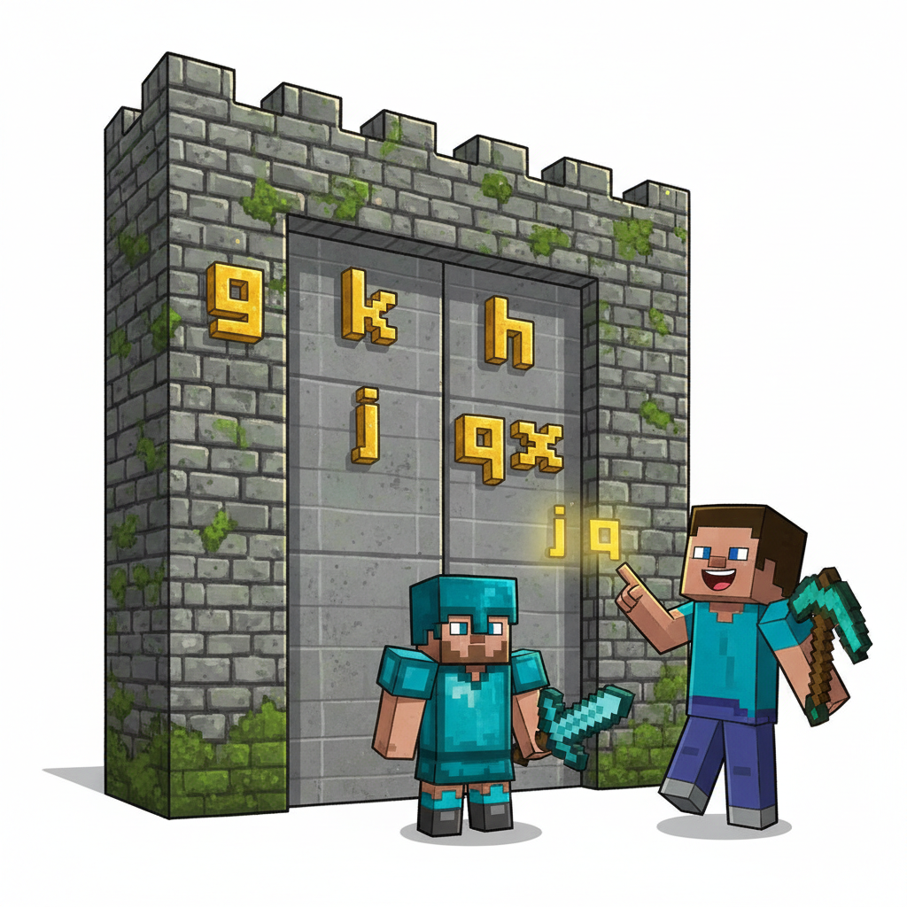
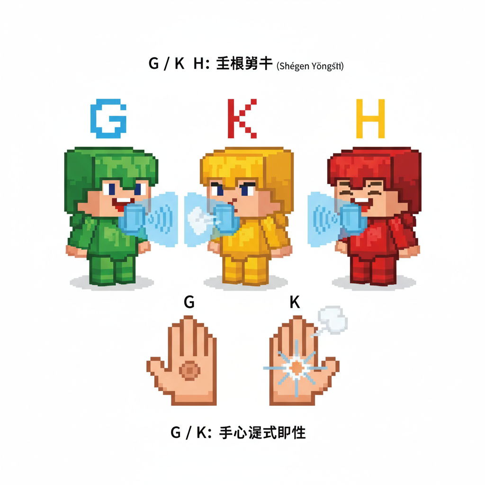
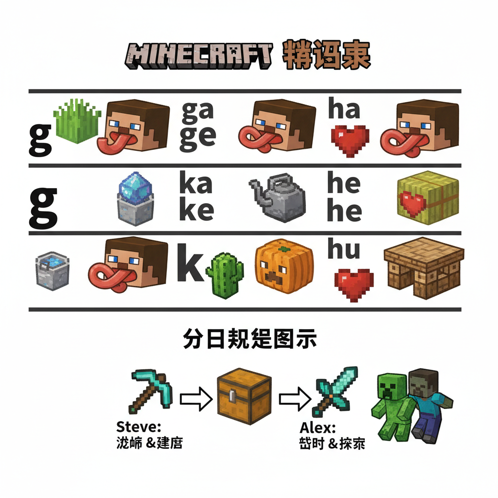
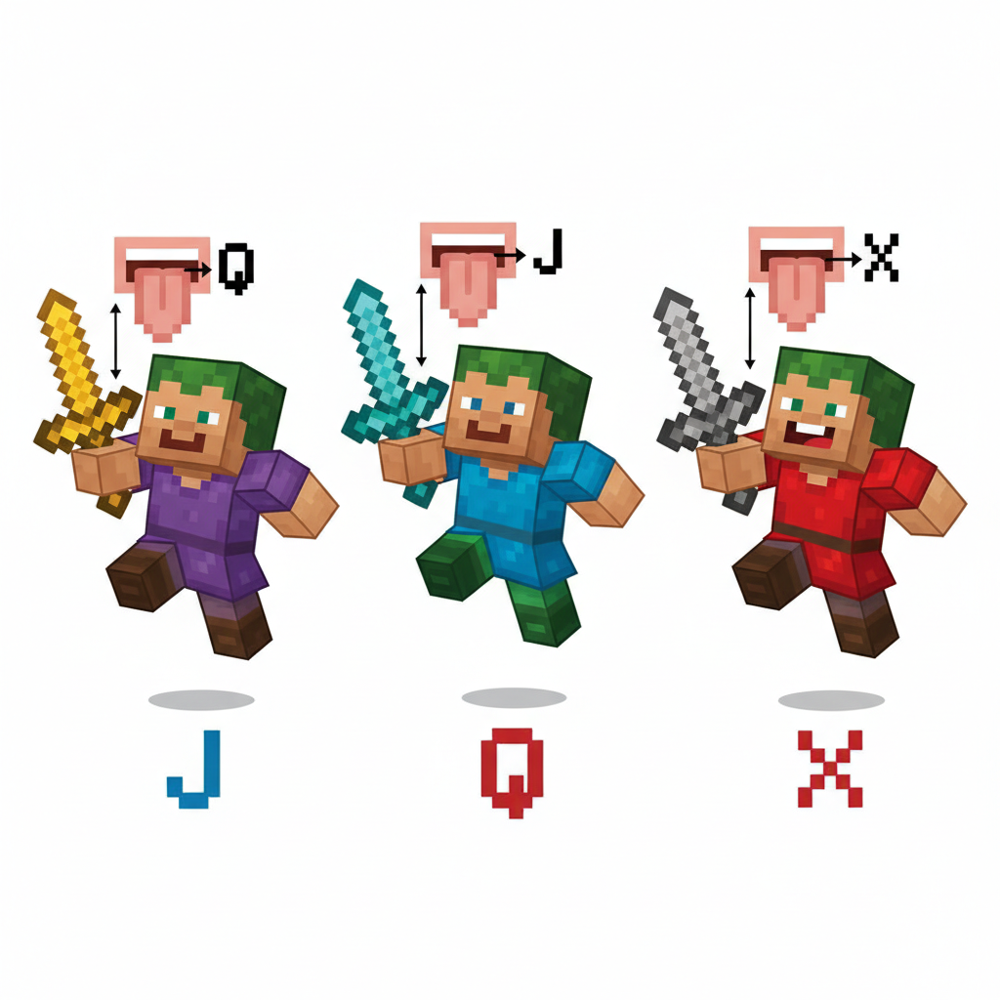
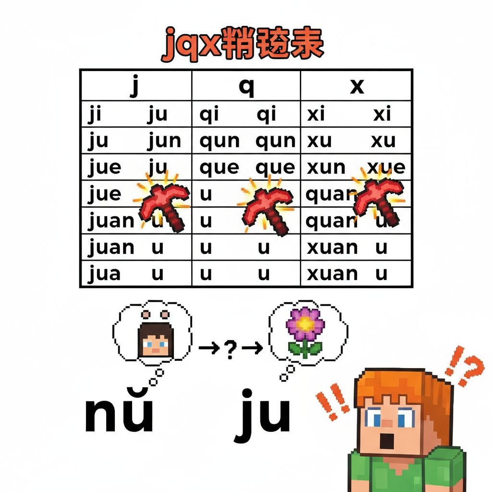
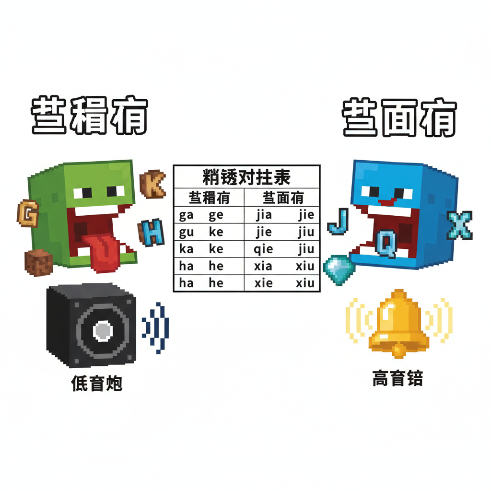
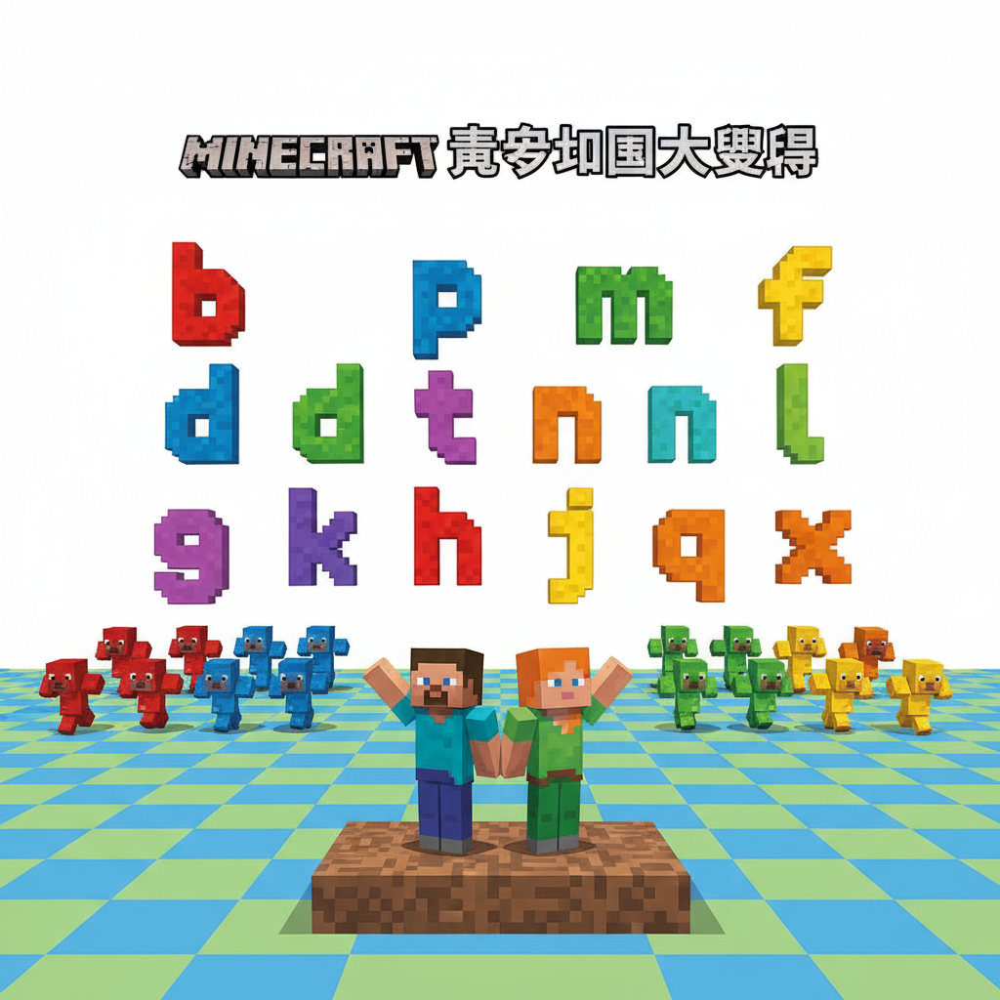
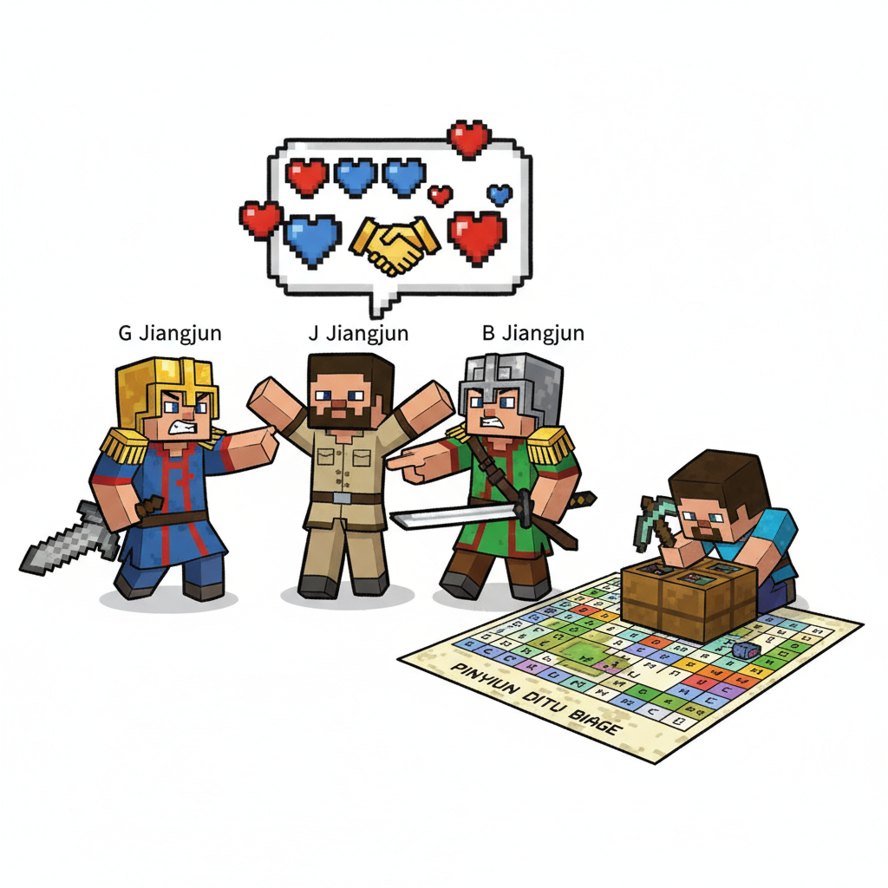
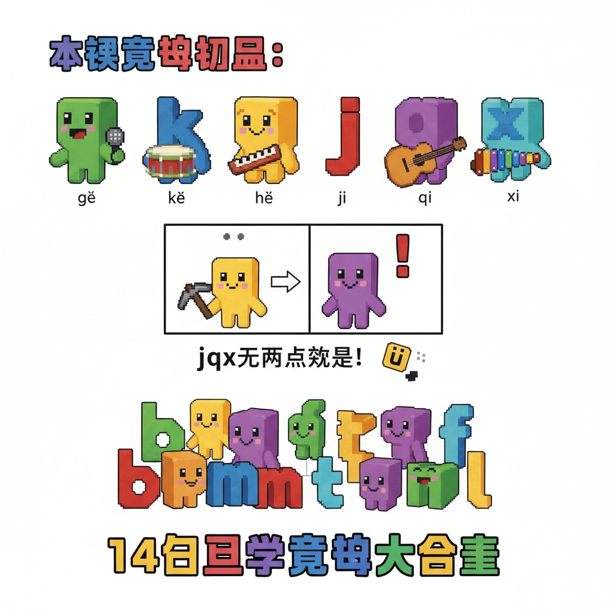

# 第10课 声母王国（中）

## 📋 学习目标
- 认识 6 个新声母：**g k h j q x**
- 理解舌根音（g k h）和舌面音（j q x）
- 掌握 j q x 遇到 ü 时去掉两点的规则
- 用新声母拼读更多音节

**拼音阶段不引入新汉字**

---

## 🎬 第一页：声母王国的第二道门

掌握 b p m f d t n l 之后，拼音石再次发光。

Steve 和 Alex 回到声母王国。b 将军在第二道城堡门前等着。

> "准备好了吗？今天认识我的战友——**g k h j q x**！"

门上刻着这些符号：

```
   🏰 声母小队（第二批）
   
   g  k  h  — 舌根三勇士（喉咙附近的战士）
   j  q  x  — 舌面三剑客（舌面抬起的战士）
```

> "g k h 的声音来自喉咙深处，j q x 的声音来自舌头表面——感觉完全不一样！"

```
   🗣️ 发音部位：
   
   舌根音：g k h
   气流在喉咙附近受阻，像在漱口
   
   舌面音：j q x
   舌面贴近上颚，像在微笑
```

Alex 好奇："为什么 j q x 是微笑战士？"

> "因为发 j q x 的时候，嘴角会自然咧开——像在微笑！来，试试看：j——q——x——"

> "真的！"Steve 发现自己在咧嘴笑。



---

## 🎬 第二页：g k h — 舌根三勇士

三个穿着厚重铠甲的精灵大步走出来。

**g**（金色重甲）："听好了——g！舌头后部抬起，顶住喉咙上方，突然松开！"

> "像鸽子叫：g g g！"

```
   g 的口诀：
   9字加弯 g g g，
   舌根抬起 g g g。
   
   ✋ 手心测试：g 不送气
```

**k**（银色轻甲）："到我了——k！跟 g 一样的位置，但要喷气！"

> "像咳嗽：k k k！"

```
   k 的口诀：
   像挺机枪 k k k，
   舌根喷气 k k k。
   
   ✋ 手心测试：k 送气（有强气流）
```

**h**（铜色披风）："h——舌根靠近喉咙上方，留一条缝，气从缝里出来。"

> "像喝水：h h h！"

```
   h 的口诀：
   像把椅子 h h h，
   喉咙出气 h h h。
   
   ✋ 手心测试：h 有气但不爆
```

```
   🎯 g/k 分辨（跟 b/p 和 d/t 一样）：
   g = 不送气  k = 送气
```



---

## 🎬 第三页：g k h 拼读大展

三勇士展示它们的拼读能力：

```
   🗡️ g 的拼读：
   g + a = ga    g + e = ge    g + u = gu
   gā — 嘎（嘎嘎叫）
   gē — 哥（哥哥）
   gū — 姑（姑姑）
   gǔ — 古（古人）
   gù — 故（故事）
   
   🗡️ k 的拼读：
   k + a = ka    k + e = ke    k + u = ku
   kā — 咖（咖啡）
   kě — 可（可以）
   kū — 哭（哭泣）
   kǔ — 苦（辛苦）
   kù — 库（仓库）
   
   🗡️ h 的拼读：
   h + a = ha    h + e = he    h + u = hu
   hā — 哈（哈哈笑）
   hé — 和（我和你）
   hǔ — 虎（老虎）
   hù — 护（保护）
   
   注意：g k h 不能跟 i 和 ü 拼！
   这是声母王国的规则。
```

> "咦，为什么 g k h 不能跟 i 拼？"Alex 问。

> "因为发音位置不一样——舌根音接 i 太难发了！不过别担心，j q x 专门负责跟 i 和 ü 拼！"

Steve 试着拼："g-i... g-i... 真的好难！舌头打架！"

> "哈哈哈！这就是为什么拼音有分工。"



---

## 🎬 第四页：j q x — 舌面三剑客

三个轻盈灵活的精灵跳出来。

**j**（红色轻甲）："j——舌面抬起贴近上颚，然后松开一条缝让气流出来！"

> "像小鸡叫：j j j！"

```
   j 的口诀：
   竖弯加点 j j j，
   舌面抬起 j j j。
   
   ✋ 不送气
```

**q**（紫色轻甲）："q——跟 j 一样的位置，但用力喷气！"

> "像气球漏气：q q q！"

```
   q 的口诀：
   像个气球 q q q，
   舌面喷气 q q q。
   
   ✋ 送气（有强气流）
```

**x**（蓝色轻甲）："x——舌面靠近上颚，留一条缝，气从缝里挤出。"

> "像蛇吐信：x x x！"

```
   x 的口诀：
   一个大叉 x x x，
   舌面挤气 x x x。
   
   ✋ 有气流，但持续不断
```

Alex 发现："j q x 的时候，我一直在笑！"

> "没错！微笑战士！😊"



---

## 🎬 第五页：j q x 拼读 + ü 的秘密

> "j q x 最厉害的本领是什么？"j 精灵神秘地问。

> "它们可以跟 i 和 ü 拼！而 g k h 不行！"Steve 回答。

> "对！但还有更神奇的——"

```
   🗡️ j 的拼读：
   j + i = ji    jī — 机（飞机）  jǐ — 几（几个）
   j + ü = ju    jū — 居（居住）  jù — 句（句子）
   
   🗡️ q 的拼读：
   q + i = qi    qī — 七（七个）  qí — 旗（旗子）
   q + ü = qu    qū — 区（地区）  qù — 去（出去）
   
   🗡️ x 的拼读：
   x + i = xi    xī — 西（西方）  xǐ — 洗（洗澡）
   x + ü = xu    xū — 需（需要）  xué — 学（学习）
```

> "等等！我发现了一个秘密！"Alex 大喊。

> "j q x 后面的 ü——两点不见了！"

```
   🤯 ü 的大秘密：
   
   nǚ（女）— ü 有两点 ✓
   lǜ（绿）— ü 有两点 ✓
   
   jū（居）— ü 没两点！❌
   qù（去）— ü 没两点！❌  
   xué（学）— ü 没两点！❌
   
   规则：j q x 真淘气，见了 ü 点就挖去！
         但读音还是 ü，不是 u！
```

> "所以 jū 读的是 jǖ，qù 读的是 qǜ，xué 读的是 xüé——只是把两点省掉了！"

```
   📝 口诀：
   j q x，小淘气，
   见到 ü 点就挖去。
   挖了点，还是 ü，
   读的时候别忘记！
```



---

## 🎬 第六页：j q x vs g k h 大对比

六大新声母站在一起：

```
   🏋️ 舌根三勇士（靠后）：
   g k h — 声音从喉咙来，不能跟 i ü 拼
   
   😊 舌面三剑客（靠前）：
   j q x — 声音从舌面来，跟 i ü 做好朋友
```

> "来比赛！同样的韵母 a，谁拼得更响亮？"

```
   g + a = ga  😤 喉咙用力
   k + a = ka  💨 喉咙喷气
   h + a = ha  🌬️ 喉咙出气
   
   j + i = ji  😊 舌面微笑
   q + i = qi  💨 舌面微笑喷气
   x + i = xi  🌬️ 舌面微笑挤气
```

> "g k h 像低音炮——声音低沉！"
> "j q x 像高音铃——声音清脆！"

```
   🎵 g k h 遇上 a o e u（低沉）：
   gā gē gū  kā kē kū  hā hē hū
   
   🎵 j q x 遇上 i ü（清脆）：
   jī jū  qī qū  xī xū
```

> "这就是声母世界的交响乐！"



---

## 🎬 第七页：全声母大练兵

到目前为止已经学了 14 个声母！所有声母集合——

```
   🏰 声母王国大阅兵
   
   嘴唇四兄弟：b  p  m  f
   舌尖四剑客：d  t  n  l
   舌根三勇士：g  k  h
   舌面三剑客：j  q  x
   
   ────────────────
   共 14 位声母战士！
```

> "来一次大拼读！看你能拼出多少！"

```
   b+a=ba  p+a=pa  m+a=ma  f+a=fa
   d+a=da  t+a=ta  n+a=na  l+a=la
   g+a=ga  k+a=ka  h+a=ha
   
   b+i=bi  p+i=pi  m+i=mi
   d+i=di  t+i=ti  n+i=ni  l+i=li
   j+i=ji  q+i=qi  x+i=xi
   
   b+u=bu  p+u=pu  m+u=mu  f+u=fu
   d+u=du  t+u=tu  n+u=nu  l+u=lu
   g+u=gu  k+u=ku  h+u=hu
```

> "你们现在已经能用声母和韵母拼出 60 多种声音了！"

> "下次——最后一批声母：zh ch sh r z c s y w！"



---

## 🎬 第八页：故事时间 — g 和 j 的误会

练兵结束后，发生了一件有趣的事。

g 将军和 j 剑客吵起来了。

> "我的声音最响亮！g——！"g 将军吼道。

> "我的声音最好听！j——！"j 剑客反驳。

> "停停停！"b 将军出来调解。"你们两个根本不能比！"

> "为什么？"

> "因为你的战场是 a o e u（g），他的战场是 i ü（j）。你们永远不会抢同一个韵母！"

g 将军想了想："对哦——我拼 ga，他拼 ji，我们根本不打架。"

j 剑客也笑了："我们各有所长！"

> "每个声母都有自己的'专属韵母'。有的能跟所有韵母拼，有的只能跟部分韵母拼。这就是拼音的规则——分工合作，不打架。"

```
   🏷️ 声母拼读规则：
   
   能和 a 拼的：b p m f d t n l g k h ✅
   能和 i 拼的：b p m d t n l j q x ✅  （f g k h 不能 ❌）
   能和 u 拼的：b p m f d t n l g k h ✅  （j q x 不能 ❌）
   能和 ü 拼的：n l j q x ✅  （其他不能 ❌）
```

> "拼音的世界，规则清清楚楚！"

Steve 在本子上画了一张大表，记下了每个声母能拼哪些韵母。这就是他的"拼音地图"。



---

## 📝 练习

### 一、声母分类

把声母放到正确的组里：

```
   b p m f d t n l g k h j q x
   
   不送气（声带不振动）：___ ___ ___ ___ ___
   送气（喷出气流）：___ ___ ___ ___ ___
   其他（鼻音/擦音）：___ ___ ___ ___ ___
```

### 二、拼一拼

```
   g + ā → ___   k + ě → ___   h + é → ___
   j + ī → ___   q + ǐ → ___   x + ǖ → ___
   
   注意：j q x 后面的 ü 写什么？
   j + ǖ → j___    q + ǜ → q___    x + ǘ → x___
```

### 三、找错误

下面哪些拼写是错误的？

```
   gī  ✗（g 不能和 i 拼！）
   jū  ___（对还是错？）
   kǖ  ___（对还是错？）
   hǔ  ___（对还是错？）
   xü  ___（对还是错？）
   qǘ  ___（提示：q 后面 ü 要去点写成 qu！）
```

### 四、读儿歌

```
   g k h，舌根忙，
   声音从喉咙里响。
   j q x，舌面强，
   微微一笑把音扬。
   
   g 像鸽子咕咕叫，
   k 像咳嗽咳咳跳，
   h 像喝水呼呼笑。
   
   j 像小鸡叽叽叫，
   q 像气球轻轻飘，
   x 像小蛇慢慢绕。
```

---

## 🏆 挑战 — 声母大师

**第一关：听音写声母 🔍**

| 老师念 | 声母 |
|--------|------|
| gā | ___ |
| kā | ___ |
| hā | ___ |
| jī | ___ |
| qī | ___ |
| xī | ___ |

**第二关：拼读大接龙 🐉**

用 g k h j q x 各拼出一个新的拼音（不是书上的）：

```
   g + ___ = ___
   k + ___ = ___
   h + ___ = ___
   j + ___ = ___
   q + ___ = ___
   x + ___ = ___
```

**第三关：ü 的变身 🎭**

把下面的拼音写完整（注意 j q x 后面的 ü！）：

```
   n + ǚ = ___（女）
   l + ǜ = ___（绿）
   j + ǖ = ___（居 — 注意两点！）
   q + ǜ = ___（去 — 注意两点！）
   x + ǘ = ___（学 — 注意两点！）
```

---

## 📊 本课小结

新学声母（6个）：
- [ ] g — 舌根不送气（鸽子 g g g）
- [ ] k — 舌根送气（咳嗽 k k k）
- [ ] h — 舌根擦音（喝水 h h h）
- [ ] j — 舌面不送气（小鸡 j j j）
- [ ] q — 舌面送气（气球 q q q）
- [ ] x — 舌面擦音（小蛇 x x x）

重要规则：
- [ ] g k h 不能和 i ü 拼
- [ ] j q x 遇到 ü 去两点！（ju qu xu）
- [ ] j q x 的发音嘴角像微笑 😊

> **已学声母：14/23**
> 下次学习：zh ch sh r z c s y w

---


