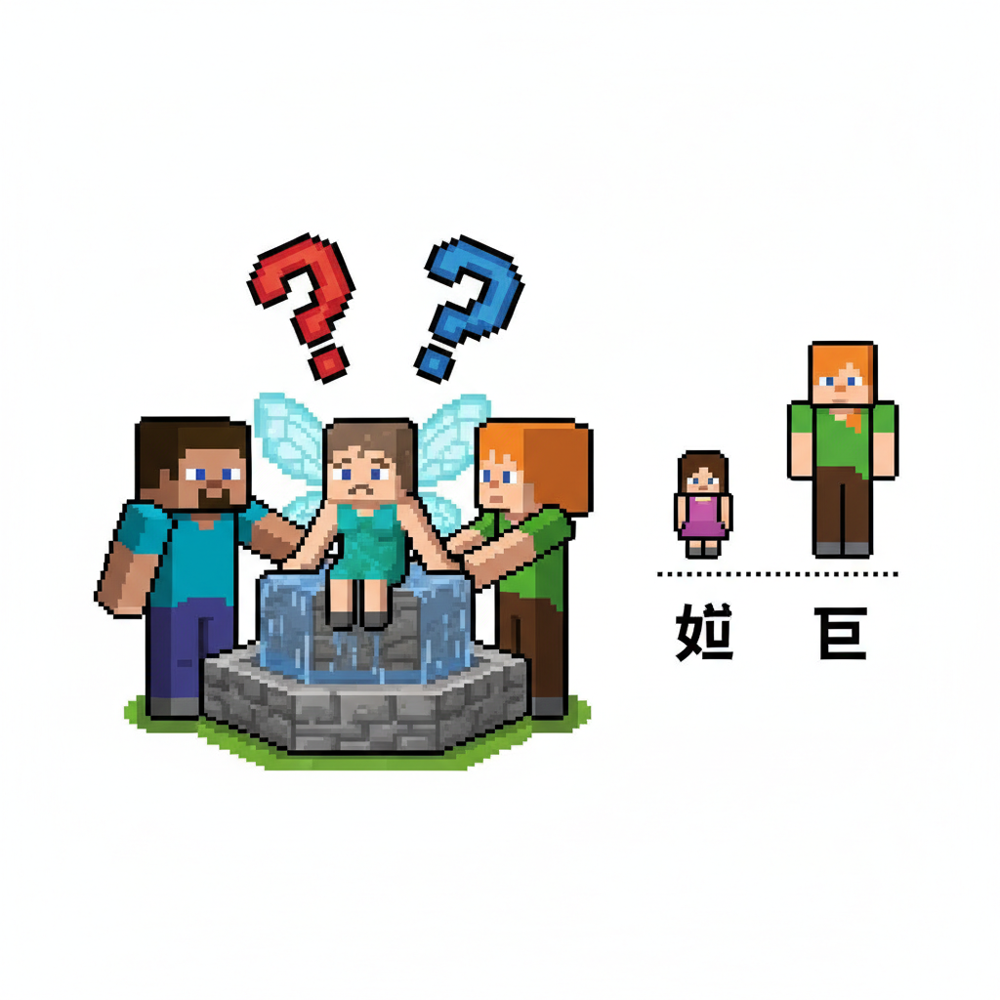
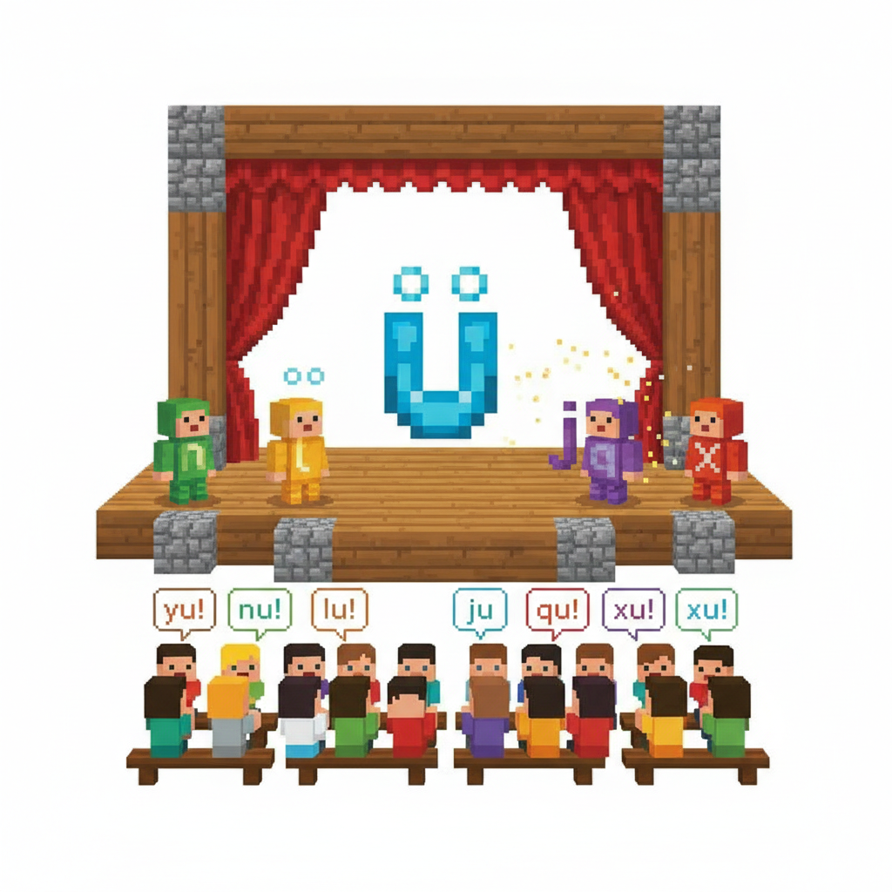
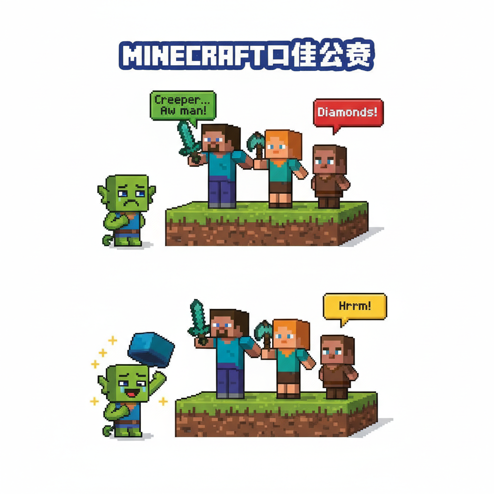
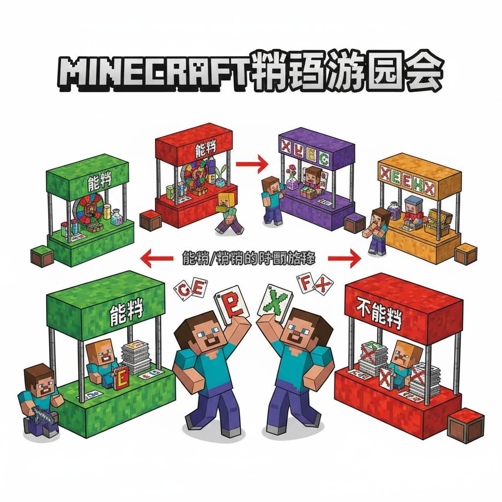
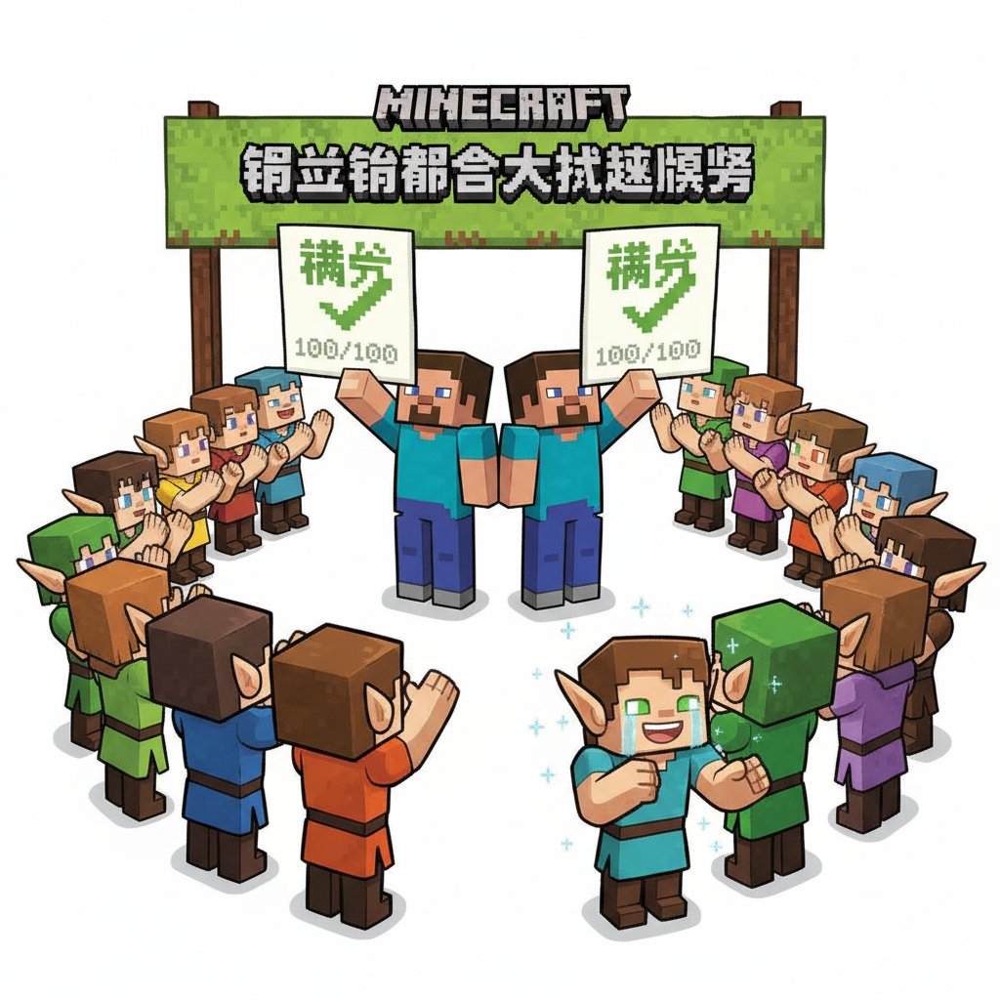
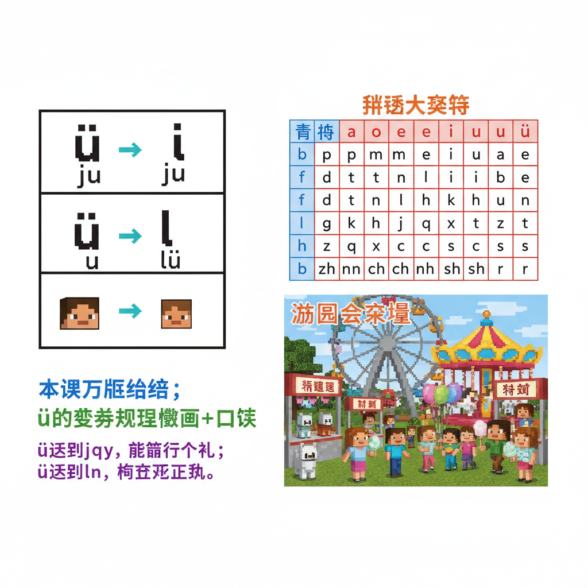

# 第10课 拓展篇：ü 的大冒险

## 📋 学习目标
- 巩固 g k h j q x 六个声母
- 重点掌握"j q x 遇到 ü 去两点"规则
- 区分 n l + ü（保留两点）和 j q x + ü（去掉两点）
- 综合拼读 14 个已学声母

---

## 🎬 第一页：ü 的烦恼

拼音小镇里，ü 精灵伤心地坐在喷泉边。

> "你怎么了？"Alex 蹲下来问。

> "我……我遇到了一个问题。"ü 擦擦眼泪。

> "每次 j q x 来找我玩，我的两点就不见了！但我还是我！可很多人看到 ju、qu、xu 就读成 u——他们忘了那其实是我！"

Steve 明白了："所以你在担心别人认不出你？"

> "对！我跟 u 是完全不同的韵母！ju 和 du 里的韵母不一样！"

```
   😢 ü 的烦恼：
   
   在 n 和 l 后面 → nǚ, lǜ（两点在 ✓）
   在 j q x 后面 → ju, qu, xu（两点不见了！）
   
   但读音还是 ü，不是 u！
   
   dū（都）≠ jū（居）
   韵母不同！
```

> "我们来帮你！"Steve 和 Alex 说。"让大家记住真正的你！"



---

## 🎬 第二页：ü 的变身秀

> "我们办一场'ü 的变身秀'！让大家看看你在不同声母后面的样子！"

广场上搭起了一个小舞台。ü 精灵站在中间。

第一幕：老朋友 n 和 l 来了。

```
   n + ü → nü
   
   舞台上，ü 骄傲地展示自己的两点：
   
   n + ǖ → nǖ（女声母 n，保留 ü 的两点 ✓）
   n + ǚ → nǚ（女孩的女 ✓）
   
   l + ǖ → lǖ
   l + ǜ → lǜ（绿色的绿 ✓）
```

> "n 和 l 是我的老朋友，它们尊重我的两点！"

第二幕：j q x 来了。

```
   j + ü → ju
   
   j 精灵一靠近，ü 的两点突然消失了！
   
   j + ǖ → jū ✨（但读的仍然是 ǖ！）
   j + ǘ → jú
   j + ǚ → jǔ
   j + ǜ → jù
```

> "j q x 来了，我的两点就藏起来了——但我还是我！"

```
   q 来了：
   q + ǖ → qū（区）  q + ǘ → qú（渠）
   q + ǚ → qǔ（取）  q + ǜ → qù（去）
   
   x 来了：
   x + ǖ → xū（需）  x + ǘ → xú（徐）
   x + ǚ → xǔ（许）  x + ǜ → xù（续）
```

观众们一起念。起初有人念成 u，但马上改口——"不对！是 ü！"

> "ju 不是 du！qu 不是 ku！xu 不是 hu！"



---

## 🎬 第三页：ü 的口诀大赛

> "谁能为 ü 编一句最好记的口诀？"

Steve 先来：

> "j q x 真淘气，见到 ü 点就挖去。挖了点，还是 ü，大家千万别忘记！"

观众鼓掌。

Alex 接着：

> "n l 来了两点在，j q x 来两点藏。点不在，音不变，ü 在心里永不忘！"

观众欢呼。

一个小村民举手：

> "小 ü 见 j q x，脱帽行个礼。见了 n 和 l，两点不分离！"

> "好！"ü 精灵开心地跳了起来。

```
   📝 最佳口诀（投票结果）：
   
   🥇 小 ü 见 j q x，脱帽行个礼。
       见了 n 和 l，两点不分离！
```

Steve 在本子上记下来，旁边画了一个戴帽子和脱帽子的 ü 精灵。



---

## 🎬 第四页：拼读游园会

演出结束后，声母精灵们举办了一场拼读游园会。

每个摊位可以"抓"一个声母 + 一个韵母，现场拼读！

```
   🎪 拼读游园会 🎪
   
   游戏规则：
   1. 抽一个声母卡
   2. 抽一个韵母卡
   3. 如果能拼，就大声读出来！
   4. 如果不能拼，说说为什么
```

Steve 先来：

```
   🃏 声母：j     🃏 韵母：i
   → jī！可以拼！小鸡的鸡！
   
   🃏 声母：g     🃏 韵母：i
   → 不能拼！g 不能和 i 拼！
   
   🃏 声母：q     🃏 韵母：ü
   → qū！注意：这里 ü 的两点要去掉，写 qu！
```

Alex 抽卡：

```
   🃏 声母：x     🃏 韵母：ü
   → xué！注意：写 xu 但读 xüé！学习的学！
   
   🃏 声母：k     🃏 韵母：u
   → kǔ！可以拼！辛苦的苦！
```

> "14 个声母 × 6 个韵母，但不是所有组合都能拼——记住规则就不怕了！"



---

## 🎬 第五页：综合大挑战

游园会的高潮——综合大挑战！

```
   🏆 综合大挑战 🏆
   
   规则：看到拼音 → 说出声母、韵母、声调
```

| 拼音 | 声母 | 韵母 | 声调 | 能组成的字 |
|------|------|------|------|-----------|
| bā | b | a | ˉ | 八 |
| pà | p | a | ˋ | 怕 |
| gē | g | e | ˉ | 歌 |
| kè | k | e | ˋ | 课 |
| hǔ | h | u | ˇ | 虎 |
| jī | j | i | ˉ | 机 |
| qù | q | ü | ˋ | 去 |
| xué | x | ü | ˊ | 学 |

> "全部正确！你们已经掌握了 14 个声母和 6 个韵母的组合！"

> "拼音世界的门，已经向你们敞开了大半！"

全体声母精灵和韵母精灵一起鼓掌。ü 精灵的眼角闪着泪花——但这次是开心的泪。

> "谢谢你们帮我！现在大家都知道，ju qu xu 里面的韵母，就是我 ü！"



---

## 📝 练习

### 一、ü 的变身规则

填空（注意两点要不要写）：

```
   n + ǚ → n___（女）
   l + ǜ → l___（绿）
   j + ǖ → j___（居 — 两点怎么写？）
   q + ǜ → q___（去 — 两点怎么写？）
   x + ǘ → x___（学 — 两点怎么写？）
```

### 二、读音判断

下面这些拼音读出来，韵母是 u 还是 ü？

```
   gǔ — 韵母是 ___（u 还是 ü？）
   jǔ — 韵母是 ___（u 还是 ü？注意虽然写的是 ju，但读的是 jü！）
   hù — 韵母是 ___
   qù — 韵母是 ___
   dù — 韵母是 ___
   xù — 韵母是 ___
```

### 三、能拼不能拼

判断下面组合能不能拼（能✓ 不能✗）：

```
   g + i   → ___  为什么？
   j + i   → ___  为什么？
   k + ü   → ___  为什么？
   q + ü   → ___  为什么？
   h + i   → ___  为什么？
   x + ü   → ___  为什么？
```

---

## 🏆 挑战 — ü 的守护者

**第一关：找 ju qu xu 🔍**

从下面的字中找出 ju qu xu：

```
   句子、出去、学习、需要、菊花、取书
   
   包含 ju 的：_______
   包含 qu 的：_______
   包含 xu 的：_______
```

**第二关：编写口诀 ✏️**

你为 ü 的变身规则编一句自己的口诀：

```
   _____________________
   _____________________
```

**第三关：声母韵母配对 🎴**

用 14 个声母 + 6 个韵母，做出你能拼的所有拼音（不计声调）：

```
   例：b+a=ba  b+o=bo  b+i=bi  b+u=bu
       但 b 不能和 e/ü 拼
   
   你能列出多少个？目标：30+ 个！
```

---

## 📊 拓展小结

核心规则：
- [ ] n l + ü → 保留两点（nǚ lǜ）
- [ ] j q x + ü → 去掉两点（ju qu xu，但读 jü qü xü）
- [ ] 口诀：小 ü 见 j q x，脱帽行个礼。见了 n 和 l，两点不分离！

综合能力：
- [ ] 能正确拼读 14 个声母 + 6 个韵母的所有合法组合
- [ ] 能判断哪些声母+韵母组合不能拼
- [ ] 能为 ü 的规则编写自己的口诀

> **下一步：声母王国（下）— zh ch sh r z c s y w**

---


