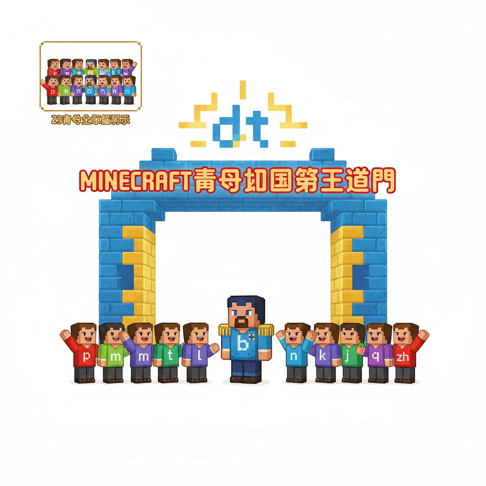
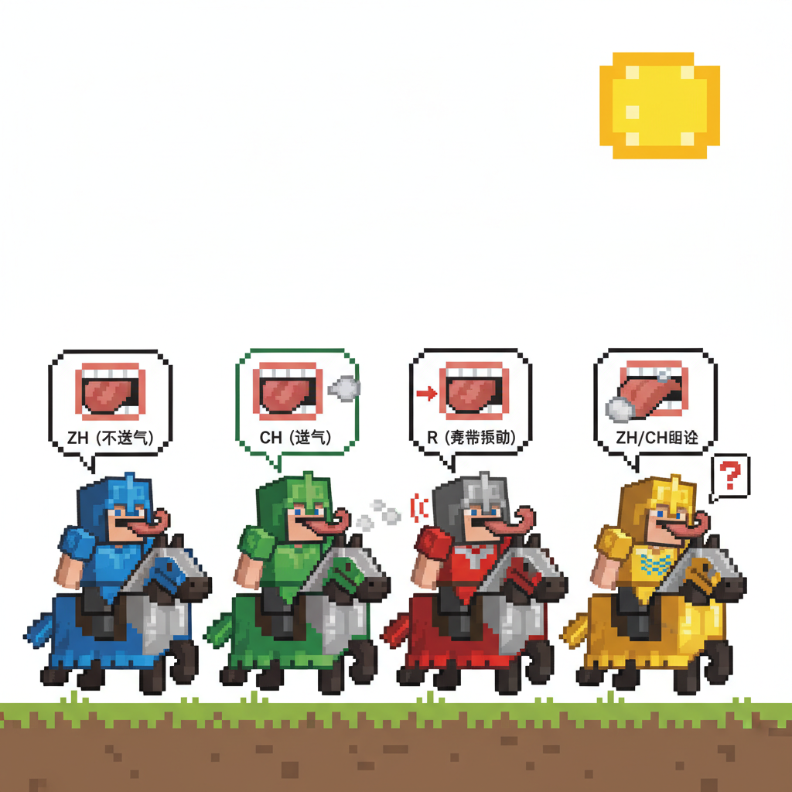
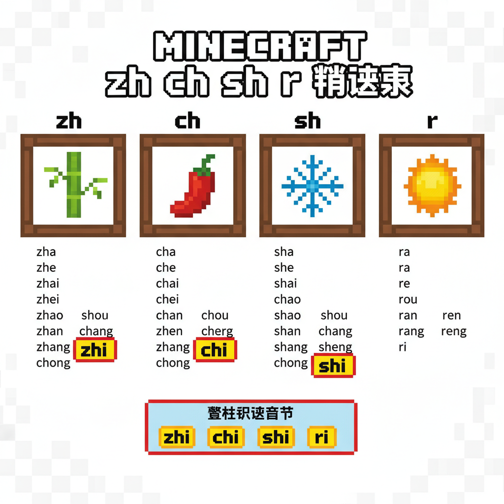
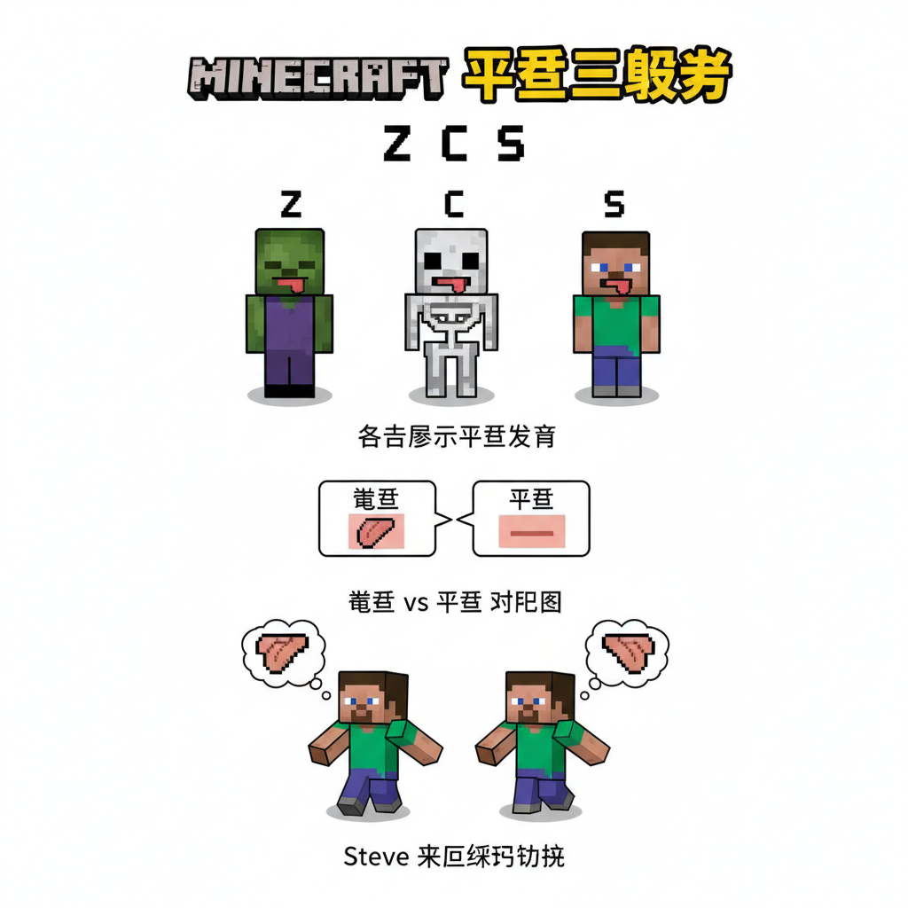
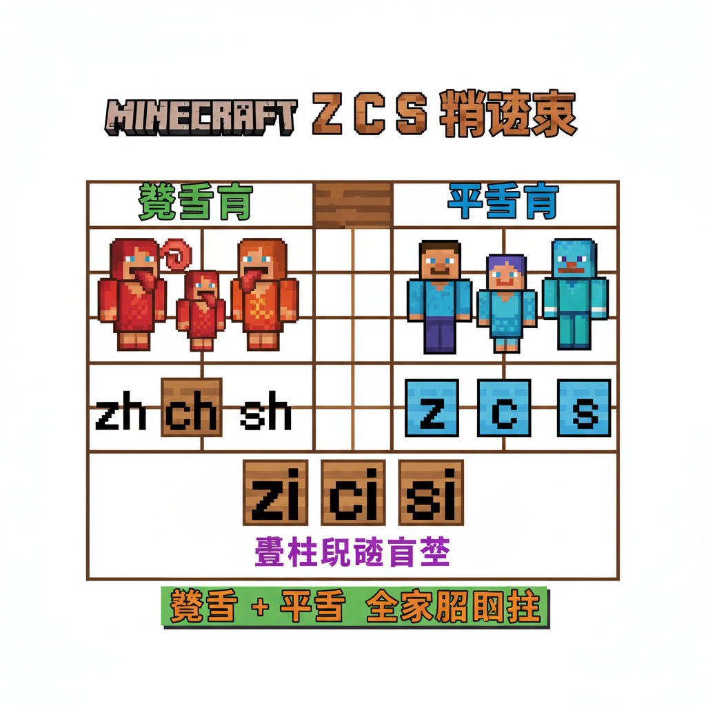
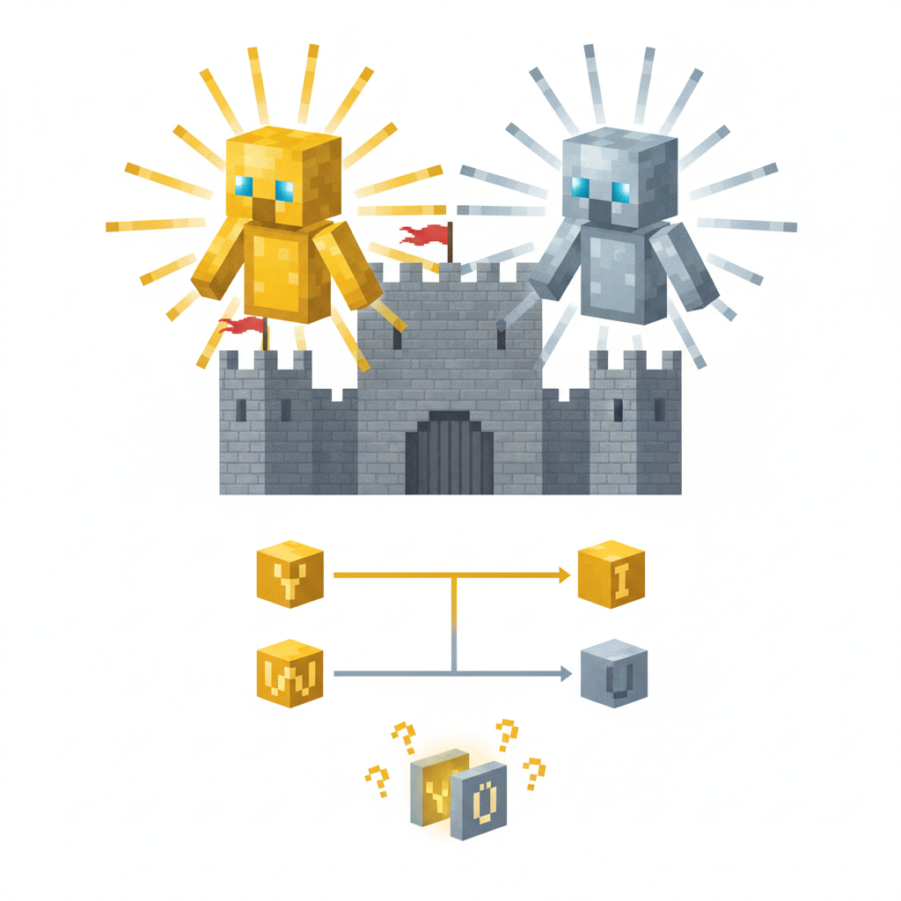
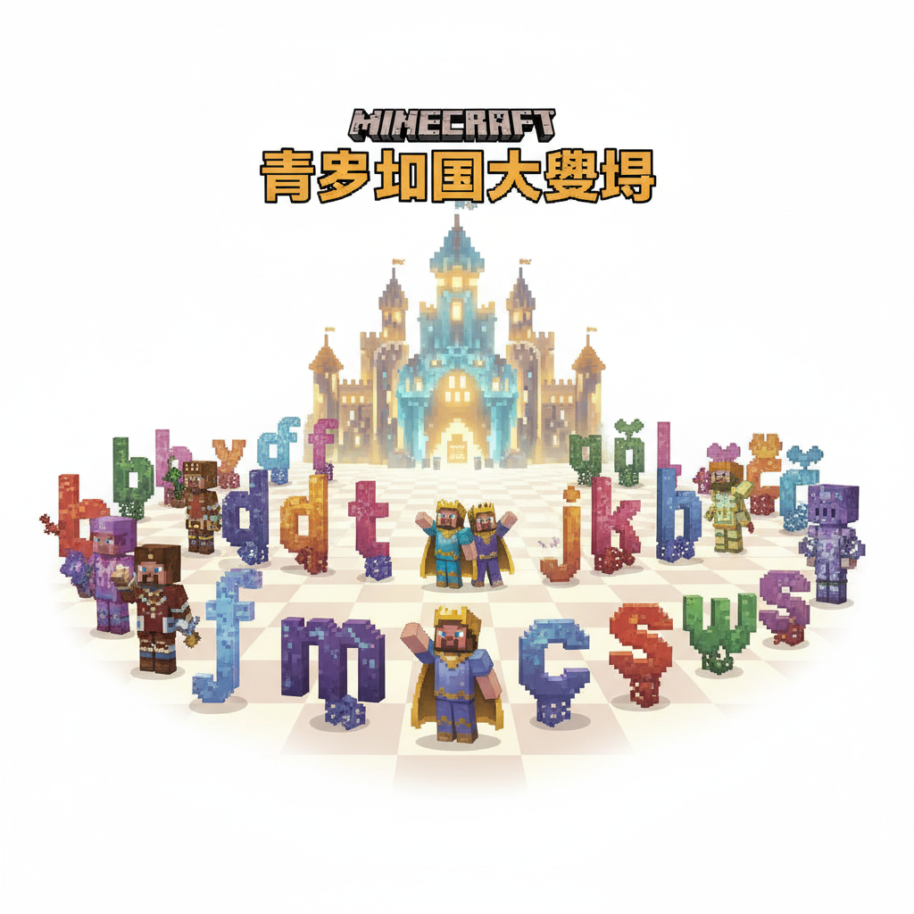
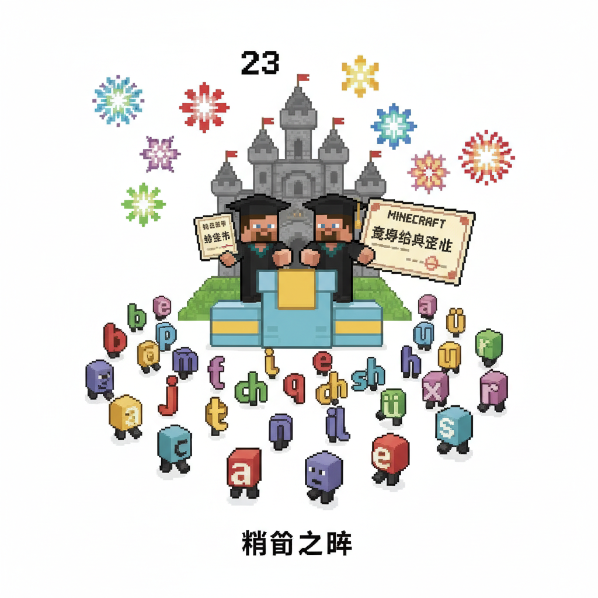
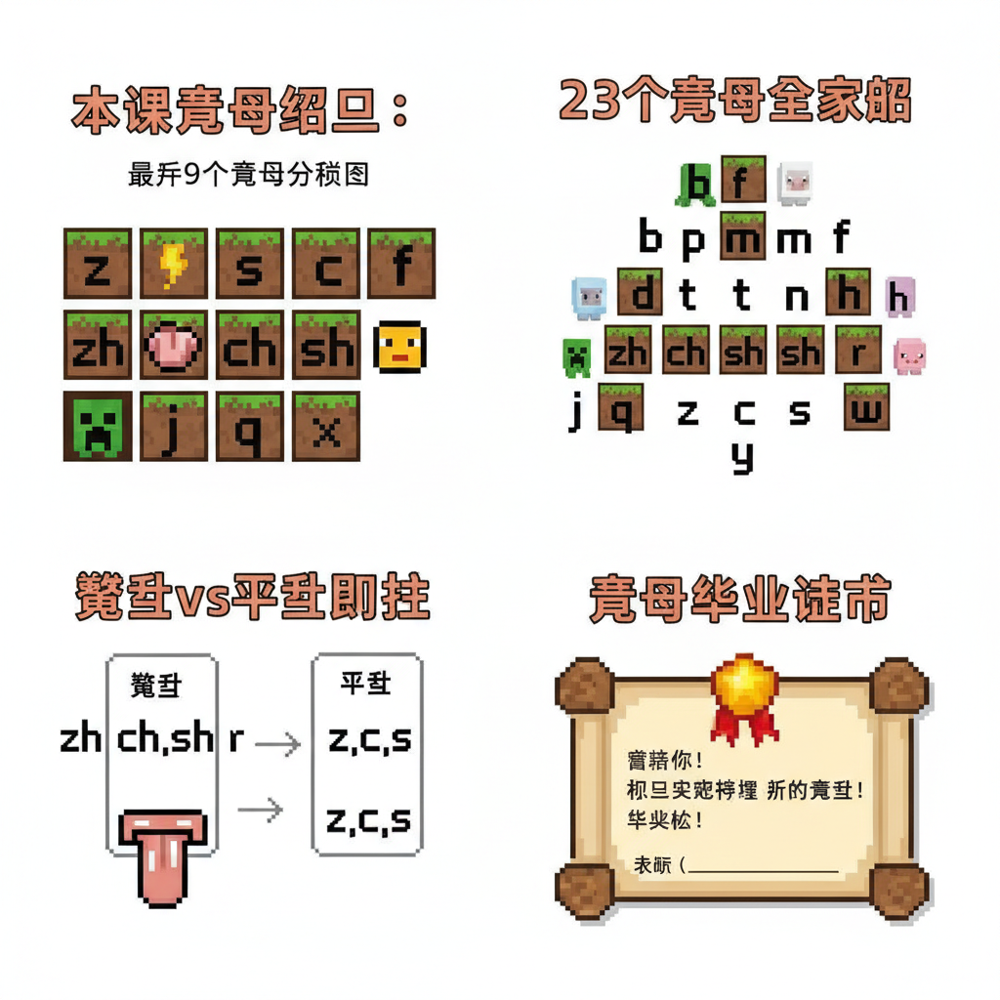

# 第11课 声母王国（下）

## 📋 学习目标
- 认识最后 9 个声母：**zh ch sh r z c s y w**
- 区分卷舌音（zh ch sh r）和平舌音（z c s）
- 掌握 y w 的特殊拼读规则
- 完成全部 23 个声母的学习

---

## 🎬 第一页：最后一扇门

Steve 和 Alex 来到声母王国的第三道——也是最后一道门。

b 将军在门口等着，身边站着已经认识的 14 位声母战士。

> "今天，你们将见到最后一批战友。学完它们，你们就掌握了全部 23 个声母！"

门上浮现出新的符号：

```
   🏰 声母王国 — 最后一批
   
   zh ch sh r  — 卷舌四骑士（舌尖翘起）
   z  c  s     — 平舌三兄弟（舌尖放平）
   y  w        — 特殊二使者（半元音）
```

> "最后这几个，是拼音里最有特色的声母！学会了它们，所有声母就到齐了。"

```
   🎯 全部 23 声母：
   
   b p m f    d t n l
   g k h      j q x
   zh ch sh r z c s
   y w
   
   今天学最后 9 个！
```



---

## 🎬 第二页：卷舌四骑士 — zh ch sh r

四位穿着闪亮铠甲的骑士策马而来。它们说话的时候，舌尖都翘起来！

> "看清楚——我们的发音秘诀是：**舌尖翘起来，顶住上颚前部！**"

**zh**（金甲骑士）："zh——舌尖翘起顶住硬颚，然后松开一条缝！"

```
   zh 的口诀：
   z 加椅子 zh zh zh，
   舌尖翘起 zh zh zh。
   
   像"织布"的声音：zh zh zh
```

**ch**（银甲骑士）："ch——一样的翘舌位置，但要喷气！"

```
   ch 的口诀：
   c 加椅子 ch ch ch，
   翘舌喷气 ch ch ch。
   
   像"吃饭"的声音：ch ch ch
   ✋ 送气！
```

**sh**（铜甲骑士）："sh——舌尖翘起靠近硬颚，气流从缝里挤出！"

```
   sh 的口诀：
   s 加椅子 sh sh sh，
   翘舌挤气 sh sh sh。
   
   像"狮子"的声音：sh sh sh
```

**r**（宝石骑士）："r——跟 sh 一样的翘舌位置，但声带要振动！"

```
   r 的口诀：
   小苗发芽 r r r，
   翘舌振动 r r r。
   
   像"日子"的声音开头：r r r
   ✋ 手摸喉咙：有振动！
```

> "注意！zh ch sh 是三个一组——不送气、送气、擦音。r 是唯一的翘舌浊音！"

```
   🎯 卷舌骑士 vs 平舌兄弟：
   卷舌（舌尖翘起）：zh ch sh
   平舌（舌尖放平）：z c s（接下来就学！）
```



---

## 🎬 第三页：zh ch sh r 拼读

四骑士展示它们的拼读本领：

```
   🗡️ zh 的拼读：
   zh + a = zha    zhā — 扎（扎手）
   zh + e = zhe    zhè — 这（这个）
   zh + u = zhu    zhù — 住（居住）
   zh + i = zhi    zhī — 知（知道）
   
   注意：zhi 中的 i 不是平常的 i！
   它是"整体认读音节"——不用拼，直接读！
   
   🗡️ ch 的拼读：
   ch + a = cha    chá — 茶（茶叶）
   ch + e = che    chē — 车（汽车）
   ch + u = chu    chū — 出（出去）
   ch + i = chi    chī — 吃（吃饭）
   
   🗡️ sh 的拼读：
   sh + a = sha    shā — 沙（沙子）
   sh + e = she    shé — 蛇（小蛇）
   sh + u = shu    shū — 书（书本）
   sh + i = shi    shī — 师（老师）
   
   🗡️ r 的拼读：
   r + e = re      rè — 热（热水）
   r + u = ru      rù — 入（进入）
   r + i = ri      rì — 日（日子）
```

> "zh ch sh r + i 的时候，i 读起来不太一样——这是整体认读音节，以后专门学！"



---

## 🎬 第四页：平舌三兄弟 — z c s

三个穿着轻便布甲的精灵走过来。跟卷舌骑士不同，它们的舌尖是放平的！

> "我们的秘诀是：**舌尖放平，靠近上门牙后面！**"

**z**（棕色布甲）："z——舌尖平放，顶住上门牙后面，突然松开！"

```
   z 的口诀：
   像个 2 字 z z z，
   平舌弹开 z z z。
   
   ✋ 不送气
```

**c**（灰色布甲）："c——同样的位置，用力喷气！"

```
   c 的口诀：
   半个圆圈 c c c，
   平舌喷气 c c c。
   
   ✋ 送气（强气流）
```

**s**（银色布甲）："s——舌尖靠近上门牙后面，气流从缝里挤出。"

```
   s 的口诀：
   8 字写半 s s s，
   平舌挤气 s s s。
   
   像"丝线"的声音：s s s
```

```
   🎯 卷舌 vs 平舌 大对比：
   
   卷舌（舌尖翘起）：zh ch sh
   平舌（舌尖放平）：z  c  s
   
   试试看：
   zh — 舌尖翘起！  z — 舌尖放平！
   ch — 翘起喷气！   c — 放平喷气！
   sh — 翘起挤气！   s — 放平挤气！
```

Steve 来回切换："zh——z——zh——z——真的不一样！"



---

## 🎬 第五页：z c s 拼读

```
   🗡️ z 的拼读：
   z + a = za      zá — 杂（杂色）
   z + e = ze      zé — 则（规则）
   z + u = zu      zú — 足（足球）
   z + i = zi      zì — 字（写字）
   
   🗡️ c 的拼读：
   c + a = ca      cā — 擦（擦桌子）
   c + e = ce      cè — 册（册子）
   c + u = cu      cū — 粗（粗细）
   c + i = ci      cí — 词（词语）
   
   🗡️ s 的拼读：
   s + a = sa      sǎ — 洒（洒水）
   s + e = se      sè — 色（颜色）
   s + u = su      sù — 速（速度）
   s + i = si      sī — 丝（丝线）
```

> "z c s 也不能跟 i 拼常规音节——zi ci si 也是整体认读音节！"

```
   📝 整体认读音节小预告：
   
   zhi chi shi ri zi ci si
   
   这 7 个不用拼，整体记住就好！
   后面会专门学。
```



---

## 🎬 第六页：特殊二使者 — y w

最后两位声母从城堡深处走出来。它们看起来跟别的声母不太一样——

**y**（金色使者）："我是 y——但我有时候表现得像 i。"

**w**（银色使者）："我是 w——但我有时候表现得像 u。"

> "y 和 w 很特别——它们是半元音，介于声母和韵母之间！"

```
   🌟 y 和 w 的秘密：
   
   y = i 的声母版
   w = u 的声母版
   
   当 i 或 u 作为音节开头时，
   要变成 y 和 w！
```

**y 的拼读规则：**

```
   y + a = ya      yā — 鸭（鸭子）
   y + e = ye      yè — 叶（叶子）
   y + i = yi      yī — 衣（衣服）
   y + u = yu      yú — 鱼（鱼 → ü！）
   
   注意！yu 里面是 ü！
   y + ü → yu（去两点，跟 jqx 一样！）
```

**w 的拼读规则：**

```
   w + a = wa      wá — 娃（娃娃）
   w + o = wo      wǒ — 我（我们）
   w + u = wu      wū — 乌（乌鸦）
```

> "y 和 w 虽然看起来简单，但在拼音里非常重要——它们是音节的'开头大使'！"

```
   📝 y w 规则口诀：
   
   大 y 加 a 变 ya，大 w 加 a 变 wa，
   大 y 加 u 读 yu（里面藏着 ü），
   大 w 加 o 读 wo。
```



---

## 🎬 第七页：23 声母大集合

最后一位声母入场——全体集合！

```
   🏰 声母王国大阅兵 — 23 位战士全部到齐！
   
   嘴唇四兄弟    b  p  m  f
   舌尖四剑客    d  t  n  l
   舌根三勇士    g  k  h
   舌面三剑客    j  q  x
   卷舌四骑士    zh ch sh r
   平舌三兄弟    z  c  s
   特殊二使者    y  w
   
   ─────────────────────
   共计：23 位！
```

23 个声母排成一个巨大的弧形。每个声母发出自己独特的声音——整个城堡都在共鸣！

> "从 23 个声母 × 24 个韵母 × 4 个声调——你能拼出多少种声音？"

Steve 算了算："好几百！"

> "对！这就是全部汉字的发音密码！"

b 将军站在最前面："恭喜你们——学完了全部 23 个声母！现在你们拥有了打开所有汉字发音的钥匙。"

```
   🎵 声母大合唱 🎵
   
   b p m f — 嘴唇响当当
   d t n l — 舌尖跳舞忙
   g k h   — 喉咙嗡嗡嗡
   j q x   — 舌面笑盈盈
   zh ch sh r — 卷舌转圈圈
   z c s   — 平舌丝丝丝
   y w     — 开头来帮忙
```



---

## 🎬 第八页：故事时间 — 声母毕业典礼

大阅兵结束后，城堡大厅里举行了毕业典礼。

b 将军郑重宣布：

> "Steve 和 Alex——你们完成了声母王国的全部课程！"

> "从今天起，你们可以用 23 个声母 + 6 个韵母 + 4 个声调，拼出几百种声音——这足够读出你们将来遇到的每一个汉字！"

所有 23 位声母战士齐声欢呼。

六位韵母姐妹也来了。她们和声母们手拉手，在城堡大厅跳起了拼音之舞。

```
   💃 拼音之舞 💃
   
   每个声母邀请一位韵母——
   ba  pa  ma  fa  da  ta  na  la
   ga  ka  ha  ja  qa  xa  zha  cha
   sha  za  ca  sa  ya  wa...
   
   每一种组合，都是一个新的声音！
```

Steve 拿出他的笔记本。在第一页，他写道：

```
   📖 我的拼音日记 — 声母篇 完
   
   23 个声母，全部认识！
   
   下一步：更多韵母（复韵母、鼻韵母）
   最终目标：用拼音读出任何汉字！
```

Alex 在后面加了一行：

> "拼音——让我们看见声音，听见文字。"

毕业典礼的烟花在声母王国上空绽放：

```
   🎆 B! 🎆 P! 🎆 M! 🎆 F!
   🎆 D! 🎆 T! 🎆 N! 🎆 L!
   ...23 朵烟花，23 个声母！
```



---

## 📝 练习

### 一、卷舌还是平舌？

```
   zh — 卷舌 ✓   还是   平舌 ✗
   z  — 卷舌 ✗   还是   平舌 ✓
   ch — 卷舌？    sh — 卷舌？   c  — 平舌？
   s  — 平舌？    r  — 卷舌？   
```

### 二、听音辨声母

让大人念，你写出声母：

| 字 | 拼音 | 声母 |
|----|------|------|
| 知 | zhī | ___ |
| 吃 | chī | ___ |
| 书 | shū | ___ |
| 日 | rì | ___ |
| 字 | zì | ___ |
| 词 | cí | ___ |
| 四 | sì | ___ |
| 叶 | yè | ___ |
| 我 | wǒ | ___ |

### 三、y 和 w 规则

```
   y + ___ = ye（叶）
   y + ___ = yu（鱼 — 注意里面是 ü！）
   w + ___ = wo（我）
   w + ___ = wu（乌）
```

### 四、全部 23 声母默写

不看书，按组写出全部 23 个声母：

```
   嘴唇组 (4)：___ ___ ___ ___
   舌尖组 (4)：___ ___ ___ ___
   舌根组 (3)：___ ___ ___
   舌面组 (3)：___ ___ ___
   卷舌组 (4)：___ ___ ___ ___
   平舌组 (3)：___ ___ ___
   特殊组 (2)：___ ___
```

---

## 🏆 挑战 — 声母大师毕业考

**第一关：卷舌平舌区分 🔍**

```
   下面拼音的声母是卷舌还是平舌？
   
   zhī — ___    zī — ___    chī — ___
   cī — ___     shī — ___    sī — ___
```

**第二关：zh ch sh vs j q x 🎭**

都是"不送气/送气/擦音"三件套——但部位不同！

```
   j  q  x  — 舌面（微笑）
   zh ch sh — 卷舌（翘舌）
   z  c  s  — 平舌（放平）
   
   试试快速切换：
   j—zh—z—j—zh—z
   q—ch—c—q—ch—c
   x—sh—s—x—sh—s
```

**第三关：23 声母全表 📊**

自己制作一张声母全表，按发音部位排列。检查：一共 23 个！

---

## 📊 本课小结

新学声母（9个）：
- [ ] zh — 翘舌不送气
- [ ] ch — 翘舌送气
- [ ] sh — 翘舌擦音
- [ ] r — 翘舌浊音（声带振动！）
- [ ] z — 平舌不送气
- [ ] c — 平舌送气
- [ ] s — 平舌擦音
- [ ] y — 特殊使者（i 的声母版，yu = ü）
- [ ] w — 特殊使者（u 的声母版）

> **全部 23 个声母学习完成 ✅！**
> 累计：b p m f / d t n l / g k h / j q x / zh ch sh r / z c s / y w

> 下次学习：复韵母 — ai ei ui ao ou iu ie üe er

---


