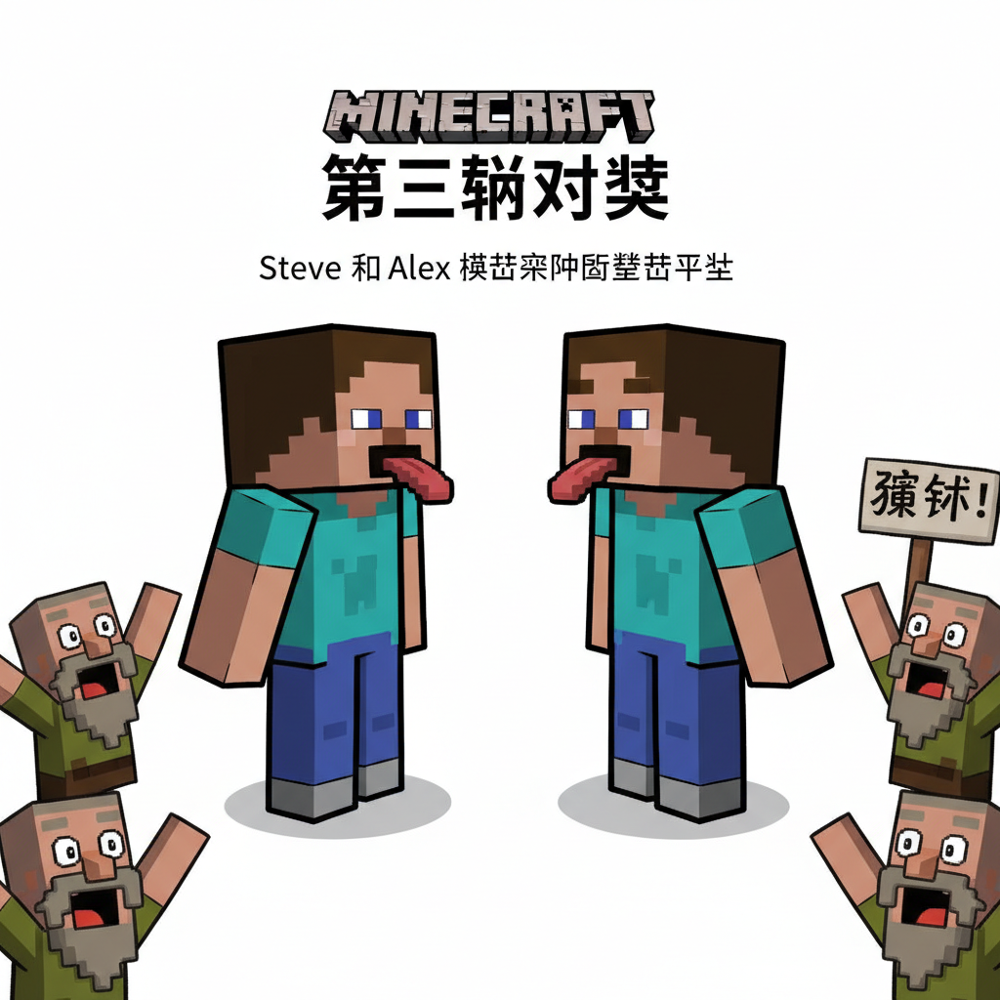
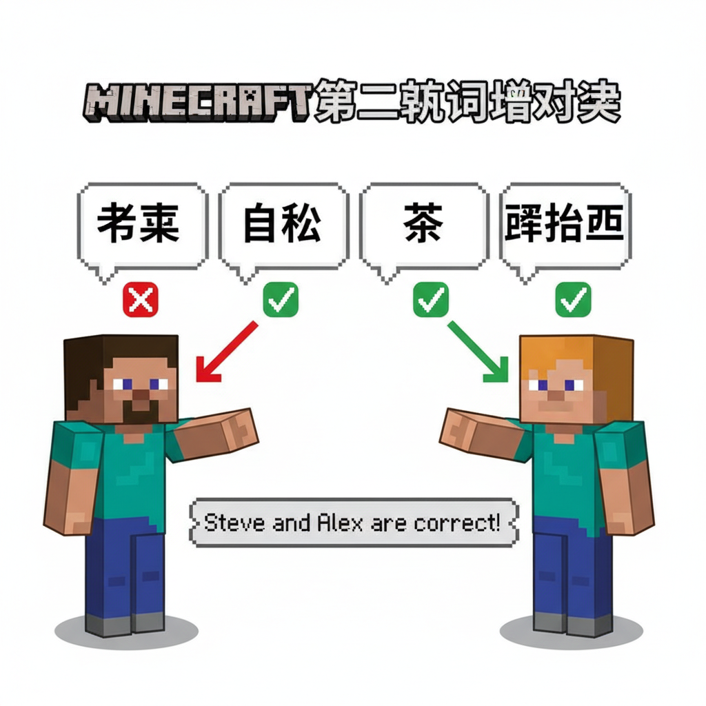
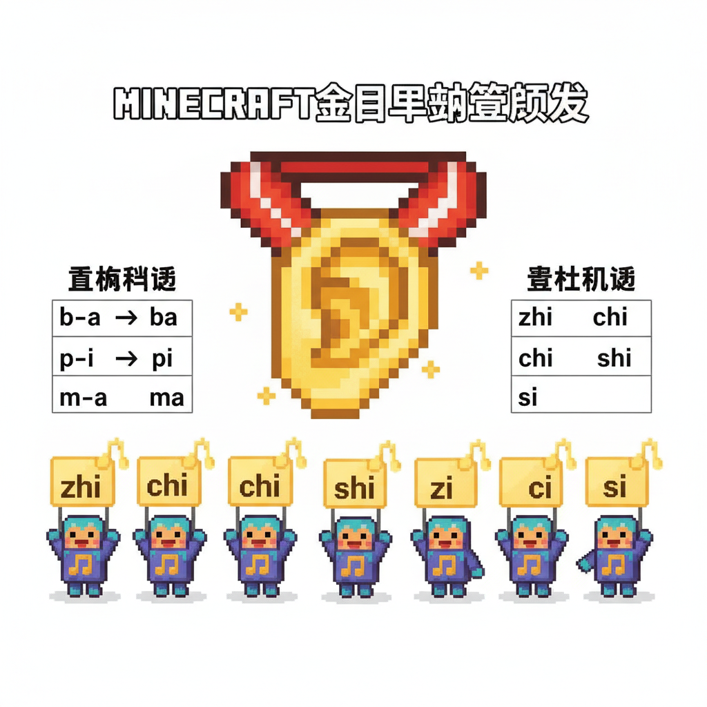
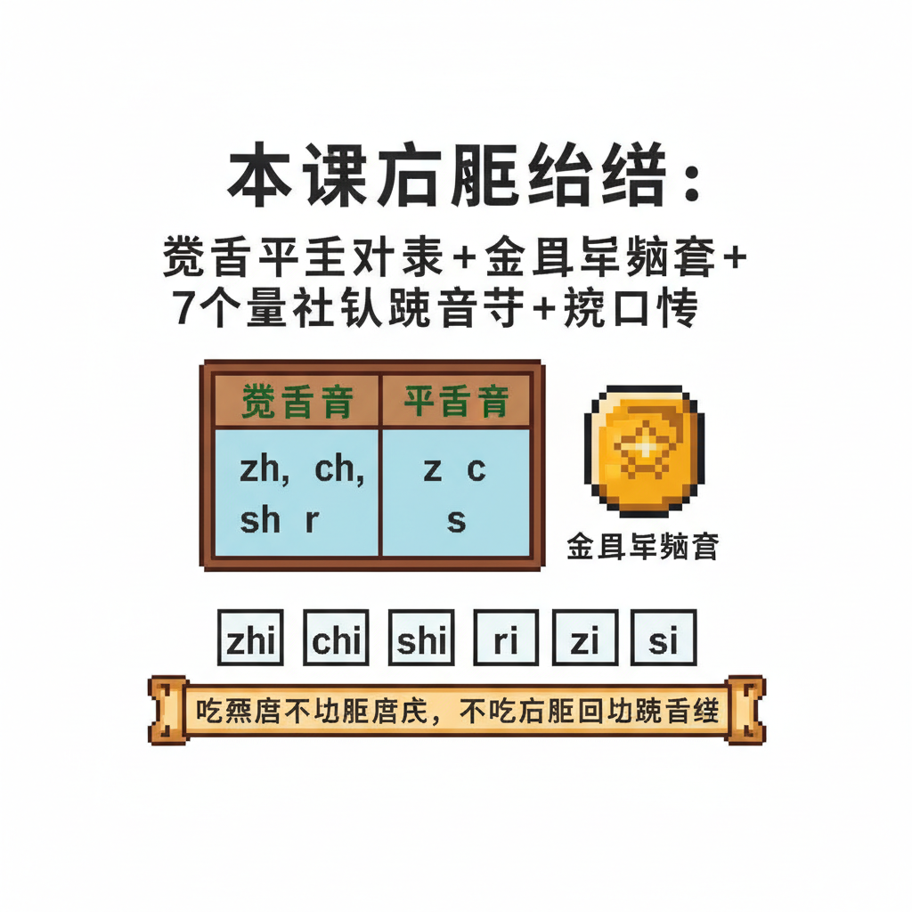

# 第11课 拓展篇：卷舌平舌大决战

## 📋 学习目标
- 熟练区分 zh ch sh（卷舌）和 z c s（平舌）
- 掌握整体认读音节 zhi chi shi ri zi ci si
- 综合运用全部 23 个声母拼读

---

## 🎬 第一页：卷舌村 vs 平舌村

声母王国的地图上有两个相邻的村庄：

```
   🏘️ 卷舌村             🏘️ 平舌村
   
   村民：zh ch sh r      村民：z c s
   
   特征：说话时舌尖翘起   特征：说话时舌尖放平
```

两村之间有一条河，河上有一座桥。但桥上挂着一个牌子：

> "谁能分清我们的声音，谁就能过桥！"

卷舌村的 zh 村长和平舌村的 z 村长站在桥两头。

> "很多人分不清我们的声音。"zh 村长说。

> "但分清我们很重要！"z 村长补充。"因为 zī 和 zhī 是不同的字！"

```
   🎯 经典对比：
   
   zī（资）≠ zhī（知）
   cí（词）≠ chí（迟）
   sī（丝）≠ shī（师）
```

> "来参加卷舌平舌大挑战吧！通过就能获得'金耳朵'称号！"


---

## 🎬 第二页：第一轮 — 单字对决

> "规则：听一个字，判断它的声母是卷舌还是平舌！"

```
   第一题：zhī（知）
   Steve："卷舌！因为舌尖翘起来了！"
   ✓ 正确！
   
   第二题：zì（字）
   Alex："平舌！舌尖放平的！"
   ✓ 正确！
   
   第三题：chī（吃）
   Steve："卷舌！"
   ✓ 正确！
   
   第四题：sì（四）
   Alex："平舌！"
   ✓ 正确！
```

> "你们天生就是金耳朵！"两位村长惊叹。

```
   🎯 分辨秘诀：
   
   念的时候用手摸舌尖——
   舌尖翘起碰到上颚 = 卷舌（zh ch sh）
   舌尖放平碰到牙后 = 平舌（z c s）
```



---

## 🎬 第三页：第二轮 — 词语对决

> "升级！听一个词，里面可能同时有卷舌和平舌！"

```
   第一词：shū zhuō（书桌）
   Steve："sh — 卷舌！zh — 卷舌！两个都是卷舌！"
   ✓
   
   第二词：zì sī（自私）
   Alex："z — 平舌！s — 平舌！"
   ✓
   
   第三词：chá zì（茶字）
   Steve："ch — 卷舌！z — 平舌！混合！"
   ✓
```

> "最难的一个——"

```
   第四词：sì shí sì（四十四）
   
   Alex深吸一口气："s—平舌，sh—卷舌，s—平舌！"
   ✓ ✓ ✓ 全对！
```

两位村长激动地握手："多少年了！终于有人能一次通过！"



---

## 🎬 第四页：金耳朵认证 + 整体认读入门

两位村长给 Steve 和 Alex 戴上了"金耳朵"勋章。

> "有了金耳朵，你们就能分辨所有卷舌和平舌的音了！"

接着，六位韵母精灵也来了。她们带来了一个秘密：

```
   🔮 整体认读音节 (zhěng tǐ rèn dú yīn jié)
   
   有些音节不用拼！整体记住就行。
   
   zhi  chi  shi  ri  zi  ci  si
   
   这 7 个音节里的 i 不是平常的 i！
   它是"哑 i"——不拼读，直接整体念出来。
```

> "比如 zhi——不是 z-h-i 拼出来的，而是直接读'知'！"

```
   整体认读音节对比：
   
   正常拼读：      整体认读：
   zh+a=zha 扎     zh+i=zhi 知（不拼！）
   ch+a=cha 查     ch+i=chi 吃（不拼！）
   sh+a=sha 沙     sh+i=shi 师（不拼！）
   r+e=re 热       r+i=ri 日（不拼！）
   z+a=za 杂       z+i=zi 字（不拼！）
   c+a=ca 擦       c+i=ci 词（不拼！）
   s+a=sa 洒       s+i=si 四（不拼！）
```

> "这 7 个音节就像拼音世界里的'快捷键'——不用拼，直接读！"

Steve 恍然大悟："怪不得 zhi chi shi 听起来跟 zha cha sha 不一样！"

> "没错！这就是整体认读音节的秘密。后面的课会详细学。"



---

## 📝 练习

### 一、卷舌还是平舌？

```
   zhuō（桌）→ 声母 zh，卷舌 ___
   zuò（坐）→ 声母 z，平舌 ___
   cháng（长）→ 声母 ___，___
   cǎo（草）→ 声母 ___，___
   shān（山）→ 声母 ___，___
   sān（三）→ 声母 ___，___
```

### 二、填声母（zh/z, ch/c, sh/s）

```
   ___ī（知）  ___ī（资）
   ___ī（吃）  ___í（词）
   ___ī（师）  ___ī（丝）
   ___ì（日）
```

### 三、读一读——经典绕口令

```
   sì shì sì，shí shì shí，
   shí sì shì shí sì，
   sì shí shì sì shí。
   （四是四，十是十，十四是十四，四十是四十。）
```

---

## 📊 拓展小结

- [ ] zh ch sh — 卷舌 ✓
- [ ] z c s — 平舌 ✓
- [ ] r — 卷舌浊音 ✓
- [ ] y w — 特殊使者 ✓
- [ ] 整体认读 zhi chi shi ri zi ci si（7个入门）

> **23 声母全部掌握！下一步：L12 韵母大家族**

---


