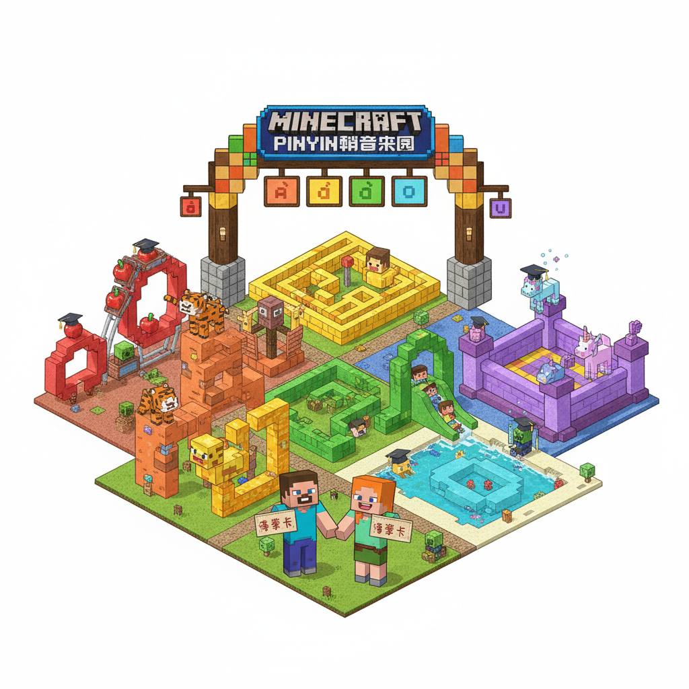
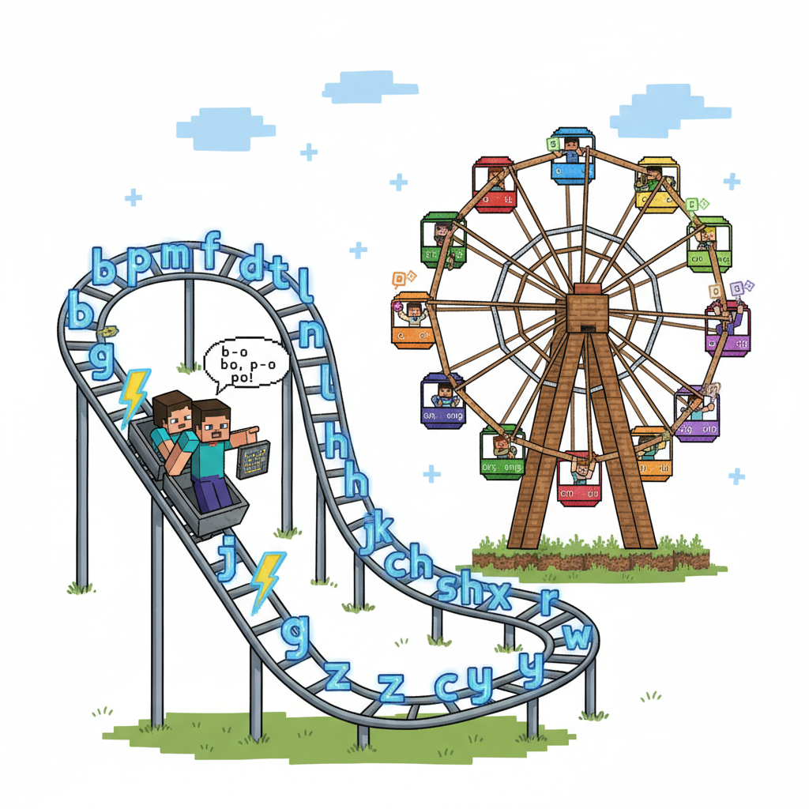
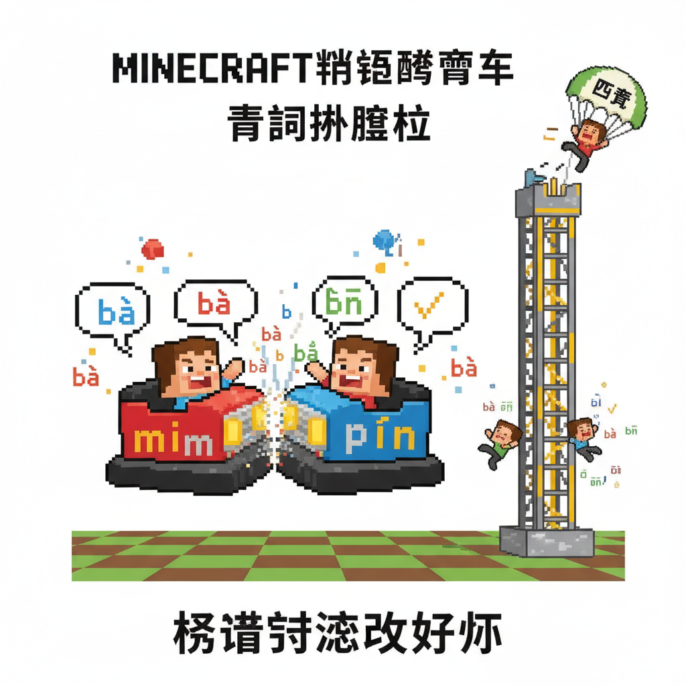
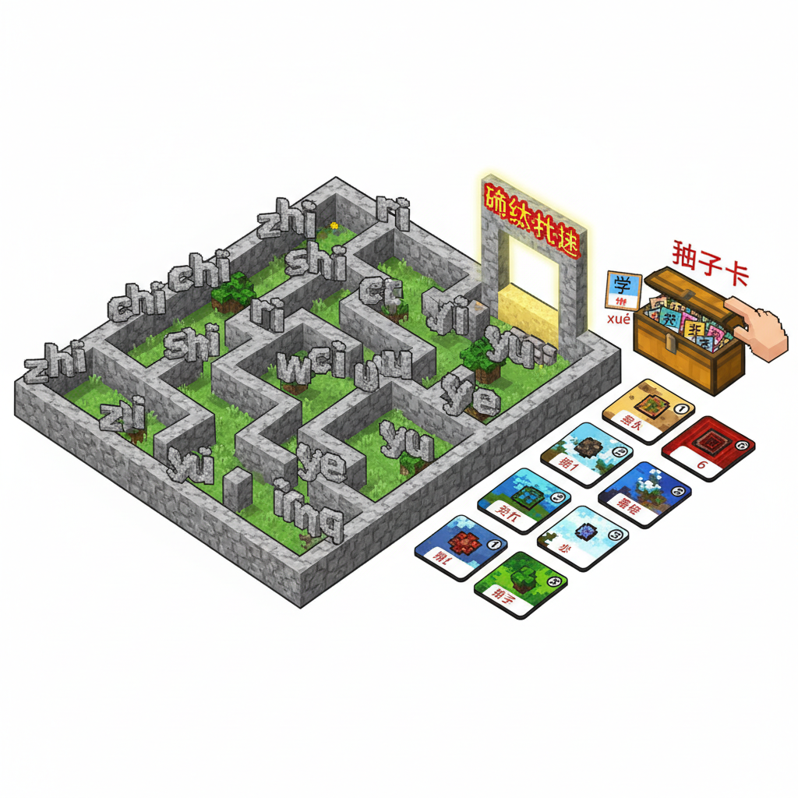
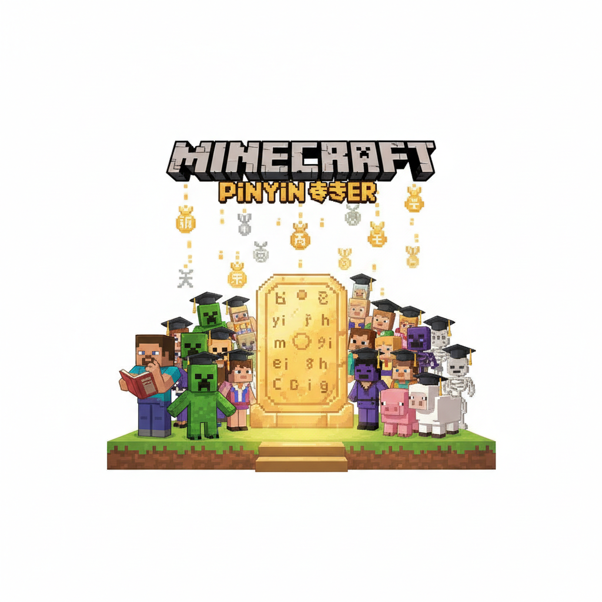
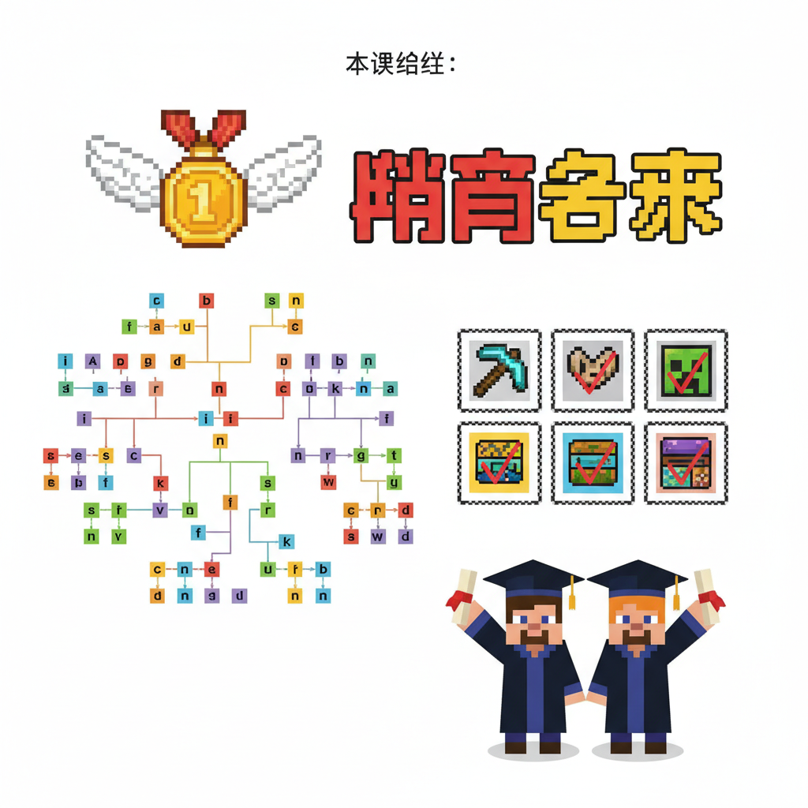

# 第12课 拓展篇：拼音游乐园

## 📋 学习目标
- 综合复习拼音体系（声母 + 单韵母 + 复韵母 + 整体认读 + 声调）
- 拼读完整音节
- 学会用拼音标注已学汉字
- 拼音技能毕业测试

---

## 🎬 第一页：拼音游乐园

学完韵母大冒险后，整个拼音世界的精灵们一起建了一座游乐园——

```
   🎡 拼音游乐园 🎡
   
   六大区域：
   ① 声母过山车   ② 韵母摩天轮   ③ 拼读碰碰车
   ④ 声调跳楼机   ⑤ 整体认读迷宫 ⑥ 终极大挑战
```

> "这是你们的毕业典礼！通过所有区域，就能获得'拼音大师'称号！"

Steve 和 Alex 站在游乐园入口，手里拿着一张集章卡。每通过一个区域就能盖一个章。

> "来吧！全部通关！"



---

## 🎬 第二页：① 声母过山车 + ② 韵母摩天轮

**声母过山车**：轨道上不断闪过声母符号，必须在经过时大声读出来！

```
   🎢 b→p→m→f→d→t→n→l→g→k→h→
      j→q→x→zh→ch→sh→r→z→c→s→y→w
   
   Steve一口气读完 23 个声母！✓ 盖章！
```

**韵母摩天轮**：每个车厢里是一个韵母，转到最高点时读出：

```
   🎡 a车厢→o车厢→e车厢→i车厢→u车厢→ü车厢→
      ai→ei→ui→ao→ou→iu→ie→üe→er
   
   Alex读完 15 个韵母！✓ 盖章！
```

两个章到手！✅✅



---

## 🎬 第三页：③ 拼读碰碰车 + ④ 声调跳楼机

**拼读碰碰车**：碰到别的车就要大声拼出对方的拼音！

```
   🚗 Steve的车：b+ai → bāi/bái/bǎi/bài
   🚙 Alex的车：m+ei → mēi/méi/měi/mèi
   
   碰！读出对方的拼音！
   🚗 sh+ui → shuī/shuí/shuǐ/shuì
   🚙 l+ao → lāo/láo/lǎo/lào
```

**声调跳楼机**：从高处落下，必须在落地前念完四个声调！

```
   跳楼机上升中：ā —— á —— ǎ ——
   开始下落！—— à —— 安全落地！
   
   ō ó ǒ ò —— dī dí dǐ dì ——
   全部正确！✓ 盖章！
```

四个章到手！✅✅✅✅



---

## 🎬 第四页：⑤ 整体认读迷宫 + ⑥ 终极大挑战

**整体认读迷宫**：墙壁上刻着 10 个整体认读音节，必须边走边读，读错就走进死胡同！

```
   🏛️ 迷宫入口：zhi→chi→shi→ri→
               zi→ci→si→
               yi→wu→yu→🏆 出口！
   
   "zhi chi shi ri zi ci si yi wu yu！"
   全对！走出迷宫！✓ 盖章！
```

**终极大挑战**：随机抽一张字卡，必须用拼音完整标注！

```
   🃏 字卡1：花
   Steve："h-u-ā → huā！声母 h，韵母 a，一声！"
   ✓
   
   🃏 字卡2：学
   Alex："x-ué → xué！声母 x，复韵母 üe，二声！
          注意：jqx后面的üe去两点！"
   ✓
   
   🃏 字卡3：书
   Steve："sh-ū → shū！声母 sh，韵母 u，一声！"
   ✓
   
   🃏 字卡4：走
   Alex："z-ǒu → zǒu！声母 z，复韵母 ou，三声！"
   ✓
```

全部六个章集齐！✅✅✅✅✅✅



---

## 🎬 第五页：拼音大师毕业典礼

游乐园中央的舞台上，所有声母精灵和韵母精灵齐聚一堂。

> "Steve 和 Alex——你们通过了拼音游乐园的全部挑战！"

> "从今天起，你们是——拼音大师！"

🏅🏅 两枚拼音大师勋章从天空飘落。

```
   🏅 拼音大师 🏅
   
   技能清单：
   ✅ 23 个声母 — 全部掌握
   ✅ 15 个韵母 — 全部掌握（单+复）
   ✅ 4 个声调 — 全部掌握
   ✅ 10 个整体认读音节 — 全部掌握
   ✅ 能拼任何学过的汉字
   ✅ 能给生字标拼音
```

Steve 拿起他的笔记本，翻到第一页——那里写着一声平、二声扬。那是几周前的自己。

> "从 a o e 开始，到现在——我们真的学会了拼音。"

Alex 笑了："现在任何汉字，只要看到拼音，我们都能读出来。"

> "但这只是一个开始。"b 将军说。"后面还有鼻韵母、更多整体认读音节等着你们。拼音的路，越走越宽。"

> "但你们已经有了最重要的基础——拼读的能力！"

Steve 和 Alex 握紧拼音石。石头发出温暖的光芒。

> "下一站——鼻韵母！"



---

## 📝 练习

### 一、拼读大测

给下面的字标完整拼音：

```
   花 → ___    鸟 → ___    走 → ___
   白 → ___    美 → ___    写 → ___
   牛 → ___    老 → ___    月 → ___
   水 → ___    火 → ___    书 → ___
```

### 二、拼音体系默写

不看书，写出你知道的：

```
   声母（23个）：___ ___ ___ ___ ___ ...
   单韵母（6个）：___ ___ ___ ___ ___ ___
   复韵母（9个）：___ ___ ___ ___ ___ ___ ___ ___ ___
   整体认读（10个）：___ ___ ___ ___ ___ ___ ___ ___ ___ ___
```

### 三、我是拼音大师

用拼音写一句话，让朋友用拼音读出来：

```
   例：wǒ ài xué pīn yīn！
   （我爱学拼音！）
   
   你的：______________
```

---

## 📊 拓展小结 — 拼音 Phase 2 完成！

> **拼音核心体系 ✅ 全部学完！**
> 
> 23声母 + 15韵母 + 10整体认读 + 4声调
> 
> 下一步：鼻韵母 an en in un ün ang eng ing ong

---



---

> 【标A: 语文课标一上·汉语拼音·声母韵母整体认读】

### ❌常见误解

| ❌ 错误发音/写法 | ✅ 正确发音/写法 |
|-------|-------|
| b和d分不清（"b像6，d反6"） | b=右耳b，圆圈在右；d=左耳d，圆圈在左 |
| p和q分不清（"p像9，q反9"） | p=泼水p，圆圈在右向下；q=气球q，圆圈在左向下 |
| zh/ch/sh 读成 j/q/x | 舌尖翘起（翘舌音），不是舌面贴硬腭 |
| 前鼻音和后鼻音不分 | an≠ang，舌头位置不同（前鼻音舌尖顶上齿，后鼻音舌根抬起） |

🧠 想一想
1. **观察推理**：b、p、m、f 都用嘴唇发音，d、t、n、l 用舌尖。你还能找到其他发音位置的规律吗？
2. **反事实**：如果拼音里没有声调（一、二、三、四声），"妈妈骂马"这4个字还能分得清吗？

## 🔗 跨科连接
英语Lesson 2-3教26个字母 → 拼音声母韵母与英语字母对比
数学第10课教图形 → b/d/p/q 形状分辨

