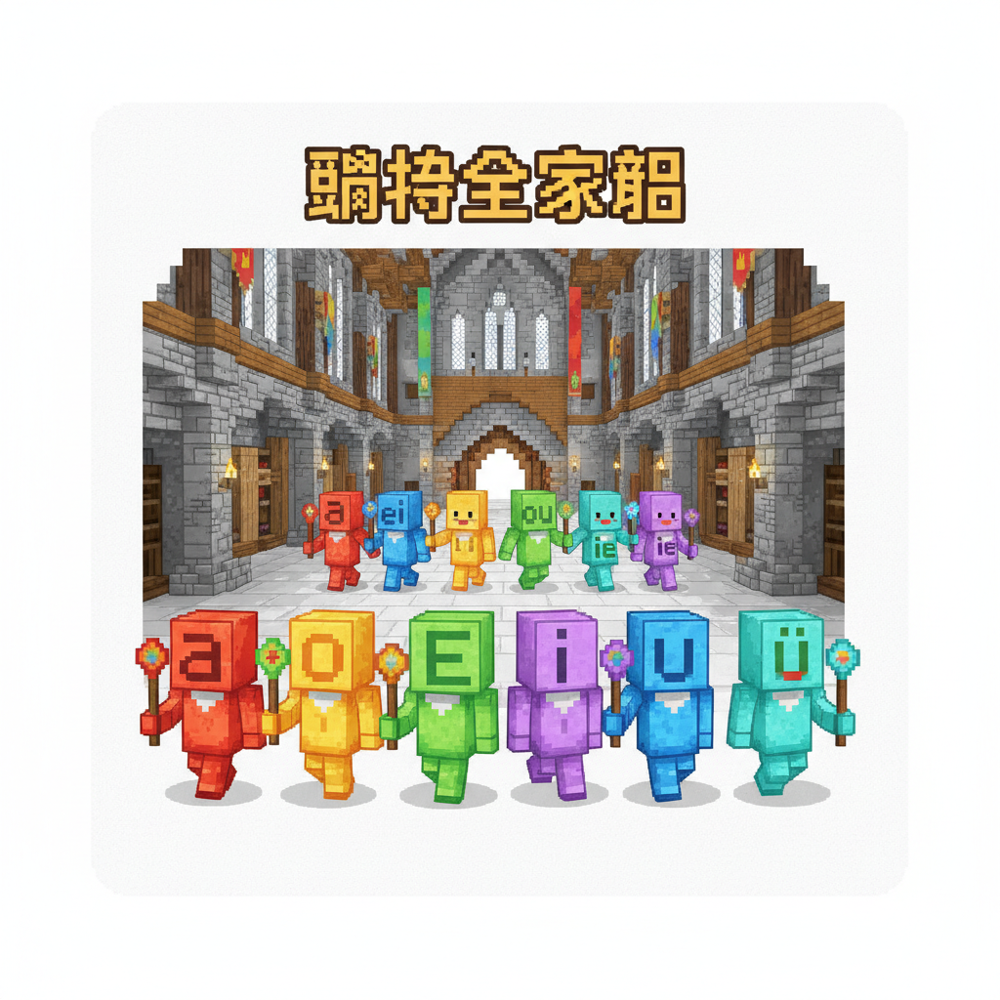
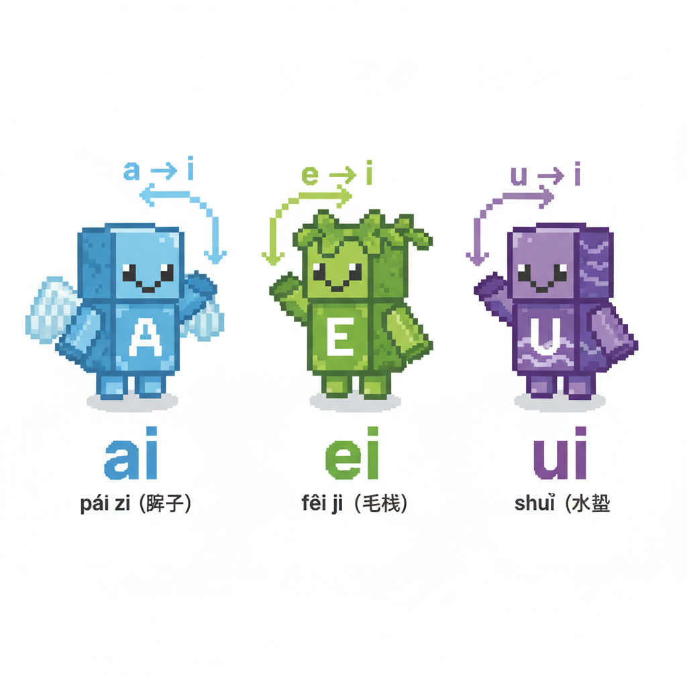
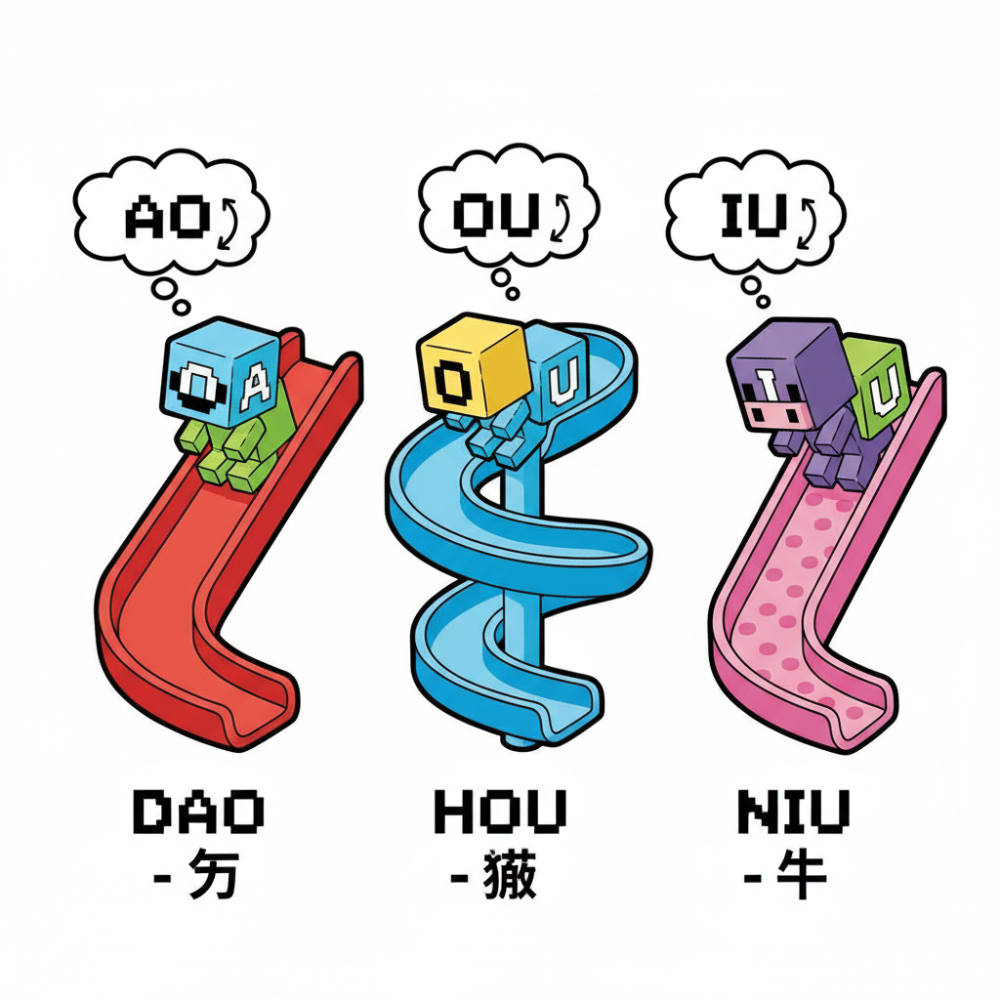
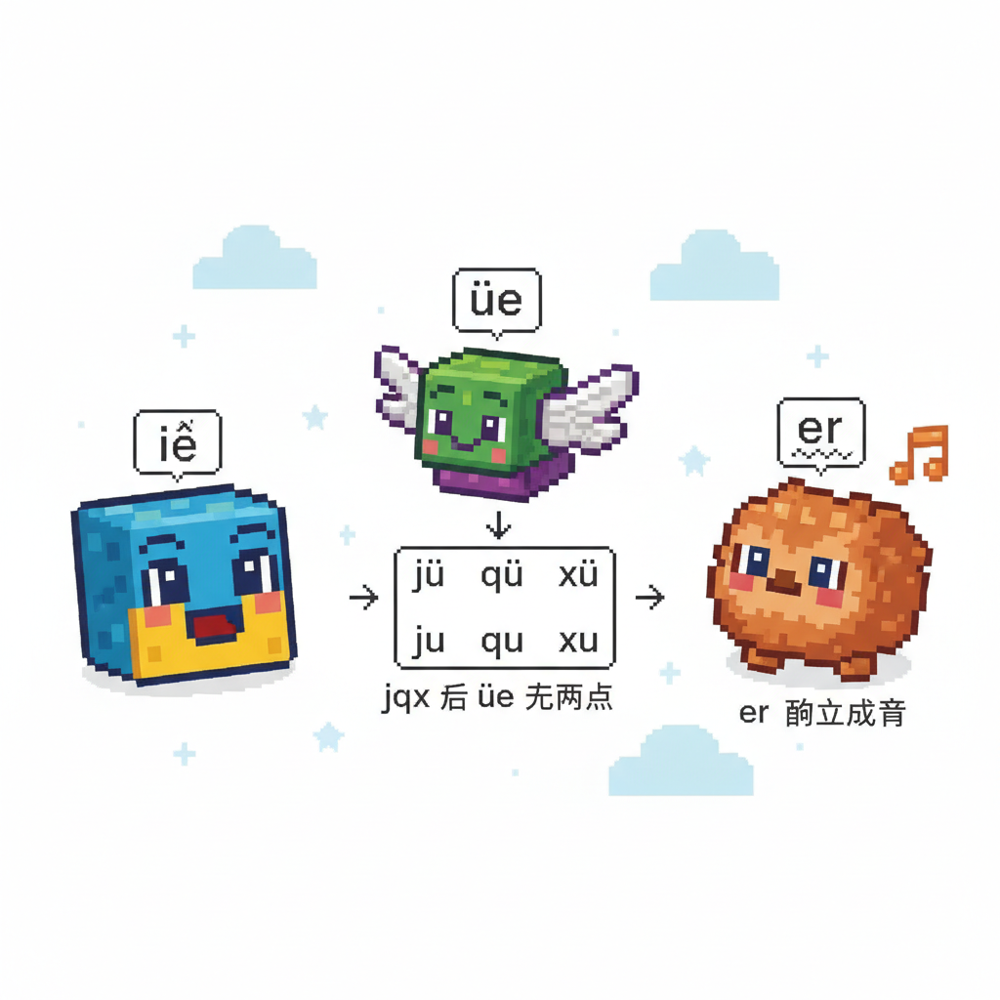
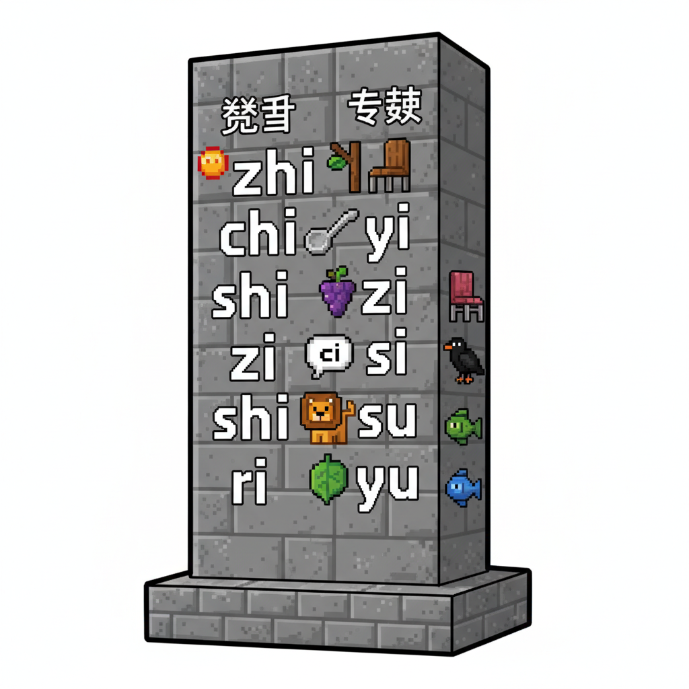
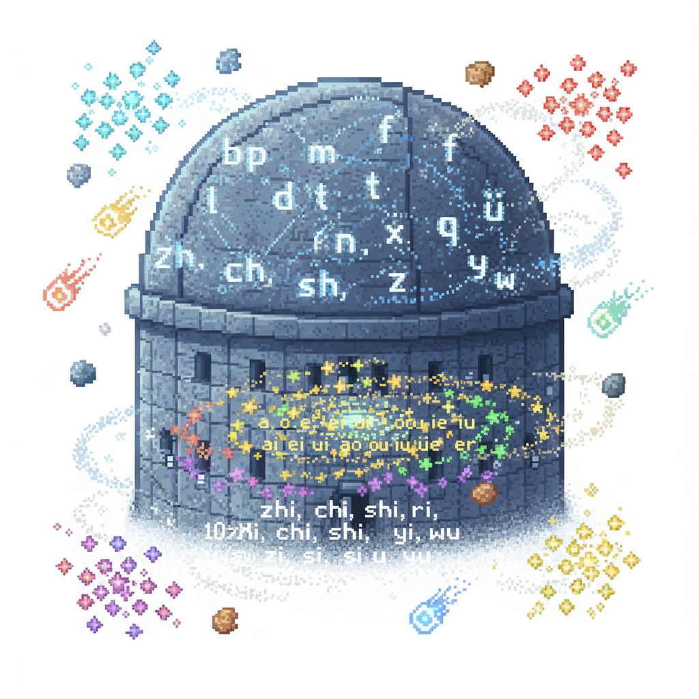
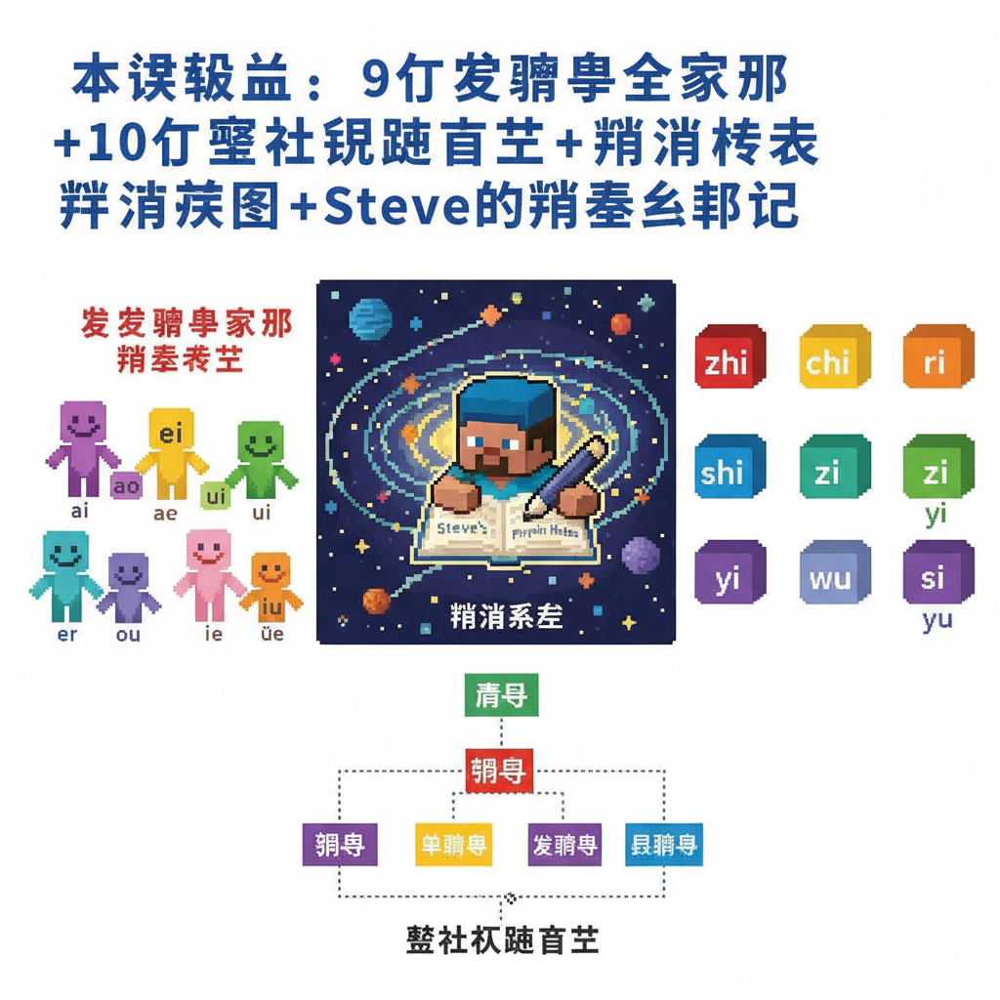

# 第12课 韵母大冒险

## 📋 学习目标
- 认识复韵母：**ai ei ui ao ou iu ie üe er**
- 学习整体认读音节：**zhi chi shi ri zi ci si yi wu yu ye yue**
- 区分单韵母和复韵母
- 完成拼音体系核心框架

---

## 🎬 第一页：韵母精灵的秘密

学完全部 23 个声母后，六位单韵母精灵在城堡大厅等着 Steve 和 Alex。

> "你们已经认识了全部声母——但韵母不止我们六个！"

> "我们还有姐妹——复韵母！"a 精灵说。

```
   单韵母（6个）：a o e i u ü
   复韵母（9个）：ai ei ui ao ou iu ie üe er
```

> "复韵母 = 两个单韵母手拉手组成的新声音！"

城堡大厅的门打开了，一群新的韵母精灵走了出来。每个精灵都是由两个单韵母组合而成的。

```
   🔴 a + 💚 i = 🟠 ai
   🔵 e + 💚 i = 🟣 ei
   💜 u + 💚 i = 🟤 ui
   🔴 a + 🟡 o = 🟠 ao
   🟡 o + 💜 u = 🟣 ou
   💚 i + 💜 u = 🟤 iu
   💚 i + 🔵 e = ie
   🧡 ü + 🔵 e = üe
   🔵 e + r = er
```

> "今天，我们来探索韵母世界的新大陆！"



---

## 🎬 第二页：ai ei ui — 开口三姐妹

前三个复韵母精灵手拉手走出来。

```
   ai  ei  ui  — 开口呼三姐妹
   
   特点：从第一个音滑到第二个音！
```

**ai**："a——滑到——i。像'爱'的声音：ài！"

```
   ai 的口诀：
   a 和 i，手拉手，
   a 滑到 i，ai ai ai。
   
   像说"哎呀"被打了一下：āi！
```

**ei**："e——滑到——i。像'诶'的声音：ēi！"

```
   ei 的口诀：
   e 和 i，手拉手，
   e 滑到 i，ei ei ei。
   
   像用力时发出的声音：ēi！
```

**ui**："u——滑到——i。注意！ui 是 u 和 i 的组合，但读写都是 ui！"

```
   ui 的口诀：
   u 和 i，手拉手，
   u 滑到 i，ui ui ui。
   
   像"微笑"的嘴型：uī！
```

```
   🎯 拼读练习：
   
   b + ai = bai    bái — 白（白色）
   m + ei = mei    měi — 美（美丽）
   g + ui = gui    guī — 归（归来）
```



---

## 🎬 第三页：ao ou iu — 圆口三兄弟

接下来是三个以圆唇收尾的复韵母：

**ao**："a——滑到——o。像'凹'：āo！"

```
   ao 的口诀：
   a 和 o，手拉手，
   a 滑到 o，ao ao ao。
   
   像大老虎叫：áo——！
```

**ou**："o——滑到——u。像'欧'：ōu！"

```
   ou 的口诀：
   o 和 u，手拉手，
   o 滑到 u，ou ou ou。
   
   像海鸥叫：ōu——！
```

**iu**："i——滑到——u。注意！iu 是 i 和 u 的组合！"

```
   iu 的口诀：
   i 和 u，手拉手，
   i 滑到 u，iu iu iu。
   
   像"优秀"的开头：iū！
```

```
   🎯 拼读练习：
   
   l + ao = lao    lǎo — 老（老师）
   z + ou = zou    zǒu — 走（走路）
   n + iu = niu    niú — 牛（小牛）
```

> "有没有发现——复韵母的发音都是从第一个音滑到第二个音？就像坐滑梯！"



---

## 🎬 第四页：ie üe er — 特别三侠

最后三个复韵母各有特别之处：

**ie**："i——滑到——e。像'叶子'的'叶'开头：iē！"

```
   ie 的口诀：
   i 和 e，手拉手，
   i 滑到 e，ie ie ie。
   
   注意：这里的 e 读 ê（不是平常的 e！）
```

**üe**："ü——滑到——e。像'月亮'的'月'开头：üē！"

```
   üe 的口诀：
   ü 和 e，手拉手，
   ü 滑到 e，üe üe üe。
   
   注意！j q x 后面时 ü 去两点 →
   jue（决）que（缺）xue（学）
```

**er**："这是一个最特别的韵母——它不跟任何声母拼，自己就是一个音节！"

```
   er 的口诀：
   e 加小尾巴 r，
   卷起舌头 er er er。
   
   像"耳朵"：ěr！
   
   ér（儿） ěr（耳） èr（二）
```

```
   🎯 拼读练习：
   
   x + ie = xie    xiě — 写（写字）
   j + üe = jue    jué — 觉（觉得）
   er — 特殊韵母，独立成音！
```



---

## 🎬 第五页：整体认读音节

全部韵母精灵到齐后，城堡中出现了一块巨大的石碑。

石碑上刻着 16 个特殊的音节：

```
   🔮 整体认读音节 🔮
   
   这些音节不用拼！整体记住直接读！
   
   zhi  chi  shi  ri   — 卷舌组
   zi   ci   si        — 平舌组
   yi   wu   yu        — i/u/ü 开头组
   ye   yue  yin  yun  ying  yuan — 扩展组（后学）
```

> "今天先学前 10 个——最常用的！"

```

---

> 【标A: 语文课标一上·汉语拼音·声母韵母整体认读】

### ❌常见误解

| ❌ 错误发音/写法 | ✅ 正确发音/写法 |
|-------|-------|
| b和d分不清（"b像6，d反6"） | b=右耳b，圆圈在右；d=左耳d，圆圈在左 |
| p和q分不清（"p像9，q反9"） | p=泼水p，圆圈在右向下；q=气球q，圆圈在左向下 |
| zh/ch/sh 读成 j/q/x | 舌尖翘起（翘舌音），不是舌面贴硬腭 |
| 前鼻音和后鼻音不分 | an≠ang，舌头位置不同（前鼻音舌尖顶上齿，后鼻音舌根抬起） |

🧠 想一想
1. **观察推理**：b、p、m、f 都用嘴唇发音，d、t、n、l 用舌尖。你还能找到其他发音位置的规律吗？
2. **反事实**：如果拼音里没有声调（一、二、三、四声），"妈妈骂马"这4个字还能分得清吗？

## 🔗 跨科连接
英语Lesson 2-3教26个字母 → 拼音声母韵母与英语字母对比
数学第10课教图形 → b/d/p/q 形状分辨

📖 整体认读音节（上）
   
   卷舌组：
   zhi — 知    chi — 吃    shi — 师    ri — 日
   
   平舌组：
   zi — 字    ci — 词    si — 四
   
   特殊组：
   yi — 衣    wu — 乌    yu — 鱼
   
   注意：zhi chi shi ri zi ci si 中的 i 不是平常的 i！
   yi wu yu 中的 y 和 w 也不是声母——整体认读就好！
```

> "这些音节就像一个整体字——你不用拆，直接念！"

```
   🎯 口诀：
   zhi chi shi ri zi ci si
   七个整体记心里
   yi wu yu 跟着学
   一共十个不用拼
```



---

## 🎬 第六页：拼音体系总览

城堡大厅的穹顶上，出现了完整的拼音体系图：

```
   🏰 拼音体系完整图 🏰
   
   ┌─ 声母 (23个)
   │  b p m f  d t n l  g k h
   │  j q x  zh ch sh r  z c s
   │  y w
   │
   ├─ 韵母 (24个)
   │  单韵母：a o e i u ü
   │  复韵母：ai ei ui ao ou iu ie üe er
   │  鼻韵母：an en in un ün ang eng ing ong（后学）
   │
   ├─ 整体认读音节 (16个)
   │  zhi chi shi ri zi ci si
   │  yi wu yu ye yue yin yun ying yuan
   │
   └─ 声调 (4个)
      ˉ ˊ ˇ ˋ
```

> "这就是整个拼音体系的框架！"

> "你们已经学会了 23 个声母 + 15 个韵母（6 单 + 9 复） + 10 个整体认读音节 + 4 个声调！"

> "下一次，我们将学习最后的韵母——鼻韵母，以及更多的整体认读音节。"

Steve 在笔记本上画下了这个拼音星系图。所有的声母和韵母像星星一样排列着。

> "拼音真是一个完整的宇宙。"他说。



---

## 📝 练习

### 一、找复韵母

圈出下面拼音中的复韵母：

```
   bái（白）— 复韵母：___
   měi（美）— 复韵母：___
   lǎo（老）— 复韵母：___
   zǒu（走）— 复韵母：___
   xiě（写）— 复韵母：___
   niú（牛）— 复韵母：___
```

### 二、整体认读

读出下面的整体认读音节：

```
   zhi — ___    chi — ___    shi — ___    ri — ___
   zi  — ___    ci  — ___    si  — ___
   yi  — ___    wu  — ___    yu  — ___
```

### 三、拼一拼

```
   b + ai → ___（白）
   m + ei → ___（美）
   g + ui → ___（归）
   l + ao → ___（老）
   n + iu → ___（牛）
   x + ie → ___（写）
```

### 四、找到错误

```
   j + üe → jüe  ✗ 错！（j 后面 ü 去两点 → jue）
   q + üe → qüe  ✗ 错！（→ que）
   x + üe → xüe  ✗ 错！（→ xue）
   
   改正：jue que xue ✓
```

---

## 🏆 挑战 — 拼音大师

**第一关：韵母分类 📦**

```
   单韵母：___ ___ ___ ___ ___ ___
   复韵母：___ ___ ___ ___ ___ ___ ___ ___ ___
```

**第二关：拼读大挑战 ⚡**

用已学声母 + 复韵母，拼出尽可能多的拼音（不计声调）：

```
   例：b+ai=bai  p+ai=pai  m+ai=mai...
   
   目标：20+ 个！
```

**第三关：拼音星系图 🎨**

画出你自己的拼音星系图（声母 + 韵母 + 整体认读）：

---

## 📊 本课小结

新学复韵母（9个）：
- [ ] ai ei ui — 开口三姐妹
- [ ] ao ou iu — 圆口三兄弟
- [ ] ie üe er — 特别三侠

整体认读音节（10/16）：
- [ ] zhi chi shi ri — 卷舌组
- [ ] zi ci si — 平舌组
- [ ] yi wu yu — 特殊组

> **拼音核心框架完成！**
> 已学：23声母 + 15韵母 + 10整体认读 + 4声调
> 待学：鼻韵母 + 剩余整体认读音节

---


