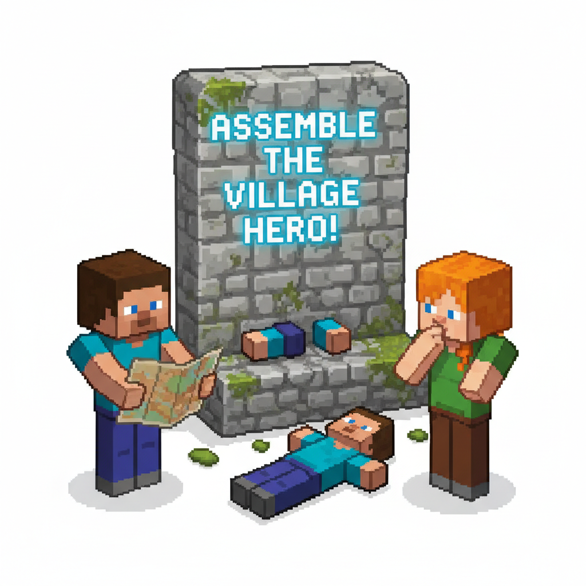
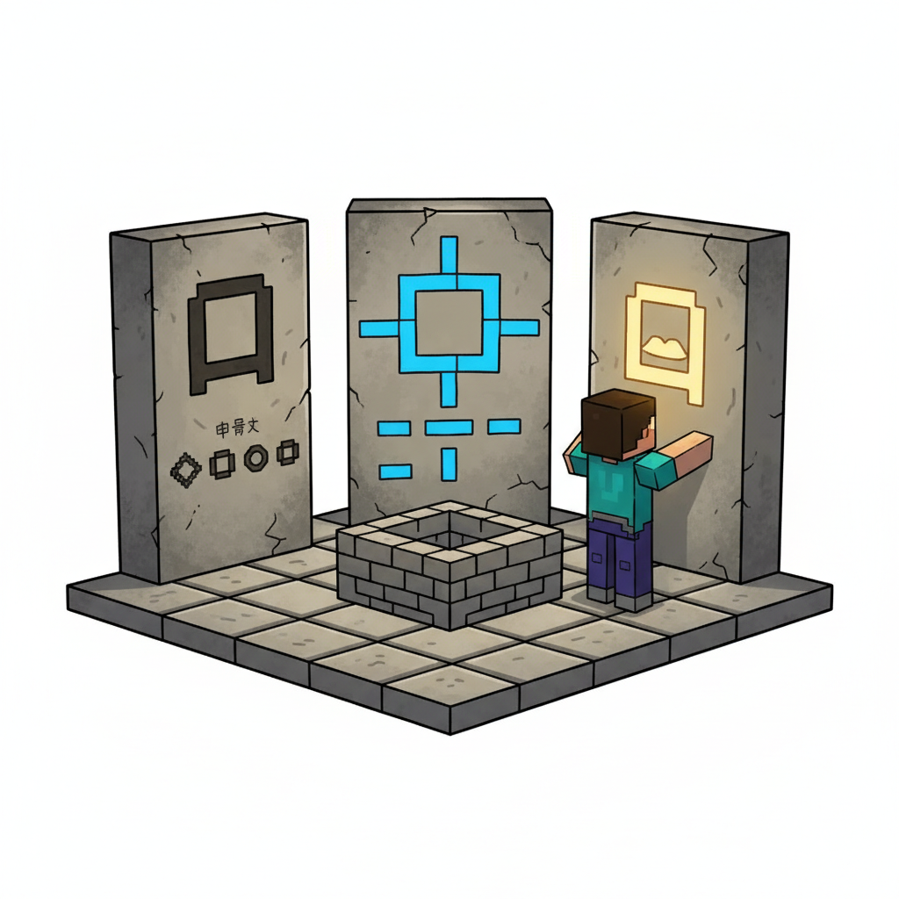
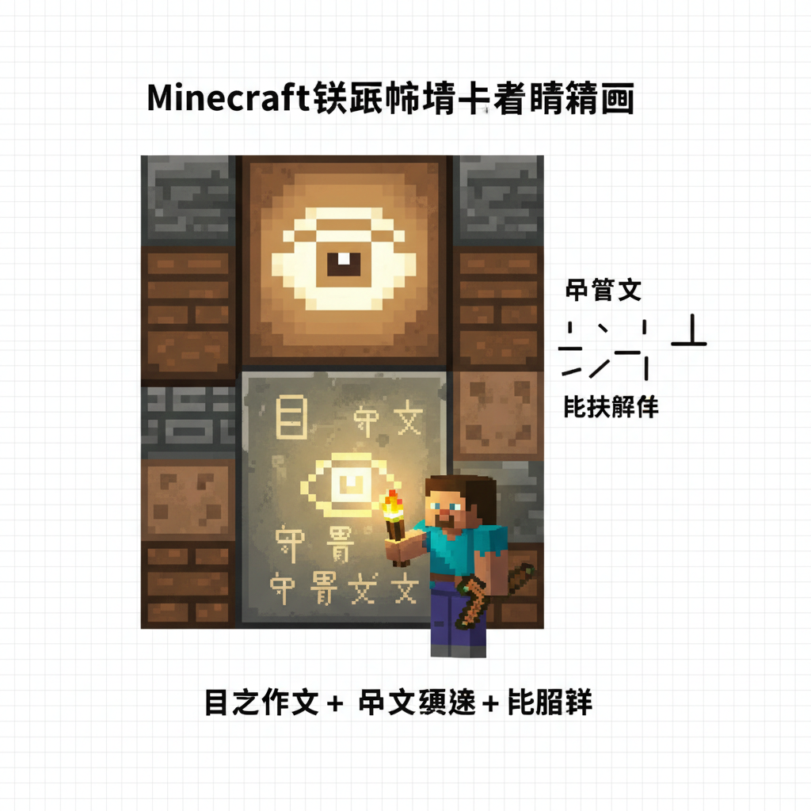
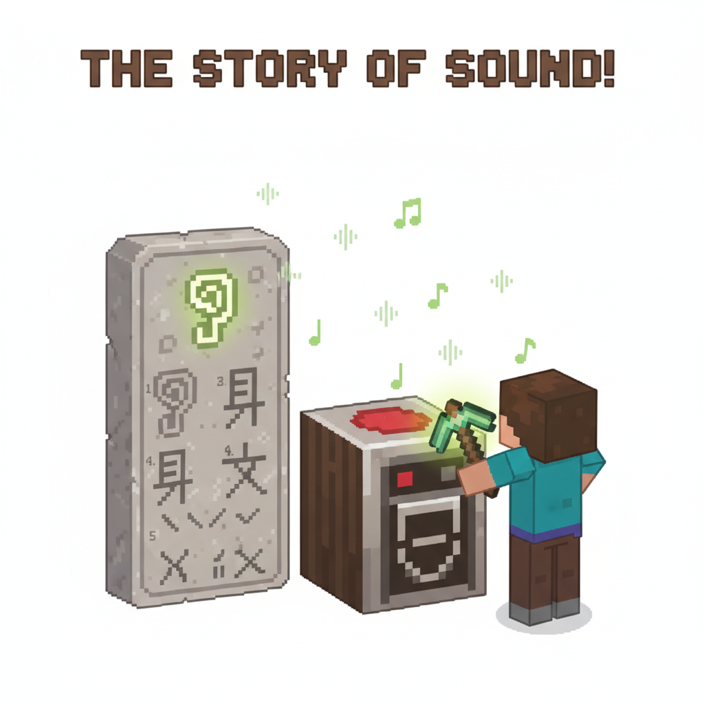
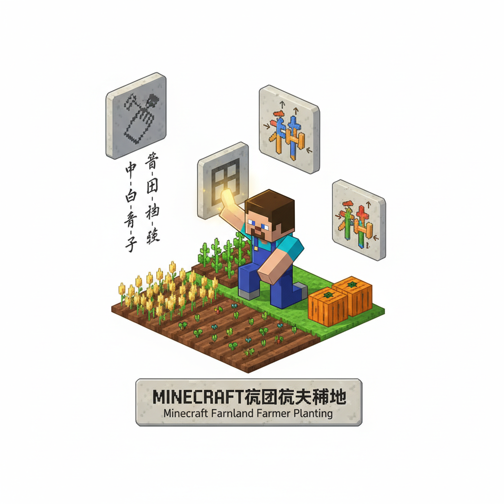
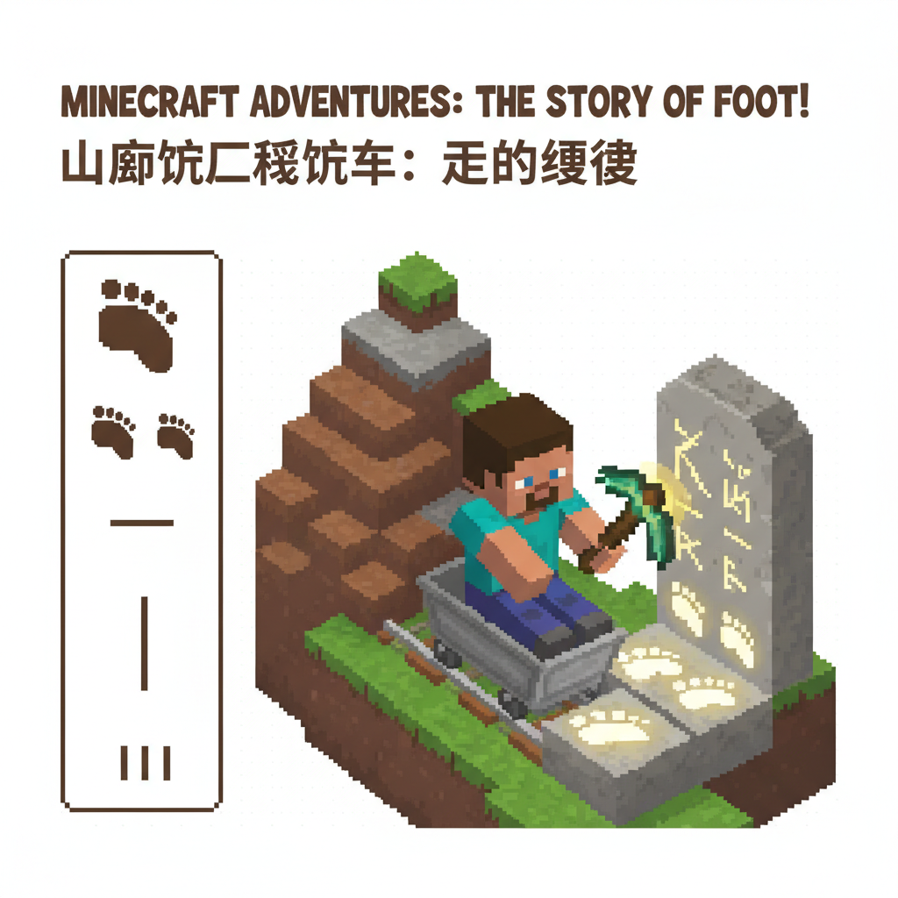
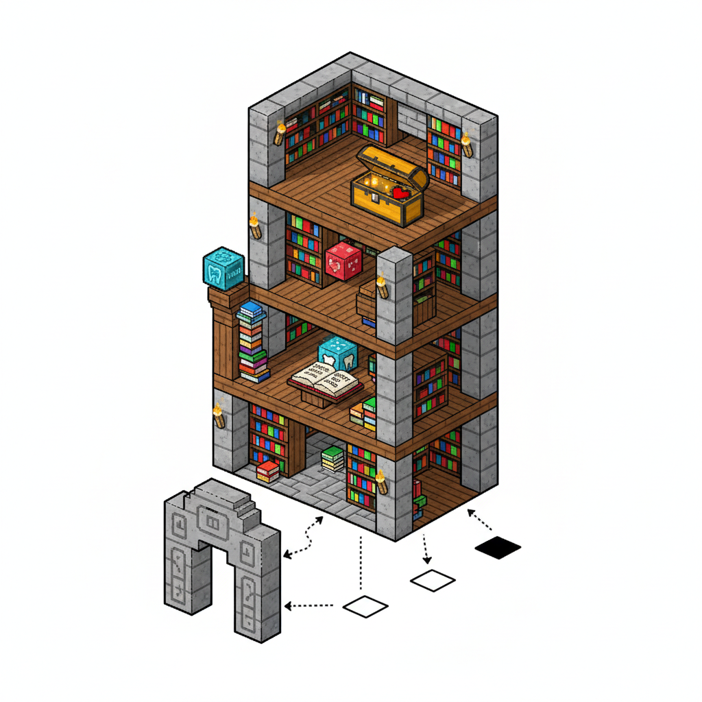
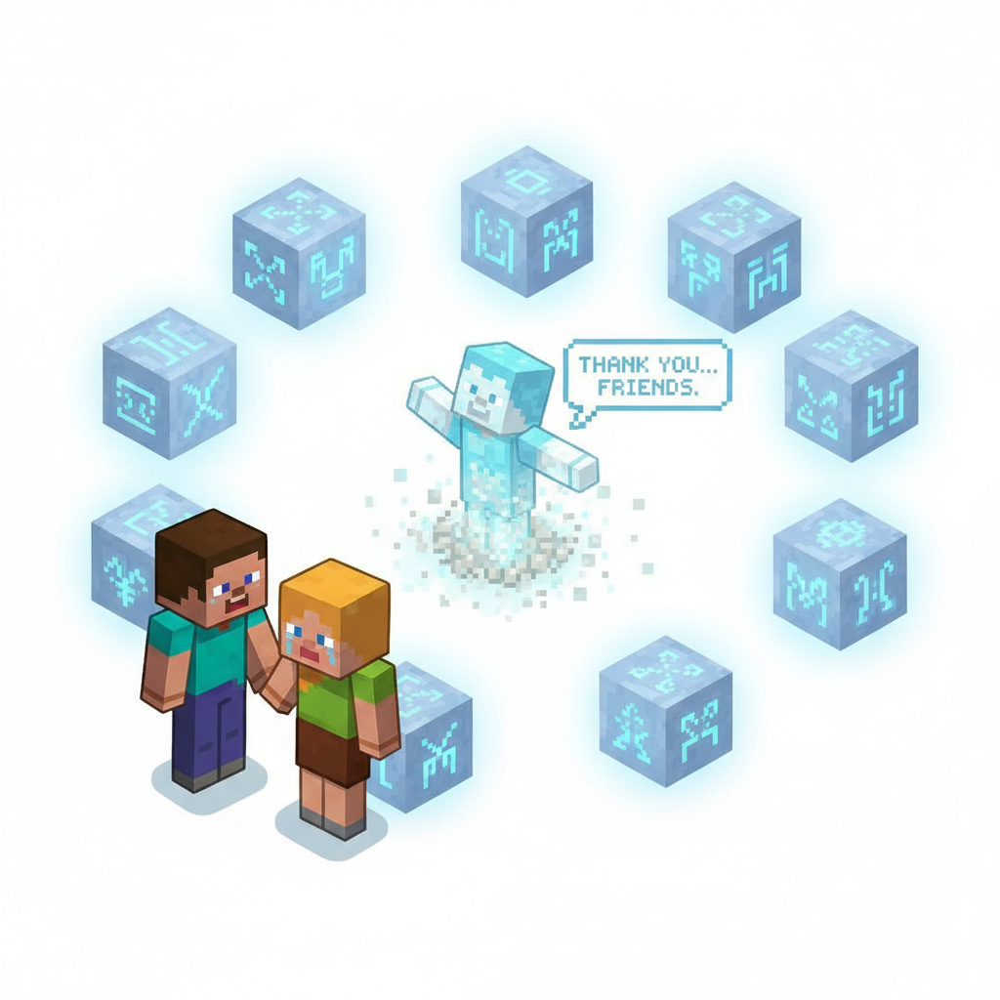
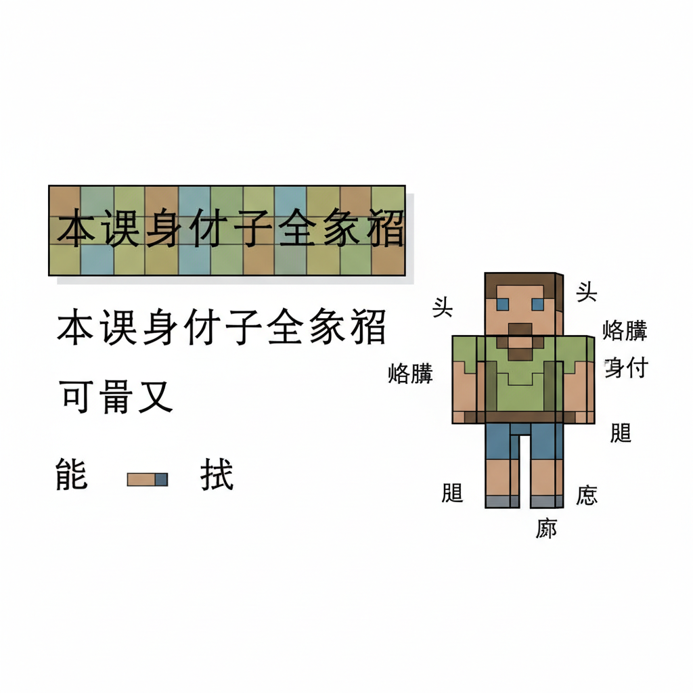

# 第13课 我的身体

## 📋 学习目标
- 认识身体部位字：**口 耳 目 手 足 头 牙 心**
- 掌握笔画顺序与拼音标注
- 了解人体器官的象形本源
- 学会用身体字组词造句

**累计识字：66字**（L1-L12: 58字 + 本课: 8字）

---

## 🎬 第一页：方块人的秘密

Steve 和 Alex 在村庄里发现了一座奇怪的石碑。

石碑上刻着一个方块人——但它的身体各部分被拆开了，散落在各处。

> "这是一个方块人拼图！"Steve 说。"我们必须找到所有零件，把它拼回去。"

```
   🧩 方块人零件清单：
   
   □ 头    □ 目（眼睛）
   □ 口（嘴）   □ 耳（耳朵）
   □ 手    □ 足（脚）
   □ 牙    □ 心
```

石碑底座上出现了一行发光的字：

> "认识你的身体——从认识这些字开始。每个部分的字，都藏着一个古老的故事。"

> "全部拼齐后，方块人就会复活，告诉你们一个关于身体的大秘密。"

Alex 展开地图。"一共八个零件。我们一个一个找。"



---

## 🎬 第二页：口 — 嘴巴的秘密

第一个零件在村庄广场的井边。石台上放着一块刻着 **口** 的符文石。

```
   口 [kǒu] (3画)
   笔画顺序：①丨(竖) ②𠃍(横折) ③一(横)
   记忆口诀：一张方方的嘴巴
   象形：甲骨文的"口"就是一张张开的嘴
   组词：口水(kǒu shuǐ)、开口(kāi kǒu)、门口(mén kǒu)
```

> "你看——'口'这个字，像不像一张张开的方嘴巴？"Alex 说。

Steve 把符文石放入石碑的嘴巴位置。石碑咔嗒一声——嘴巴部分亮了！

```
   📖 小词典：口
   
   意思：嘴巴，也指出入的地方
   造句：我张口说话。
   扩展：门口 = 门的地方
```

> "一个字，两个意思——既可以指嘴巴，也可以指出入口。中文真有意思！"



---

## 🎬 第三页：目 — 看世界的窗

第二个零件在铁匠铺的墙上。墙上挂着一幅画——一只眼睛。

```
   目 [mù] (5画)
   笔画顺序：①丨(竖) ②𠃍(横折) ③一(横) ④一(横) ⑤一(横)
   记忆口诀：一只竖起来的眼睛，里面三道光
   象形：甲骨文的"目"就是一只竖着的眼睛，中间有瞳孔
   组词：目光(mù guāng)、目的(mù dì)、节目(jié mù)
```

> "看——'目'就像一只竖起来的眼睛！外面的框是眼眶，里面的两横是眼珠。"

Steve 把"目"嵌入石碑。石碑的眼睛位置亮了！

```
   📖 小词典：目
   
   意思：眼睛
   造句：我用目看世界。
   扩展：目前 = 眼前，现在
```

> "为什么'目'是竖着的？因为古代人写字在竹简上，竖着写方便！"



---

## 🎬 第四页：耳 — 听声音的贝壳

第三个零件藏在唱片机旁边。石板上刻着 **耳**。

```
   耳 [ěr] (6画)
   笔画顺序：①一(横) ②丨(竖) ③丨(竖) ④一(横) ⑤一(横) ⑥一(横)
   记忆口诀：像一只耳朵的形状，外面是耳廓，里面是纹路
   象形：甲骨文的"耳"就是一只耳朵的轮廓
   组词：耳朵(ěr duo)、木耳(mù ěr)、耳目一新(ěr mù yī xīn)
```

> "'耳'看起来就像一只耳朵——外面弯曲的轮廓，中间是耳朵里面的纹路！"

唱片机里放着轻柔的音乐。Alex 把"耳"放入石碑——耳朵位置亮了。

```
   📖 小词典：耳
   
   意思：耳朵，听声音的器官
   造句：我用耳朵听声音。
   扩展：耳目 = 耳朵和眼睛 → 指"探听消息的人"
```



---

## 🎬 第五页：手 — 万能工具

第四个零件在农田里，农夫正在用双手种地。

```
   手 [shǒu] (4画)
   笔画顺序：①丿(撇) ②一(横) ③一(横) ④亅(竖钩)
   记忆口诀：五个手指张开，就是"手"
   象形：甲骨文像一只手，有五指
   组词：手工(shǒu gōng)、手指(shǒu zhǐ)、洗手(xǐ shǒu)
```

> "看——'手'像不像一只手？上面三横是三节手指，下面的竖钩是手掌和手腕！"

农夫把"手"符文石递给 Steve。"手可以做很多事——种地、写字、拿东西。"

```
   📖 小词典：手

   意思：手，人体最灵活的部分
   造句：我用小手画画。
   扩展：出手 = 伸出手 → 也指"开始行动"
```



---

## 🎬 第六页：足 — 走遍世界的脚

第五个零件在山脚下。矿工正在用脚踩着矿车。

```
   足 [zú] (7画)
   笔画顺序：①丨(竖) ②𠃍(横折) ③一(横) ④丨(竖) ⑤一(横) ⑥丿(撇) ⑦㇏(捺)
   记忆口诀：上面是"口"（膝盖），下面像"人走路"
   象形：甲骨文画了一个膝盖 + 一只脚
   组词：足球(zú qiú)、足够(zú gòu)、手足(shǒu zú)
```

> "'足'的上面像膝盖（口），下面像脚掌和脚趾——加起来就是整条腿和脚！"

```
   📖 小词典：足

   意思：脚；也指"足够"
   造句：我用足走路。
   扩展：足球 = 用脚踢的球；足够 = 够多了
```



---

## 🎬 第七页：头牙心 — 最后的零件

最后三个零件藏在村庄图书馆里。

**头** — 在最顶层的书架上：

```
   头 [tóu] (5画)
   笔画顺序：①丶(点) ②丶(点) ③一(横) ④丿(撇) ⑤丶(点)
   记忆口诀：两点是眼睛，一横是眉毛，一撇是鼻子，一点是嘴
   组词：石头(shí tou)、头发(tóu fa)、点头(diǎn tóu)
```

**牙** — 在牙医的书里：

```
   牙 [yá] (4画)
   笔画顺序：①一(横) ②𠄌(竖折) ③亅(竖钩) ④丿(撇)
   记忆口诀：像一颗露出来的牙齿
   组词：牙齿(yá chǐ)、月牙(yuè yá)、刷牙(shuā yá)
```

**心** — 在最珍贵的宝箱里：

```
   心 [xīn] (4画)
   笔画顺序：①丶(点) ②㇃(卧钩) ③丶(点) ④丶(点)
   记忆口诀：像一个跳动的心脏，三点是心跳
   象形：甲骨文就是一颗心脏的样子
   组词：开心(kāi xīn)、小心(xiǎo xīn)、心里(xīn lǐ)
```

> "三个零件，三个故事。"Steve 把"头牙心"全部嵌入石碑。



---

## 🎬 第八页：方块人复活！

全部八个零件嵌入石碑——方块人睁开了眼睛！

```
   🧩 方块人：口、耳、目、手、足、头、牙、心 — 全部就位！
```

方块人缓缓站起来，用洪亮的声音说：

> "你们已经认识了自己的身体——口能说、耳能听、目能看、手能做、足能走、牙能嚼、心能想。"

> "但最重要的事，不在这些字里面——"

> "而在你怎样用它。口说好话，耳听善言，目看美好，手做好事，足走正道，心装善良。"

> "这才是认识身体真正的意义。"

Steve 和 Alex 对视一眼——他们不光学会了八个字，还学会了一个道理。

```
   🎵 身体儿歌 🎵
   
   小口说话，小耳听话，
   小目看花，小手画画，
   小足跑步，小牙吃瓜，
   小小的心，装满爱呀！
```

石碑缓缓沉入地下。但八个符文石留在 Steve 手中——它们的知识永远不会消失。



---

## 📝 练习

### 一、找身体

把身体部位字和位置连起来：

```
   口  ●     ● 脖子上面
   耳  ●     ● 脸上，用来看
   目  ●     ● 脸上，用来说
   手  ●     ● 身体两侧
   足  ●     ● 身体最下面
   头  ●     ● 脸上，用来听
```

### 二、笔画数

```
   口 — ___ 画    目 — ___ 画    耳 — ___ 画
   手 — ___ 画    足 — ___ 画    头 — ___ 画
   牙 — ___ 画    心 — ___ 画
```

### 三、组词

```
   口 → ___（嘴巴）  ___（出入的地方）
   目 → ___（看的方向）  ___（眼前）
   足 → ___（用脚踢的球）  ___（够多了）
   心 → ___（高兴）  ___（注意）
```

### 四、拼音标调

给下面的字标拼音和声调：

```
   口 → ___    耳 → ___    目 → ___
   手 → ___    足 → ___    头 → ___
   牙 → ___    心 → ___
```

---

## 🏆 挑战 — 身体大师

**第一关：身体字谜 🔍**

```
   一张方嘴不发言 → ___
   一只竖眼看世界 → ___
   五根手指做什么 → ___
   上面膝盖下面脚 → ___
   两点大眼一张嘴 → ___
   三点围着卧钩转 → ___
```

**第二关：我的身体书 📖**

画出你自己，在每个部位旁边写出对应的字：

```
   [画自己]
   
   头 □    目 □□    口 □
   耳 □□    手 □□    足 □□
   牙 □□    心 💛（在里面！）
```

**第三关：用身体写字 ✏️**

用你刚学的字造句：

```
   我用 ___ 看星星。
   我用 ___ 听音乐。
   我用 ___ 画妈妈。
   我用 ___ 踢足球。
   我有一口好 ___。
   我的 ___ 里装着快乐。
```

---

## 📊 本课小结

新学身体字（8个）：
- [ ] 口 kǒu — 嘴巴 / 入口
- [ ] 目 mù — 眼睛
- [ ] 耳 ěr — 耳朵
- [ ] 手 shǒu — 手
- [ ] 足 zú — 脚 / 足够
- [ ] 头 tóu — 头
- [ ] 牙 yá — 牙齿
- [ ] 心 xīn — 心脏 / 心情

> **累计识字：66字**

---


