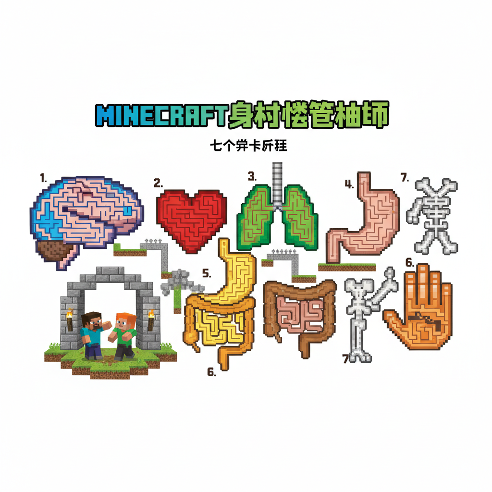
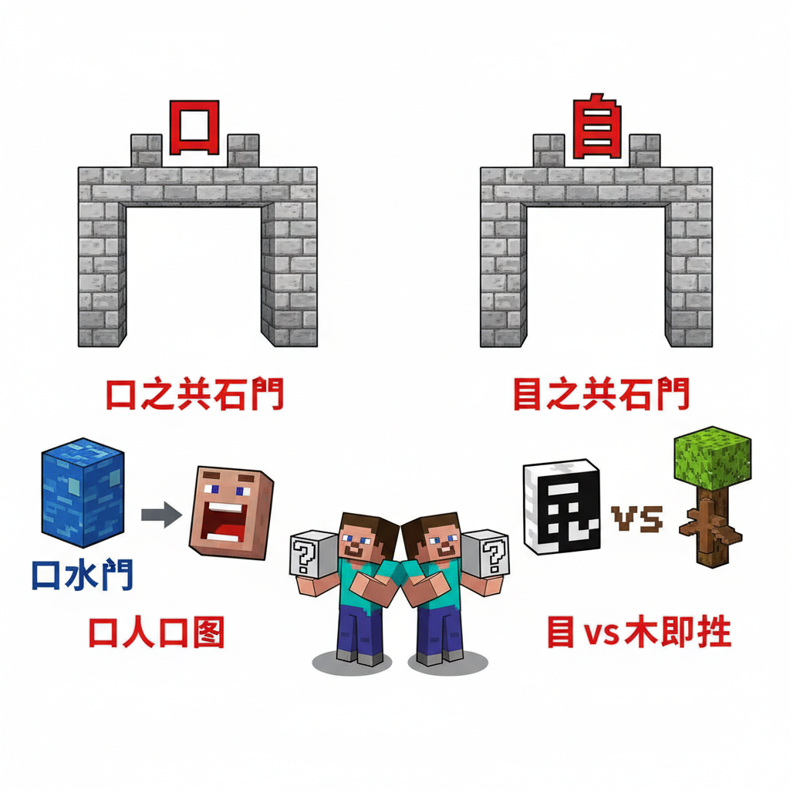
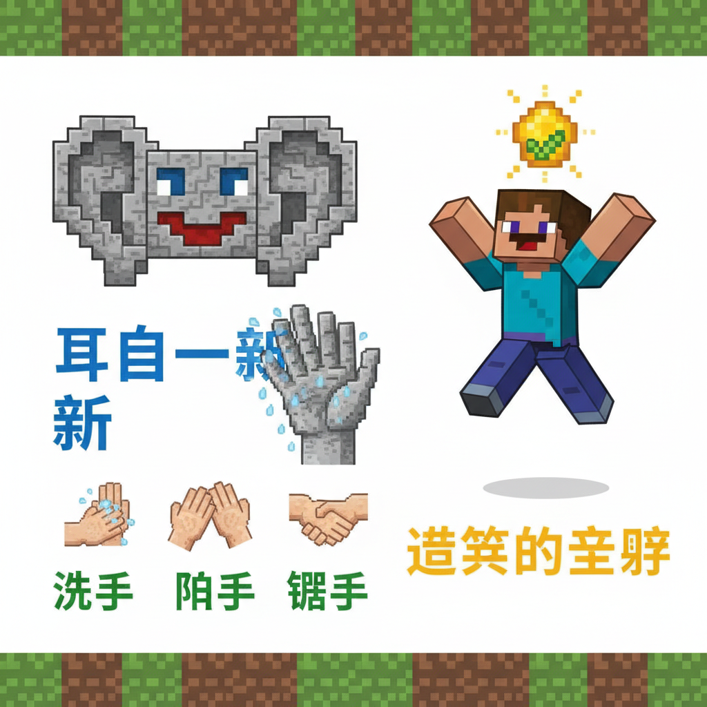
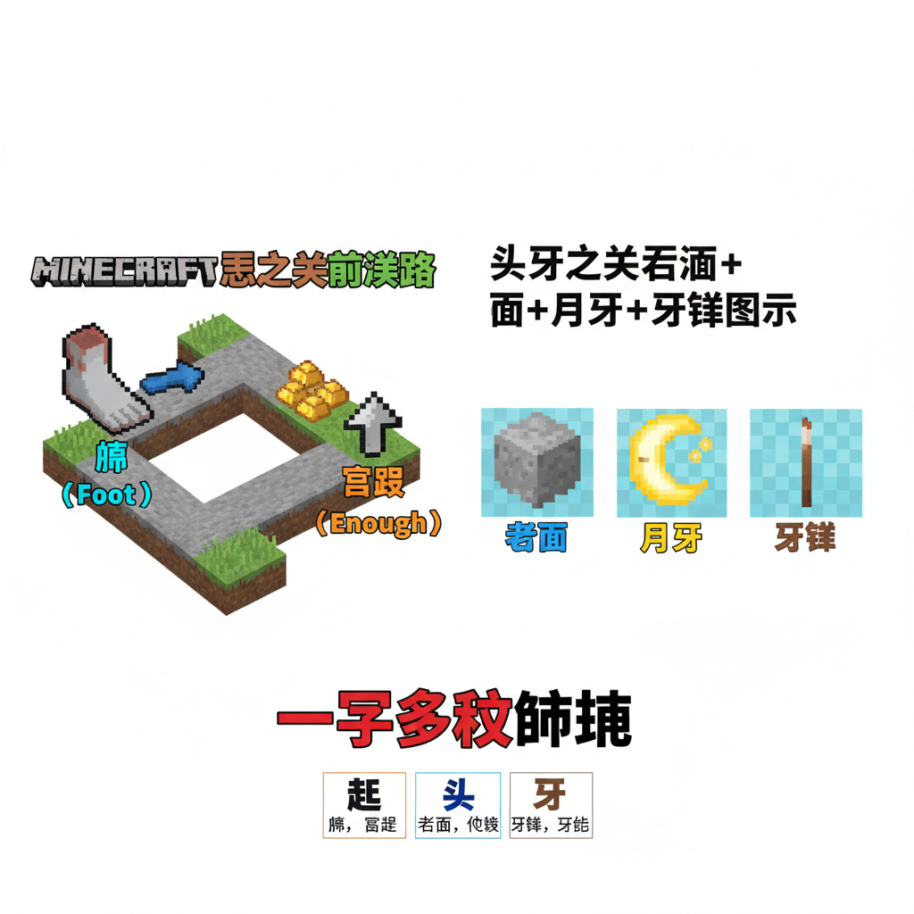
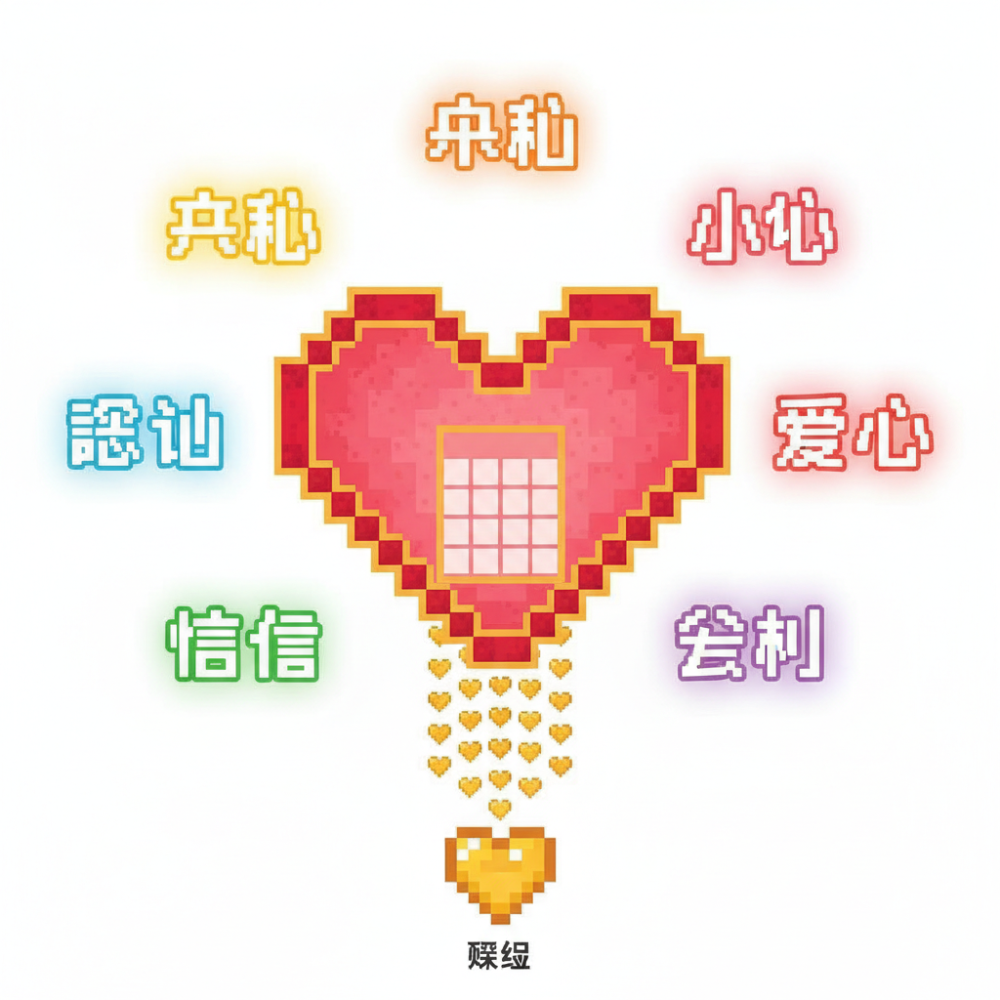
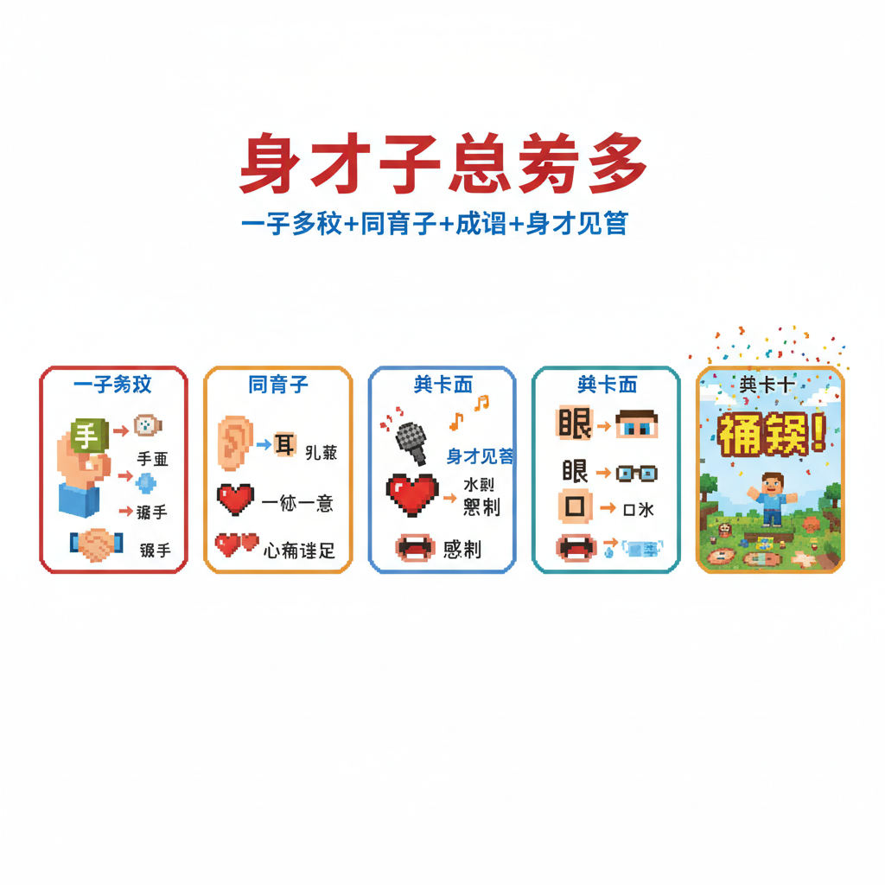

# 第13课 拓展篇：身体大闯关

## 📋 学习目标
- 巩固身体字：口耳目手足头牙心
- 学习身体相关成语与复合词
- 用拼音完整标注身体字
- 身体主题综合阅读

---

## 🎬 第一页：身体迷宫

方块人复活后，送给 Steve 和 Alex 一张地图——"身体迷宫"。

> "学完八个字只是第一步。要真正掌握，你们必须通过身体迷宫！"

迷宫有七关，每关对应一个身体部位。通过全部七关才能获得最终奖励。

```
   🏛️ 身体迷宫
   
   ① 口之关 → ② 目之关 → ③ 耳之关 → ④ 手之关
   ⑤ 足之关 → ⑥ 头牙之关 → ⑦ 心之关 → 🏆
```

> "准备好了吗？出发！"



---

## 🎬 第二页：口之关 + 目之关

**口之关**：门上写着："说出三个带'口'的词！"

```
   🗣️ 口字词：
   口 → 口水、开口、门口、人口、路口
```

Steve 大声回答："口水、门口、人口！"

> "通过！口不只是嘴巴，还可以表示开口的地方——瓶口、门口、路口。"

**目之关**：门上写着："'目'和'木'读音一样吗？"

```
   👀 目字辨音：
   目 mù（眼睛）≠ 木 mù（树木）
   同音不同字！
```

Alex 回答："读音一样，都念 mù！但字不一样——一个是眼睛，一个是树木！"

> "正确！汉字里同音字很多，要根据上下文判断意思！"

```
   目字词：目光、目前、节目、题目
   木字词：树木、木头、木星
```

两个关通过！✅✅



---

## 🎬 第三页：耳之关 + 手之关

**耳之关**：一只巨大的耳朵石像。只有对它说对了话，门才开。

> "'耳目一新'是什么意思？"

```
   👂 耳目一新：
   耳(耳朵) + 目(眼睛) + 一(一下子) + 新(新鲜)
   = 看到听到的都变了，感觉很新鲜！
```

Steve 大声回答："看到听到都变了，变得很新鲜！"

耳朵石像点点头——门开了！

**手之关**：一只巨大的手石像。它手里握着三张卡片，必须按顺序排列。

```
   ✋ 手字词排序：
   洗手 → 拍手 → 握手
   （跟手有关的动作，从简单到复杂！）
```

Alex 排好顺序。"先洗干净，再拍拍手，最后握握手！"

> "手可以做无数动作——举手、拍手、握手、洗手、帮手……手是最能干的器官！"

四个关通过！✅✅✅✅



---

## 🎬 第四页：足之关 + 头牙之关

**足之关**：地上有两条路——一条写着"足=脚"，一条写着"足=足够"。

> "走哪条？两条都对！"

```
   🦶 足的两个意思：
   ① 足 = 脚（足球、足迹）
   ② 足 = 足够（充足、满足）
```

> "'足'是一个字，但有两个完全不同的意思！这叫'一字多义'。"

**头牙之关**：石像上有两个空槽——必须正确放入"头"和"牙"的符文石。

```
   🧠 头和牙的妙用：
   头 tóu — 石头、木头（不是真正的头）
   牙 yá — 月牙、牙签（牙的形状）
```

> "注意！'石头'的'头'不是真正的头——它只是一个后缀，表示东西！"

> "同样，'月牙'不是月亮的牙齿——而是弯弯的月亮像一颗牙！"

六个关通过！✅✅✅✅✅✅



---

## 🎬 第五页：心之关 — 最终关

最后一道门。门上没有文字，只有一颗巨大的心。

心在跳动。咚——咚——咚——

> "说出三个跟'心'有关的词，要表达不同的心情。"

```
   ❤️ 心字词 — 表达心情：
   
   开心 — 心里开着花，很高兴
   小心 — 心里注意着，很谨慎
   担心 — 心里担着东西，很忧虑
   爱心 — 心里装着爱，很善良
   信心 — 心里相信自己，很坚定
```

Steve 说："开心、小心、爱心！"

Alex 说："担心、信心、关心！"

心之门缓缓打开。里面有一颗发光的金色小心脏。

> "心不仅仅是一个器官。在中文里，'心'是一切想法的来源——开心是心里的花开了，小心是心里提着神，爱心是心里装着别人。"

> "学会用心，比学会写心更重要。"

七个关全部通过！🏆



---

## 📝 练习

### 一、一字多义

```
   "足"在"足球"中的意思是：___
   "足"在"足够"中的意思是：___
   
   "头"在"头发"中的意思是：___
   "头"在"石头"中的意思是：___
```

### 二、身体成语连线

```
   耳目一新  ●   心里很高兴
   手足无措  ●   看到听到的都变了
   心花怒放  ●   手脚不知道放哪（紧张）
   口是心非  ●   说的和想的不一样
```

### 三、我是小诗人

用身体字写一首小诗：

```
   我的小___，能说又会唱。
   我的小___，闪闪看四方。
   我的小___，柔软又能干。
   我的小___，带我走四方。
```

---

## 📊 拓展小结

- [ ] 口 — 嘴巴 / 出入口（一字多义）
- [ ] 目 — 眼睛（同音字：木）
- [ ] 耳 — 耳朵（耳目一新）
- [ ] 手 — 手（多种动作）
- [ ] 足 — 脚 / 足够（一字多义）
- [ ] 头 — 头 / 后缀（石头木头）
- [ ] 牙 — 牙齿 / 形状（月牙）
- [ ] 心 — 心脏 / 心情（心理字族）

> **累计识字：66字** ✅

---


