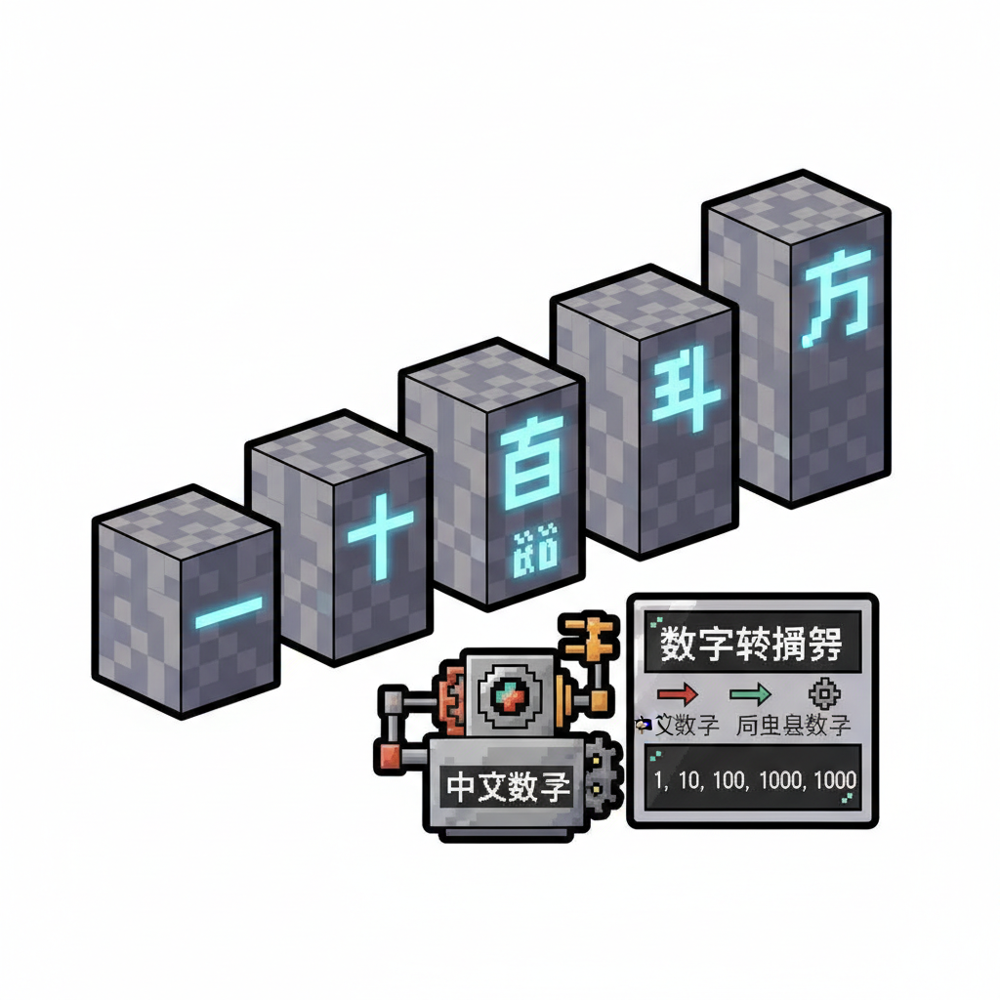
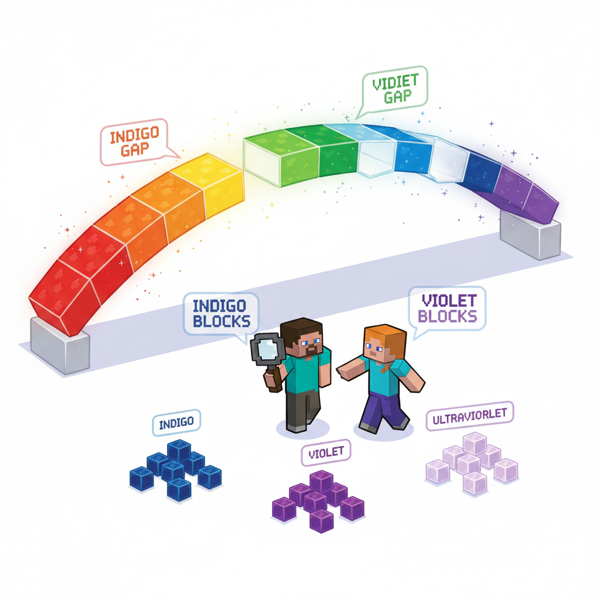
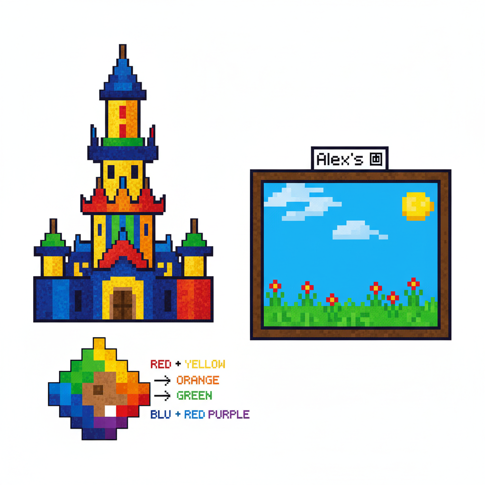
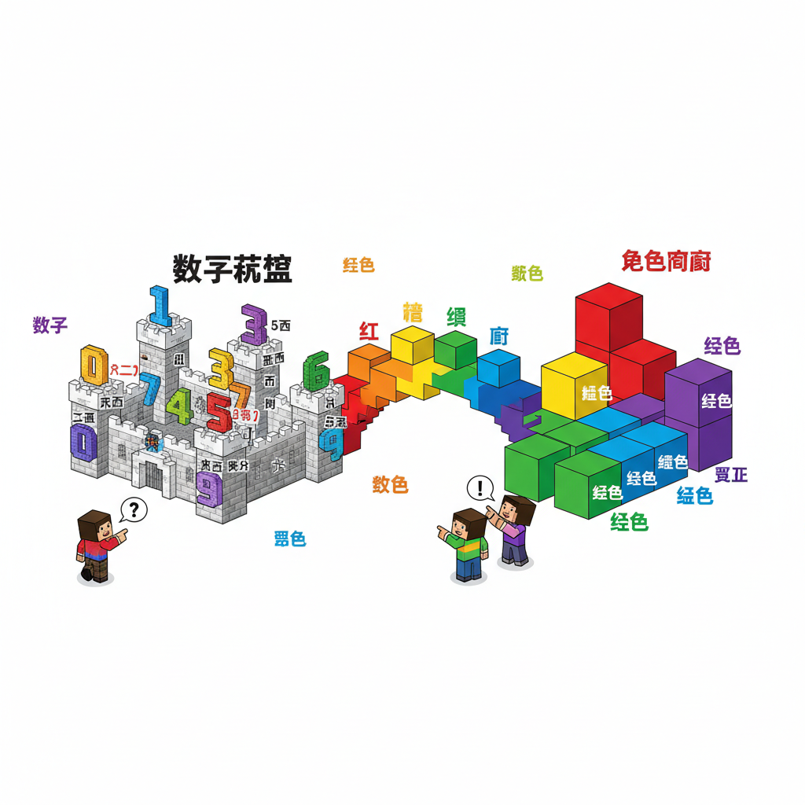

# 第14课 拓展篇：数字城堡与彩虹桥

## 📋 学习目标
- 巩固数字字与颜色字
- 理解中文数字系统（个十百千万）
- 学习数字+颜色的搭配表达
- 认识数字和颜色的复合词汇

---

## 🎬 第一页：数字城堡

离开矿洞后，Steve 和 Alex 发现了一座城堡——数字城堡。

城堡有五座塔楼，分别代表"个、十、百、千、万"。

> "数字城堡——每个塔楼代表一个数位！"

```
   🏰 数字城堡 — 五座塔楼
   
   万塔楼 (10000) ↑
   千塔楼 (1000)  |
   百塔楼 (100)   |
   十塔楼 (10)    |
   个塔楼 (1)     |
```

> "中文的数字系统，就是'计数 + 位名'——比如三十七 = 3个十 + 7个一！"

```
   📖 中文计数法：
   三十七 = 三(3) × 十(10) + 七(7)
   五百二十一 = 五(5) × 百(100) + 二(2) × 十(10) + 一(1)
   一百二(十) = 一百二十
```

Steve 在城堡大厅里看到了一个神奇的数字生成器——输入数字，就能看到中文数字字！



---

## 🎬 第二页：彩虹桥

从数字城堡出来，一座七彩桥连接着另一头的颜色宫殿。

彩虹桥的七段分别写着颜色字——但缺了一段！

```
   🌈 彩虹桥
   
   🔴红  🟠？ 🟡黄  🟢绿  🔵蓝  🟣？ ⚪白？（缺三段！）
```

> "少了三段——你们必须补上缺失的颜色字才能过桥！"

Steve 和 Alex 开始在桥周围寻找丢失的颜色字。

**第一段补全**：他们在桥下发现了一块橙色石头，上面写着——

> "橙（chéng）——红+黄=橙！但更常见的是说'橙色'。"

**第二段补全**：桥的另一头有紫色墨水，但中文里——

> "紫色（zǐ sè）——神秘的紫，帝王色！"

**第三段补全**：桥顶缺的是——

> "实际上彩虹只有七色，红橙黄绿蓝靛紫。但中文基础识字里，我们学的是最基本六色！"

桥上的发光文字显示：

```
   🌈 彩虹七色（完整版）：
   红(赤) 橙 黄 绿 蓝(青) 靛 紫
   
   我们已经学的基础六色：
   红 黄 蓝 绿 白 黑 + 新认识：橙 紫
```



---

## 🎬 第三页：颜色大拼盘

走过彩虹桥，来到颜色宫殿。宫殿里有一个巨大的调色盘：

> "两种基础颜色混在一起，变成第三种颜色！"

```
   🎨 颜色魔法：
   
   红 + 黄 = 橙 🟠
   红 + 蓝 = 紫 🟣
   黄 + 蓝 = 绿 🟢
   红 + 白 = 粉 🩷
   红 + 绿 = 棕 🟤
   白 + 黑 = 灰 🩶
```

> "有趣的是——'绿'虽然是基础色字，但用颜料调的时候，是黄+蓝调出来的！"

```
   📖 颜色复合词：
   红色 — 像红的颜色
   黄黄 — 很黄的样子
   蓝蓝 — 蓝蓝的天
   绿绿 — 绿绿的草
   白白 — 白白的云
   黑黑 — 黑黑的夜
```

Alex 用调色盘画了一幅画——蓝天、绿草、红花、黄太阳、白白云朵。

> "所有的颜色字都用上了！"



---

## 📝 练习

### 一、中文数字转换

```
   37 = _________
   52 = _________
   108 = _________
   1024 = _________
```

### 二、颜色填空

```
   红 + 黄 = ___（橙色）
   红 + 蓝 = ___（紫色）
   蓝 + ___ = 绿
   ___ + 黑 = 灰
```

### 三、数字颜色诗

用数字和颜色写一首小诗：

```
   ___ 朵 ___ 花，（数量 + 颜色）
   ___ 只 ___ 鸟，
   天上有 ___ 片云，
   地上有 ___ 种草。
```

---

## 📊 拓展小结

- [ ] 中文数字系统：个十百千万位值法
- [ ] 基础六色：红黄蓝绿白黑
- [ ] 新颜色字：橙、紫
- [ ] 颜色混合规律
- [ ] 数字+颜色组合搭配

> **累计识字：80字** ✅

---


