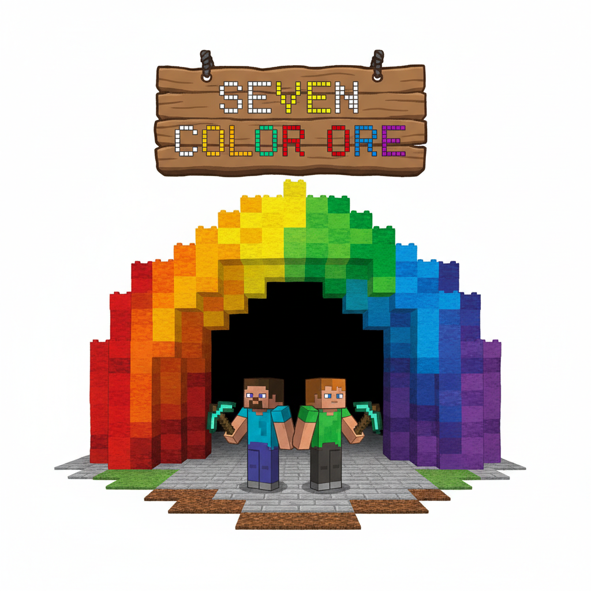
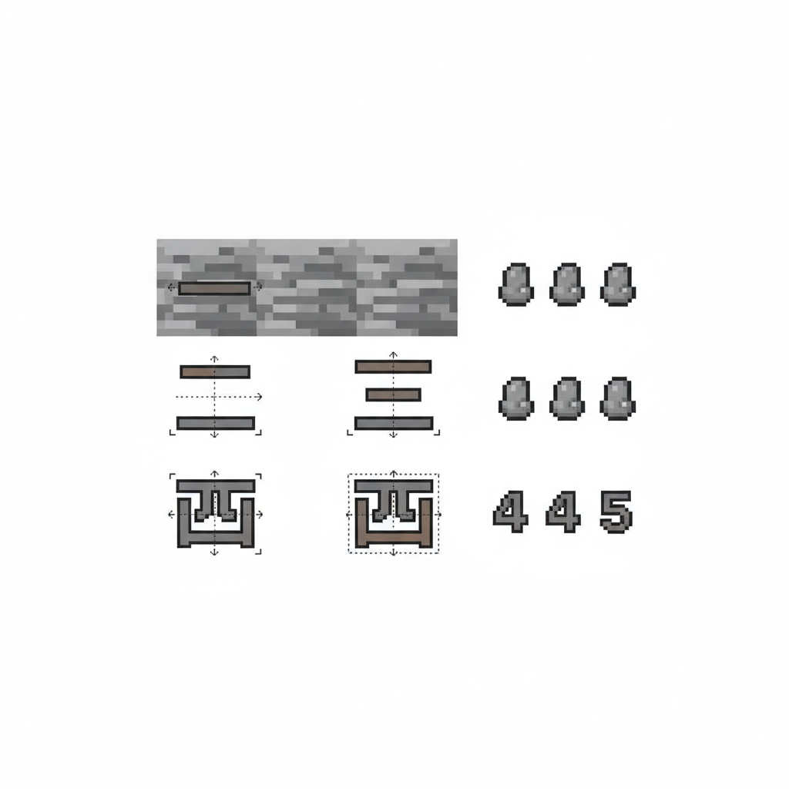
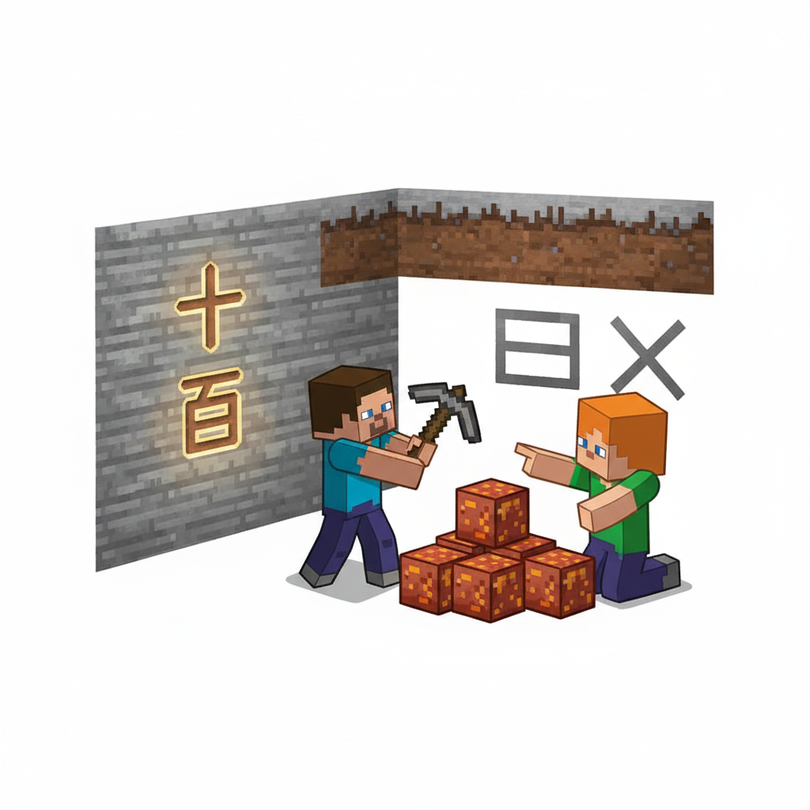
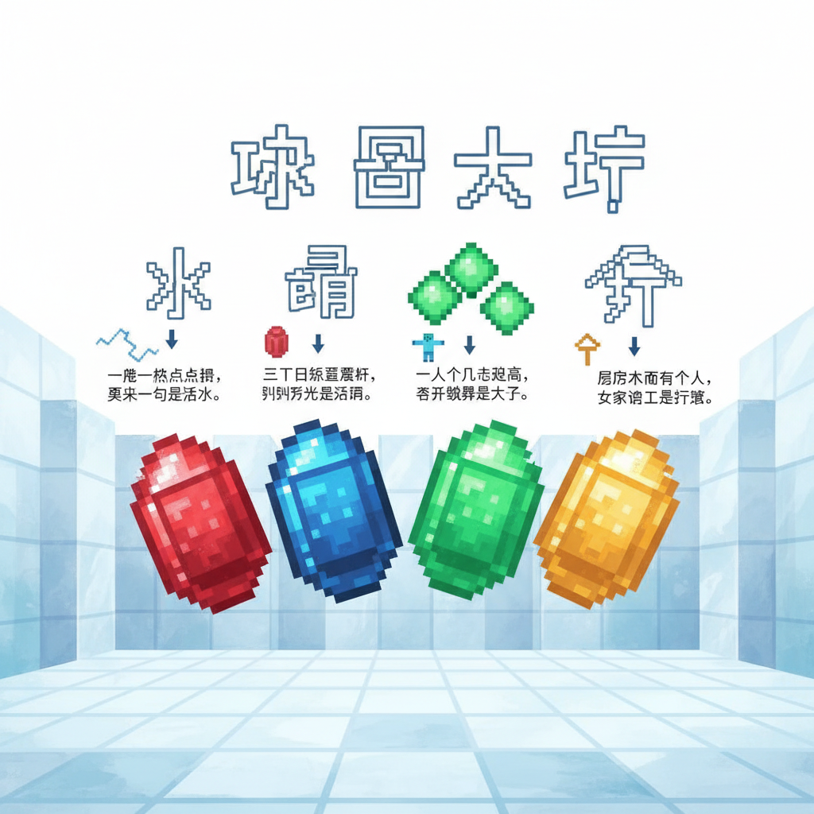
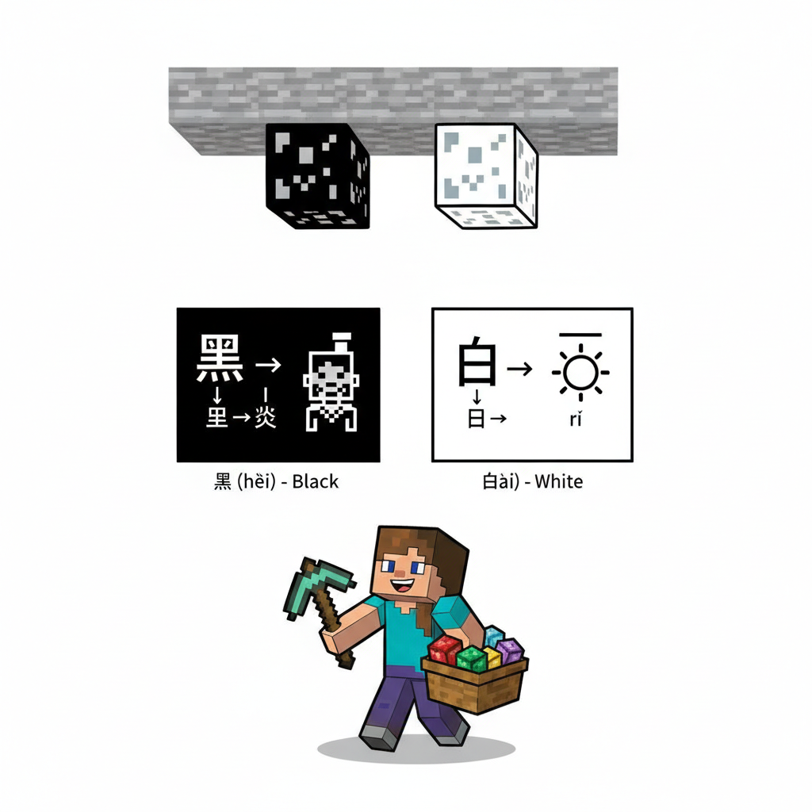
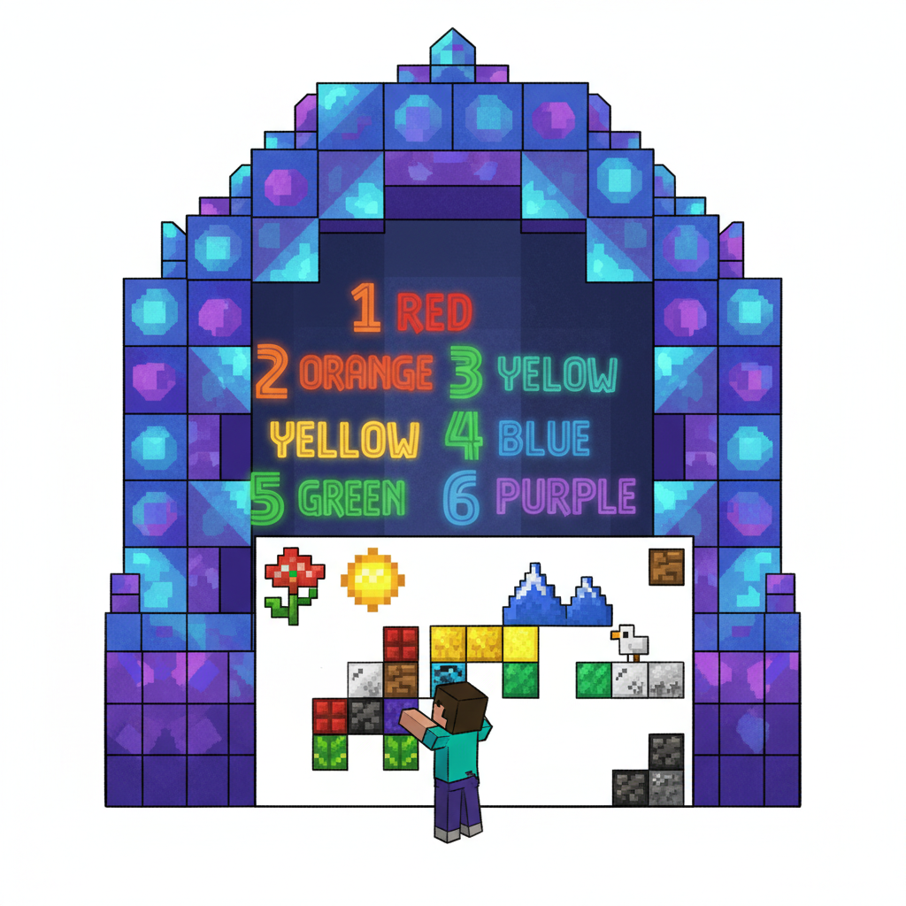
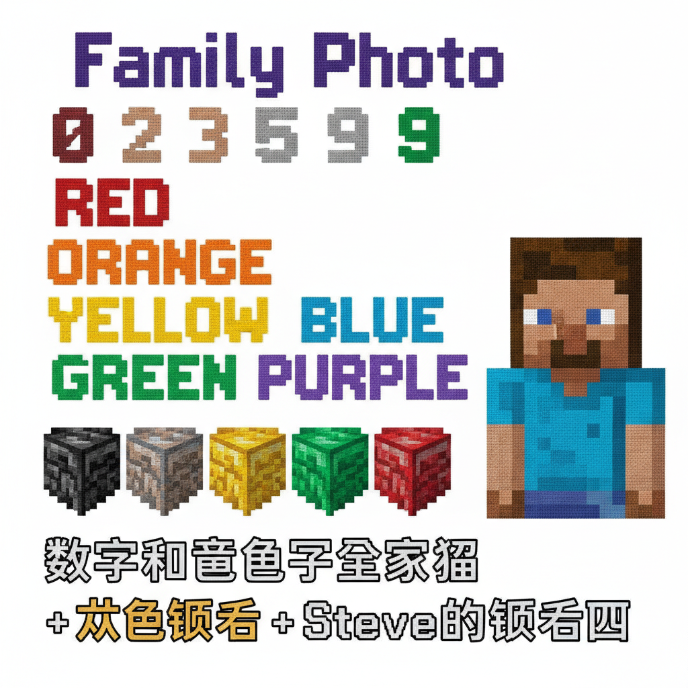

# 第14课 数字与颜色

## 📋 学习目标
- 认识数字字：**一 二 三 四 五 十 百 千 万**
- 认识颜色字：**红 黄 蓝 绿 白 黑**
- 掌握笔画顺序与拼音标注
- 学会用数字和颜色字组词造句

**累计识字：80字**（L13: 66字 + 本课: 14字）

---

## 🎬 第一页：彩虹矿洞

Steve 和 Alex 在深山里发现了一个矿洞。

矿洞入口的牌子上写着："彩虹矿洞——七色矿石，各有魔力。"

> "里面藏着七种颜色的矿石！"Alex 兴奋地说。"每种颜色都有自己的颜色字。"

```
   🌈 彩虹矿石清单：
   
   🔴 红石（红）    🟡 黄金（黄）    🔵 蓝宝石（蓝）
   🟢 绿翡翠（绿）  ⚪ 白水晶（白）  ⚫ 黑曜石（黑）
```

> "但挖矿需要数数——你知道一到万怎么说吗？"

数字字闪现在入口：

```
   🔢 数字字：
   一 二 三 四 五 十 百 千 万
```

> "一共有三层矿洞：浅层（个位数）、深层（十百千）、最深层（万+颜色）"



---

## 🎬 第二页：浅层矿洞 — 一到五

矿洞第一层，墙上刻着最简单的数字。

```
   一 [yī] (1画)
   笔画顺序：①一(横)
   记忆口诀：一横就是一
```

```
   二 [èr] (2画)
   笔画顺序：①一(横) ②一(横)
   记忆口诀：一横加一横，就是二
```

```
   三 [sān] (3画)
   笔画顺序：①一(横) ②一(横) ③一(横)
   记忆口诀：三横就是三
```

> "看——一二三就像用横线计数：一横、两横、三横！"

```
   四 [sì] (5画)
   笔画顺序：①丨(竖) ②𠃍(横折) ③丿(撇) ④乚(竖弯) ⑤一(横)
   记忆口诀：一个方框里面两个人
   
   五 [wǔ] (4画)
   笔画顺序：①一(横) ②丨(竖) ③𠃍(横折) ④一(横)
   记忆口诀：天地交叉就是五
```

> "四和五就不只是横线了——它们是更高级的计数符号！"

```
   📖 小词典：
   一 yī — 1    二 èr — 2    三 sān — 3
   四 sì — 4    五 wǔ — 5
```



---

## 🎬 第三页：深层矿洞 — 十百千

矿洞第二层，数字变大了！

```
   十 [shí] (2画)
   笔画顺序：①一(横) ②丨(竖)
   记忆口诀：一横一竖组成十（十字形）
   组词：十分(shí fēn)、十足(shí zú)
   
   百 [bǎi] (6画)
   笔画顺序：①一(横) ②丿(撇) ③丨(竖) ④𠃍(横折) ⑤一(横) ⑥一(横)
   记忆口诀：一加白就是百
   组词：一百(yī bǎi)、百姓(bǎi xìng)
   
   千 [qiān] (3画)
   笔画顺序：①丿(撇) ②一(横) ③丨(竖)
   记忆口诀：一撇加十就是千（十上加一撇）
   组词：一千(yī qiān)、千万(qiān wàn)
```

> "注意看——'百'里面有个'白'，'千'里面有个'十'！"

```
   📖 小词典：
   十 shí — 10
   百 bǎi — 100
   千 qiān — 1000
```

Steve 挖到十块铁矿石。Alex 数："一、二、三……九、十！正好十块！"



---

## 🎬 第四页：最深层 — 万 + 颜色矿

矿洞最深处，有一个巨大的水晶大厅。墙上刻着最后也是最难的数字：

```
   万 [wàn] (3画)
   笔画顺序：①一(横) ②𠃍(横折钩) ③丿(撇)
   记忆口诀：一撇穿过万（像一个人弯腰）
   组词：万一(wàn yī)、千万(qiān wàn)
```

> "'万'是一个很大的数字——一万 = 十个一千！"

在大厅的墙上，嵌着六颗闪闪发光的颜色矿石：

```
   🔴 红 [hóng] (6画)
   笔画顺序：①𠃐(撇折) ②𠃐(撇折) ③𠃊(提) ④一(横) ⑤丨(竖) ⑥一(横)
   记忆口诀：绞丝旁(纟)加"工"就是红
   组词：红色(hóng sè)、红花(hóng huā)
   
   🟡 黄 [huáng] (11画)
   笔画顺序：①一(横) ②丨(竖) ③丨(竖) ④一(横) ⑤丨(竖) ⑥𠃍(横折) ⑦一(横) ⑧丨(竖) ⑨一(横) ⑩丿(撇) ⑪丶(点)
   记忆口诀：黄字像田里出苗
   组词：黄色(huáng sè)、黄金(huáng jīn)
   
   🔵 蓝 [lán] (13画)
   笔画顺序：(艹头+监)
   记忆口诀：草头加监就是蓝（蓝草染色）
   组词：蓝色(lán sè)、蓝天(lán tiān)
   
   🟢 绿 [lǜ] (11画)
   笔画顺序：(纟+录)
   记忆口诀：绞丝旁加录就是绿（绿丝线）
   组词：绿色(lǜ sè)、绿叶(lǜ yè)
```



---

## 🎬 第五页：白与黑

在六颗彩色矿石之外，还有两颗特殊的矿石嵌在洞穴顶上：

```
   ⚪ 白 [bái] (5画)
   笔画顺序：①丿(撇) ②丨(竖) ③𠃍(横折) ④一(横) ⑤一(横)
   记忆口诀：日字加一撇就是白（太阳的光是白色）
   组词：白色(bái sè)、白天(bái tiān)、白云(bái yún)
   
   ⚫ 黑 [hēi] (12画)
   笔画顺序：(四点底+黑部)
   记忆口诀：黑色的四点像烧焦的炭火
   组词：黑色(hēi sè)、天黑(tiān hēi)、黑板(hēi bǎn)
```

> "白和黑——最极致的两种颜色，也是光线和黑暗的对比。"

```

---

> 【标A: 语文课标一上·识字与写字·生活情境识字】

### ❌常见误解

| ❌ 错误写法/理解 | ✅ 正确写法/理解 |
|-------|-------|
| "吃"字右边写成"乞" | 吃=口+乞（qǐ），乞=气去掉最后一笔 |
| "身"字少写一横 | 身=7画，第6笔是长横，不能漏 |
| 学了新字忘了旧字 | 每课复习前课字，学过的字要在新情境中用 |
| 只认字不组词 | 每个字至少要会2个词（如：水→河水、水果） |

🧠 想一想
1. **观察推理**："吃、喝、叫、唱"都有"口"字旁。为什么这些字都跟嘴巴有关？你能再找出3个有"口"字旁的字吗？
2. **反事实**：如果所有的字都没有偏旁部首，全都是随机的笔画组合，学汉字会变成什么样？

## 🔗 跨科连接
数学第15课教认识钱币 → 语文教"买、卖、元、角"
英语Lesson 7-9教动物/身体/食物 → 中文对应词同步

📖 小词典 — 颜色字：
   红 hóng  🔴    黄 huáng  🟡    蓝 lán  🔵
   绿 lǜ    🟢    白 bái    ⚪    黑 hēi  ⚫
```

Alex 挖下最后一颗宝石——蓝色的。她数了数袋子里的矿石：

> "红、黄、蓝、绿、白、黑——六种颜色，全部集齐！"



---

## 🎬 第六页：数字和颜色的魔法

收集全部矿石后，水晶大厅展示了两种字的组合魔法：

```
   🔢 数字 + 🌈 颜色 = 组合词！
   
   一 + 红 = 一点红
   五 + 黄 = 五朵黄花
   十 + 蓝 = 十颗蓝石
   万 + 绿 = 万片绿叶
   白 + 白 = 白白的一片
   黑 + 黑 = 黑黑的一个
```

> "数字和颜色可以组合——这是中文的强大之处！"

Steve 在矿洞墙壁上留下了一幅画——用六种颜色的矿石拼出来的：

```
   🎨 Steve 的矿石画：
   
   一朵 红 花 🔴🌸
   两个 黄 太阳 🟡☀️
   三座 蓝 山 🔵⛰️
   四片 绿 叶子 🟢🍃
   五只 白 鸟 ⚪🐦
   六块 黑 石头 ⚫🪨
```

> "这就是数字和颜色的全部秘密——它们可以一起用！"



---

## 📝 练习

### 一、数字默写

```
   1 → ___    2 → ___    3 → ___    4 → ___    5 → ___
   10 → ___   100 → ___   1000 → ___   10000 → ___
```

### 二、颜色配对

```
   红 🔴    ●    ⚪
   黄 🟡    ●    🔵
   蓝 🔵    ●    🟢
   绿 🟢    ●    🔴
   白 ⚪    ●    ⚫
   黑 ⚫    ●    🟡
```

### 三、笔画数

```
   一 — ___画    十 — ___画    百 — ___画
   万 — ___画    红 — ___画    黄 — ___画
   黑 — ___画
```

### 四、数字+颜色造句

```
   我有 ___ 朵 ___ 花。
   天上有 ___ 片 ___ 云。
   地上有 ___ 块 ___ 石头。
```

---

## 🏆 挑战 — 数字颜色大师

**第一关：写数字 📝**

不看书，写出从一到十：

```
   一、___、___、___、___、___、___、___、___、十
```

**第二关：彩虹画 🎨**

用你学到的颜色字画一幅画，给每种颜色标字：

```
   [画一幅有六种颜色的画]
   红色 → 写"红"
   黄色 → 写"黄"
   ...
```

**第三关：大数字 🔢**

```
   10 = 十
   100 = ___    
   1000 = ___   
   10000 = ___  
```

---

## 📊 本课小结

数字字（9个）：
- [ ] 一二三四五 — 1-5
- [ ] 十 bǎi 千 万 — 10/100/1000/10000

颜色字（6个）：
- [ ] 红黄蓝绿白黑

> **累计识字：80字**

---


