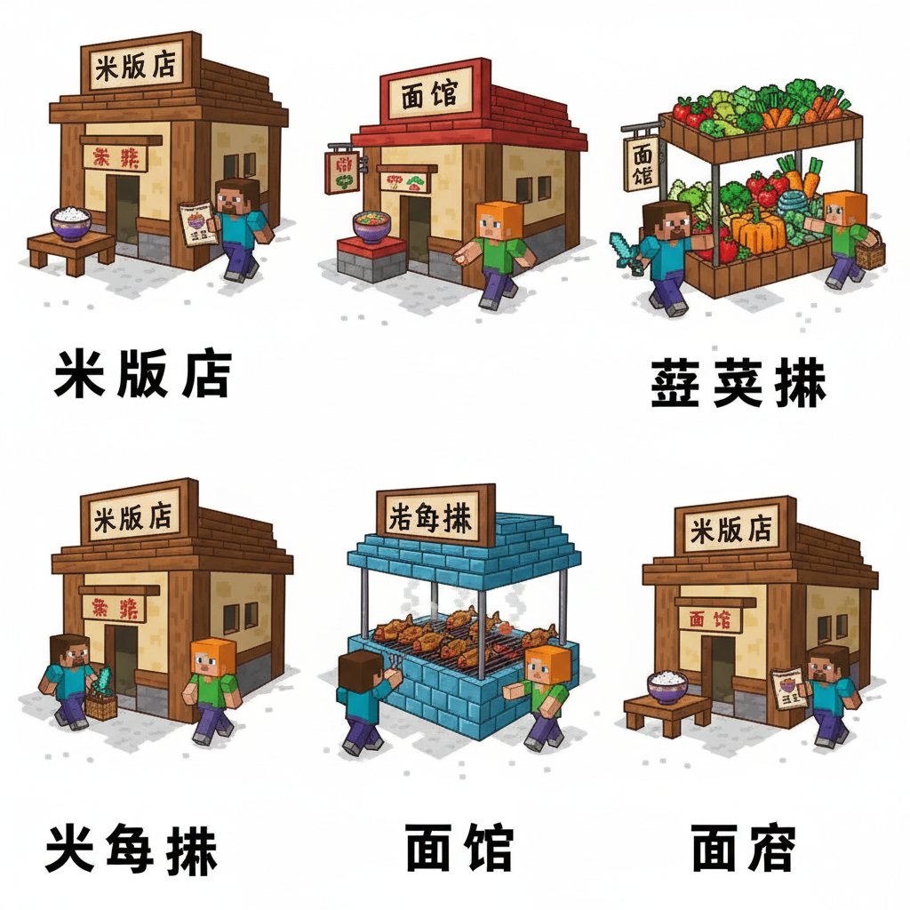
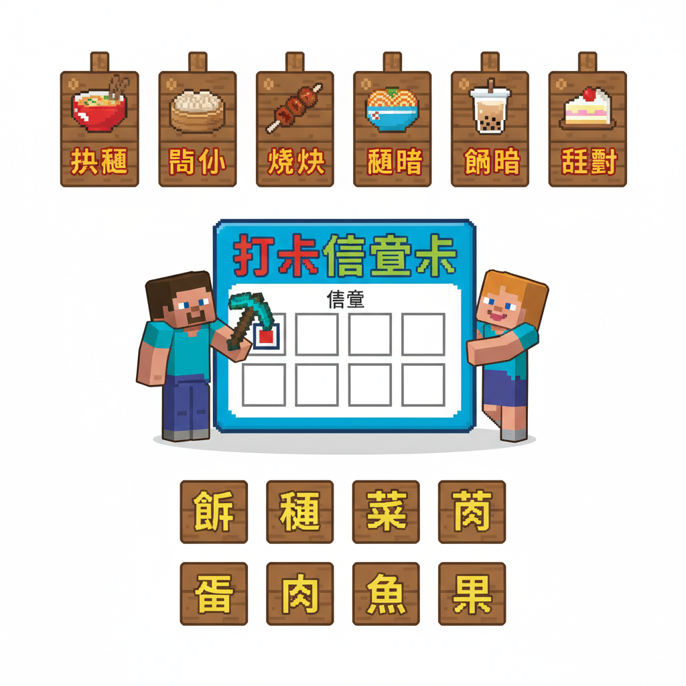

# 第15课 拓展篇：中华美食街

## 📋 学习目标
- 巩固食物字：米饭面条瓜果菜蛋鱼
- 认识更多食物相关字和文化
- 学会在餐厅情境中用食物字

---

## 🎬 第一页：美食街

方块盛宴后，厨师告诉 Steve 和 Alex：

> "你们学会了九个食物字——现在去美食街用一用吧！"

村庄美食街热闹非凡。每家店门口都挂着自己的招牌。

```
   🏮 中华美食街 🏮
   
   🍚 米饭店      🍜 面馆
   🥗 蔬菜摊      🍉 水果店
   🥚 蛋饼铺      🐟 烤鱼摊
```

> "规则：每家店都要认出门上的字，点一道菜，吃完才能去下一家！"


---

## 🎬 第二页：逛吃逛吃

**第一站 — 米饭店 🍚**

> 招牌：米饭

Steve 念出："mǐ fàn！"

> 老板："来一碗白米饭？还是蛋炒饭？"

Steve："一碗白米饭！米煮成饭——粒粒香甜！"

**第二站 — 面馆 🍜**

> 招牌：面条

Alex 念出："miàn tiáo！"

> 师傅："手工拉面——要宽的还是细的？"

Alex："细的！一条一条，又长又细！"

**第三站 — 蔬菜摊 🥬**

> 招牌：瓜果蔬（菜）

> 摊主："新鲜的瓜果蔬菜——西瓜、黄瓜、苹果、白菜......"

Steve 买了西瓜和白菜。"瓜是藤上的，菜是田里的！"

**第四站 — 烤鱼摊 🐟**

> 招牌：烤鱼

> 摊主："现烤活鱼——外焦里嫩！"

Alex："鱼——头身尾，一条完整的鱼！"

六家店全部打卡！Steve 和 Alex 吃得肚子圆滚滚。

> "学过的字都在生活中用上了！"



---

## 📝 练习

### 一、菜单配对

```
   米饭   ●   🍜
   面条   ●   🍚
   水果   ●   🐟
   烤鱼   ●   🍎
```

### 二、点菜

假如你去美食街，你会点什么？

```
   在米饭店：我要一碗___。
   在面馆：我要一碗___面。
   在水果店：我要一个___。
```

---

## 📊 拓展小结

- [ ] 全部9个食物字在生活中应用
- [ ] 美食街情境练习
- [ ] 点菜用字实践

> **累计识字：89字** ✅

---



---

> 【标A: 语文课标一上·识字与写字·生活情境识字】

### ❌常见误解

| ❌ 错误写法/理解 | ✅ 正确写法/理解 |
|-------|-------|
| "吃"字右边写成"乞" | 吃=口+乞（qǐ），乞=气去掉最后一笔 |
| "身"字少写一横 | 身=7画，第6笔是长横，不能漏 |
| 学了新字忘了旧字 | 每课复习前课字，学过的字要在新情境中用 |
| 只认字不组词 | 每个字至少要会2个词（如：水→河水、水果） |

🧠 想一想
1. **观察推理**："吃、喝、叫、唱"都有"口"字旁。为什么这些字都跟嘴巴有关？你能再找出3个有"口"字旁的字吗？
2. **反事实**：如果所有的字都没有偏旁部首，全都是随机的笔画组合，学汉字会变成什么样？

## 🔗 跨科连接
数学第15课教认识钱币 → 语文教"买、卖、元、角"
英语Lesson 7-9教动物/身体/食物 → 中文对应词同步

