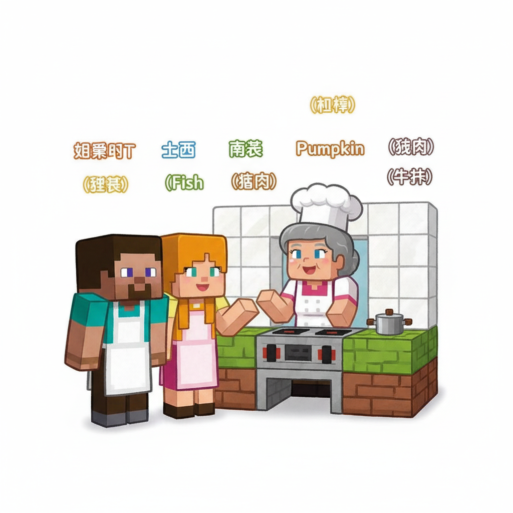
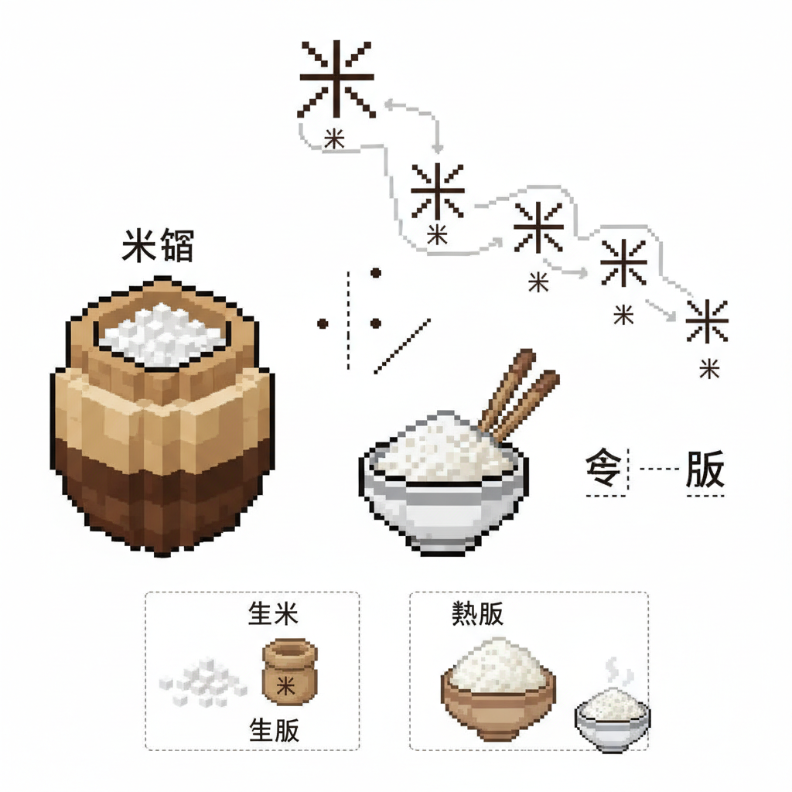
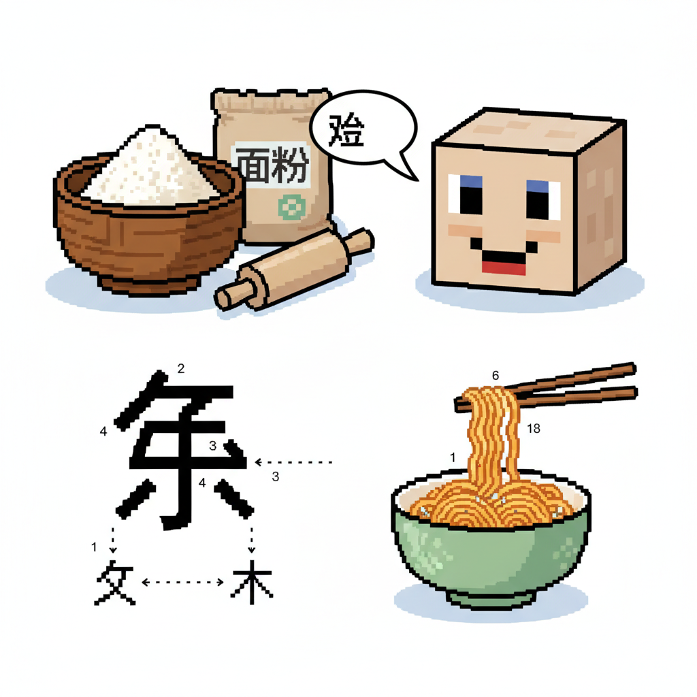
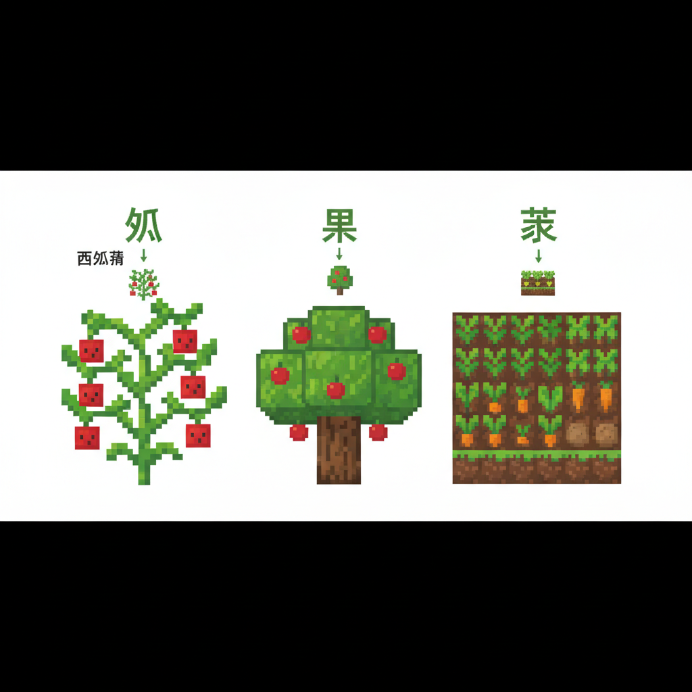
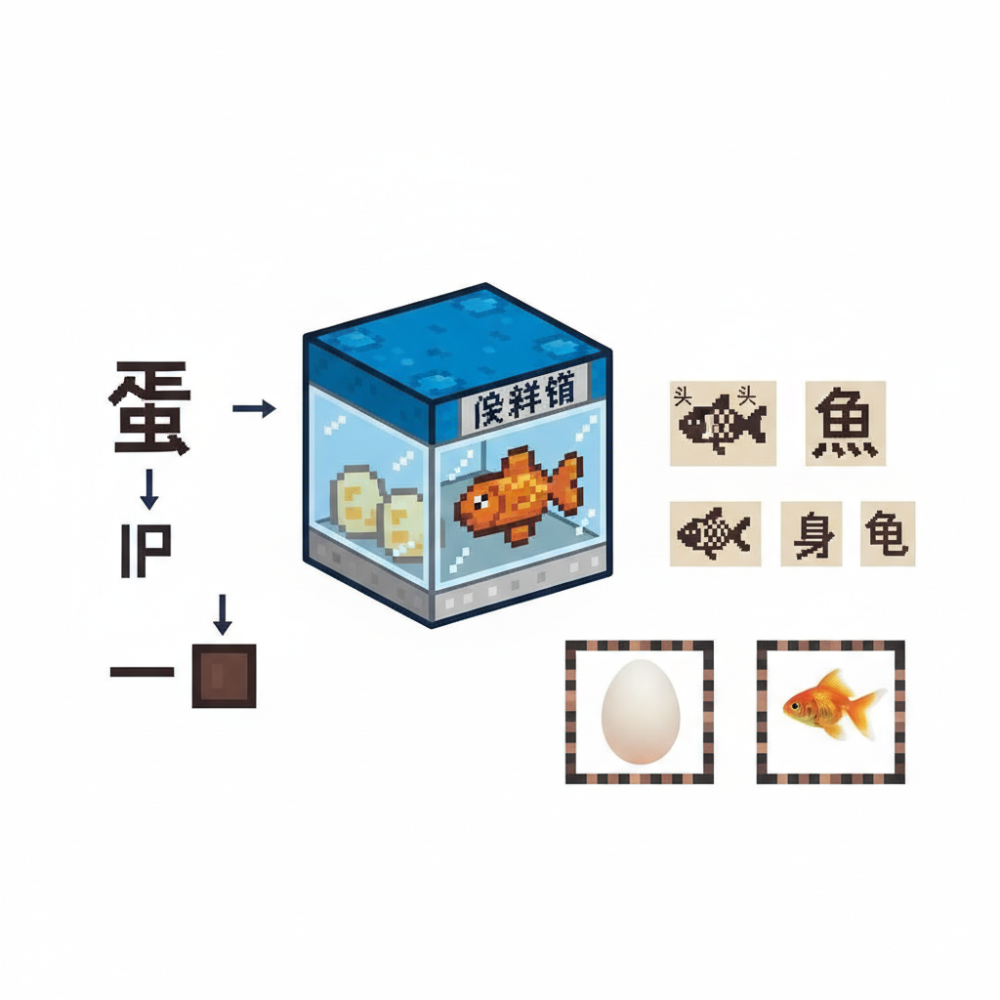
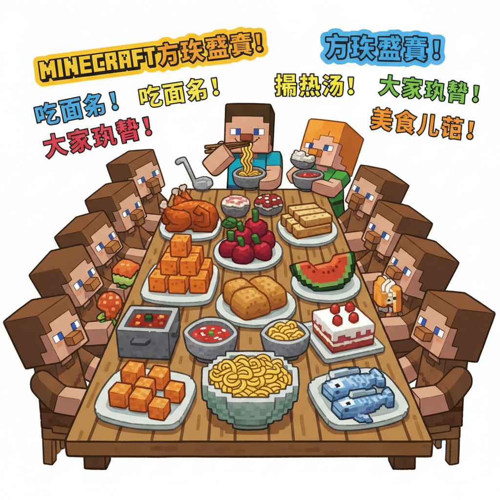
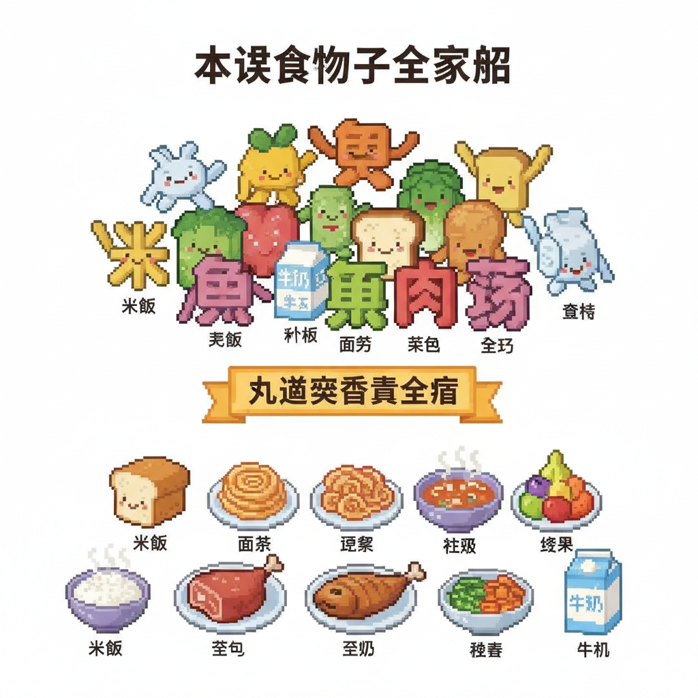

# 第15课 美味食物

## 📋 学习目标
- 认识食物字：**米 饭 面 条 瓜 果 菜 蛋 鱼**
- 掌握笔画顺序与拼音标注
- 了解常见食物的字源
- 学会用食物字组词造句

**累计识字：89字**（L14: 80字 + 本课: 9字）

---

## 🎬 第一页：方块厨房

Steve 和 Alex 走进村庄的大厨房。厨师阿姨正在准备一场盛宴。

> "欢迎来到方块厨房！今天我们要做出九道美味——但首先，你们得学会每种食材的名字！"

```
   🍳 方块厨房 — 九种食材：
   
   🌾 米（米饭的米）
   🍚 饭（煮好的米）
   🍜 面（面粉的面）
   🍝 条（面条的条）
   🍉 瓜（西瓜黄瓜）
   🍎 果（水果的果）
   🥬 菜（蔬菜的菜）
   🥚 蛋（鸡蛋的蛋）
   🐟 鱼（鱼肉的鱼）
```

> "这些字不仅代表食物，还藏着中华饮食文化的密码！"



---

## 🎬 第二页：米和饭 — 粒粒皆辛苦

厨师从米缸里舀出一碗白米。

```
   米 [mǐ] (6画)
   笔画顺序：①丶(点) ②丿(撇) ③一(横) ④丨(竖) ⑤丿(撇) ⑥㇏(捺)
   记忆口诀：上面两点像米粒，下面是个"木"（因为米长在植物上）
   象形：甲骨文就是几粒米的样子
   组词：大米(dà mǐ)、玉米(yù mǐ)、米饭(mǐ fàn)
   
   饭 [fàn] (7画)
   笔画顺序：①丿(撇) ②㇟(横撇) ③㇏(捺) ④丿(撇) ⑤丿(撇) ⑥㇏(捺)
   记忆口诀：食字旁(饣)加"反"就是饭
   组词：吃饭(chī fàn)、早饭(zǎo fàn)、饭店(fàn diàn)
```

> "米是没煮的——饭是煮熟的！你看'饭'的左边是食字旁，说明它跟吃有关。"

Steve 抓了一把米："一粒一粒，每一颗都是农民辛苦种的。"

```
   📖 小词典：
   米 mǐ — 大米，谷类作物
   饭 fàn — 煮熟的米，也指一顿正餐
```



---

## 🎬 第三页：面条 — 长长的美味

厨师端出一盆面粉和一把面条。

```
   面 [miàn] (9画)
   笔画顺序：①一(横) ②丿(撇) ③丨(竖) ④𠃍(横折) ⑤丨(竖) ⑥丨(竖) ⑦一(横) ⑧一(横) ⑨一(横)
   记忆口诀：面像一个人的脸——但也是面粉的面！（一字二义）
   组词：面条(miàn tiáo)、面包(miàn bāo)、面前(miàn qián)
   
   条 [tiáo] (7画)
   笔画顺序：①丿(撇) ②㇟(横撇) ③㇏(捺) ④一(横) ⑤丨(竖) ⑥丿(撇) ⑦㇏(捺)
   记忆口诀：反文旁(夂)加"木"就是条
   组词：面条(miàn tiáo)、条件(tiáo jiàn)、一条鱼(yī tiáo yú)
```

> "注意！'面'有两个意思——面粉的脸，也是脸上的脸！面条就是面粉做的长条。"

Alex 捧起一把面条："软软的、长长的——'条'就是细长的意思！"

```
   📖 小词典：
   面 miàn — 面粉 / 脸
   条 tiáo — 细长的东西 / 量词
```



---

## 🎬 第四页：瓜果菜 — 田园三宝

厨师带他们来到厨房后院的菜园。满园的蔬果！

```
   瓜 [guā] (5画)
   笔画顺序：①丿(撇) ②丿(撇) ③丨(竖) ④𠃊(提) ⑤丶(点)
   记忆口诀：像藤上挂着一个圆滚滚的瓜
   组词：西瓜(xī guā)、黄瓜(huáng guā)、瓜子(guā zǐ)
   
   果 [guǒ] (8画)
   笔画顺序：①丨(竖) ②𠃍(横折) ③一(横) ④一(横) ⑤一(横) ⑥丨(竖) ⑦丿(撇) ⑧㇏(捺)
   记忆口诀："田"上长"木"，树上结果
   组词：水果(shuǐ guǒ)、苹果(píng guǒ)、如果(rú guǒ)
   
   菜 [cài] (11画)
   笔画顺序：①一(横) ②丨(竖) ③丨(竖) ④丿(撇) ⑤丶(点) ⑥丶(点) ⑦丿(撇) ⑧一(横) ⑨丨(竖) ⑩丿(撇) ⑪㇏(捺)
   记忆口诀：草字头(艹)加"采"就是菜（从草里采来的！）
   组词：蔬菜(shū cài)、白菜(bái cài)、饭菜(fàn cài)
```

> "瓜是藤上的圆果，果是树上的子实，菜是田里采来的——三个字三个来源！"

Steve 摘了一个红苹果："果——树上结的！"

```
   📖 小词典：
   瓜 guā — 藤上结的（西瓜、黄瓜）
   果 guǒ — 树上结的（苹果、水果）
   菜 cài — 田里采的（蔬菜、白菜）
```



---

## 🎬 第五页：蛋和鱼 — 动物馈赠

最后两种食材在厨房的保鲜箱里。

```
   蛋 [dàn] (11画)
   笔画顺序：①㇟(横撇) ②㇏(捺) ③丨(竖) ④𠃍(横折) ⑤一(横) ⑥丨(竖) ⑦一(横) ⑧丶(点) ⑨丿(撇) ⑩丿(撇) ⑪㇏(捺)
   记忆口诀："疋"下有个"虫"——鸟虫生的就是蛋
   组词：鸡蛋(jī dàn)、蛋糕(dàn gāo)、蛋黄(dàn huáng)
   
   鱼 [yú] (8画)
   笔画顺序：①丿(撇) ②㇟(横撇) ③丨(竖) ④𠃍(横折) ⑤一(横) ⑥丨(竖) ⑦一(横) ⑧一(横)
   记忆口诀：头是"⺈"，身是"田"，尾是一横
   象形：甲骨文就是一条鱼——有头有鳞有尾巴
   组词：小鱼(xiǎo yú)、金鱼(jīn yú)、鱼肉(yú ròu)
```

> "'鱼'的象形最明显——上面是鱼头，中间是鱼身（田形鳞片），下面一横是鱼尾！"

Alex 指着鱼字："看！真的是头、身、尾三部分——一条完整的鱼！"

```

---

> 【标A: 语文课标一上·识字与写字·生活情境识字】

### ❌常见误解

| ❌ 错误写法/理解 | ✅ 正确写法/理解 |
|-------|-------|
| "吃"字右边写成"乞" | 吃=口+乞（qǐ），乞=气去掉最后一笔 |
| "身"字少写一横 | 身=7画，第6笔是长横，不能漏 |
| 学了新字忘了旧字 | 每课复习前课字，学过的字要在新情境中用 |
| 只认字不组词 | 每个字至少要会2个词（如：水→河水、水果） |

🧠 想一想
1. **观察推理**："吃、喝、叫、唱"都有"口"字旁。为什么这些字都跟嘴巴有关？你能再找出3个有"口"字旁的字吗？
2. **反事实**：如果所有的字都没有偏旁部首，全都是随机的笔画组合，学汉字会变成什么样？

## 🔗 跨科连接
数学第15课教认识钱币 → 语文教"买、卖、元、角"
英语Lesson 7-9教动物/身体/食物 → 中文对应词同步

📖 小词典：
   蛋 dàn — 动物的卵
   鱼 yú — 水里的动物，头身尾
```



---

## 🎬 第六页：盛宴开席

九种食材全部准备完毕！厨师带领 Steve 和 Alex 开始烹饪。

```
   🍳 方块盛宴 🍳
   
   米 + 饭 = 一碗米饭 🍚
   面 + 条 = 一碗面条 🍜
   瓜 + 果 + 菜 = 瓜果蔬菜拼盘 🥗
   蛋 + 鱼 = 蒸蛋 + 红烧鱼 🥚🐟
```

厨师把每道菜端上桌。整个村庄的人都来了！

> "看——'米'变成了'饭'，'面'变成了'条'，'瓜'、'果'、'菜'组成了拼盘。这就是中文的神奇——学会了单个字，就能拼出千变万化的美食！"

Steve 夹起一筷子面条："面是粉，条是形——面条！”"

Alex 喝着鱼汤："鱼是活的，煮了就变成了美味！"

```
   🎵 美食儿歌 🎵
   
   一捧大米煮成饭，
   一把面粉做成面。
   园里瓜果和蔬菜，
   桌上蛋鱼香满天。
   九个美食字学会了，
   自己点菜也不难！
```



---

## 📝 练习

### 一、食物分类

```
   长在藤上的：___
   长在树上的：___
   长在田里的：___
   动物给的：___ ___
   加工过的：___ ___
```

### 二、笔画数

```
   米 — ___画    饭 — ___画    面 — ___画
   瓜 — ___画    果 — ___画    鱼 — ___画
```

### 三、一字多义

```
   "面"在"面条"中的意思是：___
   "面"在"面前"中的意思是：___
   
   "米"在"米饭"中的意思是：___
   "米"在"一米长"中的意思是：___
```

### 四、拼音标注

给下面的食物字标拼音和声调：

```
   米 → ___    饭 → ___    面 → ___
   条 → ___    瓜 → ___    果 → ___
   菜 → ___    蛋 → ___    鱼 → ___
```

---

## 🏆 挑战 — 小小厨师

**第一关：猜食物 🔍**

```
   一头鱼尾是水下 → ___
   藤上挂个大圆球 → ___
   草下采来可做菜 → ___
   一粒一粒煮成碗 → ___
```

**第二关：我的菜单 📋**

写出你今天想吃的：

```
   早餐：___ + ___
   午餐：___ + ___
   晚餐：___ + ___
```

**第三关：写菜谱 ✏️**

用学过的字写一道简单的菜谱：

```
   菜名：_______
   食材：___、___、___
   做法：先___，再___，最后___。
```

---

## 📊 本课小结

新学食物字（9个）：
- [ ] 米 mǐ — 大米
- [ ] 饭 fàn — 煮熟的米
- [ ] 面 miàn — 面粉 / 脸
- [ ] 条 tiáo — 细长的东西
- [ ] 瓜 guā — 藤上结的
- [ ] 果 guǒ — 树上结的
- [ ] 菜 cài — 田里采的
- [ ] 蛋 dàn — 动物的卵
- [ ] 鱼 yú — 水里游的

> **累计识字：89字**

---


