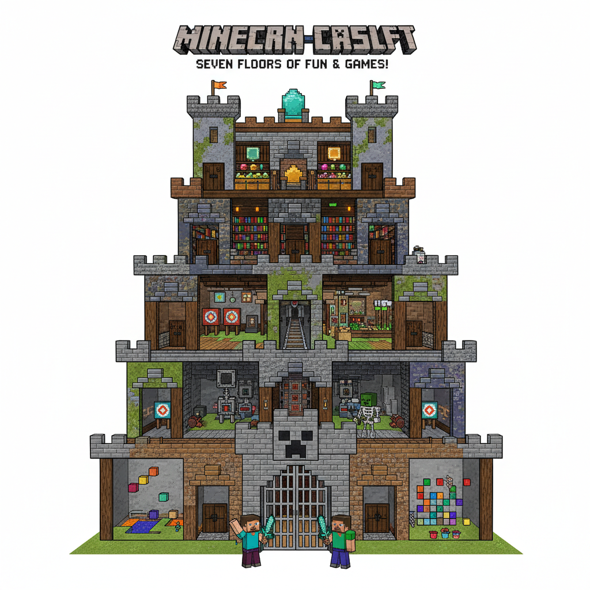
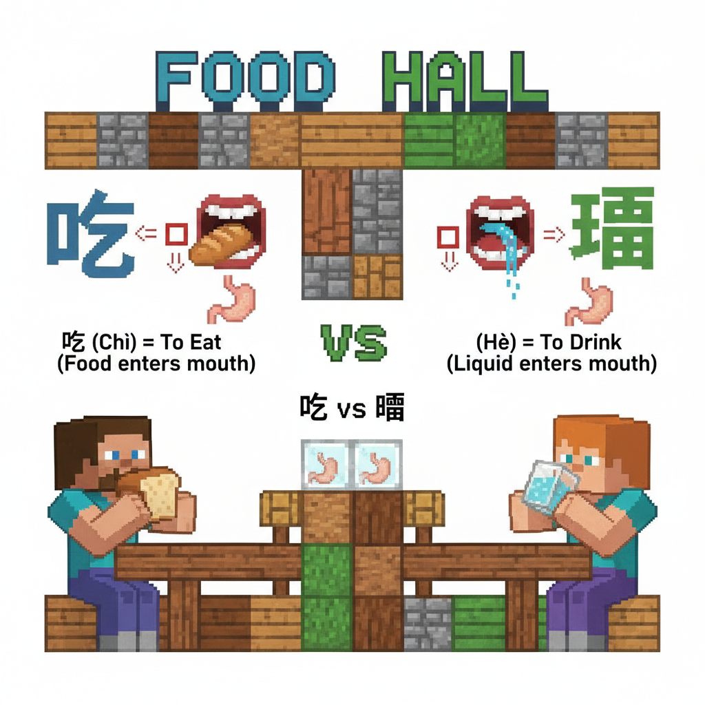
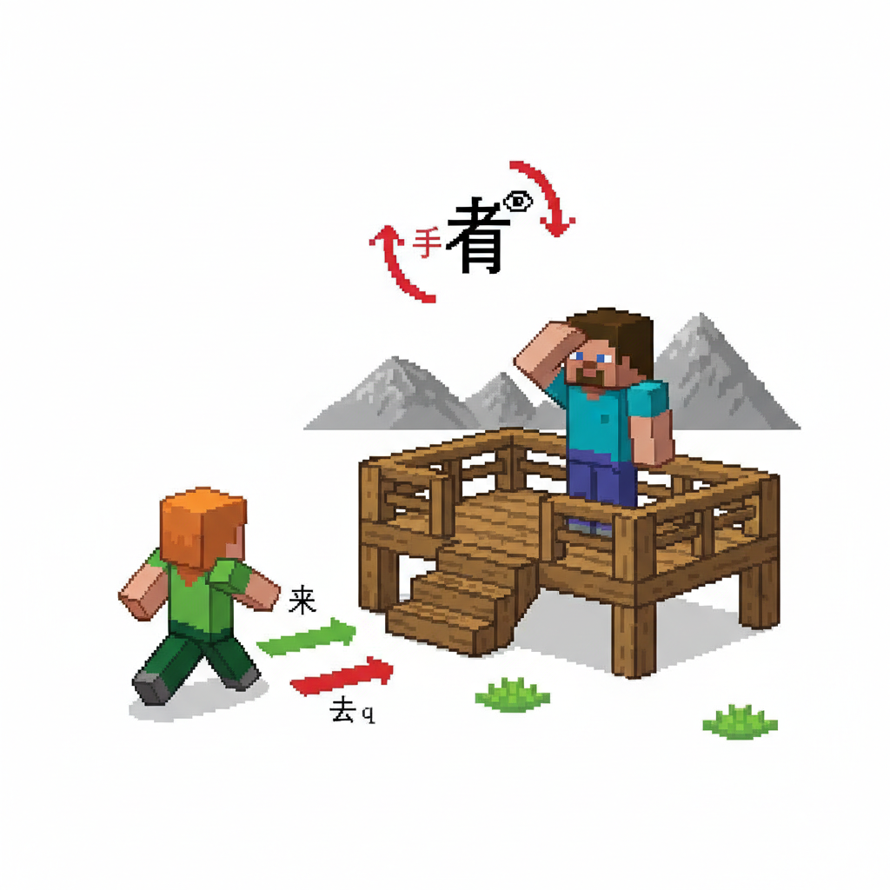
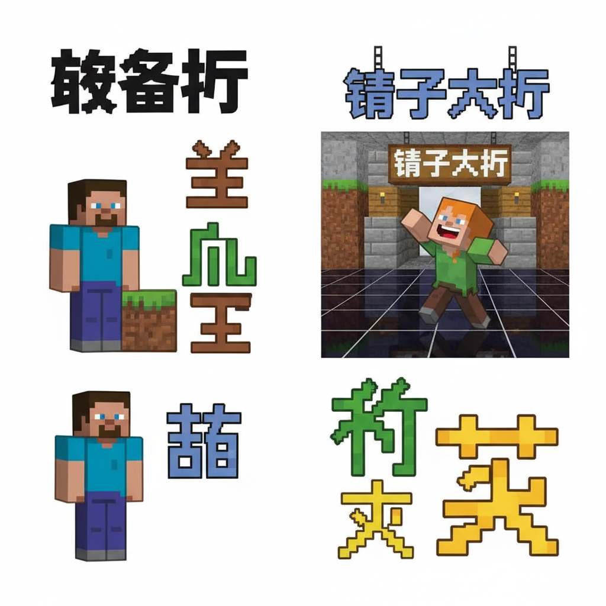
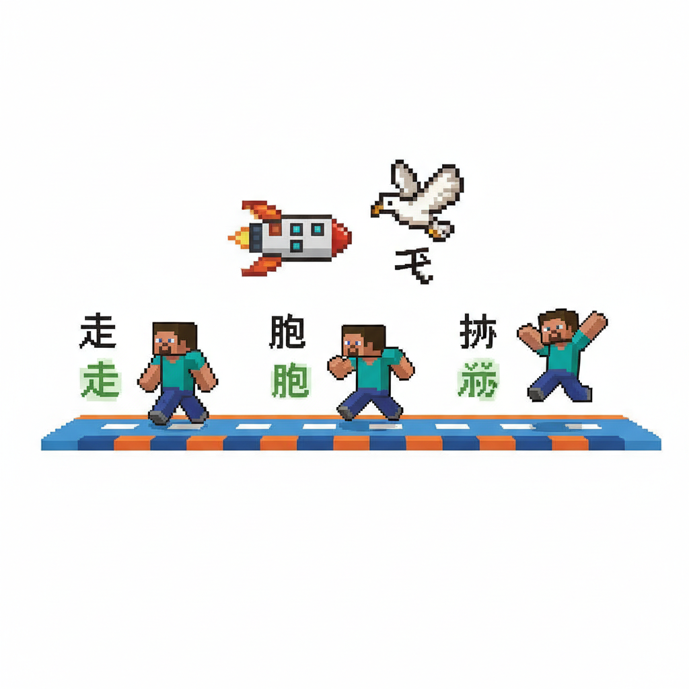
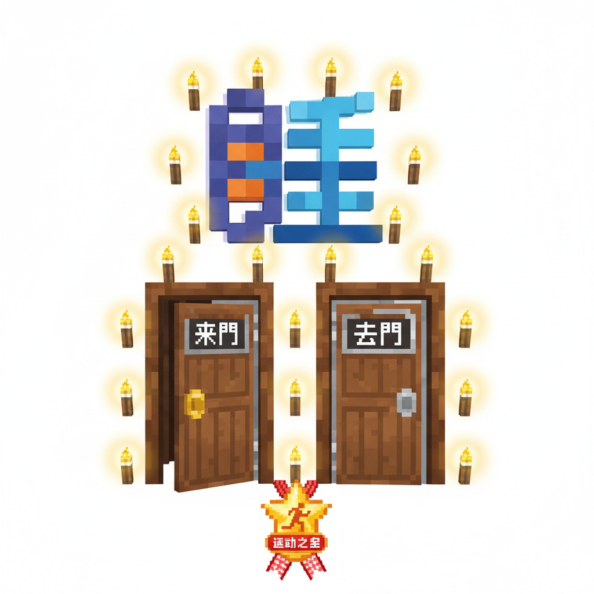
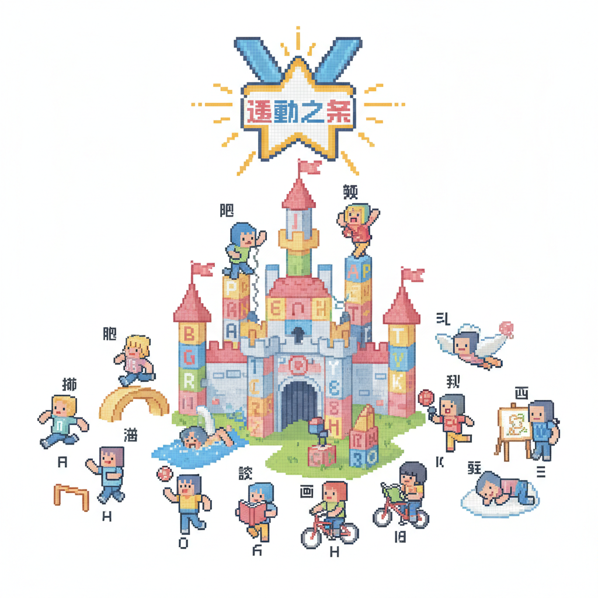

# 第16课 动作乐园

## 📋 学习目标
- 认识动作字：**吃 喝 看 走 笑 来 去 坐 睡 站 跑 跳 飞**
- 掌握笔画顺序与拼音标注
- 学会用动作字描述日常活动
- 区分来/去、坐/站等反义动作

**累计识字：103字**（L15: 89字 + 本课: 14字）

---

## 🎬 第一页：动作城堡

村口新开了一座"动作城堡"——一座巨大的游乐场，每层楼对应一个动作！

> "动作城堡——学会了全部动作字，就能到达顶层，获得'运动之星'勋章！"

```
   🏰 动作城堡 — 七层挑战
   
   一层：吃喝 🍽️     二层：看来 👀
   三层：坐站 🪑🧍    四层：笑 😄
   五层：走跑跳 🏃    六层：飞 🕊️
   七层：来去 →       顶层：🏆
```

> "一共 14 个动作字——每学会一个，就点亮一层的一盏灯！"



---

## 🎬 第二页：吃喝 — 第一层

第一层是"食物大厅"——学会什么动作才能吃？

```
   吃 [chī] (6画)
   笔画顺序：①丨(竖) ②𠃍(横折) ③一(横) ④丿(撇) ⑤一(横) ⑥乚(竖弯钩)
   记忆口诀：口字旁——用嘴巴完成的动作（口+乞）
   组词：吃饭(chī fàn)、吃药(chī yào)、好吃(hǎo chī)
   
   喝 [hē] (12画)
   笔画顺序：(口+曷)
   记忆口诀：口字旁——用嘴巴喝东西
   组词：喝水(hē shuǐ)、喝酒(hē jiǔ)
```

> "'吃'和'喝'都是口字旁——因为都是嘴巴的动作！吃是嚼，喝是吞。"

Steve拿起一块面包咬了一口："chī——吃！嘴巴打开了，嚼一嚼！"

Alex端起一杯水："hē——喝！水直接流下去！"

```
   📖 小词典：
   吃 chī — 用嘴咀嚼吞咽（固体）
   喝 hē — 用嘴流入口中（液体）
```



---

## 🎬 第三页：看来 — 第二层

第二层是"观景台"——巨大的窗户能看到整个村庄。

```
   看 [kàn] (9画)
   笔画顺序：①丿(撇) ②一(横) ③一(横) ④一(横) ⑤丨(竖) ⑥𠃍(横折) ⑦一(横) ⑧一(横) ⑨一(横)
   记忆口诀：手(扌)搭在目(眼睛)上——就是"看"！
   组词：看见(kàn jiàn)、看书(kàn shū)、好看(hǎo kàn)
   
   来 [lái] (7画)
   笔画顺序：①一(横) ②丶(点) ③丿(撇) ④一(横) ⑤丨(竖) ⑥丿(撇) ⑦㇏(捺)
   记忆口诀：像一个人正朝你走过来
   组词：出来(chū lái)、回来(huí lái)、过来(guò lái)
```

> "'看'最有意思——上面是'手'，下面是'目'。手放在眼睛上，向远处看！"

> "'来'跟'去'相反——来是朝我这边，去是远离我。"

Steve把手放在额头上："看——远处有一座山！"

Alex从远处跑过来："我来了！"

```
   📖 小词典：
   看 kàn — 用眼睛观察（手+目）
   来 lái — 从别处到此地
```



---

## 🎬 第四页：坐站笑 — 三四层

第三层是"休息厅"——学会坐和站。

```
   坐 [zuò] (7画)
   笔画顺序：①丿(撇) ②丶(点) ③丿(撇) ④丶(点) ⑤一(横) ⑥丨(竖) ⑦一(横)
   记忆口诀：两个人(从)坐在土上——就是"坐"
   组词：坐下(zuò xià)、坐车(zuò chē)
   
   站 [zhàn] (10画)
   笔画顺序：(立+占)
   记忆口诀：立字旁(立)——站着就是立着
   组词：站立(zhàn lì)、车站(chē zhàn)
```

> "'坐'是两个人坐在土上——'从'加'土'就是'坐'！"

> "'站'左边是'立'（站立），右边是'占'——人站了一个位置！"

第四层的门打开后是一个镜子大厅——学会"笑"！

```
   笑 [xiào] (10画)
   笔画顺序：(竹+夭)
   记忆口诀：竹子(⺮)被风吹弯腰——像人笑得弯下身子
   组词：大笑(dà xiào)、玩笑(wán xiào)、笑脸(xiào liǎn)
```

Steve在镜子前坐下："zuò——坐！"然后站起来："zhàn——站！"

Alex对着镜子做鬼脸，然后哈哈大笑："xiào——笑！牙齿都露出来了！"



---

## 🎬 第五页：走跑跳飞 — 五六层

第五层是"赛道"——三种移动方式：

```
   走 [zǒu] (7画)
   笔画顺序：①一(横) ②丨(竖) ③一(横) ④丨(竖) ⑤一(横) ⑥丿(撇) ⑦㇏(捺)
   记忆口诀：像一个人迈开大步走路
   组词：走路(zǒu lù)、出走(chū zǒu)
   
   跑 [pǎo] (12画)
   笔画顺序：(足+包)
   记忆口诀：足字旁——用脚完成的快速动作
   组词：跑步(pǎo bù)、快跑(kuài pǎo)
   
   跳 [tiào] (13画)
   笔画顺序：(足+兆)
   记忆口诀：足字旁——用脚向上弹起
   组词：跳高(tiào gāo)、跳舞(tiào wǔ)、心跳(xīn tiào)
```

> "走、跑、跳都是足字旁——因为都是脚的动作！"

第六层——顶层！最后一个是"飞"。

```
   飞 [fēi] (3画)
   笔画顺序：①㇂(横斜钩) ②丿(撇) ③丶(点)
   记忆口诀：像一只鸟张开翅膀在飞
   组词：飞机(fēi jī)、飞鸟(fēi niǎo)、起飞(qǐ fēi)
```

Steve从慢走到快跑："走——跑——跳！越来越快！"

Alex看着窗外的鸟："fēi——飞！三个笔画，像一只展翅的鸟！"



---

## 🎬 第六页：来去和睡 — 第七层

最后一层有两扇门——一扇开，一扇关。

```
   去 [qù] (5画)
   笔画顺序：①一(横) ②丨(竖) ③一(横) ④𠃐(撇折) ⑤丶(点)
   记忆口诀：跟"来"相反——从此地到别处
   组词：出去(chū qù)、回去(huí qù)、过去(guò qù)
   
   睡 [shuì] (13画)
   笔画顺序：(目+垂)
   记忆口诀：目字旁——眼睛垂下来，就是睡着了
   组词：睡觉(shuì jiào)、午睡(wǔ shuì)
```

> "'去'跟'来'相反——来是过来，去是离开。"

> "'睡'是目字旁——眼睛垂下来，就是睡着了！"

```
   🎯 动作反义词：
   
   来 ↔ 去（方向相反）
   坐 ↔ 站（高低相反）
   吃 ↔ ？（吃不等于吐，但吃喝是一对！）
   走 ↔ 停
```

全部七层通过！顶层的灯光亮起——14 盏灯全部闪着金光。

🏆 "运动之星"勋章到手！



---

## 📝 练习

### 一、动作分类

```
   嘴巴做的动作：___ ___
   眼睛做的动作：___ ___
   脚做的动作：___ ___ ___ ___
   身体做的动作：___ ___ ___ ___
   方向动作：___ ___
```

### 二、反义词

```
   来 ↔ ___     坐 ↔ ___
   吃 ↔  ___（不常直接对应，但吃饱和 ___ 饿相反）
```

### 三、选字填空

```
   我___饭。          (吃/喝)
   我___水。          (吃/喝)
   我___见一只鸟。     (看/走)
   我___回家。        (来/去)
   晚上我___觉。      (睡/坐)
```

---

## 🏆 挑战 — 动作大王

**第一关：模仿动作 🎭**

看字做动作——让别人猜是什么字！

```
   飞 → 张开手臂 → 别人猜"飞"！
   笑 → 哈哈大笑 → 别人猜"笑"！
```

**第二关：一天的动作 📖**

写出你一天做的动作：

```
   早上：___（起床）、___（吃饭）、___（上学）
   中午：___（午饭）、___（坐）
   下午：___（回家）、___（跑）
   晚上：___（睡）
```

---

## 📊 本课小结

新学动作字（14个）：
- [ ] 吃 chī / 喝 hē — 嘴巴动作
- [ ] 看 kàn — 眼睛动作
- [ ] 来 lái / 去 qù — 方向动作
- [ ] 坐 zuò / 站 zhàn — 高低动作
- [ ] 走 zǒu / 跑 pǎo / 跳 tiào — 足部动作
- [ ] 飞 fēi — 空中动作
- [ ] 笑 xiào — 表情动作
- [ ] 睡 shuì — 休息动作

> **累计识字：103字**

---


