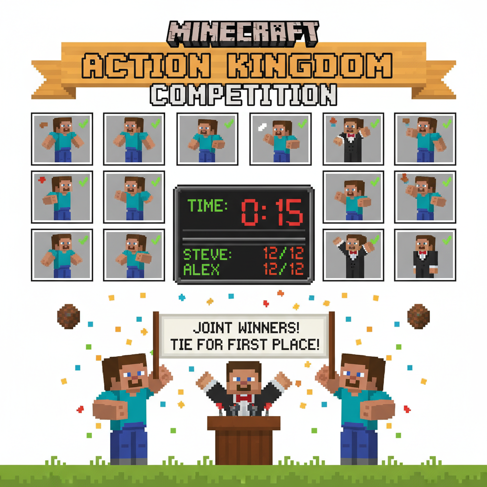
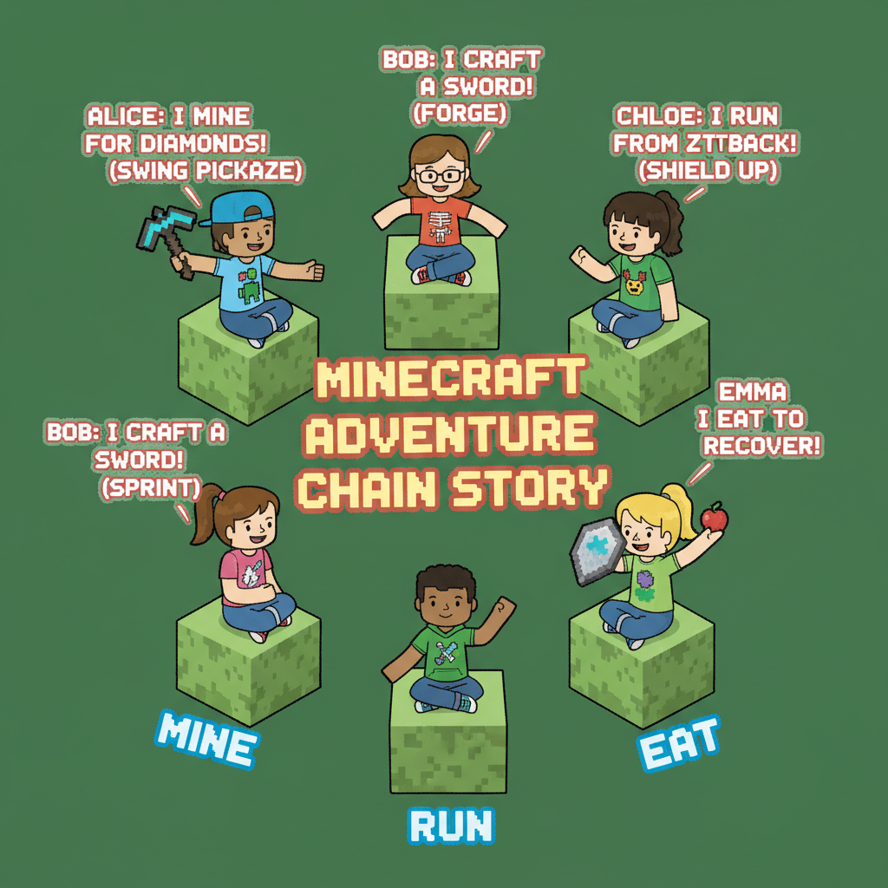
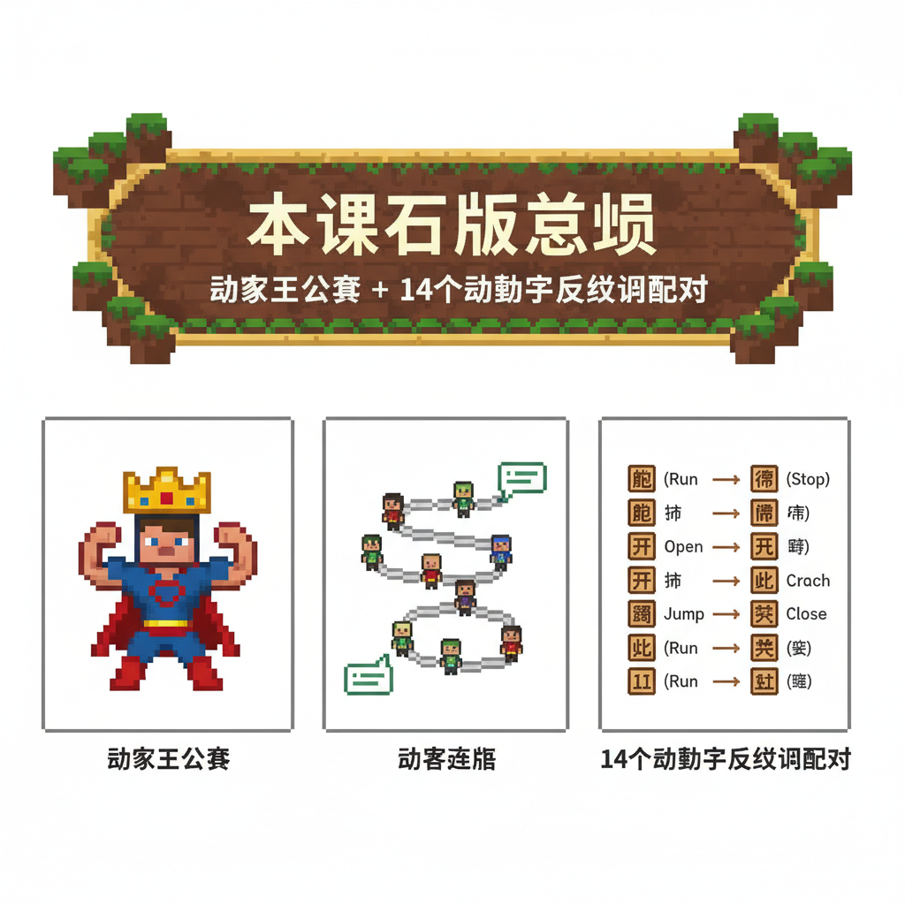

# 第16课 拓展篇：谁是动作王

## 📋 学习目标
- 巩固14个动作字
- 在竞赛情境中运用动作字
- 理解来/去、坐/站、走/跑等动作对比

---

## 🎬 第一页：动作王大赛

获得"运动之星"勋章后，动作城堡举办了一场"动作王大赛"。

> "谁能最快完成所有动作指令，谁就是动作王！"

```
   🏆 动作王大赛 — 指令板
   
   1. 走过来！→ 2. 坐下来！→ 3. 站起来！
   4. 喝水！→ 5. 吃饼干！→ 6. 笑起来！
   7. 走出去！→ 8. 跑回来！→ 9. 跳起来！
   10. 看一看！→ 11. 飞（模仿鸟）！→ 12. 睡觉（假装）！
```

Steve和Alex同时出发。两人动作敏捷——

> "走——坐——站——喝——吃——笑——走——跑——跳——看——飞——睡！"

几乎同时达成！裁判宣布：

> "两个动作王——并列第一！"



---

## 🎬 第二页：动作故事接龙

比赛结束后，大家玩起了"动作故事接龙"——每人说一句话，必须用上至少一个动作字，然后传给下一个人。

```

---

> 【标A: 语文课标一上·识字与写字·生活情境识字】

### ❌常见误解

| ❌ 错误写法/理解 | ✅ 正确写法/理解 |
|-------|-------|
| "吃"字右边写成"乞" | 吃=口+乞（qǐ），乞=气去掉最后一笔 |
| "身"字少写一横 | 身=7画，第6笔是长横，不能漏 |
| 学了新字忘了旧字 | 每课复习前课字，学过的字要在新情境中用 |
| 只认字不组词 | 每个字至少要会2个词（如：水→河水、水果） |

🧠 想一想
1. **观察推理**："吃、喝、叫、唱"都有"口"字旁。为什么这些字都跟嘴巴有关？你能再找出3个有"口"字旁的字吗？
2. **反事实**：如果所有的字都没有偏旁部首，全都是随机的笔画组合，学汉字会变成什么样？

## 🔗 跨科连接
数学第15课教认识钱币 → 语文教"买、卖、元、角"
英语Lesson 7-9教动物/身体/食物 → 中文对应词同步

📖 动作故事接龙：
   
   Steve："早上，我走 到厨房吃早饭。"
   Alex："然后我笑 着跑 出家门。"
   朋友1："在学校，我坐 下来看 书。"
   朋友2："下课了，我站 起来跳 绳。"
   朋友3："放学了，我飞 快地跑 回家。"
   朋友4："晚上，我喝 杯牛奶就去睡 觉。"
```

> "看——14个动作字，每一个都能放进故事里！"



---

## 📝 练习

### 一、动作对联

```
   来 对 ___（方向）
   坐 对 ___（姿势）
   吃 对 ___（饮食）
   走 对 ___（速度换一种）
```

### 二、动作故事

用至少5个动作字写一个短故事：

```
   一天，我___出家门，___到学校。
   上___了老师，___在座位上。
   下___后我___到操场___绳。
   回家___完饭就___觉了。
```

---


