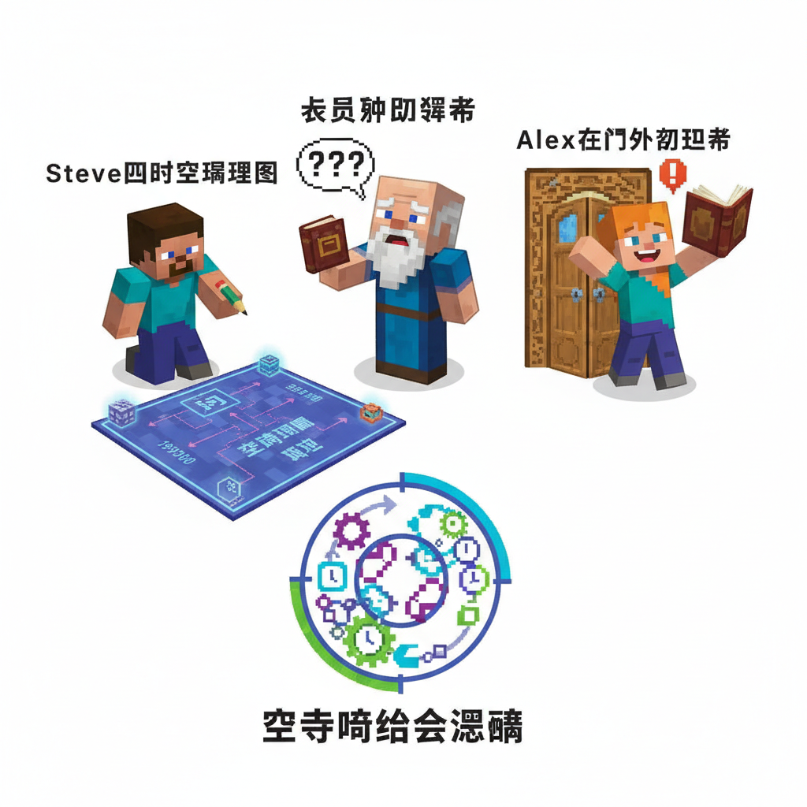
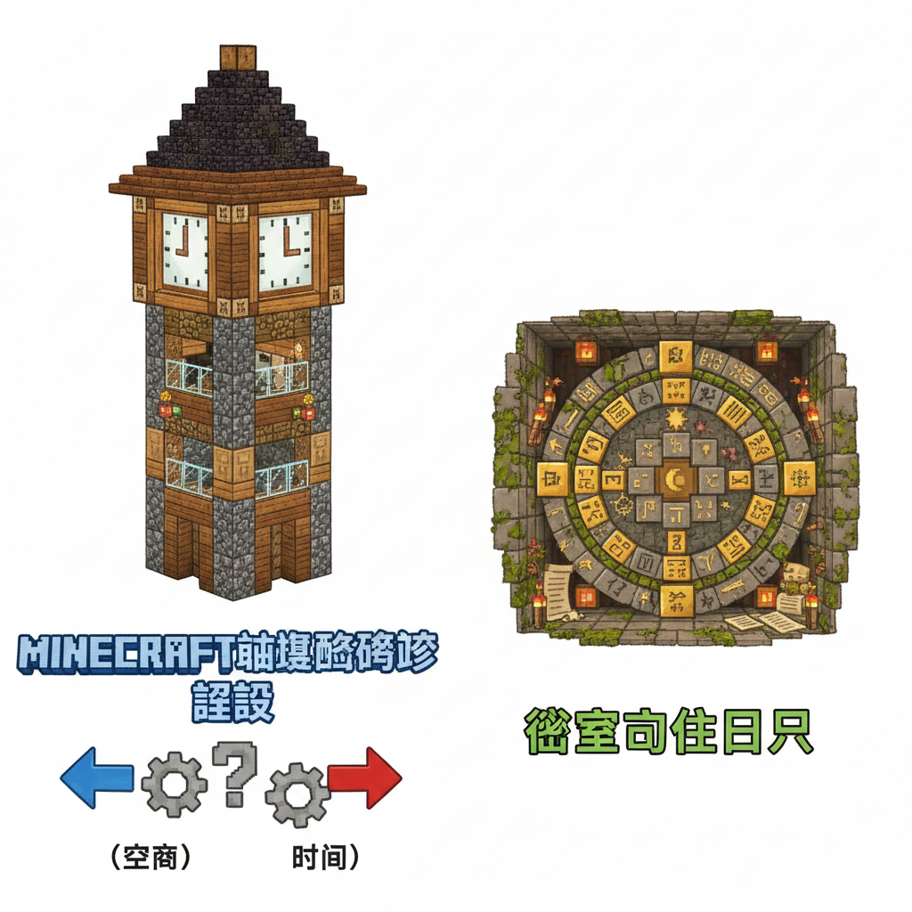
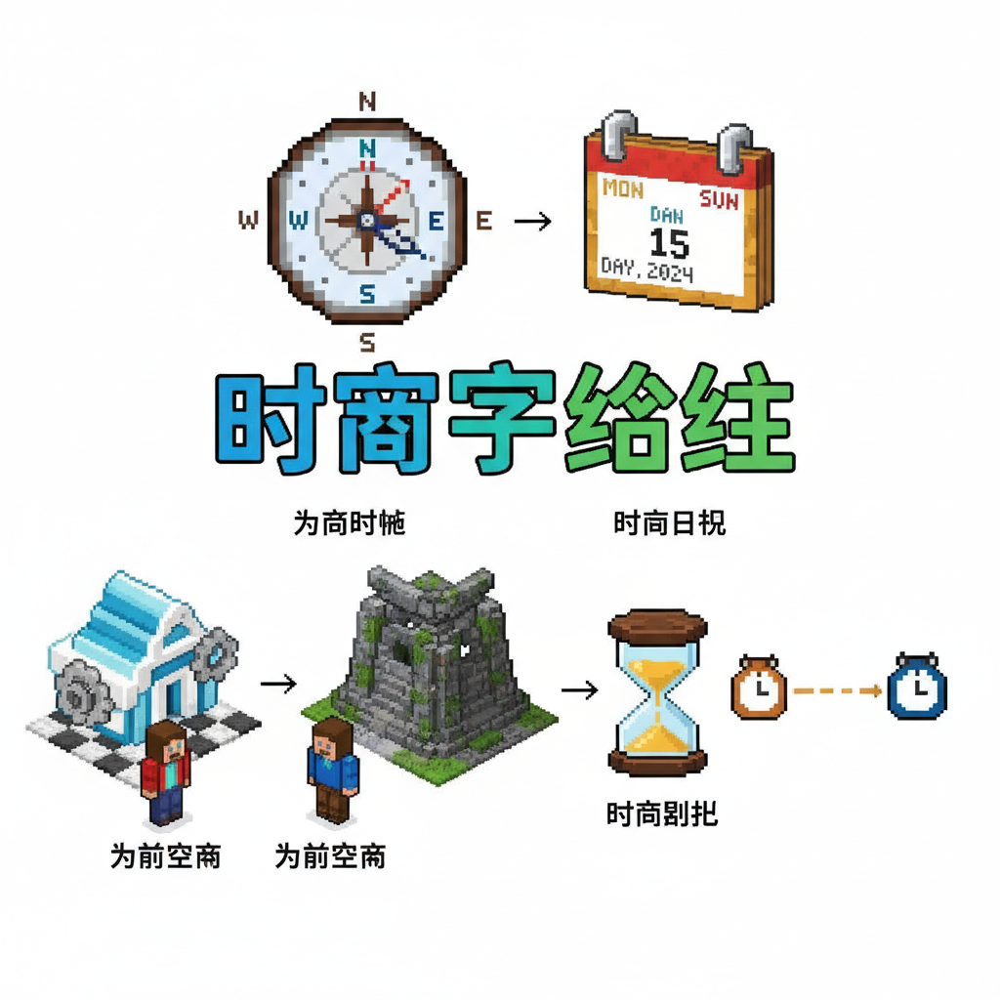

# 第17课 拓展篇：时空大冒险

## 📋 学习目标
- 巩固方向字和时间字
- 学习复合时空词（前天/后天/出入/早晚）
- 在场景中运用方向和时间描述

---

## 🎬 第一页：时空旅人

从时空迷宫出来后，Steve和Alex发现自己成了"时空旅人"——

> "现在你们能用方向和时间的字，准确描述任何一件事！"

村庄的长老来求助："我昨天把一本书放在了...什么地方来着？帮我找找！"

```
   🔍 寻书任务：
   
   长老的线索：
   "我今天早上还在看，
    昨天放在沙发前面，
    前天放在书架后面...还是出房间了？"
```

Steve拿起纸笔，画出时空图：

```
   📋 时空推理：
   
   时间     方向     位置
   前天 →   后 →    书架后面 ✗
   昨天 →   前 →    沙发前面 ✗
   今天早 → 出 →    房间外面？
```

> "今天早上在房间外面看见的！"

Alex跑到门外——果然，书在门口的长椅上！

> "时空字帮了大忙——知道什么时候 + 什么方向，就能找到任何东西！"



---

## 🎬 第二页：时间密码

下午，村庄的钟楼敲响了。钟面上刻着一行密码：

> "今早出门，昨晚入门。前天在前，后天在后。"

> "这是一首关于时间和方向的密码诗！破解它就能打开钟楼的密室。"

```
   🔐 时间密码解读：
   
   今早出门 = 今天早上，走出门口
   昨晚入门 = 昨天晚上，走入门口
   前天在前 = 前天在"前方"——已经过去了
   后天在后 = 后天在"后方"——还没到来
```

> "前=过去（前方已过），后=未来（后方待来）。这就是中文里'前'和'后'做时间词的秘密！"

Steve总结："空间上的'前'是你面对的方向；时间上的'前'是已经过去的方向！"

钟楼密室打开了——里面是一部古老的日历，刻着所有的时间字。



---

## 📝 练习

### 一、前和后——空间还是时间？

```
   我在你前面。→ 空间/时间？
   前天是星期一。→ 空间/时间？
   我在你后面排队。→ 空间/时间？
   后天是星期五。→ 空间/时间？
```

### 二、完成时间线

```
   前天的前天 = 大前天
   前天 → 昨天 → ___ → 明天 → ___ → 大后天
```

---

## 📊 拓展小结

- [ ] 前/后在空间和时间上的双重用法
- [ ] 昨天今天明天完整时间线
- [ ] 出入+早晚的日常应用

> **累计识字：115字** ✅

---



---

> 【标A: 语文课标一上·识字与写字·生活情境识字】

### ❌常见误解

| ❌ 错误写法/理解 | ✅ 正确写法/理解 |
|-------|-------|
| "吃"字右边写成"乞" | 吃=口+乞（qǐ），乞=气去掉最后一笔 |
| "身"字少写一横 | 身=7画，第6笔是长横，不能漏 |
| 学了新字忘了旧字 | 每课复习前课字，学过的字要在新情境中用 |
| 只认字不组词 | 每个字至少要会2个词（如：水→河水、水果） |

🧠 想一想
1. **观察推理**："吃、喝、叫、唱"都有"口"字旁。为什么这些字都跟嘴巴有关？你能再找出3个有"口"字旁的字吗？
2. **反事实**：如果所有的字都没有偏旁部首，全都是随机的笔画组合，学汉字会变成什么样？

## 🔗 跨科连接
数学第15课教认识钱币 → 语文教"买、卖、元、角"
英语Lesson 7-9教动物/身体/食物 → 中文对应词同步

