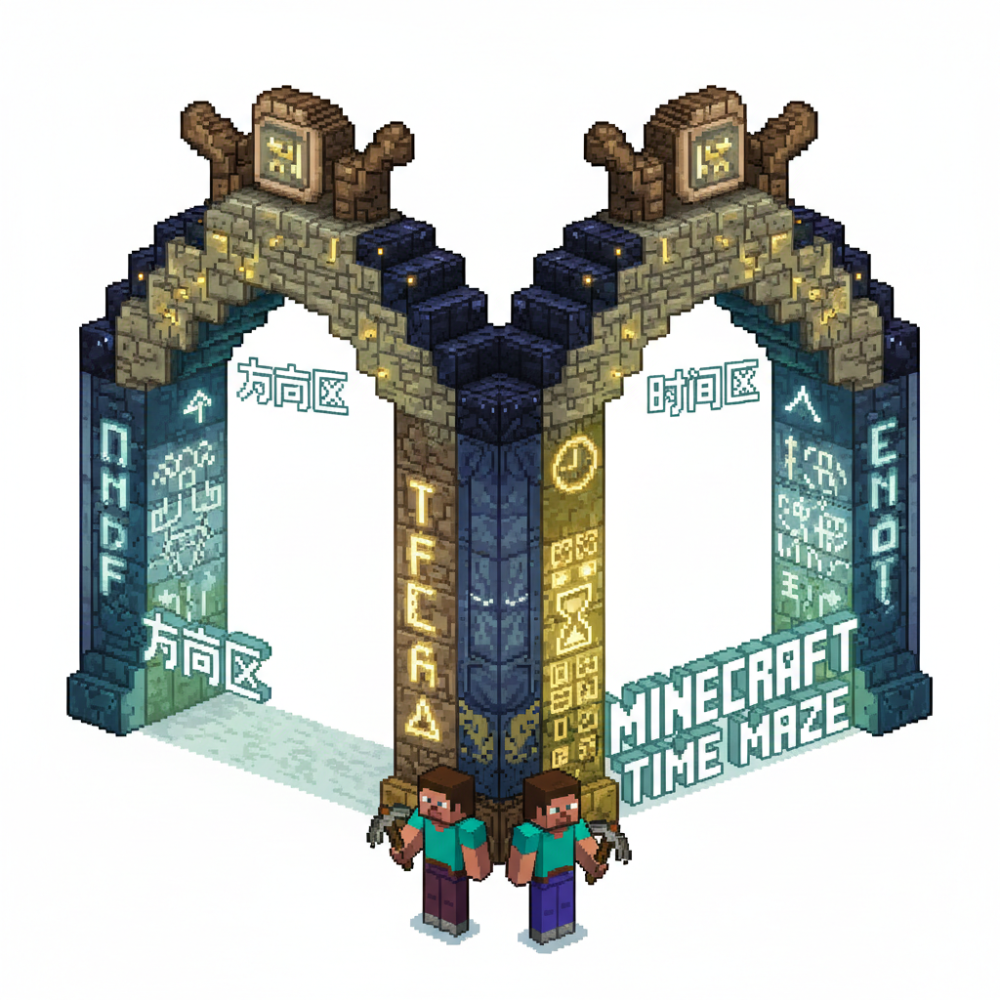
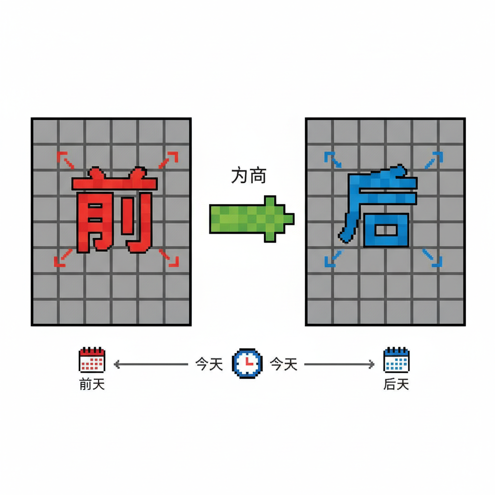
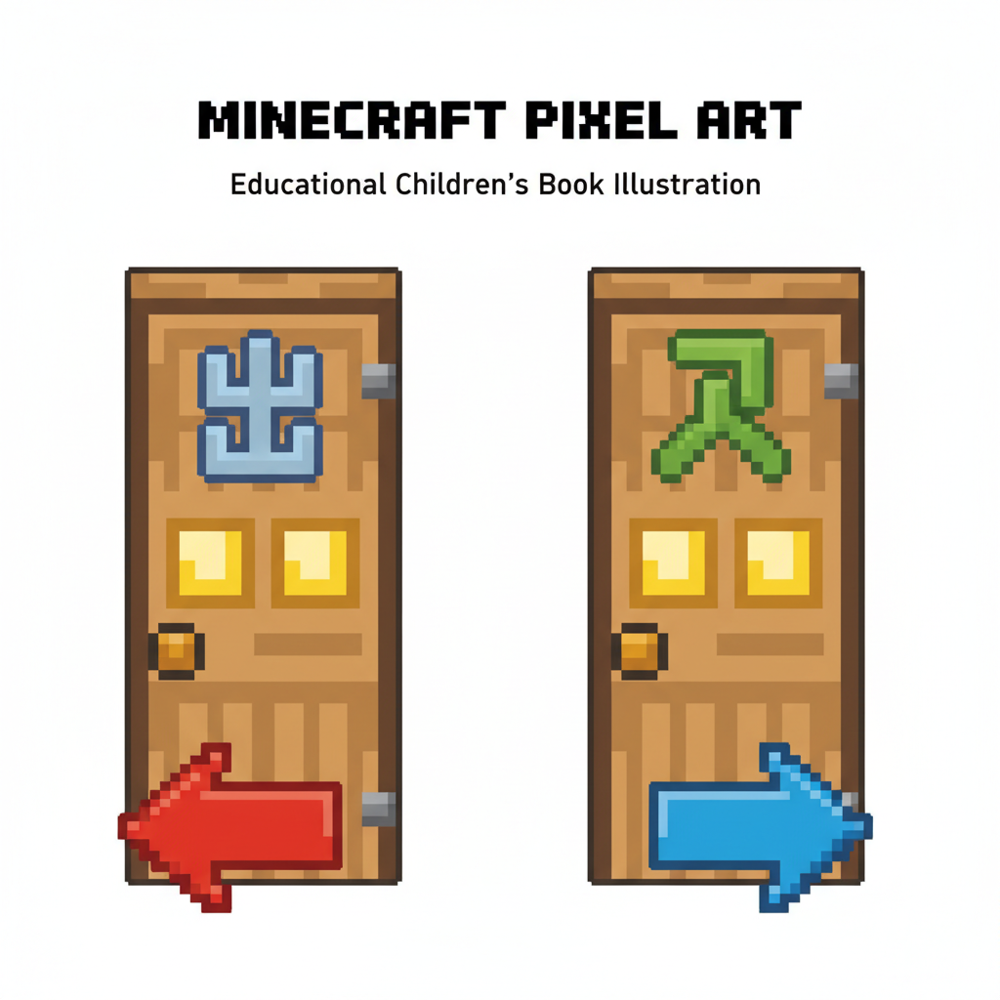
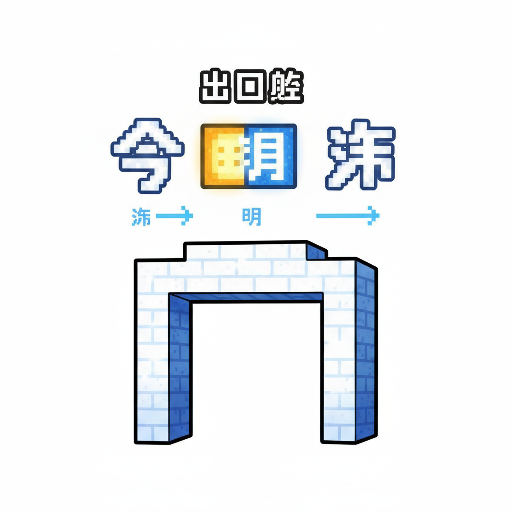
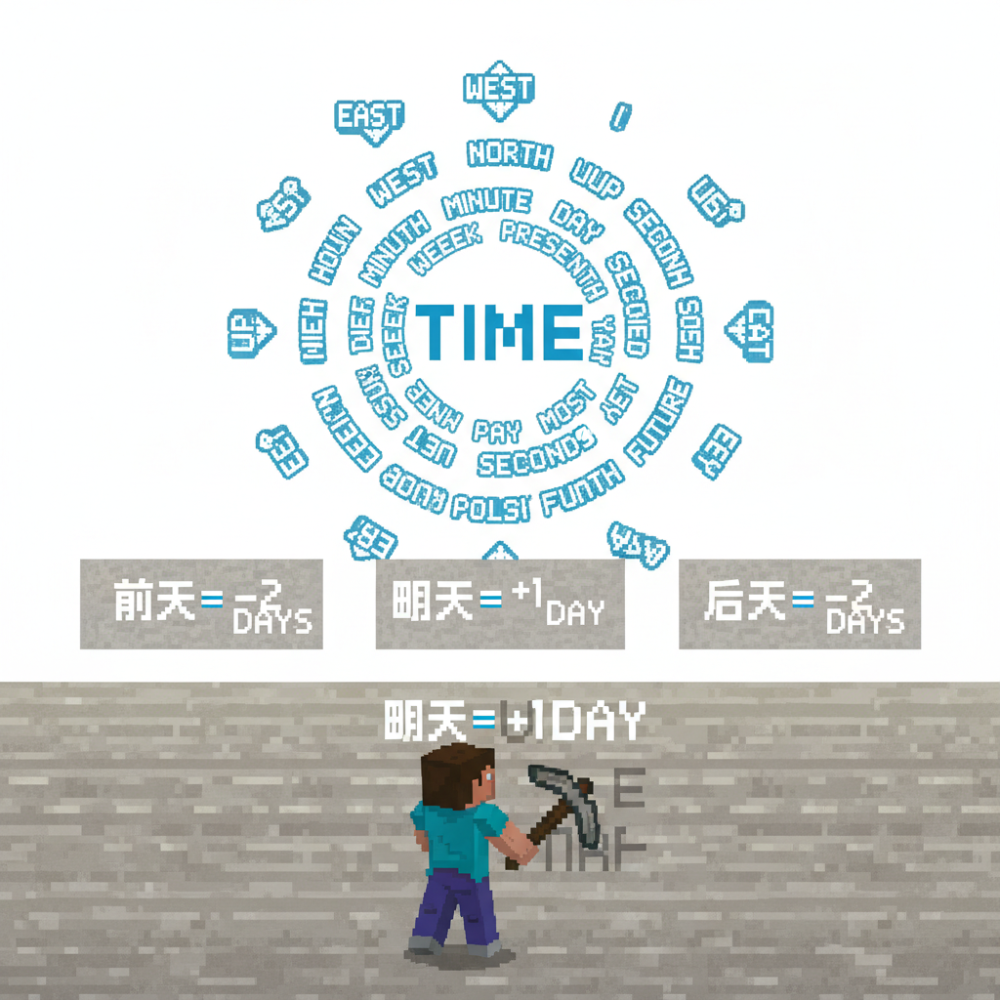
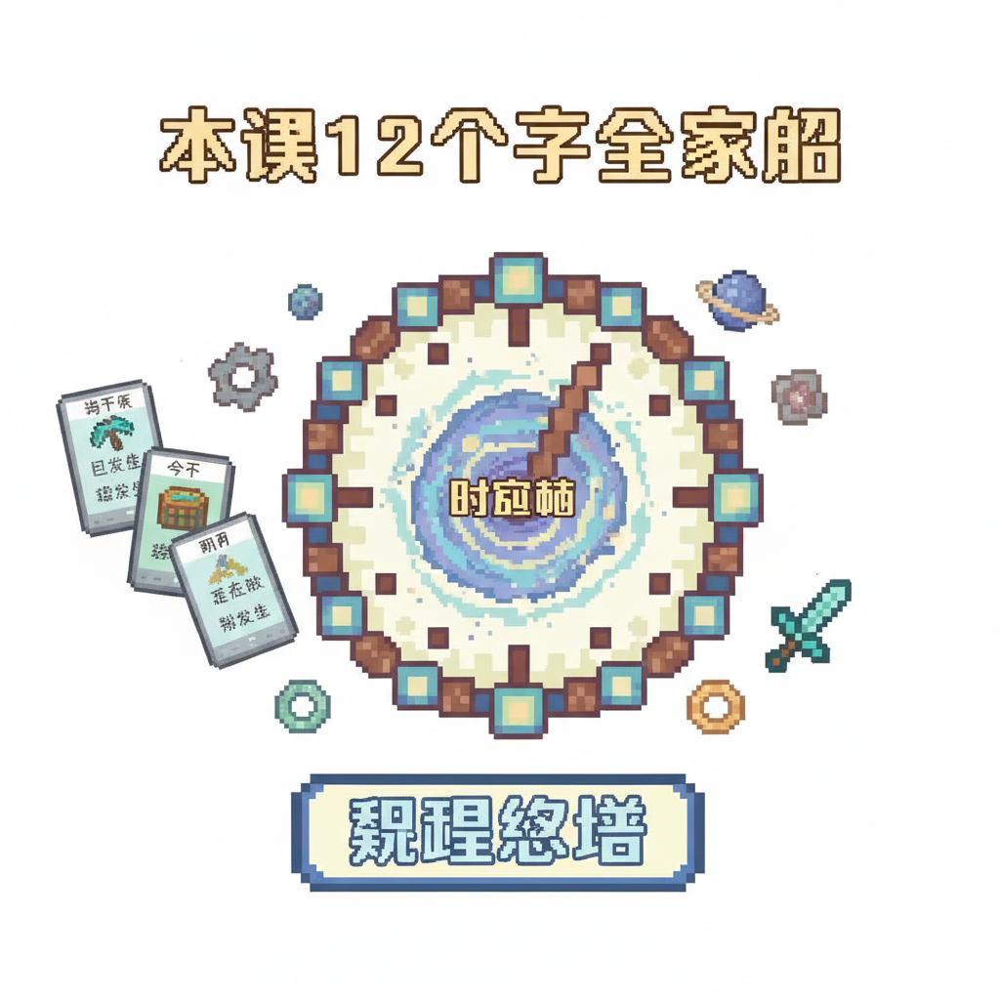

# 第17课 方向与时间

## 📋 学习目标
- 认识方向字：**前 后 出 入**
- 认识时间字：**早 中 晚 今 明 昨**
- 复习来/去做方向对比
- 掌握笔画顺序与拼音标注

**累计识字：115字**（L16: 103字 + 本课: 12字）

---

## 🎬 第一页：时空迷宫

动作城堡的顶层，有一扇隐藏的门。门后面是一个旋转的迷宫——

> "时空迷宫——掌握方向和时间的秘密，才能走出去！"

```
   🌀 时空迷宫
   
   方向区：前 后 出 入 来 去
   时间区：早 中 晚 今 明 昨
```

> "方向字告诉你往哪走，时间字告诉你什么时候走。两者结合——你才不会迷路！"

迷宫墙壁上刻着闪光的字。每走一段路，就要读对墙上的方向或时间字，否则墙会闭合！

Steve和Alex深吸一口气，走进迷宫。



---

## 🎬 第二页：方向区 — 前后

第一段是方向区。两面墙上各有一个大字：

```
   前 [qián] (9画)
   笔画顺序：①丶(点) ②丿(撇) ③一(横) ④丨(竖) ⑤𠃍(横折钩) ⑥一(横) ⑦一(横) ⑧丨(竖) ⑨亅(竖钩)
   记忆口诀：上面"䒑"下面"刂"——前面就是正对面
   组词：前面(qián miàn)、从前(cóng qián)、前天(qián tiān)
   
   后 [hòu] (6画)
   笔画顺序：①丿(撇) ②一(横) ③丨(竖) ④𠃍(横折) ⑤一(横) ⑥丶(点)
   记忆口诀：像一个人回头看的形状
   组词：后面(hòu miàn)、后来(hòu lái)、后天(hòu tiān)
```

> "前是正前方——你要去的方向。后是背对的方向——你来的方向。"

> "有趣的是——'前'和'后'不只是方向，还是时间词！前天 = 昨天的昨天，后天 = 明天的明天！"

Steve向前走一步："前！" 墙壁开了。
Alex向后看一眼："后！" 身后安全。

```
   📖 小词典：
   前 qián — 正前方 / 以前（时间）
   后 hòu — 后方 / 以后（时间）
```



---

## 🎬 第三页：方向区 — 出入

走了一段，前方出现了两扇门——一扇开着，一扇关着。

```
   出 [chū] (5画)
   笔画顺序：①㇗(竖折) ②丨(竖) ③丨(竖) ④㇗(竖折) ⑤丨(竖)
   记忆口诀：两座山叠在一起——从山里走出来！
   组词：出去(chū qù)、出门(chū mén)、日出(rì chū)
   
   入 [rù] (2画)
   笔画顺序：①丿(撇) ②㇏(捺)
   记忆口诀：一撇一捺，往内收——就是"进入"
   组词：进入(jìn rù)、入口(rù kǒu)、出入(chū rù)
```

> "'出'像两座山——从山里走出来！'入'像一扇开着的门——走进去！"

Steve推开写着"出"的门——走出了迷宫的一个区。
然后从"入"走进下一个区。

```
   📖 小词典：
   出 chū — 从内到外
   入 rù — 从外到内
   
   出入 = 出来和进去
```



---

## 🎬 第四页：时间区 — 早中晚

通过方向区后，进入了"时间大厅"。三个巨大的时钟挂在墙上——分别指向不同的时间。

```
   早 [zǎo] (6画)
   笔画顺序：①丨(竖) ②𠃍(横折) ③一(横) ④一(横) ⑤一(横) ⑥丨(竖)
   记忆口诀：太阳(日)刚升起——早上！
   组词：早上(zǎo shang)、早饭(zǎo fàn)、早睡(zǎo shuì)
   
   中 [zhōng] (4画)
   笔画顺序：①丨(竖) ②𠃍(横折) ③一(横) ④丨(竖)
   记忆口诀：一个口加一竖——正中间！
   组词：中午(zhōng wǔ)、中间(zhōng jiān)、心中(xīn zhōng)
   
   晚 [wǎn] (11画)
   笔画顺序：(日+免)
   记忆口诀：太阳(日)落山——晚上
   组词：晚上(wǎn shang)、晚饭(wǎn fàn)、晚安(wǎn ān)
```

> "三个字都跟'日'有关——早上的日刚升起，中午的日在正中（中的就是"正"），晚上的日要落山了。"

```
   📖 小词典：
   早 zǎo — 清晨（日刚出）
   中 zhōng — 正午 / 中间
   晚 wǎn — 天黑（日要落）
```


---

## 🎬 第五页：时间区 — 今明昨

最后一段——三个闪闪发光的字在迷宫出口跳动。

```
   今 [jīn] (4画)
   笔画顺序：①丿(撇) ②㇏(捺) ③丶(点) ④㇇(横撇)
   记忆口诀：像一口钟——"今"就是现在！
   组词：今天(jīn tiān)、今年(jīn nián)、如今(rú jīn)
   
   明 [míng] (8画)
   笔画顺序：①丨(竖) ②𠃍(横折) ③一(横) ④一(横) ⑤丿(撇) ⑥𠃍(横折) ⑦一(横) ⑧一(横)
   记忆口诀：日+月=明！太阳和月亮一起——就是光明、明天！
   组词：明天(míng tiān)、光明(guāng míng)、明白(míng bái)
   
   昨 [zuó] (9画)
   笔画顺序：(日+乍)
   记忆口诀：日字旁——跟时间有关，就是"昨天"
   组词：昨天(zuó tiān)、昨日(zuó rì)
```

> "'明'是最美的汉字之一——左边是太阳，右边是月亮。太阳和月亮都给世界带来光明！"

> "所以'明天'就是下一个有太阳和月亮的日子——充满光明的未来！"

```

---

> 【标A: 语文课标一上·识字与写字·生活情境识字】

### ❌常见误解

| ❌ 错误写法/理解 | ✅ 正确写法/理解 |
|-------|-------|
| "吃"字右边写成"乞" | 吃=口+乞（qǐ），乞=气去掉最后一笔 |
| "身"字少写一横 | 身=7画，第6笔是长横，不能漏 |
| 学了新字忘了旧字 | 每课复习前课字，学过的字要在新情境中用 |
| 只认字不组词 | 每个字至少要会2个词（如：水→河水、水果） |

🧠 想一想
1. **观察推理**："吃、喝、叫、唱"都有"口"字旁。为什么这些字都跟嘴巴有关？你能再找出3个有"口"字旁的字吗？
2. **反事实**：如果所有的字都没有偏旁部首，全都是随机的笔画组合，学汉字会变成什么样？

## 🔗 跨科连接
数学第15课教认识钱币 → 语文教"买、卖、元、角"
英语Lesson 7-9教动物/身体/食物 → 中文对应词同步

📖 小词典：
   今 jīn — 现在，当前
   明 míng — 光明 / 明天（日+月）
   昨 zuó — 昨天，过去的一天
   
   时间线：昨 ← 今 → 明
```



---

## 🎬 第六页：迷宫出口

全部12个字学完——迷宫的墙壁全部开启！

在出口处，Steve和Alex看到了一面巨大的字墙——所有方向和时间字排列成一个时钟：

```
   ⏰ 时空钟 ⏰
   
   方向针：前(12点) 后(6点) 出(3点) 入(9点)
   时间环：早(外环) 中(中环) 晚(内环)
   日历环：昨 今 明（最内层）
```

> "方向和时间的字，一起组成了中国人的时间-空间观！"

> "'前天'、'后天'、'前天'——'前'和'后'跟时间组合，变成了新的时间词！"

Steve在墙上写下：

```
   昨天的昨天 = 前天
   明天 = 明天
   明天的明天 = 后天
   
   前=往前看（空间+时间）
   后=往后看（空间+时间）
```

迷宫外面阳光明媚。Steve和Alex不仅走出来了——他们还获得了最重要的技能：在任何情况下都知道往哪走、什么时候走。



---

## 📝 练习

### 一、方向配对

```
   前 ↔ ___（反方向）
   出 ↔ ___（反方向）
   来 ↔ ___（反方向）
```

### 二、时间线

把下面的时间按从早到晚排序：

```
   晚  早  中
   
   ___ → ___ → ___
```

### 三、天与天

```
   昨天 → ___ → 明天
   前天 → ___ → 明天
   明天 → ___ (后天)
```

### 四、填空

```
   我站在门___面。        (前/后)
   他从门里___来了。       (出/入)
   太阳升起来了，是___上。  (早/晚)
   ___天是星期三。         (今/明)
   ___天星期二已经过了。    (昨/明)
```

---

## 🏆 挑战 — 时空大师

**第一关：画时空钟 🎨**

画出你的时空钟——外圈方向字，内圈时间字：

```
   12点：前    3点：出
   6点：后    9点：入
   
   外环：早→中→晚
   内环：昨→今→明
```

**第二关：时间词语接龙**

```
   前天 → 昨天 → ___ → 明天 → ___
```

---

## 📊 本课小结

方向字（4个）：
- [ ] 前 qián / 后 hòu — 空间+时间
- [ ] 出 chū / 入 rù — 内外

时间字（8个）：
- [ ] 早 zǎo / 中 zhōng / 晚 wǎn — 一日三时
- [ ] 今 jīn / 明 míng（日+月）/ 昨 zuó — 三日线
- [ ] 前天（昨天的昨天）/ 后天（明天的明天）

> **累计识字：115字**

---


