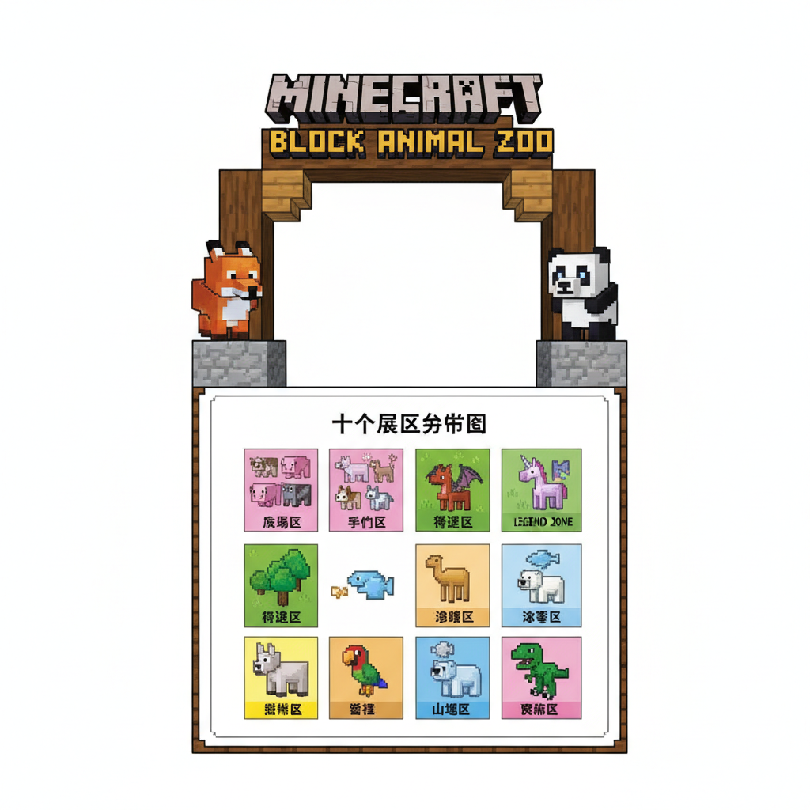
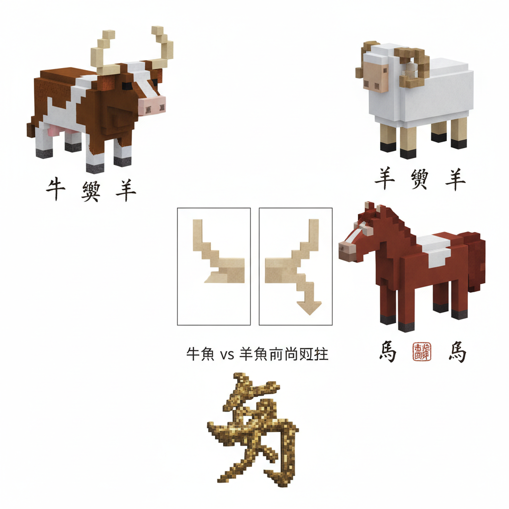
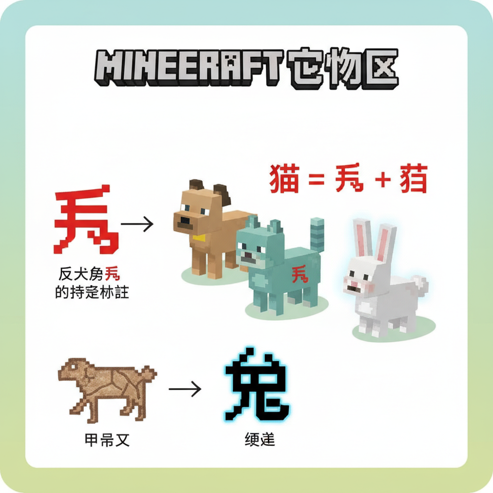
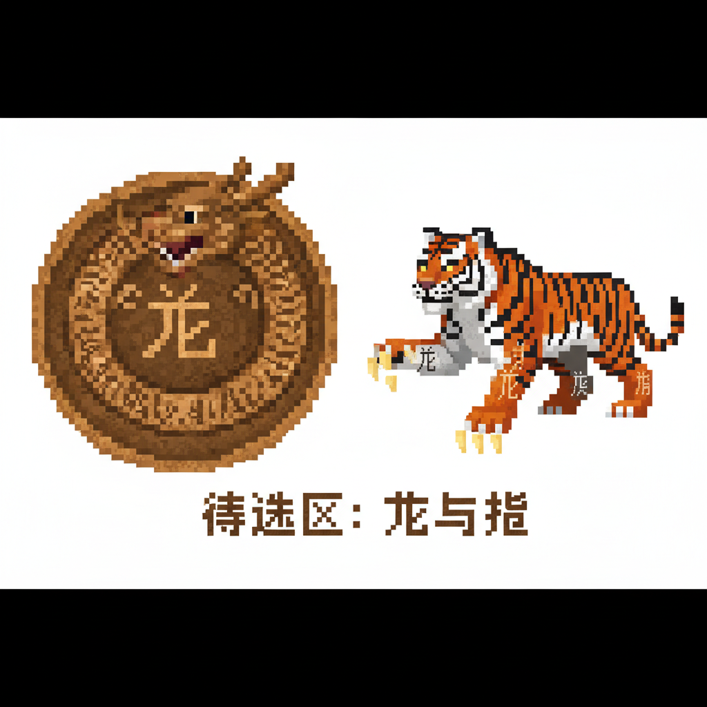
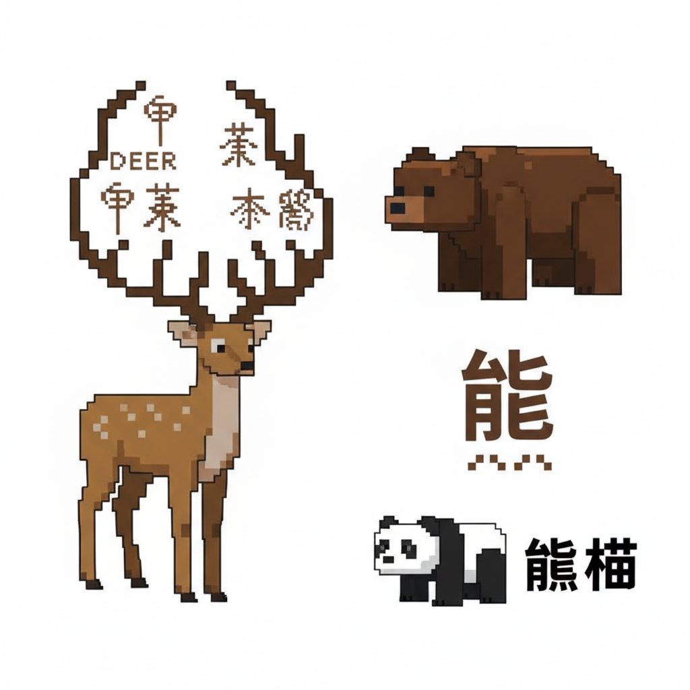
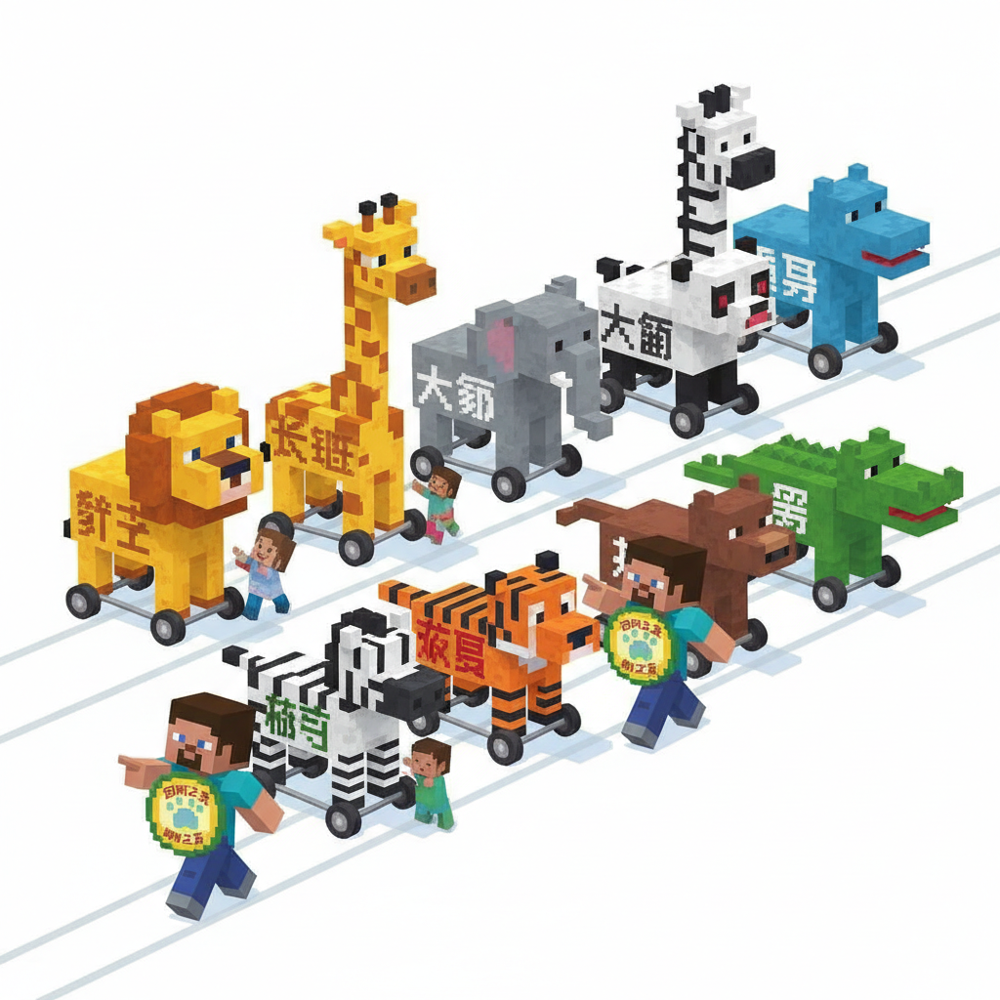
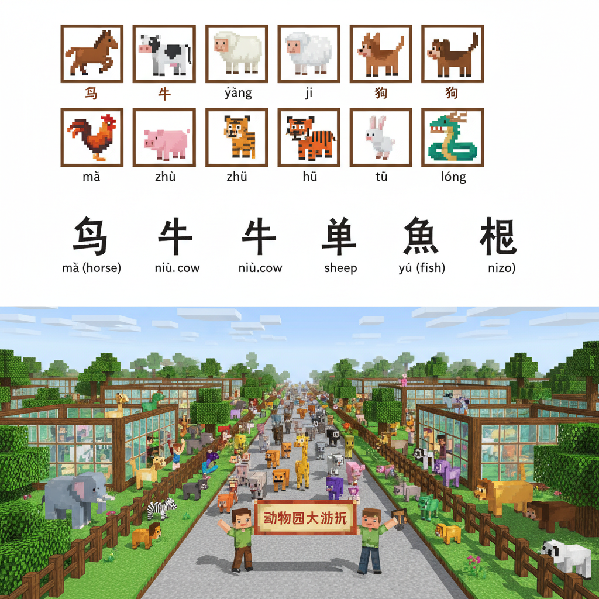
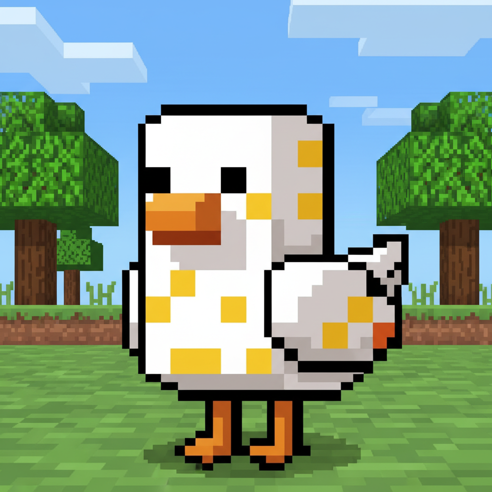
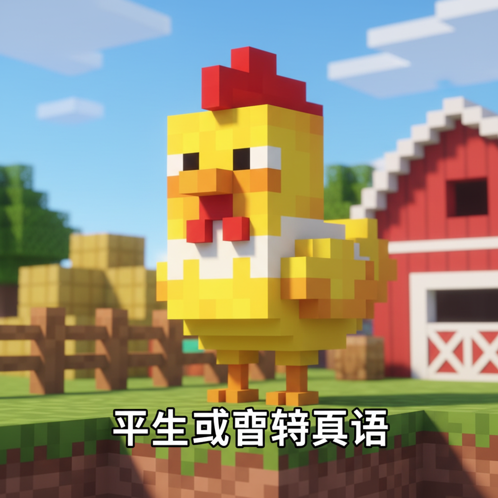

# 第18课 动物世界

## 📋 学习目标
- 认识动物字：**牛 羊 马 狗 猫 兔 龙 虎 鹿 熊**
- 掌握笔画顺序与拼音标注
- 了解动物字的象形来源
- 学会用动物字组词

**累计识字：125字**（L17: 115字 + 本课: 10字）

---

## 🎬 第一页：方块动物园

村庄新建了一座动物园！各种动物住在不同的展区里。

> "方块动物园——每个展区门口写着动物的名字。认对了字才能进！"

```
   🦁 方块动物园 — 十大动物
   
   农场区：牛 🐄  羊 🐑  马 🐴
   宠物区：狗 🐕  猫 🐱  兔 🐰
   传说区：龙 🐉  虎 🐯
   森林区：鹿 🦌  熊 🐻
```

> "一共十个动物字——八个是真实动物，两个是传说中的猛兽！"

Steve拿着门票："十个字，十个展区，一个一个来！"



---

## 🎬 第二页：农场三宝 — 牛羊马

**农场区**——三个最熟悉的动物：

```
   牛 [niú] (4画)
   笔画顺序：①丿(撇) ②一(横) ③一(横) ④丨(竖)
   记忆口诀：像一头牛有两只角
   象形：甲骨文就是牛头——两只角弯弯的
   组词：小牛(xiǎo niú)、牛奶(niú nǎi)、水牛(shuǐ niú)
   
   羊 [yáng] (6画)
   笔画顺序：①丶(点) ②丿(撇) ③一(横) ④一(横) ⑤一(横) ⑥丨(竖)
   记忆口诀：上面两点是羊角，下面三横是羊身
   象形：甲骨文是羊头——角向后弯
   组词：小羊(xiǎo yáng)、山羊(shān yáng)、羊毛(yáng máo)
   
   马 [mǎ] (3画)
   笔画顺序：①㇉(横折) ②㇙(竖折折钩) ③一(横)
   记忆口诀：像一匹马——头、身体、四条腿+尾巴
   象形：甲骨文就是一匹奔跑的马
   组词：小马(xiǎo mǎ)、马上(mǎ shàng)、马路(mǎ lù)
```

> "牛、羊、马——三个最古老的汉字，都是象形字！牛角朝前弯，羊角朝后弯，马有鬃毛长尾。"

Steve摸着牛的雕像："两个角朝前——牛！"
Alex看着羊："两个角朝后——羊！"

```
   📖 小词典：
   牛 niú — 角朝前弯
   羊 yáng — 角朝后弯
   马 mǎ — 奔跑的骏马
```



---

## 🎬 第三页：宠物三小只 — 狗猫兔

**宠物区**——Steve和Alex在村里常常见到的小动物。

```
   狗 [gǒu] (8画)
   笔画顺序：(犭+句)
   记忆口诀：反犬旁(犭)——跟动物有关
   组词：小狗(xiǎo gǒu)、狗叫(gǒu jiào)
   
   猫 [māo] (11画)
   笔画顺序：(犭+苗)
   记忆口诀：反犬旁(犭)加"苗"——叫声像"苗"的动物
   组词：小猫(xiǎo māo)、猫叫(māo jiào)、花猫(huā māo)
   
   兔 [tù] (8画)
   笔画顺序：①丿(撇) ②㇇(横撇) ③丨(竖) ④𠃍(横折) ⑤一(横) ⑥丿(撇) ⑦乚(竖弯钩) ⑧丶(点)
   记忆口诀：上面是"⺈"（兔头），下面像兔身和短尾
   象形：甲骨文就是一只竖起耳朵的兔子
   组词：小兔(xiǎo tù)、白兔(bái tù)、兔子(tù zi)
```

> "狗和猫都是反犬旁——犭！这个偏旁告诉你：这是动物！"

> "'猫'右边是'苗'——因为猫叫的声音像'苗苗'。"

> "'兔'的头是⺈——长耳朵！"

```
   📖 小词典：
   狗 gǒu — 人类最好的朋友（犭旁）
   猫 māo — 叫声"苗苗"（犭+苗）
   兔 tù — 长耳朵短尾巴
```



---

## 🎬 第四页：传说猛兽 — 龙虎

**传说区**——最神秘的两个动物。

```
   龙 [lóng] (5画)
   笔画顺序：①一(横) ②丿(撇) ③乚(竖弯钩) ④丿(撇) ⑤丶(点)
   记忆口诀：像一条弯曲的龙身
   象形：甲骨文就是一条盘旋的龙
   组词：龙王(lóng wáng)、飞龙(fēi lóng)、水龙(shuǐ lóng)
   
   虎 [hǔ] (8画)
   笔画顺序：①丨(竖) ②一(横) ③㇅(横钩) ④丿(撇) ⑤一(横) ⑥乚(竖弯钩) ⑦丿(撇) ⑧乚(竖弯钩)
   记忆口诀：上面是"虎头"，下面是"几"（虎身条纹）
   象形：甲骨文画出了老虎的花纹和利爪
   组词：老虎(lǎo hǔ)、虎穴(hǔ xué)、虎爪(hǔ zhuǎ)
```

> "'龙'只有五画——但它是中国文化里最重要的动物。中国人自称'龙的传人'！"

> "'虎'——森林之王！头上的花纹、锋利的爪子，都写在字里。"

```
   📖 小词典：
   龙 lóng — 传说中的神兽，中国文化象征
   虎 hǔ — 森林之王，勇猛的象征
```



---

## 🎬 第五页：森林奇兽 — 鹿熊

**森林区**——最后两个动物栖息在密林深处。

```
   鹿 [lù] (11画)
   笔画顺序：(广+比)
   记忆口诀：上面"广"像鹿角，下面"比"像鹿身
   象形：甲骨文就是一只角长身细的鹿
   组词：小鹿(xiǎo lù)、梅花鹿(méi huā lù)、鹿角(lù jiǎo)
   
   熊 [xióng] (14画)
   笔画顺序：(能+灬)
   记忆口诀：上面"能"是熊的形象，下面四点(灬)是熊掌印
   象形：甲骨文展现了熊的壮硕体态
   组词：小熊(xiǎo xióng)、熊猫(xióng māo)、狗熊(gǒu xióng)
```

> "'鹿'最特别的是它的大角——上面的'广'就像展开的鹿角！"

> "'熊'——下面是四个点：火底。表示熊掌又大又厚，像四团火！"

Alex 兴奋地说："熊猫——就是熊+猫！两个动物字放在一起，就变成了一个全新的动物！"

```
   📖 小词典：
   鹿 lù — 美丽的大角动物
   熊 xióng — 壮硕的森林巨人
   
   组合词：熊猫 = 熊 + 猫！
```



---

## 🎬 第六页：动物园大游行

十大动物全部认识后，动物园举行了一场大游行。

所有动物都出动了——但它们是用汉字组成的花车！

```
   🎪 动物园大游行 🎪
   
   🐄 牛花车 → 🐑 羊花车 → 🐴 马花车
   🐕 狗花车 → 🐱 猫花车 → 🐰 兔花车
   🐉 龙花车 → 🐯 虎花车
   🦌 鹿花车 → 🐻 熊花车
```

每个花车上都刻着巨大的动物字。Steve和Alex念着每一个字，跟游行队伍一起穿过村庄。

> "十个动物字——从农场到森林，从宠物到传说！"

```
   🎵 动物儿歌 🎵
   
   牛儿哞哞角朝前，
   羊儿咩咩角后弯。
   马儿奔跑四条腿，
   狗和猫儿在家玩。
   长耳朵兔最可爱，
   神龙飞在云上面。
   老虎一声深林吼，
   鹿儿角长熊样憨。
   十个动物都认全，
   方块世界转一转！
```

游行的终点——动物园门口，Steve和Alex获得"动物之友"勋章。



---

## 📝 练习

### 一、动物分类

```
   农场里养的：___ ___ ___
   家里养的：___ ___ ___
   森林里的：___ ___ ___
   传说中的：___ ___
```

### 二、反犬旁动物

圈出反犬旁(犭)的字：

```
   牛  狗  马  猫  羊  虎  熊
```

### 三、选字填空

```
   我喝___奶。         (牛/羊)
   ___是森林之王。      (虎/龙)
   ___是中国的象征。    (龙/牛)
   ___和___都是宠物。   (狗猫/牛羊)
   我最喜欢的动物是___。
```

### 四、象形字连线

```
   有两只角 ●       ● 马
   有长耳朵 ●       ● 牛
   有四条腿+尾巴 ●   ● 羊
   角朝后弯 ●       ● 兔
```

---

## 🏆 挑战 — 动物大师

**第一关：画动物字 🎨**

选一个你最喜欢的动物，画出它，旁边写出汉字和甲骨文：

```
   [画动物]    汉字：___
               甲骨文样：___
```

---

> 【标A: 语文课标一上·识字与写字·生活情境识字】

### ❌常见误解

| ❌ 错误写法/理解 | ✅ 正确写法/理解 |
|-------|-------|
| "吃"字右边写成"乞" | 吃=口+乞（qǐ），乞=气去掉最后一笔 |
| "身"字少写一横 | 身=7画，第6笔是长横，不能漏 |
| 学了新字忘了旧字 | 每课复习前课字，学过的字要在新情境中用 |
| 只认字不组词 | 每个字至少要会2个词（如：水→河水、水果） |

🧠 想一想
1. **观察推理**："吃、喝、叫、唱"都有"口"字旁。为什么这些字都跟嘴巴有关？你能再找出3个有"口"字旁的字吗？
2. **反事实**：如果所有的字都没有偏旁部首，全都是随机的笔画组合，学汉字会变成什么样？

## 🔗 跨科连接
数学第15课教认识钱币 → 语文教"买、卖、元、角"
英语Lesson 7-9教动物/身体/食物 → 中文对应词同步

**第二关：动物成语 📖**

```
   对牛弹琴 — 跟牛弹琴，它听不懂
   画龙点睛 — 画完龙点眼睛，活过来了
   虎头蛇尾 — 开始很大，后面很小
```

---

## 📊 本课小结

新学动物字（10个）：
- [ ] 牛 niú / 羊 yáng / 马 mǎ — 农场三宝
- [ ] 狗 gǒu / 猫 māo / 兔 tù — 宠物三小只
- [ ] 龙 lóng / 虎 hǔ — 传说猛兽
- [ ] 鹿 lù / 熊 xióng — 森林奇兽

> **累计识字：125字** ✅ Phase 3 完成！

---




---

## 📜 古诗角 — 《画鸡》

> **明·唐寅** · 大公鸡红冠白羽，一声啼叫千家万户的门都打开了。

```
头上红冠不用戴
满身雪白走将来
平生不敢轻言语
一叫千门万户开
```

逐句赏诗：
头上红冠不用戴 — 头上红冠不用戴


满身雪白走将来 — 满身雪白走将来



平生不敢轻言语 — 平生不敢轻言语



一叫千门万户开 — 一叫千门万户开


