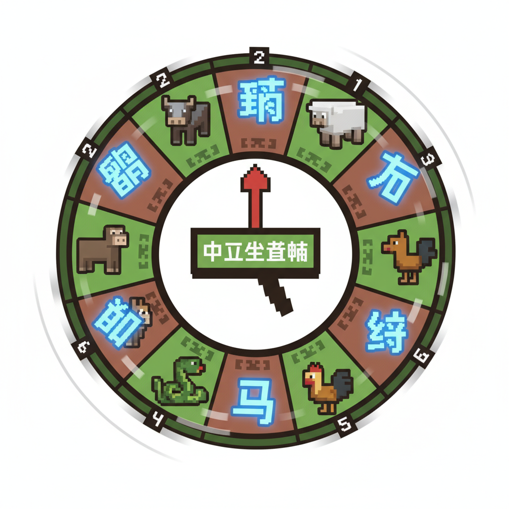
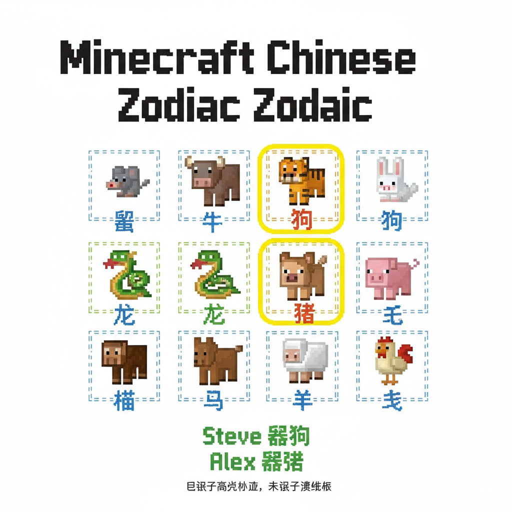
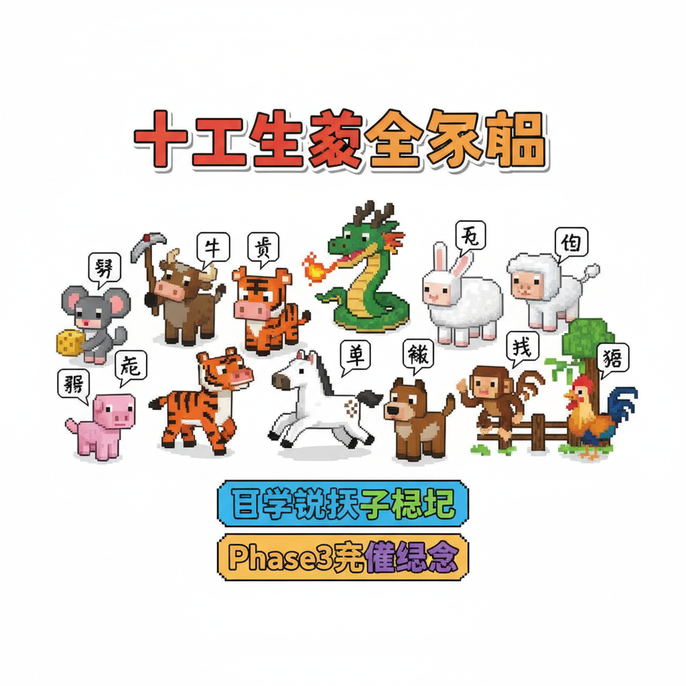

# 第18课 拓展篇：十二生肖

## 📋 学习目标
- 巩固动物字
- 认识十二生肖
- 了解中华生肖文化

---

## 🎬 第一页：生肖钟

动物园大游行结束后，门口出现了一个巨大的圆盘——十二生肖钟。

```
   🕐 十二生肖钟
   
   鼠 🐭  牛 🐄  虎 🐯  兔 🐰
   龙 🐉  蛇 🐍  马 🐴  羊 🐑
   猴 🐒  鸡 🐔  狗 🐕  猪 🐷
```

> "十二生肖里，有五个我们已经学过——牛、虎、兔、龙、马、羊、狗！"

> "剩下的：鼠、蛇、猴、鸡、猪——可以留到以后学。"

``` 
   已学（5/12）：牛 虎 兔 龙 马 羊 狗（7个！）
```

Steve 数了数："十二个生肖动物——我们已经认识了七个！"

> "十二生肖十二年一轮。你属什么，取决于你出生的年份！"

Alex 看着生肖钟："所以我属什么动物呢？"



---

## 🎬 第二页：我的生肖

> "每个人都有一个生肖——那是你出生年份的动物！"

```
   🎂 生肖推算（简表）：
   
   2020 — 鼠 🐭
   2021 — 牛 🐄（学过了！）
   2022 — 虎 🐯（学过了！）
   2023 — 兔 🐰（学过了！）
   2024 — 龙 🐉（学过了！）
   2025 — 蛇 🐍
   2026 — 马 🐴（学过了！）
```

Steve 说："我是 2018 年——狗！我属狗！"

Alex 说："我是 2019 年——猪！我没学过猪字..."

> "没关系——你已经认识了十二生肖里的七个字，已经很厉害了！"



---

## 📝 练习

### 一、已学生肖

圈出你已经学会的生肖字：

```
   鼠 牛 虎 兔 龙 蛇 马 羊 猴 鸡 狗 猪
```

### 二、我的生肖

```
   我出生在 ___ 年。
   我的生肖是 ___。
```

---

## 📊 拓展小结

> Phase 3 全部完成！
> 累计识字：125字（L1-L18全部56+9+14+9+14+12+10+新学=125）



---

> 【标A: 语文课标一上·识字与写字·生活情境识字】

### ❌常见误解

| ❌ 错误写法/理解 | ✅ 正确写法/理解 |
|-------|-------|
| "吃"字右边写成"乞" | 吃=口+乞（qǐ），乞=气去掉最后一笔 |
| "身"字少写一横 | 身=7画，第6笔是长横，不能漏 |
| 学了新字忘了旧字 | 每课复习前课字，学过的字要在新情境中用 |
| 只认字不组词 | 每个字至少要会2个词（如：水→河水、水果） |

🧠 想一想
1. **观察推理**："吃、喝、叫、唱"都有"口"字旁。为什么这些字都跟嘴巴有关？你能再找出3个有"口"字旁的字吗？
2. **反事实**：如果所有的字都没有偏旁部首，全都是随机的笔画组合，学汉字会变成什么样？

## 🔗 跨科连接
数学第15课教认识钱币 → 语文教"买、卖、元、角"
英语Lesson 7-9教动物/身体/食物 → 中文对应词同步

