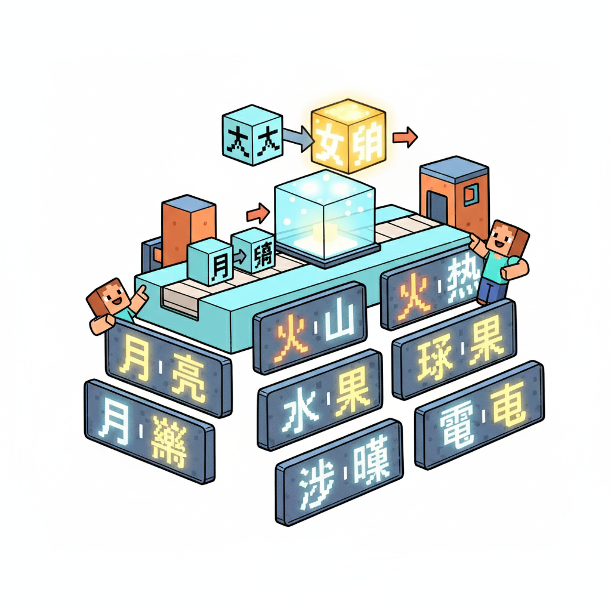
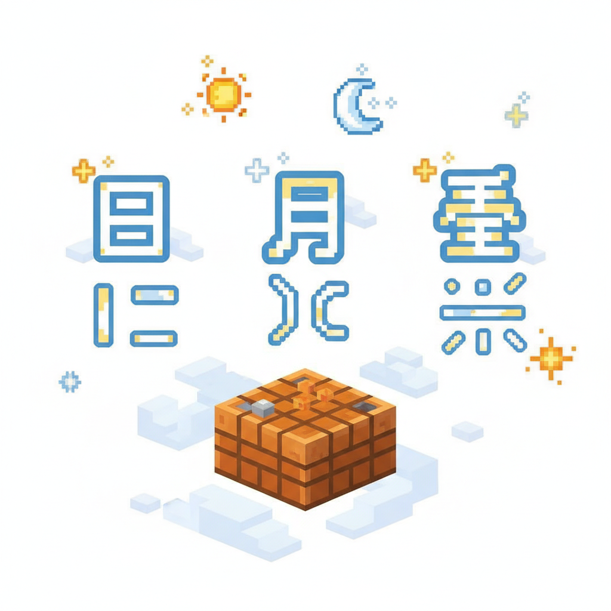
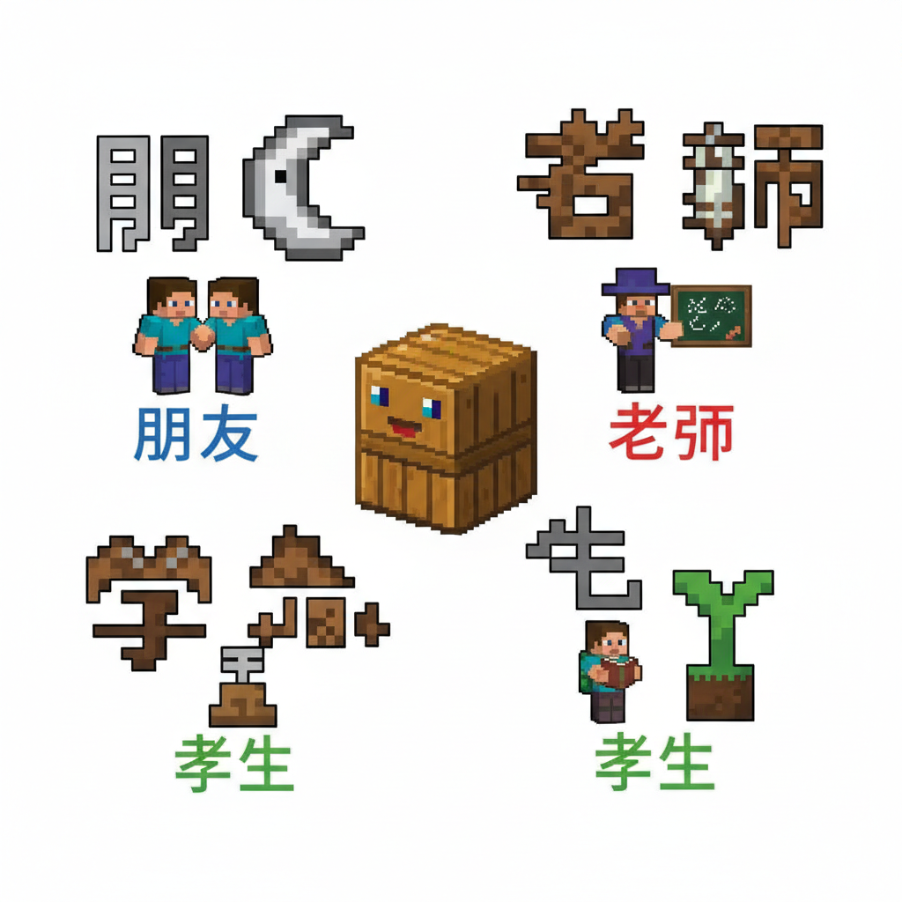
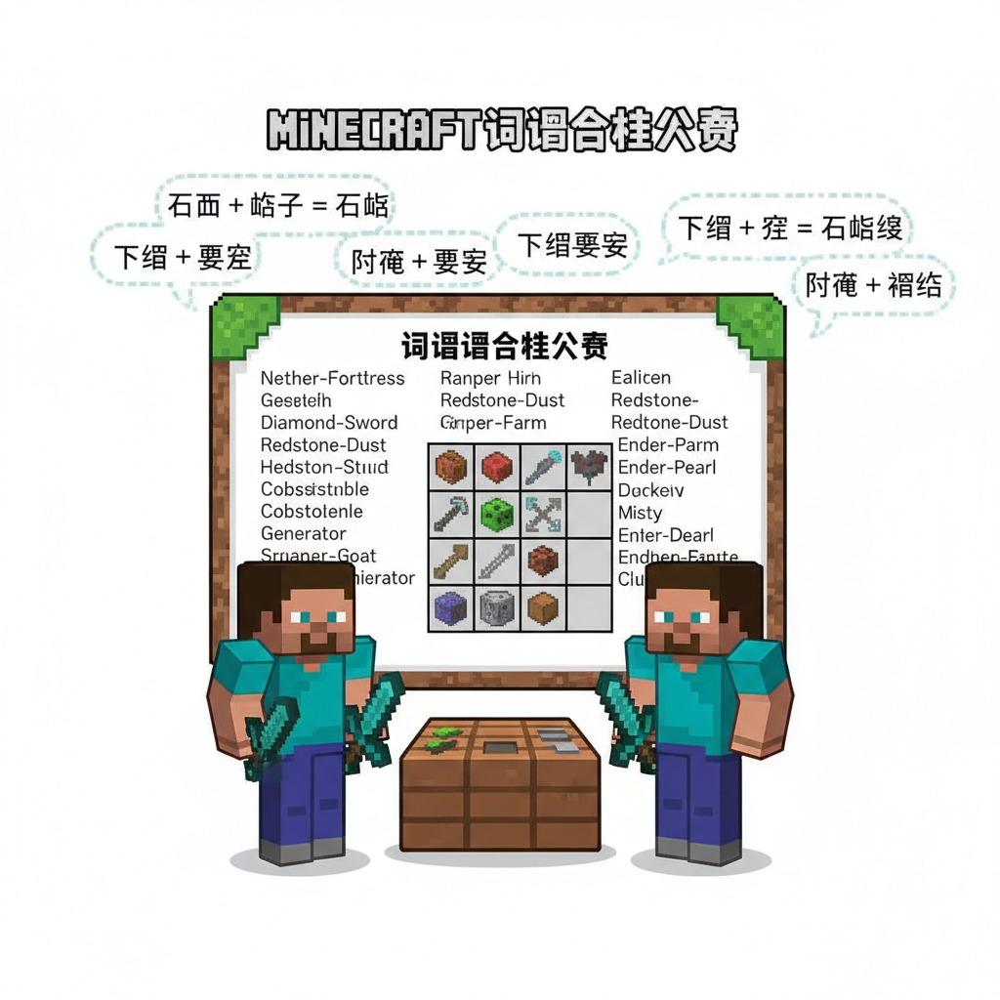
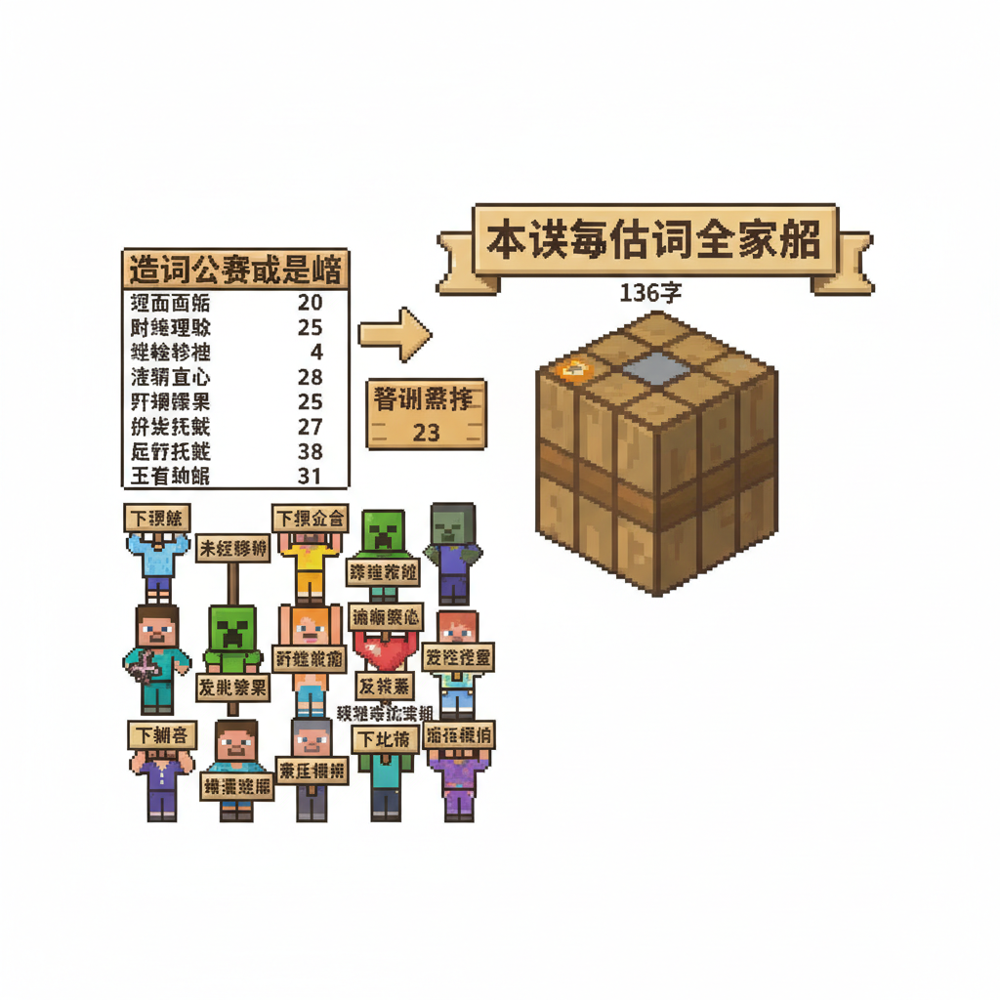

# 第19课 复合词的秘密

## 📋 学习目标
- 认识复合词：**太 阳 月 亮 星 朋 友 老 师 学 生**
- 理解复合词的构造——两个字拼在一起产生新意思
- 掌握笔画顺序与拼音标注

**累计识字：136字**（L18: 125字 + 本课: 11字）

---

## 🎬 第一页：词语合成台

Steve和Alex在村庄图书馆发现了一台奇怪的机器——"词语合成台"。

机器的说明书上写着：

> "把两个汉字放进去——合成一个全新的词语！这就是中文的神奇力量——复合词。"

```
   🧩 词语合成台 — 复合词原理
   
   太 + 阳 = 太阳（the sun）
   月 + 亮 = 月亮（the moon）
   星 + 星 = 星星（stars）
   朋 + 友 = 朋友（friend）
   老 + 师 = 老师（teacher）
   学 + 生 = 学生（student）
```

> "每个汉字都有自己的意思。两个拼在一起，新意思往往不是简单相加——而是一个全新的概念！"

Steve把一个"太"字和一个"阳"字放入机器——哗！合成出了金色的"太阳"！



---

## 🎬 第二页：天上的复合词 — 太阳 月亮 星星

**合成台 — 天空组**：

```
   太 [tài] (4画)
   笔画顺序：①一(横) ②丿(撇) ③㇏(捺) ④丶(点)
   记忆口诀：大字加一点——太大了！
   意思：很大、非常、极
   组词：太阳(tài yáng)、太大(tài dà)
   
   阳 [yáng] (6画)
   笔画顺序：(阝+日)
   记忆口诀：耳朵旁(阝)+日——太阳就是最阳的光
   意思：太阳、阳光、正面
   组词：太阳(tài yáng)、阳光(yáng guāng)、阳台(yáng tái)
```

> "太 + 阳 = 太阳！'太'表示极、很，'阳'表示光明的——合起来就是'最光明的那个'——太阳！"

```
   月 [yuè] (4画)
   笔画顺序：①丿(撇) ②𠃍(横折钩) ③一(横) ④一(横)
   意思：月亮、月份
   
   亮 [liàng] (9画)
   笔画顺序：①丶(点) ②一(横) ③丨(竖) ④𠃍(横折) ⑤一(横) ⑥丶(点) ⑦一(横) ⑧丿(撇) ⑨乚(竖弯钩)
   意思：明亮、发光
   
   月 + 亮 = 月亮！发光的月亮！
```

```
   星 [xīng] (9画)
   笔画顺序：(日+生)
   记忆口诀：日字头——天上的光点
   意思：星星
   
   星 + 星 = 星星！一颗又一颗，满天都是！
```

```
   📖 天空复合词：
   太阳 = 太(极) + 阳(光) → 最亮的那颗
   月亮 = 月 + 亮(发光) → 发光的月亮
   星星 = 星 + 星(重复) → 一颗一颗
```



---

## 🎬 第三页：身边的复合词 — 朋友 老师 学生

**合成台 — 人物组**：

```
   朋 [péng] (8画)
   笔画顺序：(两个月！)
   记忆口诀：两个月字并排——好朋友肩并肩
   意思：朋友
   
   友 [yǒu] (4画)
   笔画顺序：①一(横) ②丿(撇) ③㇏(捺) ④丶(点)
   意思：朋友、友好
   
   朋 + 友 = 朋友！两个月并肩，加上友爱——就是好朋友！
```

> "看——'朋'本身就是两个月字并排！两个月亮靠在一起，就像两个好朋友肩并肩。"

```
   老 [lǎo] (6画)
   笔画顺序：①一(横) ②丨(竖) ③一(横) ④丿(撇) ⑤丿(撇) ⑥乚(竖弯钩)
   意思：年纪大、有经验的
   
   师 [shī] (6画)
   笔画顺序：①丨(竖) ②丿(撇) ③一(横) ④丨(竖) ⑤𠃍(横折) ⑥丨(竖)
   意思：老师、师傅
   
   老 + 师 = 老师！有经验的长者 + 教人的师者 = 老师！
```

```
   学 [xué] (8画)
   笔画顺序：(⺌+子)
   意思：学习
   
   生 [shēng] (5画)
   笔画顺序：①丿(撇) ②一(横) ③一(横) ④丨(竖) ⑤一(横)
   意思：生活、出生、学生
   
   学 + 生 = 学生！学习的人！
```

```

---

> 【标A: 语文课标一上·识字与写字·学习独立识字】

### ❌常见误解

| ❌ 错误理解 | ✅ 正确理解 |
|-------|-------|
| "太阳"拆成"大+阳" | 太阳是"太+阳"——"太"不是"大" |
| 以为"月亮"的"亮"是量词 | "亮"=明亮，不是量词"辆" |
| 随便组合新词（如"大水"=很大的水） | 复合词有固定用法，不能随便拼 |
| 把"学生"写成"生学" | 复合词的字序是固定的：学生≠生学 |

🧠 想一想
1. **观察推理**：为什么"朋友"两个字都带"月"（月字旁）？提示：古代"朋"是两串贝壳
2. **反事实**：如果"老师"不是"老+师"，而是"老+狮"，意思会变成什么？

## 🔗 跨科连接
英语：英语也有复合词——sun+flower=sunflower，rain+bow=rainbow
数学：数字也可以组合（35=30+5，就像"太阳"=太+阳）

📖 人物复合词：
   朋友 = 朋(并肩) + 友(友爱) → 并肩友爱的人
   老师 = 老(有经验的) + 师(教人的) → 有经验的教学者
   学生 = 学(学习) + 生(人) → 学习的人
```



---

## 🎬 第四页：故事时间 — 词语合成大赛

图书馆举行了一场"词语合成大赛"——谁能用学过的字合成最多的新词？

```
   🏆 词语合成大赛规则：
   用已学的125个字，尽可能多地合成新词！
```

Steve和Alex一起开始：

```
   Steve的组合：
   水 + 果 = 水果 ✅
   牛 + 奶 = 牛奶 ✅
   白 + 云 = 白云 ✅
   大 + 山 = 大山 ✅
   小 + 鱼 = 小鱼 ✅
   红 + 花 = 红花 ✅
   开 + 心 = 开心 ✅
   
   Alex的组合：
   天 + 地 = 天地 ✅
   出 + 口 = 出口 ✅
   入 + 口 = 入口 ✅
   手 + 足 = 手足 ✅
   飞 + 龙 = 飞龙 ✅
   白 + 马 = 白马 ✅
   金 + 鱼 = 金鱼 ✅
```

两人一共合成了30多个新词！全场最佳。

> "看到了吗？学会125个字，用复合词的方法，你能表达的远远不止125个意思！"

> "这就是中文的力量——用有限的字，创造无限的可能。"

```
   🎵 复合词儿歌 🎵
   
   太和阳，变成太阳照大地，
   月和亮，变成月亮夜空里。
   朋和友，变成朋友永不分离，
   学和生，变成学生天天学习。
   
   字和字，手拉手，
   新词新意处处有！
```



---

## 📝 练习

### 一、合成分解

```
   太阳 = ___ + ___
   月亮 = ___ + ___
   星星 = ___ + ___
   朋友 = ___ + ___
   老师 = ___ + ___
   学生 = ___ + ___
```

### 二、用已学字合成新词

```
   红 + ___ = 红花
   小 + ___ = 小鱼
   白 + ___ = 白云
   水 + ___ = 水果
   牛 + ___ = 牛奶
   金 + ___ = 金鱼
```

### 三、选字填空

```
   天上有___和___。        (太阳/月亮/星星/朋友)
   我的___叫小明。         (朋友/老师/学生)
   我是___，在学校学习。    (老师/学生/朋友)
```

---

## 🏆 挑战 — 复合词大师

**第一关：合成你的名字**

用你学过的字，能合成什么有趣的词？

```
   例：大 + 山 = 大山（很大的山）
   
   你的合成：___ + ___ = ___
```

**第二关：找复合词 🔍**

在你读过的书里，圈出你能认出的复合词：

```
   我找到的复合词：
   ___ = ___ + ___
   ___ = ___ + ___
```

---

## 📊 本课小结

复合词（11个新字 → 6个复合词）：
- [ ] 太阳 tài yáng — the sun
- [ ] 月亮 yuè liàng — the moon
- [ ] 星星 xīng xing — stars
- [ ] 朋友 péng yǒu — friend
- [ ] 老师 lǎo shī — teacher
- [ ] 学生 xué shēng — student

> **累计识字：136字**

---


