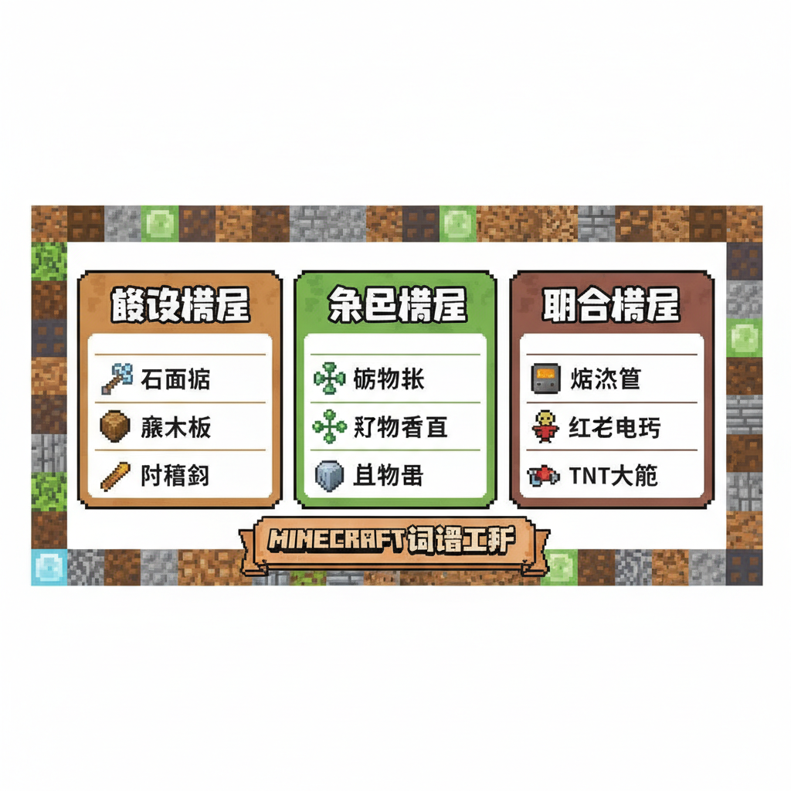
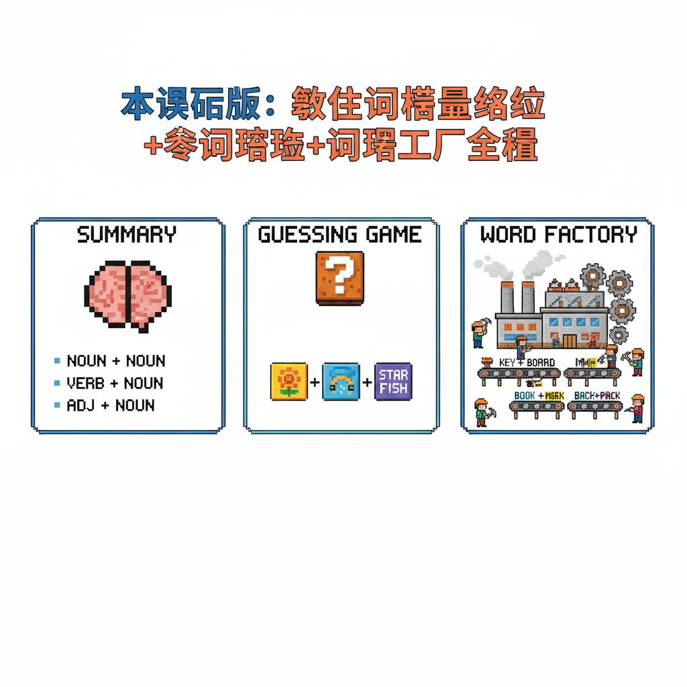

# 第19课 拓展篇：词语工厂

## 📋 学习目标
- 巩固复合词构造法
- 探索更多复合词模式
- 学会"用已知字猜生词"

---

## 🎬 第一页：复合词模式

Steve和Alex发现，复合词有三种基本模式：

```
   🧩 复合词三大模式
   
   ① 描述模式：______ + 的
      太+阳="最光明的那个"→太阳
      白+云="白色的云"→白云
      红+花="红色的花"→红花
   
   ② 类别模式：类别 + 具体
      水+果=水里/树上的果
      牛+奶=牛产的奶
      鱼+肉=鱼的肉
   
   ③ 联合模式：近义字组合
      朋+友=都是同伴的意思
      手+足=手和脚→手足
      出+入=出来和进去→出入
```

> "掌握了这些模式，遇到没见过的复合词，你也能猜出意思！"

Alex 试着解读："风 + 雨 = 风和雨 → 风雨！就是又刮风又下雨！"

Steve 试着："日 + 月 = 日和月 → 日月！就是太阳和月亮——白天和黑夜！"

> "没错！学会复合词的模式，不认识的字你也能读出来！"



---

## 📝 练习

### 一、判断模式

```
   太阳 = ___ 模式（太+阳=最光明的）
   牛奶 = ___ 模式（牛+奶=牛产的奶）
   朋友 = ___ 模式（朋+友=同伴）
```

### 二、猜词游戏

```
   给一个不认识的字 + 一个认识的字 → 猜词！
   
   识 + 字 = ___（认识 + 字 = 认识字）
   写 + 字 = ___（写 + 字 = 写字）
   读 + 书 = ___（读 + 书 = 读书）
```

---


