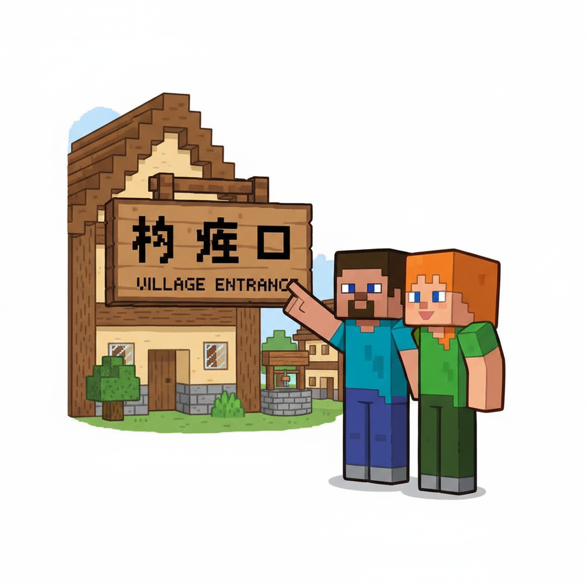
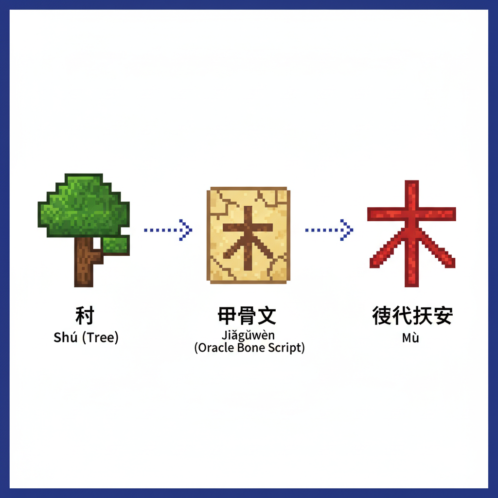
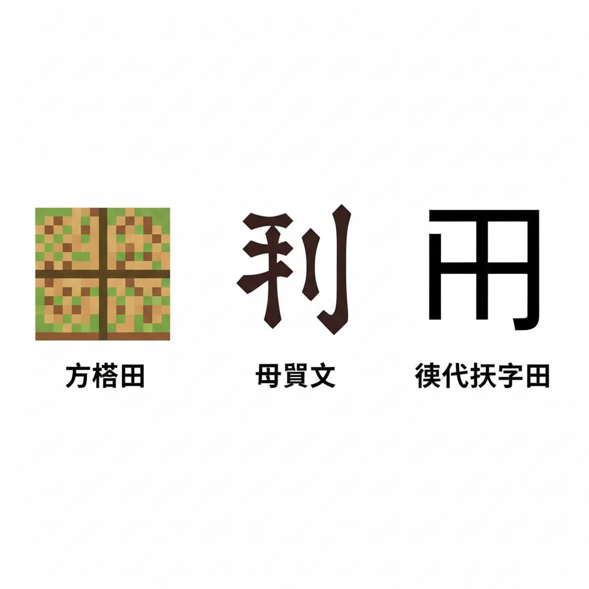
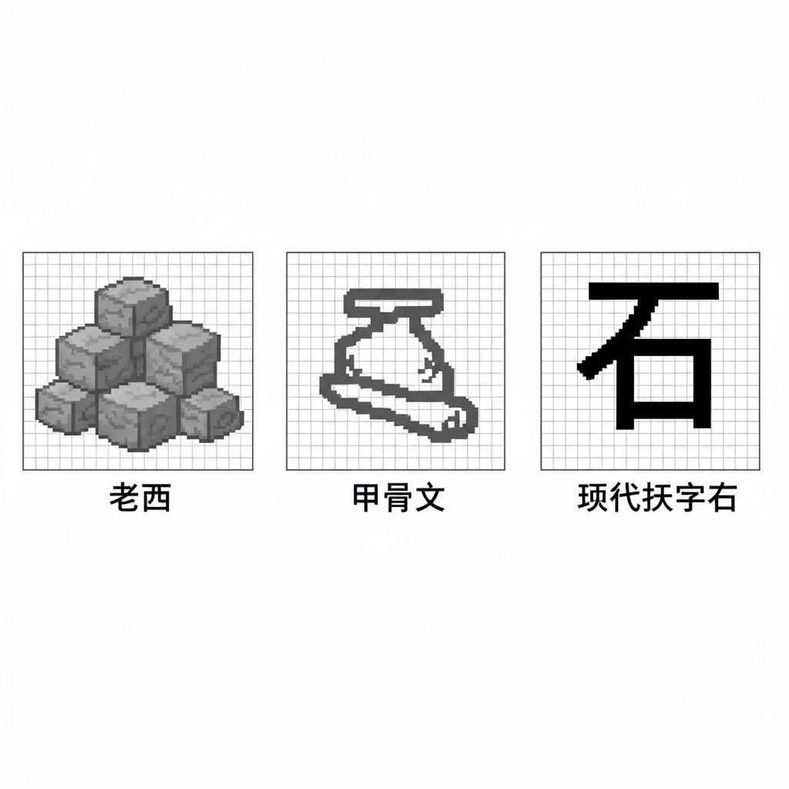
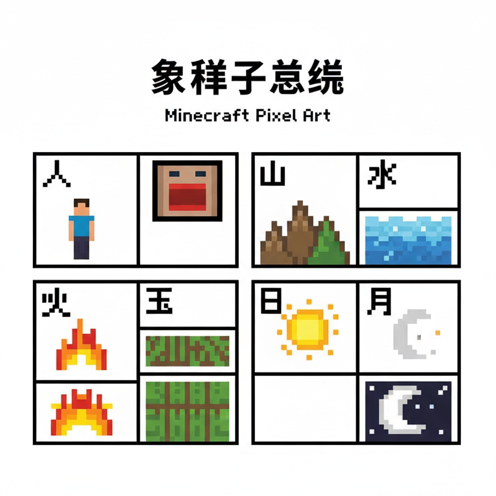
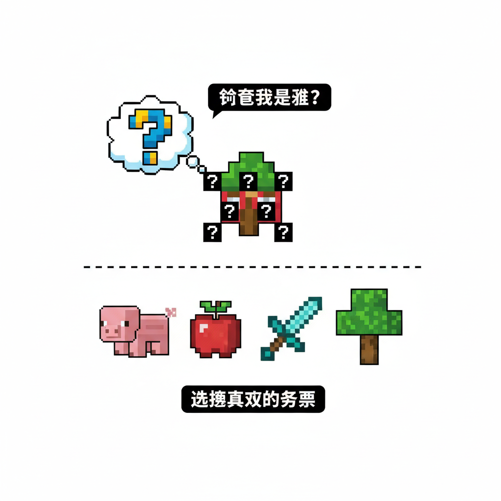
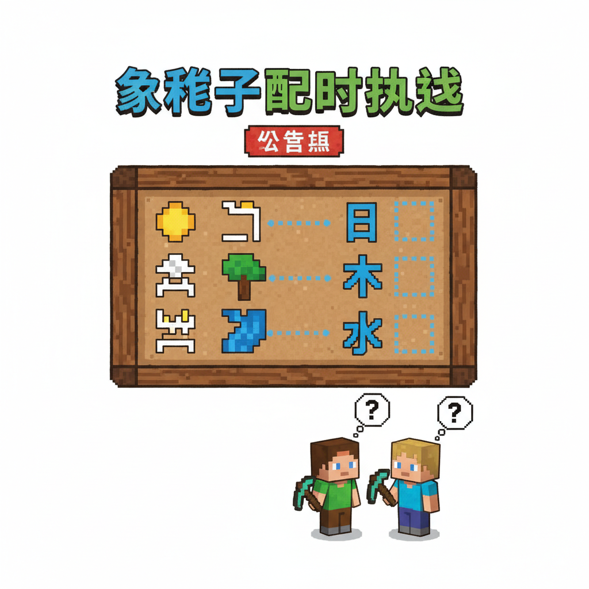

# 第1课 拓展篇 — 汉字大冒险

---

> 【标A: 语文课标一上·识字与写字·认识常用汉字（象形字→楷体）】

### ❌常见误解

| ❌ 错误写法/理解 | ✅ 正确写法/理解 |
|-------|-------|
| "日"写成"目"（中间多一横） | 日=太阳，中间一横，不是两横 |
| "山"写成三竖一样高 | 中间一竖最高，两边的低 |
| "水"的笔画随便写 | 笔顺：竖钩 → 横撇 → 撇 → 捺 |
| 把象形字当画看，不记字形 | 象形字是"从画变来的字"，要记住现在的样子 |

## 🔗 跨科连接
数学第1课教数字1-10 → 语文同步教一二三
英语Lesson 2教ABC字母 → 中英文字对比认知

> 📖 **这是第1课的拓展单元。先完成《神奇汉字》基础篇，再做这里！**

---

## 📋 学习目标
- 巩固 **日、月、山、水、火** 5个象形字
- 新认识 3 个象形字：**木 🌳、田 🌾、石 🪨**
- 学会在游戏中认出汉字

---

## 🤔 第一页：回到村庄

走出山洞后，Steve 和 Alex 来到一个村庄。

村庄的牌子上写着奇怪的符号——但是 Steve 发现：

> "咦！这些符号我认识！"
>
> "那个圆圆的符是 **日**……"
> "那个弯弯的是 **月**……"

Alex 点点头："你的学习能力真强！那村里还有更多的字等你发现呢。"



---

## 🤔 第二页：木 — 大树爷爷

村口有一棵大树，树干上刻着一个字：

> 画一棵大树 🌳 →
> 树根 + 树干 + 树枝 →
> 变成了 **木**

**木** — 一棵大树站地上，枝繁叶茂好乘凉。

"木头的房子、木头的桌子，都是用树做的。"



> 📝 **跟我写**：横 竖 撇 捺
> 一共 **4画**

---

## 🤔 第三页：田 — 稻田方块

村庄旁边是一大片农田，方方正正：

> 画一块方块田地 🌾 →
> 分成四小块 →
> 变成了 **田**

**田** — 方方正正一块地，农民伯伯种粮食。

"你看，田字是不是和 Minecraft 的耕地一样方方正正的？"



> 📝 **跟我写**：竖 横折 横 竖 横
> 一共 **5画**

---

## 🤔 第四页：石 — 石头朋友

路边有一块大石头：

> 画一块大石头 🪨 →
> 下面一个底座 →
> 变成了 **石**

**石** — 山上路边大石头，又硬又重不会动。



> 📝 **跟我写**：横 撇 竖 横折 横
> 一共 **5画**

---

## 👋 第五页：小词典

新学 3 个字 + 复习 5 个字：

| 汉字 | 读音 | 意思 | 记住的技巧 |
|------|------|------|-----------|
| **木** | mù | 树木 | 一棵大树的样子 |
| **田** | tián | 田地 | 方方正正的耕地 |
| **石** | shí | 石头 | 山脚下的大石头 |
| **日** | rì | 太阳 | 复习基础篇 ✅ |
| **月** | yuè | 月亮 | 复习基础篇 ✅ |
| **山** | shān | 大山 | 复习基础篇 ✅ |
| **水** | shuǐ | 流水 | 复习基础篇 ✅ |
| **火** | huǒ | 火焰 | 复习基础篇 ✅ |



---

## ✏️ 第六页：猜字游戏

Steve 在地上画了几个符号，你能猜出它们变成了什么字吗？

### 猜一猜 🤔
```
1. ☀️ + 外框 = ___ ?
2. 🌳 简化为 ___ ?
3. 🌊 中间一条河 = ___ ?
4. 🏔️ 三座山 = ___ ?
5. □ 四小块 = ___ ?
```

### 找相同 🔍
下面哪些字里面**藏着"日"**？圈出来！

```
月  明  木  山  田  星
```

> 💡 小提示：试着想一想，"日"在里面吗？



---

## 🎯 第七页：终极挑战 — 汉字配对

村庄的公告栏上贴着一张任务：

> "把象形图和正确的汉字配对，就能获得村庄的宝箱！"

**配对挑战：**
```
☀️ → ?    🌙 → ?    🏔️ → ?    💧 → ?    🔥 → ?
🌳 → ?    🌾 → ?    🪨 → ?
```

> 全部答对，宝箱打开！里面有 **8 颗绿宝石** 💎



---

## 🎉 第八页：完成挑战！

Steve 成功完成了所有挑战，从宝箱里拿到了 8 颗绿宝石！

> "我学会了 8 个汉字！"
> "不，不只是学会了字，"Alex 说，"你学会了**汉字的秘密**——每一个字都是一幅画。"

> 💎 **获得 8 颗绿宝石 +「象形字大师」徽章！**

---

### ✨ 拓展篇小结
- ✅ **巩固巩固**了 5 个象形字：日月山水火
- ✅ **新学**了 3 个象形字：木田石
- ✅ 我已经认识 **8 个汉字**了！🎉

> ➡️ **准备好了吗？下一课：基本笔画！**
