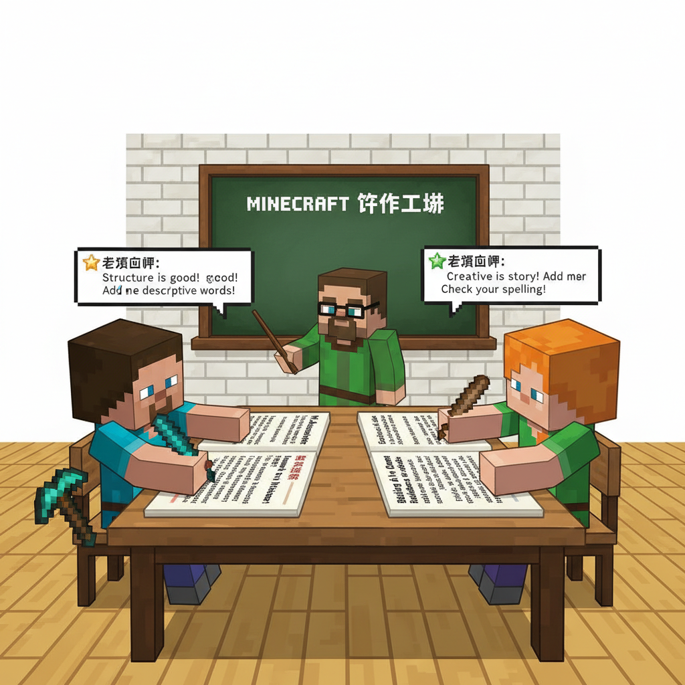
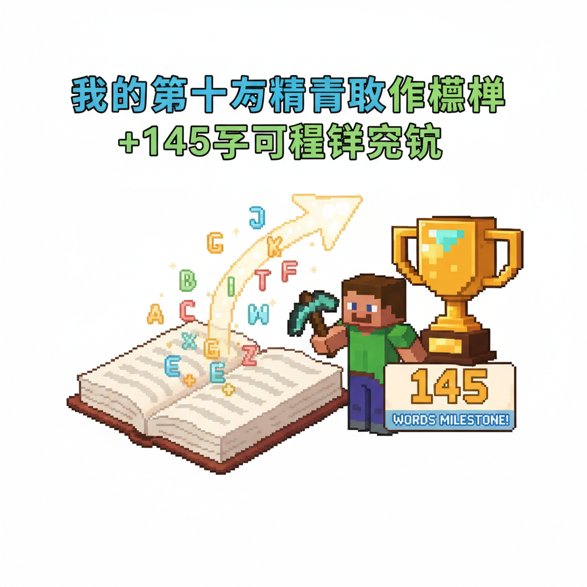

# 第20课 拓展篇：我的第一篇文章

## 📋 学习目标
- 用全部已学字写一篇短文
- 第一次自主写作练习
- 综合运用连接词组织段落

---

## 🎬 第一页：写作工坊

过了句子之桥，Steve和Alex来到"写作工坊"——一个充满了纸笔和想象力的房间。

> "现在你有了145个字和9个连接词——可以写你的第一篇文章了！"

```
   ✏️ 写作三步走：
   
   ① 选题 — 你想写什么？
   ② 造句 — 用连接词把词串起来
   ③ 成文 — 把句子排成一段话
```

Steve选题："我的家"。Alex选题："我的好朋友"。

---

## 🎬 第二页：Steve和Alex的第一篇文章

**Steve的文章：《我的家》**

```
   我的家
   
   我叫Steve。我在家里。我有一个幸福的家。
   爸爸和妈妈很好。我是学生。我在学校学习。
   我很开心。我的朋友也是。
```

**Alex的文章：《我的好朋友》**

```
   我的好朋友
   
   我的好朋友叫Steve。他是学生。我也是学生。
   我们在学校学习。我们很开心。
   他是很好的人。我有这样的朋友，很幸福。
```

> "看——用145个字，我们就能写出完整的文章了！虽然很短，但它完完全全是我们自己写的。"

老师点评：

```
   ⭐ Steve的文章：
   用了：我、在、有、是、的、和、很、也 ✓
   整体通顺，表达完整！优秀！
   
   ⭐ Alex的文章：
   用了：我、是、也、在、的、很 ✓
   表达了友情，感人！优秀！
```



---

## 📝 练习 — 我的第一篇文章

用你学过的字，写一篇关于你自己的小文章（5-8句）：

```
   题目：_______
   
   _________________________________
   _________________________________
   _________________________________
```

**提示**：记得用"我、是、在、有、的、很、和、也"！

---

## 📊 拓展小结

> **里程碑：第一次自主写作！**
> 累计识字：145字 ✅



---

> 【标A: 语文课标一上·阅读·朗读儿歌和浅近古诗】

### ❌常见误解

| ❌ 错误理解 | ✅ 正确理解 |
|-------|-------|
| 古诗就是每个字都认识就行了 | 古诗要感受画面和情感，不只是认字 |
| 反义词就是"反着说" | 反义词是意义相反的词（高↔矮），不是句子反过来 |
| "的、地、得"随便用 | 的+名词（蓝蓝的天）、地+动词（快快地跑）、得+补语（跑得快） |
| 问号(?)和感叹号(!)分不清 | ？=在提问；！=很激动 |

🧠 想一想
1. **观察推理**："床前明月光，疑是地上霜"——诗人为什么觉得月光像霜？他在想什么？
2. **反事实**：如果你要给Steve写一封信介绍中文字，你最先想让他认识哪3个字？为什么？

## 🔗 跨科连接
英语Lesson 19-23教简单故事 → 中英文阅读能力同时发展
数学第23课教应用题 → 语文阅读理解帮助解数学题

