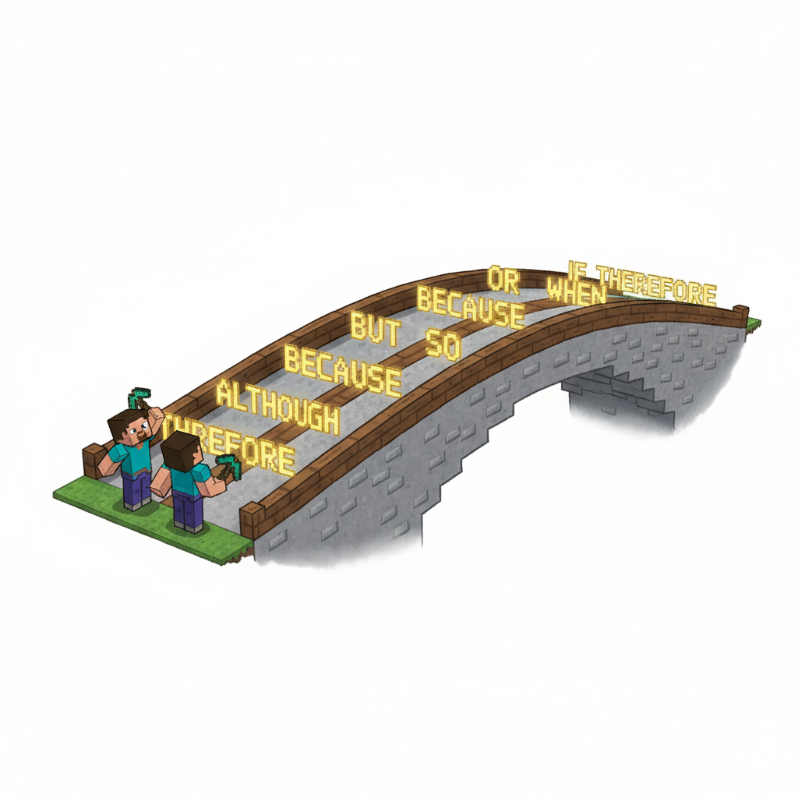
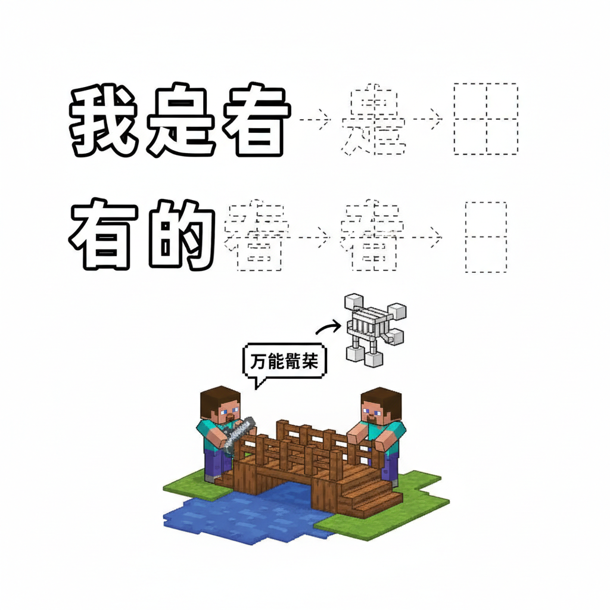
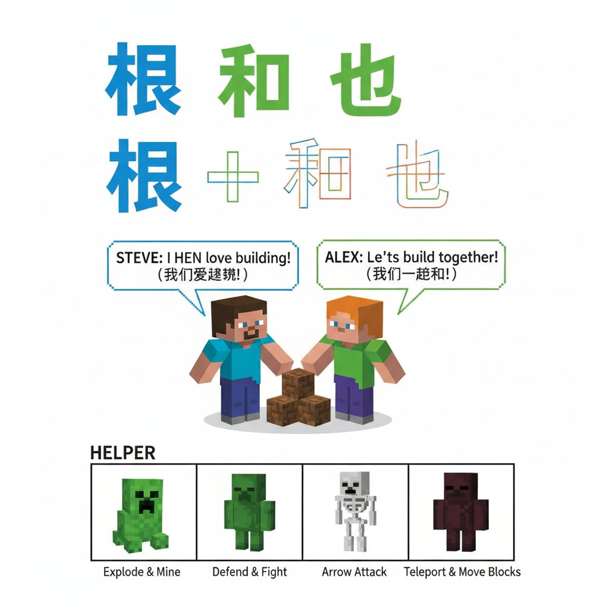
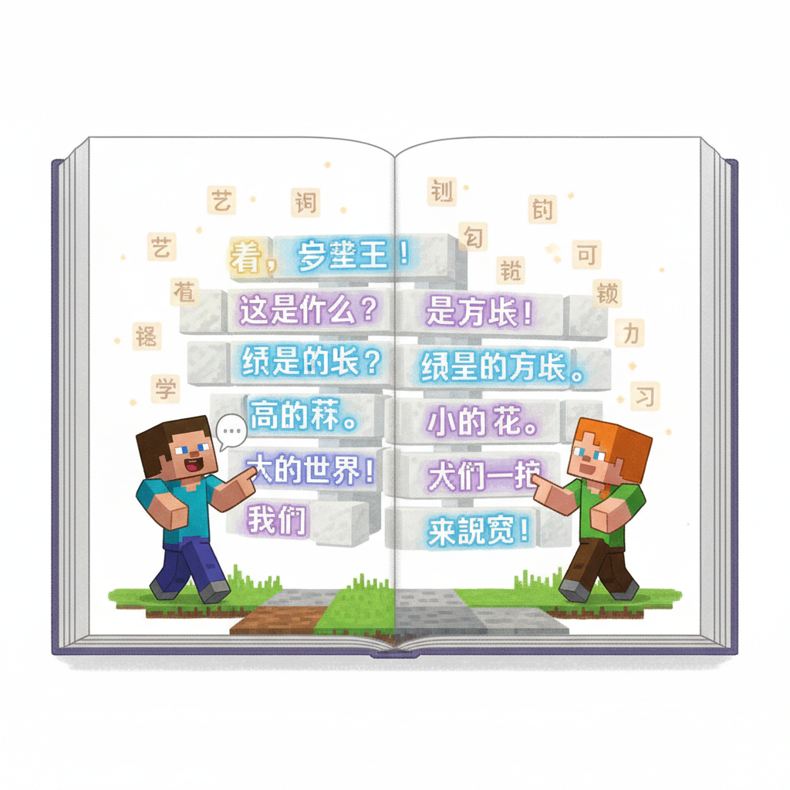
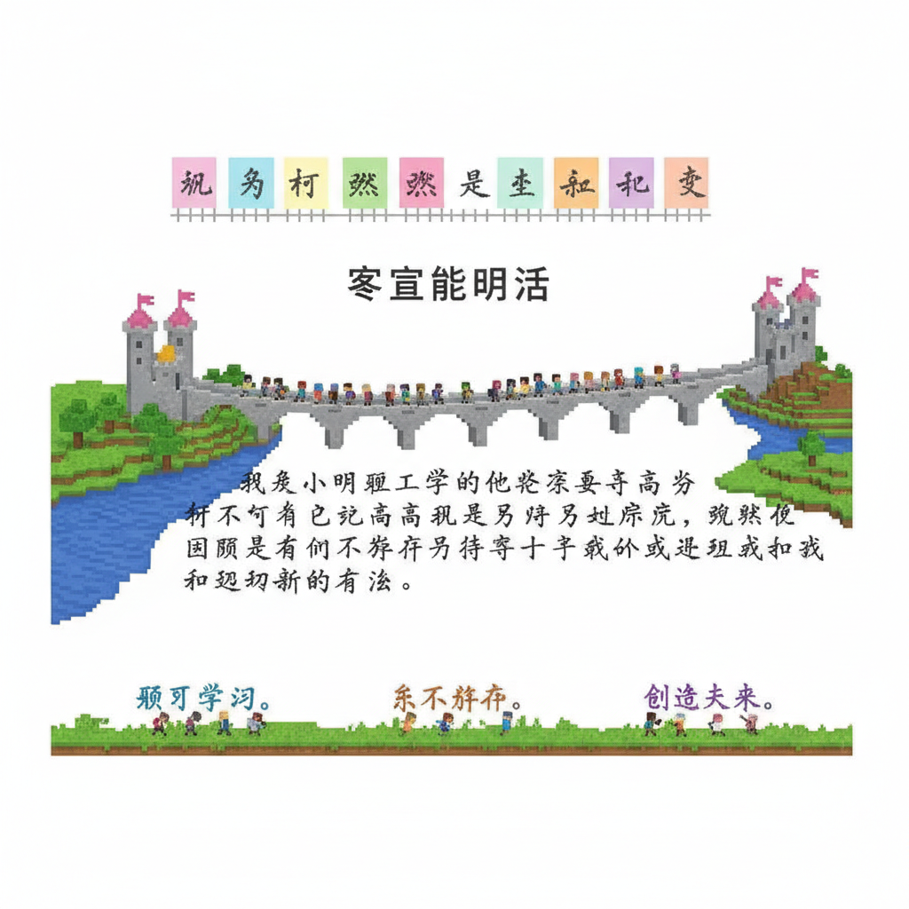

# 第20课 短句阅读

## 📋 学习目标
- 认识连词和虚词：**我 在 有 是 的 很 和 也**
- 学会用连接词组成短句
- 从识字过渡到读句
- 理解"的、和、也、很"的用法

**累计识字：145字**（L19: 136字 + 本课: 9字）

---

## 🎬 第一页：句子之桥

词语合成台旁边，出现了一座桥——"句子之桥"。

桥的入口写着：

> "词语是砖，句子是桥。学会连接词，你就能从说话走向阅读。"

```
   🌉 句子之桥 — 九个连接词
   
   我 在 有 是 的 很 和 也
   
   这九个字就像桥上的钢筋——
   把词语连起来，变成完整的句子！
```

> "之前的课我们学了名词（人、地、物）和动作字。今天学胶水字——把一切连起来！"

Steve 看着桥上的九个发光字："没有它们，我们只能说单个词；有了它们，我们就能说完整的句子！"



---

## 🎬 第二页：我、在、有、是

桥的第一段——四个最基本的字：

```
   我 [wǒ] (7画)
   笔画顺序：①丿(撇) ②一(横) ③亅(竖钩) ④𠃊(提) ⑤一(横) ⑥乚(斜钩) ⑦丿(撇)
   意思：自己，第一人称（I / me）
   组句：我是学生。我在家里。
   
   在 [zài] (6画)
   笔画顺序：①一(横) ②丿(撇) ③丨(竖) ④一(横) ⑤丨(竖) ⑥一(横)
   意思：处于某个地方 / 正在做某事
   组句：我在学校。我在看书。
   
   有 [yǒu] (6画)
   笔画顺序：①一(横) ②丿(撇) ③一(横) ④丨(竖) ⑤𠃍(横折钩) ⑥一(横)
   意思：拥有，存在（have / there is）
   组句：我有一只猫。桌子上有书。
   
   是 [shì] (9画)
   笔画顺序：①丨(竖) ②𠃍(横折) ③一(横) ④一(横) ⑤一(横) ⑥丨(竖) ⑦一(横) ⑧丿(撇) ⑨㇏(捺)
   意思：是，等于（is / am / are）
   组句：我是学生。这是书。
```

> "这四个字是中文里使用频率最高的字！学会它们，你就掌握了半个中文句子的骨架。"

```
   📖 万能骨架：
   我 + 是 + ___     → 我是学生。
   我 + 在 + ___     → 我在学校。
   我 + 有 + ___     → 我有一只猫。
   ___ + 是 + ___    → 这是书。
```

Steve 试着造句："我——是——学——生。我是学生！"

Alex 跟上："我——有——一——只——猫。我有一只猫！"



---

## 🎬 第三页：的、很、和、也

桥的第二段——四个让句子更丰富的字：

```
   的 [de] (8画)
   笔画顺序：①丿(撇) ②丨(竖) ③𠃍(横折) ④一(横) ⑤一(横) ⑥丿(撇) ⑦㇍(横折钩) ⑧丶(点)
   意思：的（表示所属/修饰）
   组句：我的朋友。红的花。我的书。
   
   很 [hěn] (9画)
   笔画顺序：(彳+艮)
   意思：非常，很（very）
   组句：很好。很大。我很开心。
   
   和 [hé] (8画)
   笔画顺序：①丿(撇) ②一(横) ③丨(竖) ④丿(撇) ⑤丶(点) ⑥丨(竖) ⑦𠃍(横折) ⑧一(横)
   意思：和，与（and）
   组句：我和你是朋友。太阳和月亮。
   
   也 [yě] (3画)
   笔画顺序：①㇇(横折钩) ②丨(竖) ③乚(竖弯钩)
   意思：也（also / too）
   组句：我也是学生。他也来了。
```

> "'的'是最常用的汉字——它把两个东西连起来，说明它们的关系。"

> "'和'把两个人或东西放在一起。'也'表示'同样如此'。"

Alex 试造："我——和——朋——友——很——开——心。我和朋友很开心！"

Steve 试造："我——是——学——生——，他——也——是——学——生。我是学生，他也是学生！"

```
   📖 丰富句子的四大帮手：
   的 → 红的花、我的朋友（修饰）
   很 → 很大、很好、很开心（程度）
   和 → 你和我、太阳和月亮（并列）
   也 → 我也是、他也来了（同类）
```



---

## 🎬 第四页：句子大阅兵

桥的尽头——一面巨大的句子墙。墙上展示着用全部九个连接词造出来的句子：

```
   🎯 短句阅兵 — 你能读出全部吗？
   
   ① 我是学生。我和老师是朋友。
   ② 我在学校看书。
   ③ 我有一只小猫。它很可爱。
   ④ 这是我的书。那也是我的。
   ⑤ 太阳很大。月亮也很亮。
   ⑥ 爸爸和妈妈在家。我也在。
   ⑦ 红的花很好看。
   ⑧ 我的朋友很好。
   ⑨ 他很开心，我也是。
```

Steve和Alex一个接一个地读。每一个句子都通顺流利——

> "我们不再是认字——我们在阅读了！"

```
   🎵 短句儿歌 🎵
   
   我在前面走，你在后面跟，
   你有你的书，我有我的本。
   天很蓝很蓝，花很红很红，
   你也笑一笑，我也很开心。
```

从识字到阅读——这是中文学习最关键的飞跃。



---

## 📝 练习

### 一、选词填空

```
   我___学生。            (是/有)
   我___家里。            (在/是)
   我___一只小狗。        (有/在)
   这是我___书。          (的/和)
   花___好看。            (很/也)
   我___爸爸和妈妈。      (和/的)
   你开心，我___开心。     (也/很)
```

### 二、连词成句

```
   我 / 学生 / 是 → 我是学生。
   我 / 在 / 学校 → _________
   我 / 有 / 朋友 → _________
   这 / 是 / 花 → _________
   花 / 红 / 很 → _________
```

### 三、读句子

读出并翻译下面的句子：

```
   我和妈妈在家。
   天很蓝，云很白。
   这是我的小狗，它很可爱。
   太阳和月亮在天上。
```

---

## 🏆 挑战 — 句子大师

**第一关：造句比赛 ✏️**

用每个连接词造一个句子：

```
   我 + 是 → _________
   在 → _________
   有 → _________
   的 → _________
   很 → _________
   和 → _________
   也 → _________
```

---

> 【标A: 语文课标一上·阅读·朗读儿歌和浅近古诗】

### ❌常见误解

| ❌ 错误理解 | ✅ 正确理解 |
|-------|-------|
| 古诗就是每个字都认识就行了 | 古诗要感受画面和情感，不只是认字 |
| 反义词就是"反着说" | 反义词是意义相反的词（高↔矮），不是句子反过来 |
| "的、地、得"随便用 | 的+名词（蓝蓝的天）、地+动词（快快地跑）、得+补语（跑得快） |
| 问号(?)和感叹号(!)分不清 | ？=在提问；！=很激动 |

🧠 想一想
1. **观察推理**："床前明月光，疑是地上霜"——诗人为什么觉得月光像霜？他在想什么？
2. **反事实**：如果你要给Steve写一封信介绍中文字，你最先想让他认识哪3个字？为什么？

## 🔗 跨科连接
英语Lesson 19-23教简单故事 → 中英文阅读能力同时发展
数学第23课教应用题 → 语文阅读理解帮助解数学题

**第二关：写一段话 📖**

用至少5个连接词写一段关于你自己的话：

```
   我叫___。我是___。
   我在___。我有___。
   我很___。我和___是朋友。
```

---

## 📊 本课小结

连接词（9个）：
- [ ] 我 wǒ — I/me
- [ ] 在 zài — at / doing
- [ ] 有 yǒu — have / there is
- [ ] 是 shì — is/am/are
- [ ] 的 de — possessive/modifier
- [ ] 很 hěn — very
- [ ] 和 hé — and
- [ ] 也 yě — also/too

> **累计识字：145字**
> **里程碑：从识字到阅读！**

---


