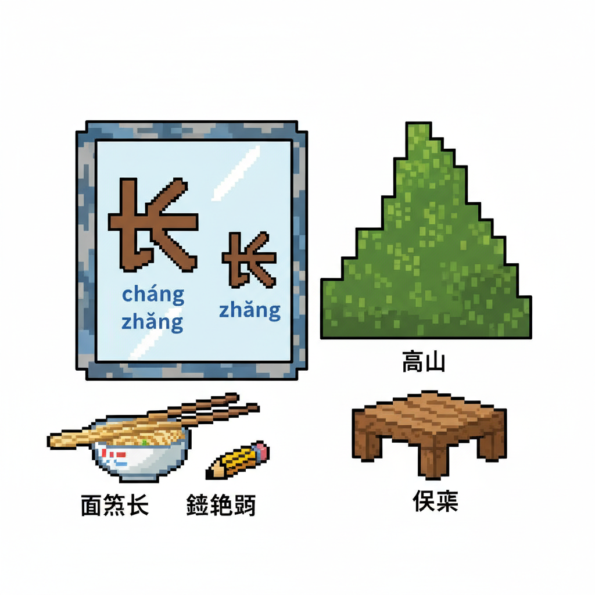
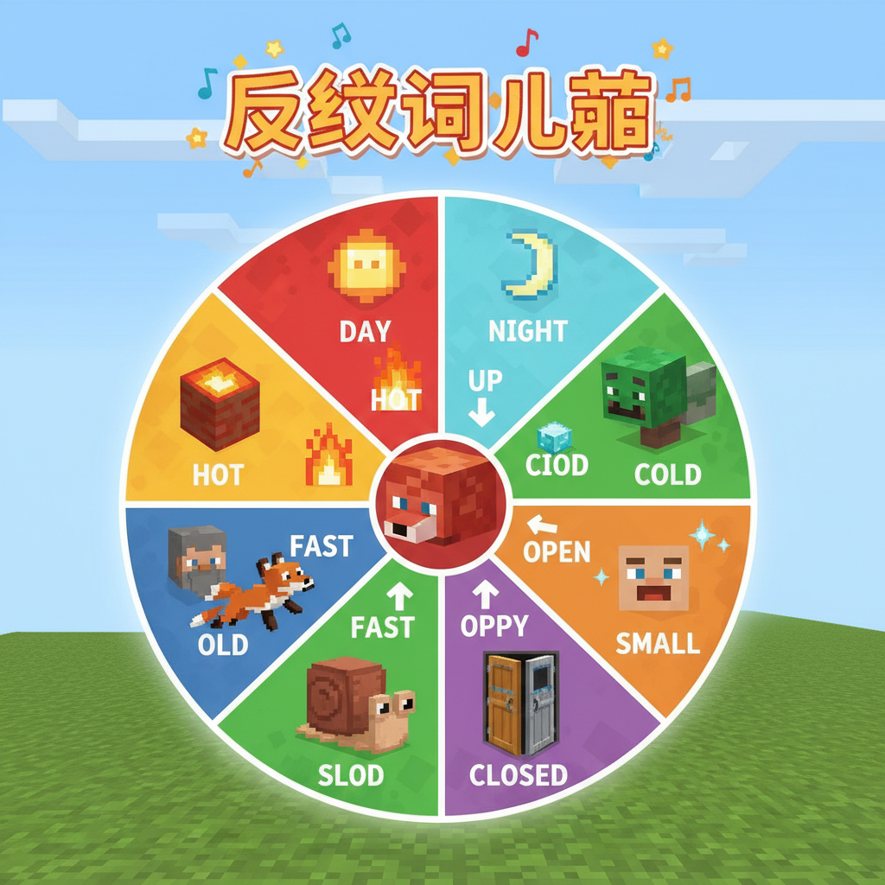

# 第21课 反义词

## 📋 学习目标
- 认识反义字：**多 少 大 小 长 短 高 低**
- 复习已学反义对：来/去、前/后、出/入、坐/站
- 掌握反义词在句子中的用法
- 理解对比的表达方式

**累计识字：153字**（L20: 145字 + 本课: 8字）

---

## 🎬 第一页：镜子大厅

句子之桥后面，有一座闪闪发光的大厅——"镜子大厅"。

大厅的墙上写着：

> "世间万物都有它的反面。白天和黑夜、大和小、多和少——学会反义词，你就学会了对比世界。"

```
   🪞 镜子大厅 — 四对反义词
   
   多 ↔ 少（数量）
   大 ↔ 小（尺寸）
   长 ↔ 短（长度）
   高 ↔ 低（高度）
```

> "每一对反义词就像镜子的两面——一面这样，一面那样。"

Steve站在一面镜子前——镜子里映出"大"和"小"两个字。他张开手臂："大！"缩成一团："小！"


---

## 🎬 第二页：多少 大小

```
   多 [duō] (6画)
   笔画顺序：①丿(撇) ②㇇(横撇) ③丶(点) ④丿(撇) ⑤㇇(横撇) ⑥丶(点)
   记忆口诀：两个"夕"叠在一起——很多个晚上！
   意思：数量大，很多
   组词：多少(duō shǎo)、很多(hěn duō)
   
   少 [shǎo] (4画)
   笔画顺序：①丨(竖) ②丶(点) ③丶(点) ④丿(撇)
   记忆口诀：小字加一撇——很少、不多
   意思：数量小，不多
   组词：多少(duō shǎo)、很少(hěn shǎo)、大小(dà xiǎo)
   
   大 [dà] (3画) — 已学，复习
   意思：尺寸大、程度高
   
   小 [xiǎo] (3画) — 已学，复习
   意思：尺寸小、程度低
```

> "'多少'这个词很有趣——'多'和'少'明明是反义词，但放在一起就变成了一个问词——'多少'= how many！"

```
   📖 反义对1：多 ↔ 少
   我有很多书。 — 我只有很少的书。
   
   📖 反义对2：大 ↔ 小
   太阳很大。 — 星星很小。
```


---

## 🎬 第三页：长短 高低

```
   长 [cháng] (4画)
   笔画顺序：①丿(撇) ②一(横) ③乚(竖钩) ④㇏(捺)
   记忆口诀：像一根长长的东西
   意思：长度大（也读zhǎng，意思是生长）
   组词：很长(hěn cháng)、长大(zhǎng dà)
   
   短 [duǎn] (12画)
   笔画顺序：(矢+豆)
   记忆口诀：矢（箭）+豆=短——箭和豆子都是短小的东西
   意思：长度小
   组词：很短(hěn duǎn)、短小(duǎn xiǎo)
   
   高 [gāo] (10画)
   笔画顺序：①丶(点) ②一(横) ③丨(竖) ④𠃍(横折) ⑤一(横) ⑥丨(竖) ⑦㇆(横折钩) ⑧丨(竖) ⑨𠃍(横折) ⑩一(横)
   记忆口诀：像一个高塔
   意思：上下距离大
   组词：很高(hěn gāo)、高山(gāo shān)
   
   低 [dī] (7画)
   笔画顺序：(亻+氏)
   记忆口诀：单人旁(亻)——人低头就是低
   意思：上下距离小
   组词：很低(hěn dī)、低头(dī tóu)
```

> "注意——'长'有两个读音：cháng（长度）和 zhǎng（长大）！"

```
   📖 反义对3：长 ↔ 短
   面条很长。 — 铅笔很短。

---

> 【标A: 语文课标一上·阅读·朗读儿歌和浅近古诗】

### ❌常见误解

| ❌ 错误理解 | ✅ 正确理解 |
|-------|-------|
| 古诗就是每个字都认识就行了 | 古诗要感受画面和情感，不只是认字 |
| 反义词就是"反着说" | 反义词是意义相反的词（高↔矮），不是句子反过来 |
| "的、地、得"随便用 | 的+名词（蓝蓝的天）、地+动词（快快地跑）、得+补语（跑得快） |
| 问号(?)和感叹号(!)分不清 | ？=在提问；！=很激动 |

🧠 想一想
1. **观察推理**："床前明月光，疑是地上霜"——诗人为什么觉得月光像霜？他在想什么？
2. **反事实**：如果你要给Steve写一封信介绍中文字，你最先想让他认识哪3个字？为什么？

## 🔗 跨科连接
英语Lesson 19-23教简单故事 → 中英文阅读能力同时发展
数学第23课教应用题 → 语文阅读理解帮助解数学题

📖 反义对4：高 ↔ 低
   山很高。 — 桌子很低。
```



---

## 🎬 第四页：反义词总览

镜子大厅中央出现了一个巨大的旋转圆盘——上面展示着已经学过的全部反义词：

```
   🪞 全部已学反义词 🪞
   
   多 ↔ 少 （数量）  新：多、少
   大 ↔ 小 （尺寸）  复习
   长 ↔ 短 （长度）  新：长、短
   高 ↔ 低 （高度）  新：高、低
   来 ↔ 去 （方向）  复习
   前 ↔ 后 （方位）  复习
   出 ↔ 入 （内外）  复习
   坐 ↔ 站 （姿势）  复习
   早 ↔ 晚 （时间）  复习
```

> "八对反义词，十六个字——每一个都能让你的句子更有对比、更有画面感！"

```
   🎵 反义词儿歌 🎵
   
   多和少，数一数，
   大和小，比一比，
   长和短，量一量，
   高和低，看一看。
   来和去，方向转，
   前和后，跟着走，
   出和入，门两边，
   坐和站，上下换。
   
   反义词，一对对，
   学会对比真有趣！
```



---

## 📝 练习

### 一、反义词配对

```
   多 ↔ ___    大 ↔ ___    长 ↔ ___
   高 ↔ ___    来 ↔ ___    前 ↔ ___
   出 ↔ ___    坐 ↔ ___
```

### 二、选词填空

```
   太阳___，星星___。         (大/小)
   面条___，头发___。         (长/短)
   山很___，草地很___。       (高/低)
   我___了很多书，他只有___书。(多/少)
```

### 三、用反义词写句子

```
   例：爸爸高，我低。（爸爸很高，我比较矮）
   
   大象___，老鼠___。
   蛇___，虫子___。
   蓝天上___，白云___。
```

---

## 🏆 挑战 — 反义词大王

**第一关：反义词接龙 🎮**

一人说"大"，下一人说"小"，然后说新的反义对。

**第二关：对子歌 ✏️**

写一首反义词对子歌：

```
   天对___，雨对___。    地、风（例）
   多对___，大对___。
   长对___，高对___。
   来对___，前对___。
```

---

## 📊 本课小结

新学反义字（8个 — 4对）：
- [ ] 多 duō ↔ 少 shǎo — 数量
- [ ] 大 dà ↔ 小 xiǎo — 尺寸（复习）
- [ ] 长 cháng ↔ 短 duǎn — 长度
- [ ] 高 gāo ↔ 低 dī — 高度

全部已学反义对（8对16字）：
多↔少 大↔小 长↔短 高↔低
来↔去 前↔后 出↔入 坐↔站

> **累计识字：153字**

---


