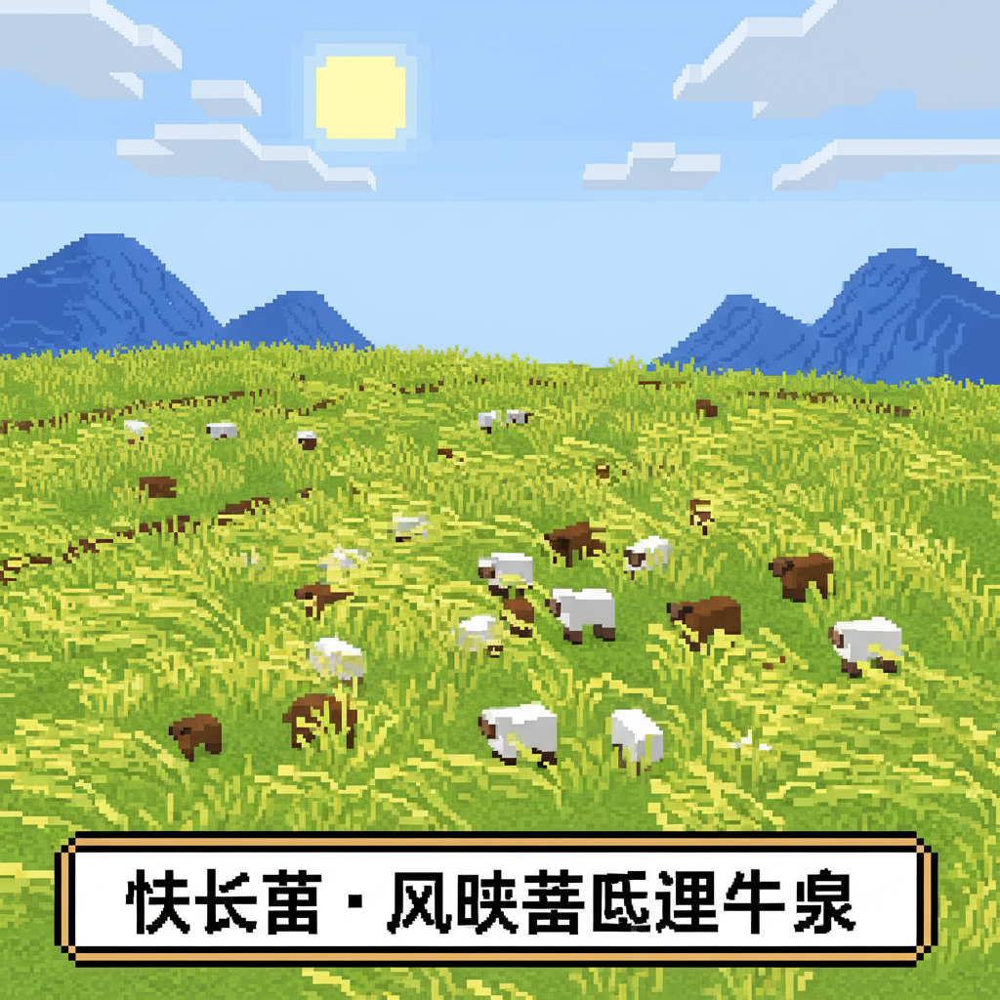

# 第21课 拓展篇：对子歌

## 📋 学习目标
- 巩固反义词
- 学习《笠翁对韵》启蒙
- 尝试创作对子

---

## 🎬 第一页：对子游戏

镜子大厅里还有一个古老的游戏——"对对子"。

> "对子是中国传统的语言游戏——把相反或相关的词配成对。"

```
   📜 经典对子（启蒙版）
   
   天对地，雨对风。
   大对小，多对少。
   长对短，高对低。
   来对去，前对后。
   山对水，花对草。
   红对绿，白对黑。
   日对月，星对云。
```

> "看——这些对子里，有些是反义词（大小），有些是同类词（天地）。"

Steve试着对："我说'多'——你说'少'！我说'高'——你说'低'！"

Alex接上："我说'太阳'——你说'月亮'！我说'花朵'——你说'小草'！"

```
   🎵 对子歌 🎵
   
   天对地，雨对风，大陆对长空。
   山花对海树，赤日对苍穹。
   （简化版）
   
   大对小，多对少，长空对海鸟。
   来对去，前对后，高山对低草。
```


---

## 📝 练习

### 一、对对子

```
   天 → ___    多 → ___    大 → ___
   长 → ___    高 → ___    来 → ___
```

### 二、创作对子歌

写出你的对子歌（至少3对）：

```
   ___对___，___对___，
   ___对___。
```

---



---

> 【标A: 语文课标一上·阅读·朗读儿歌和浅近古诗】

### ❌常见误解

| ❌ 错误理解 | ✅ 正确理解 |
|-------|-------|
| 古诗就是每个字都认识就行了 | 古诗要感受画面和情感，不只是认字 |
| 反义词就是"反着说" | 反义词是意义相反的词（高↔矮），不是句子反过来 |
| "的、地、得"随便用 | 的+名词（蓝蓝的天）、地+动词（快快地跑）、得+补语（跑得快） |
| 问号(?)和感叹号(!)分不清 | ？=在提问；！=很激动 |

🧠 想一想
1. **观察推理**："床前明月光，疑是地上霜"——诗人为什么觉得月光像霜？他在想什么？
2. **反事实**：如果你要给Steve写一封信介绍中文字，你最先想让他认识哪3个字？为什么？

## 🔗 跨科连接
英语Lesson 19-23教简单故事 → 中英文阅读能力同时发展
数学第23课教应用题 → 语文阅读理解帮助解数学题

