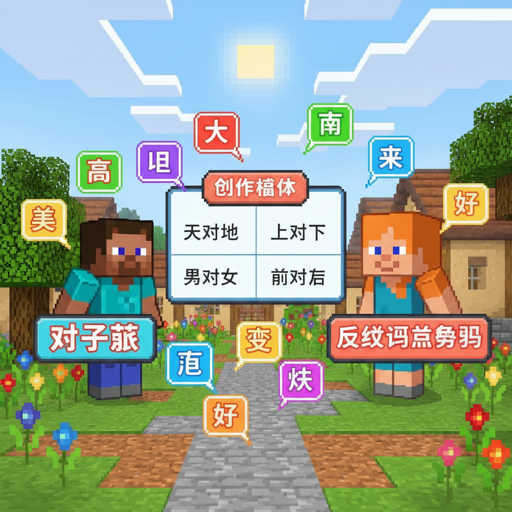
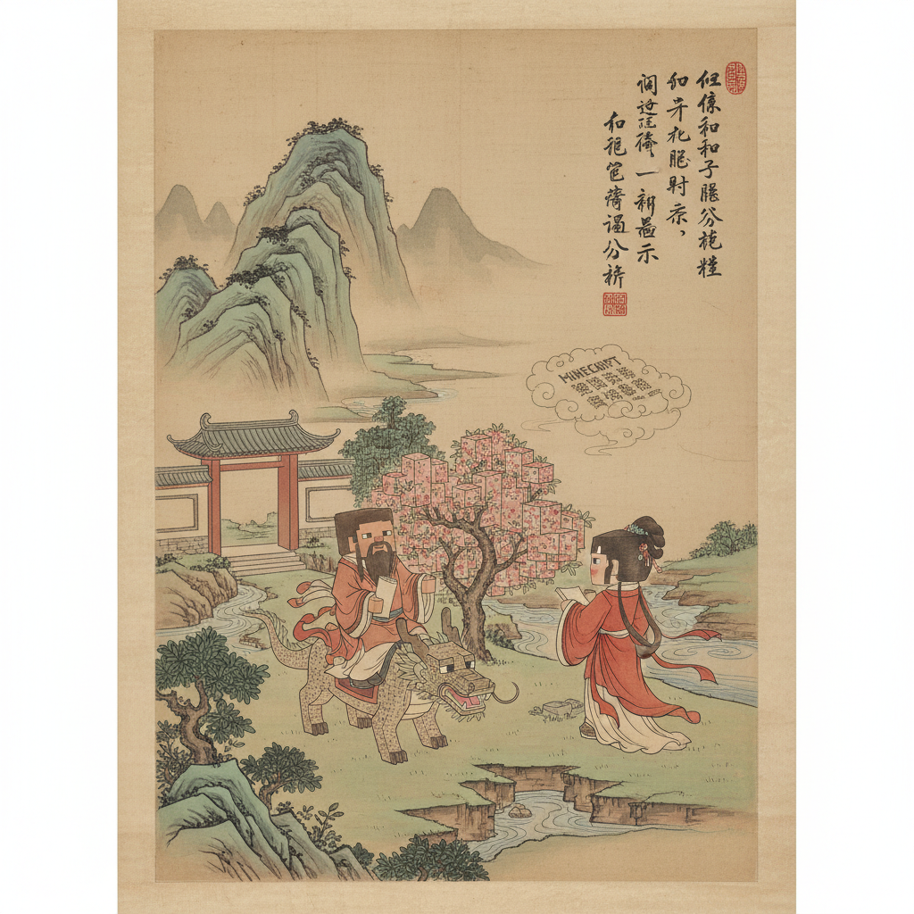
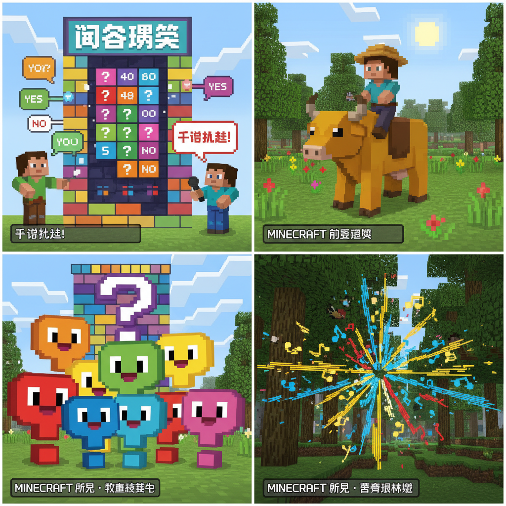

# 第22课 我会问答

## 📋 学习目标
- 认识疑问字：**谁 什 么 为 怎 知 道**
- 学会提问和回答的基本句型
- 阅读简短问答对话
- 综合运用全部已学字

**累计识字：160字**（L21: 153字 + 本课: 7字）

---

## 🎬 第一页：问答迷宫

Steve和Alex来到最后一座建筑——"问答迷宫"。入口写着：

> "会问问题，比会回答问题更重要。学会疑问字，你就学会了探索世界。"

```
   ❓ 问答迷宫 — 七个疑问字
   
   谁 — 问人（who）
   什么 — 问事物（what）
   为什么 — 问原因（why）
   怎么 — 问方式（how）
   知道 — 问答的终点
```

> "这七个字让你能问任何问题——也让你能回答任何问题。"


---

## 🎬 第二页：谁、什么、为什么

```
   谁 [shéi / shuí] (10画)
   笔画顺序：(言+隹)
   记忆口诀：言字旁——用语言问人的字
   意思：问是哪个人（who）
   组句：你是谁？谁在说话？
   
   什 [shén] (4画)
   笔画顺序：①丿(撇) ②丨(竖) ③一(横) ④丨(竖)
   意思：什么（跟"么"一起用）
   组句：这是什么？
   
   么 [me] (3画)
   笔画顺序：①丿(撇) ②𠃐(撇折) ③丶(点)
   意思：什么/怎么/这么（后缀）
   组句：你在做什么？
   
   为 [wèi] (4画)
   笔画顺序：①丶(点) ②丿(撇) ③㇍(横折钩) ④丶(点)
   意思：为了、因为（for / because）
   组句：为什么？
```

> "'什么'是两个字的组合——'什'+'么'——合起来才是完整的疑问词！"

```
   📖 三大基本问句：
   ① 这是什么？→ 用"什么"
   ② 他是谁？→ 用"谁"
   ③ 为什么？→ 用"为什么"
```

Steve提了一个问题穿过迷宫第一段："这是什么？"——墙上显示"这是苹果"。通过！

Alex 接着："他是谁？"——"他是老师。"通过！



---

## 🎬 第三页：怎么、知道

```
   怎 [zěn] (9画)
   笔画顺序：(乍+心)
   意思：怎么（how）
   组句：怎么去学校？怎么做？
   
   知 [zhī] (8画)
   笔画顺序：(矢+口)
   记忆口诀：箭(矢)和口——知道就像箭射中目标
   意思：知道、了解
   组句：我知道。你知道吗？
   
   道 [dào] (12画)
   笔画顺序：(辶+首)
   记忆口诀：走之底(辶)——走路的方向就是"道"
   意思：道路、道理、说道
   组句：知道、道路、一道门
```

> "'知道'是另一个复合词——'知'是心里明白，'道'是说出来的道理。心里明白+说出来的道理=知道！"

```

---

> 【标A: 语文课标一上·口语交际·能认真听别人讲话，努力了解讲话内容】

### ❌常见误解

| ❌ 错误理解 | ✅ 正确理解 |
|-------|-------|
| "什么"和"怎么"搞混 | 什么=问事物（这是什么？），怎么=问方式（怎么去？） |
| 问句末尾用句号 | 问句末尾一定要用问号（？） |
| 回答只说一个字 | 回答用完整句子（问：你叫什么？答：我叫小明。） |
| "为什么"和"因为"分不清 | 为什么=问原因，因为=回答原因 |

🧠 想一想
1. **观察推理**："你知道吗？"和"你知道什么？"——两句话意思一样吗？区别在哪里？
2. **反事实**：如果人类不会提问，只会陈述，交流会变成什么样？

## 🔗 跨科连接
英语：5W1H——Who/What/Where/When/Why/How（和中文疑问词对应）
科学：科学家用"为什么"探索世界——每个伟大的发现都从一个问题开始

📖 问答配对：
   
   问：你怎么去学校？ → 答：我走路去学校。
   问：你知道这是什么吗？ → 答：我知道，这是花。
   问：为什么天是蓝的？ → 答：因为太阳光照的！
```


---

## 🎬 第四页：问答实战

迷宫最后一段——一面巨大的问答墙。上面写着各种问题，必须用已学过的字回答才能通过。

```
   ❓ 问答闯关 ❓
   
   Q1: 你叫什么名字？
   A1: 我叫_______。
   
   Q2: 你几岁了？
   A2: 我_______岁了。（六/七/八）
   
   Q3: 你喜欢什么颜色？
   A3: 我喜欢_______色。
   
   Q4: 你的好朋友是谁？
   A4: 我的好朋友是_______。
   
   Q5: 为什么你喜欢上学？
   A5: 因为学校有老师和朋友！
```

Steve和Alex一个接一个地回答。每一个答案都用了已学的字！

> "看到没有——学会提问和回答，你的中文就活了。不再是认字，而是真正的交流！"

```
   ❓ 全部疑问字：
   
   谁 shéi — who
   什么 shén me — what
   为什么 wèi shén me — why
   怎么 zěn me — how
   知道 zhī dào — know
```



---

## 📝 练习

### 一、疑问字填空

```
   ___是你的老师？              (谁/什么)
   这是___？                    (谁/什么)
   ___天是蓝的？                (为什么/怎么)
   你___去学校？                (怎么/什么)
   我不___这道题的答案。         (知道/怎么)
```

### 二、回答问题

```
   Q: 你叫什么名字？
   A: ___________________
   
   Q: 你的好朋友是谁？
   A: ___________________
   
   Q: 你喜欢吃什么？
   A: ___________________
```

### 三、提问题

给下面的答案写一个问题：

```
   A: 这是书。
   Q: _______________？
   
   A: 我的朋友是小红。
   Q: _______________？
   
   A: 因为太阳出来了。
   Q: _______________？
```

---

## 🏆 挑战 — 小记者

采访一个家人或朋友，用学过的疑问字问三个问题，写下问答：

```
   问1：_______________？
   答1：_______________。
   
   问2：_______________？
   答2：_______________。
   
   问3：_______________？
   答3：_______________。
```

---

## 📊 本课小结

疑问字（7个）：
- [ ] 谁 shéi — who
- [ ] 什么 shén me — what
- [ ] 为什么 wèi shén me — why
- [ ] 怎么 zěn me — how
- [ ] 知道 zhī dào — know

> **累计识字：160字**

---


---

## 📜 古诗角 — 《所见》

> **清·袁枚** · 一个牧童骑在牛背上唱歌，忽然闭口不唱了——因为他想捉那只鸣叫的蝉。

```
牧童骑黄牛
歌声振林樾
意欲捕鸣蝉
忽然闭口立
```

逐句赏诗：
牧童骑黄牛 — 牧童骑黄牛


歌声振林樾 — 歌声振林樾


意欲捕鸣蝉 — 意欲捕鸣蝉


忽然闭口立 — 忽然闭口立


