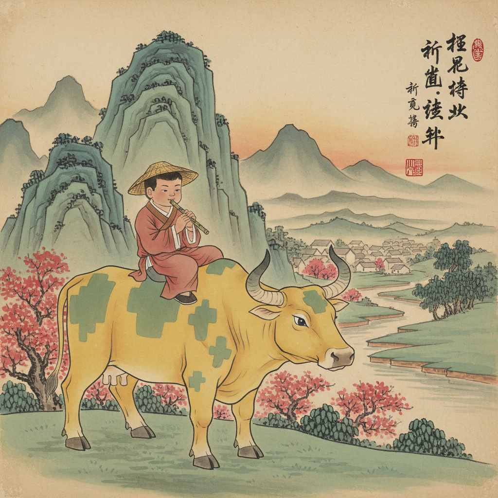

# 第22课 拓展篇：小小采访员

## 📋 学习目标
- 综合运用疑问字进行实际问答
- 采访实践
- 阅读简短对话

---

## 🎬 第一页：村庄采访

走出问答迷宫后，Steve和Alex拿到了"采访员"徽章。

> "去村里采访三个人——用你的疑问字，了解他们的一天！"

**采访1 — 老农夫：**

> Steve："你早上做什么？"
> 农夫："我早上给牛吃草。"
> "为什么这么早起？"
> "因为太阳出来牛就醒了！"

**采访2 — 铁匠：**

> Alex："你怎么做出一把剑？"
> 铁匠："铁在火里烧红，再用锤子打。"
> "这是什么？"（指着一个工具）
> "这是锤子。"

**采访3 — 小朋友：**

> Steve："你叫什么名字？"
> 小朋友："我叫小花。"
> "你喜欢什么？"
> "我喜欢小猫！"

```
   📝 采访模板：
   问：你叫什么名字？
   答：我叫_______。
   问：你喜欢什么？
   答：我喜欢_______。
   问：为什么？
   答：因为_______。
```



---

## 📝 练习

用采访模板采访一个真实的家人：

```
   我的采访对象：_______
   
   问1：_______？
   答1：_______。
   
   问2：_______？
   答2：_______。
```

---


---

> 【标A: 语文课标一上·阅读·朗读儿歌和浅近古诗】

### ❌常见误解

| ❌ 错误理解 | ✅ 正确理解 |
|-------|-------|
| 古诗就是每个字都认识就行了 | 古诗要感受画面和情感，不只是认字 |
| 反义词就是"反着说" | 反义词是意义相反的词（高↔矮），不是句子反过来 |
| "的、地、得"随便用 | 的+名词（蓝蓝的天）、地+动词（快快地跑）、得+补语（跑得快） |
| 问号(?)和感叹号(!)分不清 | ？=在提问；！=很激动 |

🧠 想一想
1. **观察推理**："床前明月光，疑是地上霜"——诗人为什么觉得月光像霜？他在想什么？
2. **反事实**：如果你要给Steve写一封信介绍中文字，你最先想让他认识哪3个字？为什么？

## 🔗 跨科连接
英语Lesson 19-23教简单故事 → 中英文阅读能力同时发展
数学第23课教应用题 → 语文阅读理解帮助解数学题

