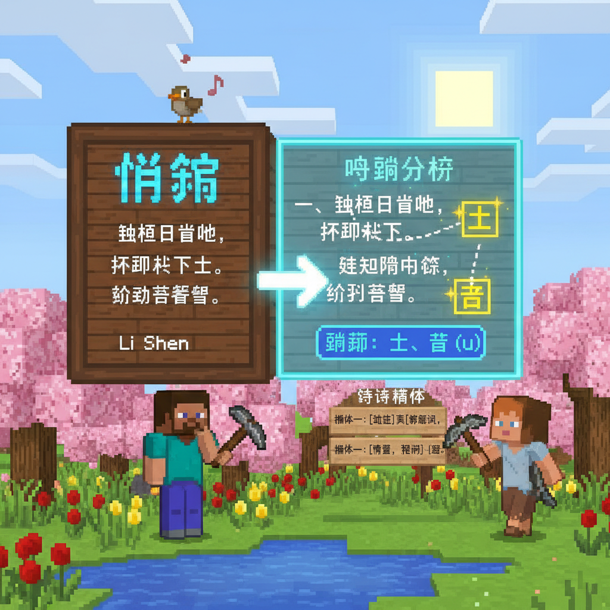
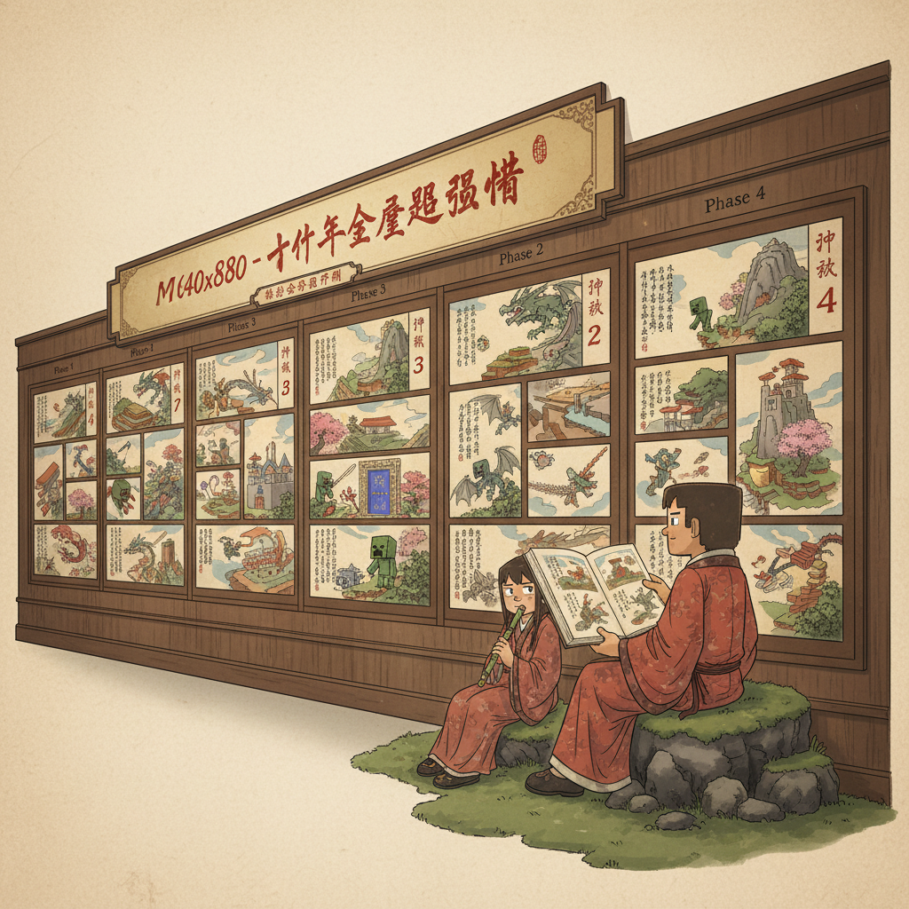
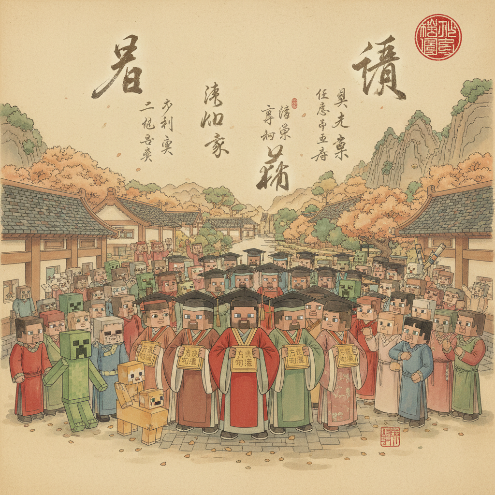

# 第24课 大冒险 — 终极挑战

## 📋 学习目标
- 总复习全部177个汉字
- 阅读原创长篇故事
- 综合运用识字、拼音、阅读能力
- 🏆 完成全部语文绘本课程！

---

## 🎬 第一页：最后的召唤

Steve和Alex的方块世界之旅即将到达终点。这天早上，他们收到了一封信——

> "亲爱的拼音大师、识字达人、古诗小诗人：你们已经学完了177个汉字。现在，全部的字都在方块世界里等着你们——去完成最后的冒险吧！"

信的背面有一张咒语——用全部已学字写的终极密码：

```
   🔮 终极密码：
   我是学生。我有朋友。我在方块世界。
   太阳很大，月亮很亮，星星很多。
   红的花，绿的草，蓝的天，白的云。
   小鸟在天上飞，小鱼在水里游。
   牛和羊在山上吃草，马在路上跑。
   爸爸妈妈在家，老师在学校。
   我开心地笑，快乐地跳。
   我知道：学中文是一件很美的事。
```

> "如果你能读完这段密码——你就完成了语文绘本的全部课程！"

Steve深吸一口气，开始念。一个字、一个字——每一个他都认识。每一句他都明白。

Alex接着念——流畅地、自信地。

密码上的每一个字都亮了起来。整个方块世界为他们闪耀。



---

## 🎬 第二页：终极回顾 — 177字全景

```

---

> 【标A: 语文课标一上·综合·对学习汉字有浓厚的兴趣，养成主动识字的习惯】

### ❌常见误解

| ❌ 错误理解 | ✅ 正确理解 |
|-------|-------|
| 学完24课就不用再学了 | 177字是起点，生活中还有上千个字等着你 |
| 只能读课本上的句子 | 你现在可以读路牌、菜单、绘本了 |
| 拼音=中文 | 拼音是工具，汉字才是中文的精华 |
| 不认识的字就没办法 | 可以猜（上下结构猜意思）、可以问、可以查字典 |

🧠 想一想
1. **回忆思考**：从第1课的"日月山水火"到现在的177个字——你觉得哪一课最有趣？哪一课最难？
2. **反事实**：如果现在让你教一个朋友认字，你最先教哪10个字？为什么选它们？

## 🔗 跨科连接
英语：你已经掌握了中文177字的方法——英语也可以用同样的方式学习（高频词→阅读）
数学：数据统计——24课×平均7.4字/课=177字，平均每天学3-4个字
科学：语言是人类最伟大的发明——每个汉字都是一幅画、一个故事

📖 语文绘本 — 177字全部回顾 📖
   
   Phase 1·汉字启蒙 (L1-L6):
   日月山水火木田石一十人大天太个八入
   天地人你我他上下左右中云雨风雪星
   花草虫鸟爸妈兄妹爷奶宝宝老师同学书包本书笔尺
   
   Phase 3·识字巩固 (L13-L18):
   口耳目手足头牙心一二三四五十百千万
   红黄蓝绿白黑米饭菜面瓜果菜蛋鱼
   吃喝看走笑来去坐睡站跑跳飞前后出入
   早中晚今明昨牛羊马狗猫兔龙虎鹿熊
   
   Phase 4·阅读表达 (L19-L24):
   太阳月亮星星朋友老师学生
   我在有是的很和也多少大小长短高低
   谁什么为什么怎么知道床光疑举望低故乡
   鹅曲项浮拨眠晓啼落
   
   总计：177字 ✅
```

> "从'日'到'落'——24课的旅程，177个字，你已经全部认识了。"

Steve翻着他的笔记本——第一页是L1的"日月山水火"。那时候他连一个字都不认识。现在，他能读诗了。


---

## 🎬 第三页：方块世界的大结局

所有的字都亮了。方块世界的所有角色——村民、动物、甚至声母和韵母精灵——都聚集在村庄广场上。

b将军（声母王国的领袖）站出来：

> "你们从'日月山水火'开始，走过了拼音王国、动作城堡、时空迷宫、镜子大厅、古诗花园——"

> "今天，你们正式从方块世界毕业了。"

> "但毕业不是结束——是新的开始。你离开方块世界后，会发现到处都是汉字：书里、路上、店里、手机里。每一个汉字，都在等着你认出来、读出来。"

🏅 两枚"方块语文大师"勋章从天而降。

Steve戴上了勋章。Alex也戴上了。他们互相看着——从第一课到今天，他们一起走完了全部24课。

```
   🎵 毕业歌 🎵
   
   从日从月从山水，
   一撇一捺学着写。
   从a o e到声母，
   拼音世界里飞。
   
   从一字到一句，
   从一句到一诗。
   177字全学会，
   方块世界不说再会。
```

> "方块世界永远欢迎你回来——只要你翻开课本，打开书，你就在方块世界里。"

Steve在笔记本最后一页写道：

> "方块世界教我的不只是字——是相信我可以用另一种语言，看到另一个世界。"

Alex在下面加了一句：

> "再见，方块世界。你好，更大的世界。"



---

## 📝 终极练习：177字闯关

### 第一关：认字量测试

随机选20个字，看看你能认出多少：

```
   星 龙 照 眠 鲜 低 蛋 绿
   站 兔 知 拨 课 家 飞 脸
   师 望 瓜 写
   
   认出 ___ / 20
```

### 第二关：读句子

```
   我的朋友叫小花。她是一个很好的学生。
   她在学校学习。我在家看书。
   我们一起在公园里玩。太阳很大，我们都笑得很开心。
```

### 第三关：写一封信

给方块世界的Steve和Alex写一封短信：

```
   亲爱的Steve和Alex：
   
   我是_______。
   我今年_______岁。
   我也在学中文。
   我很喜欢_______。
   谢谢你们陪我学汉字。
   
   再见！
   _______
```

---

## 🏆 毕业证书

```
   ╔══════════════════════╗
   ║                      ║
   ║   🏅 方块语文大师 🏅  ║
   ║                      ║
   ║   _______________    ║
   ║   (你的名字)         ║
   ║                      ║
   ║   完成了              ║
   ║   语文绘本全部24课     ║
   ║   累计识字：177字     ║
   ║                      ║
   ║   日期：___年___月___日║
   ║                      ║
   ╚══════════════════════╝
```

---

## 📊 语文绘本 — 全课程总结

| Phase | 课程 | 识字 | 重点 |
|-------|------|------|------|
| P1 | L1-L6 | 58字 | 象形+笔画启蒙 |
| P2 | L7-L12 | 拼音 | 全部声母+韵母+声调 |
| P3 | L13-L18 | 67字 | 身体/数字/食物/动作/时间/动物 |
| P4 | L19-L24 | 52字 | 复合词/短句/反义词/问答/古诗 |

> **总计：24课 + 177字 + 完整拼音体系 = 语文绘本完成！🎉**

---


