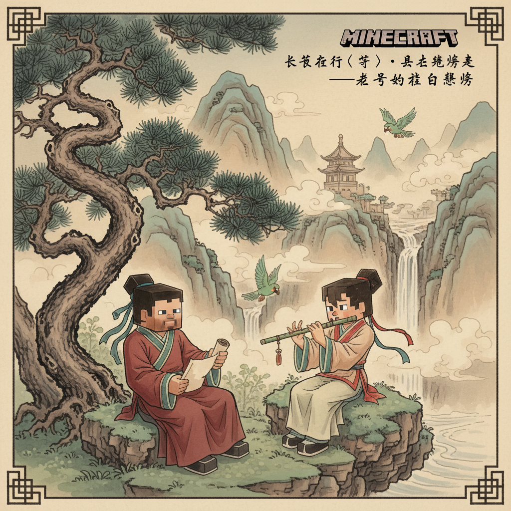
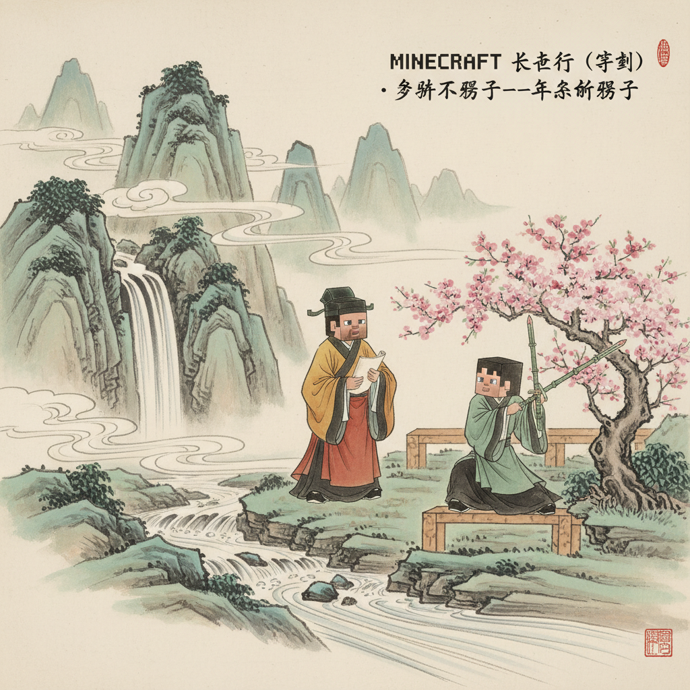
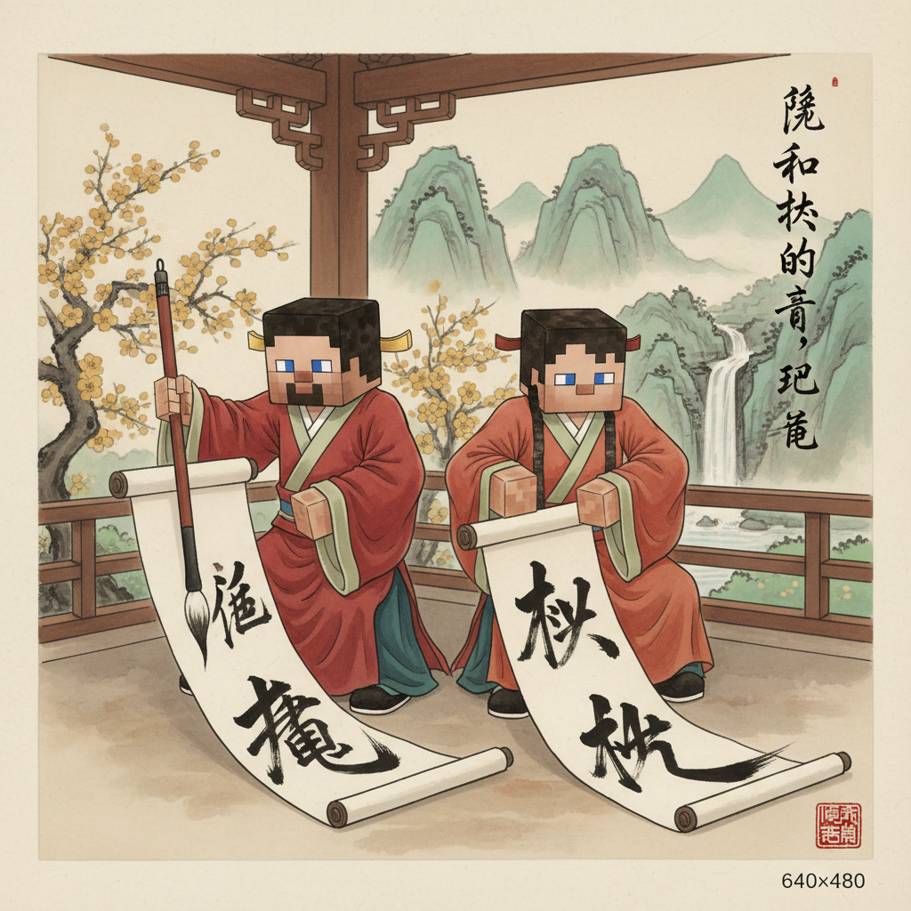
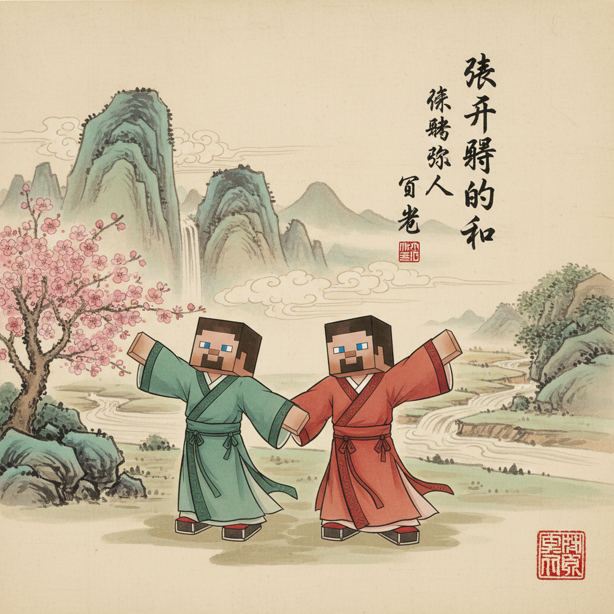
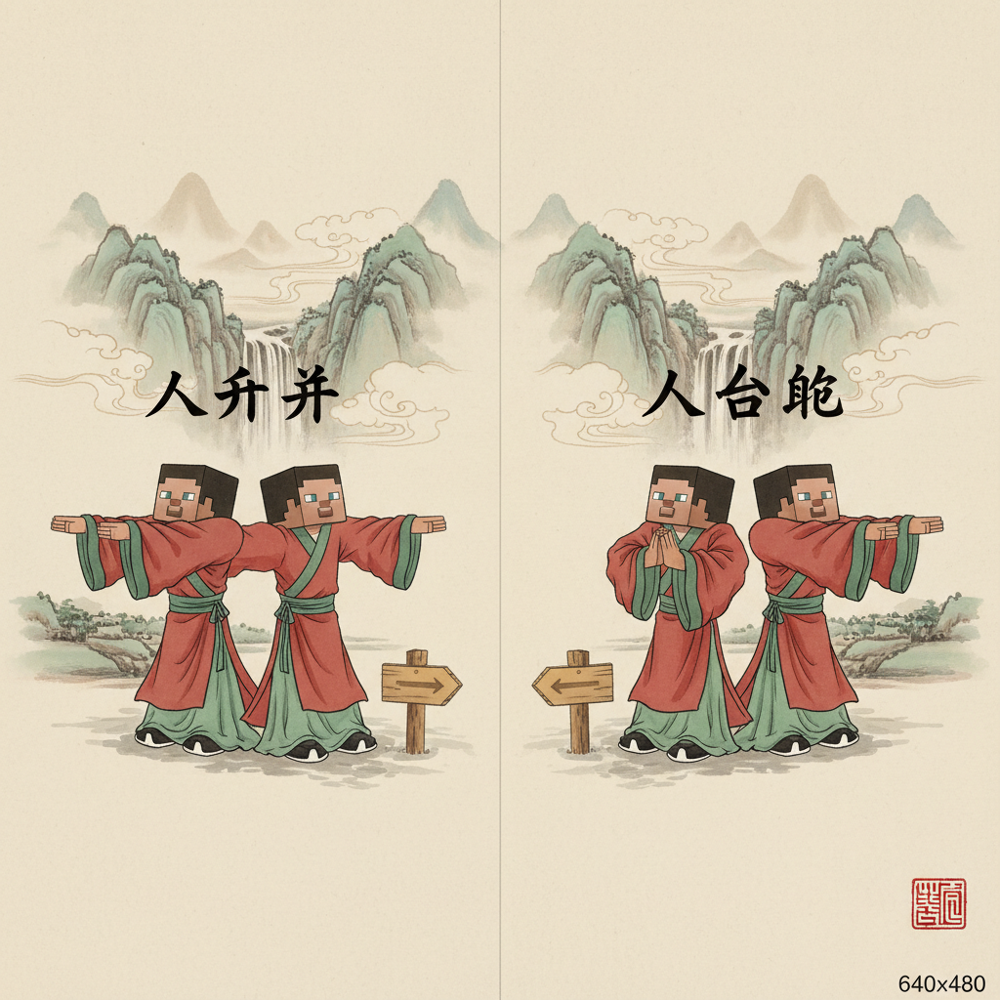
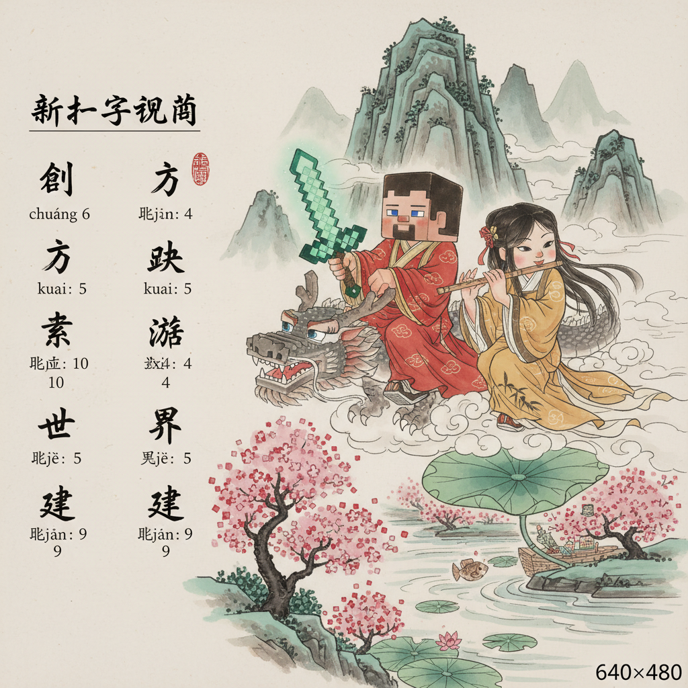
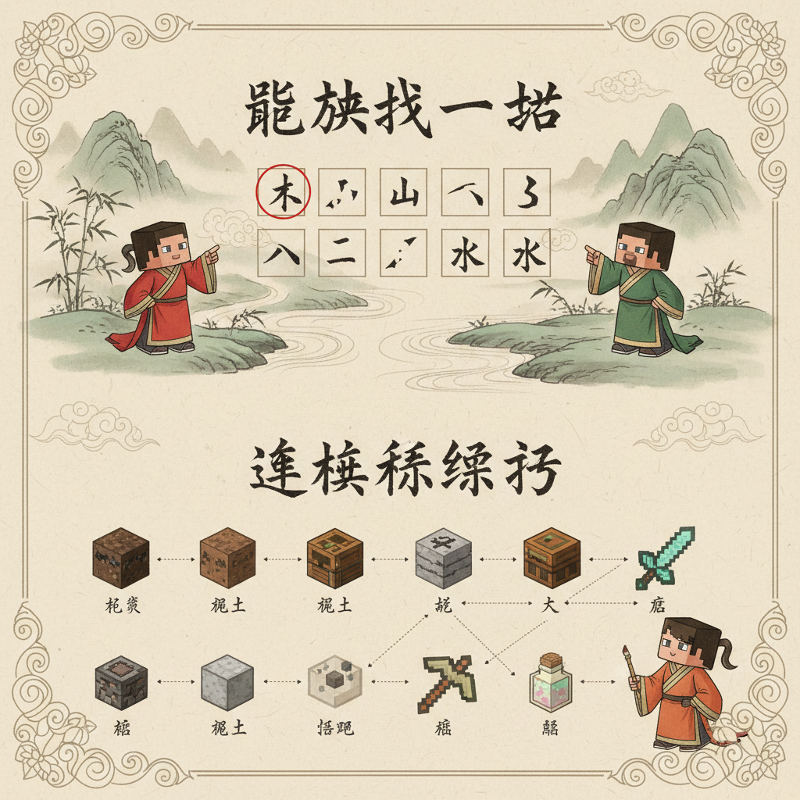
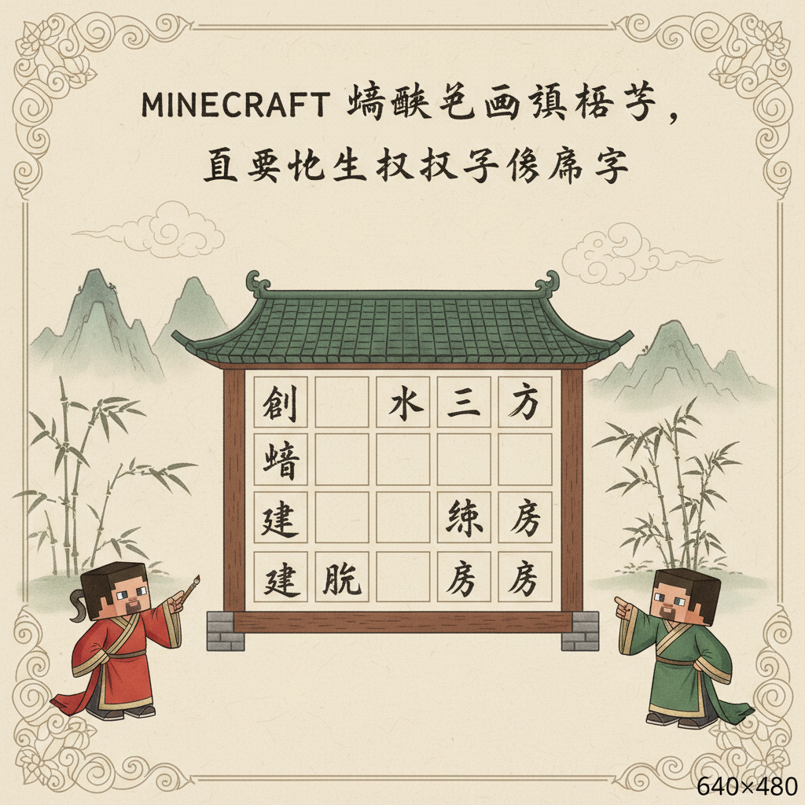
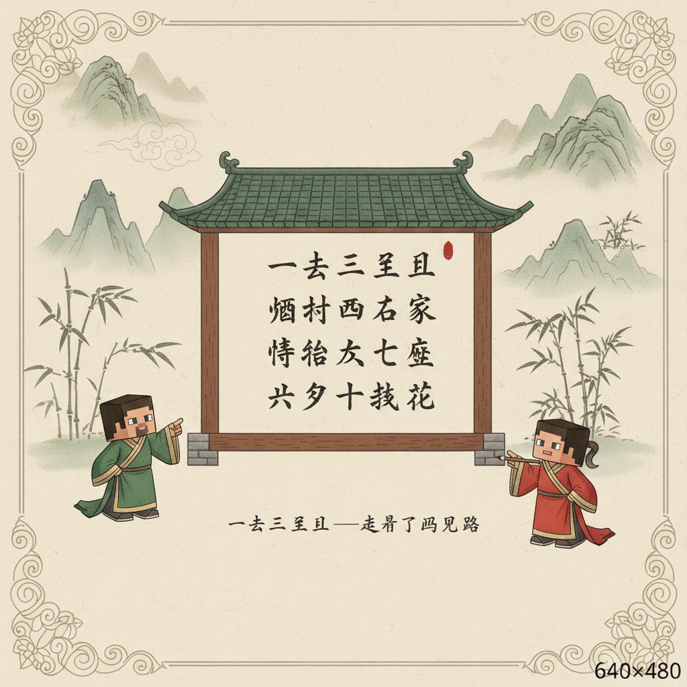
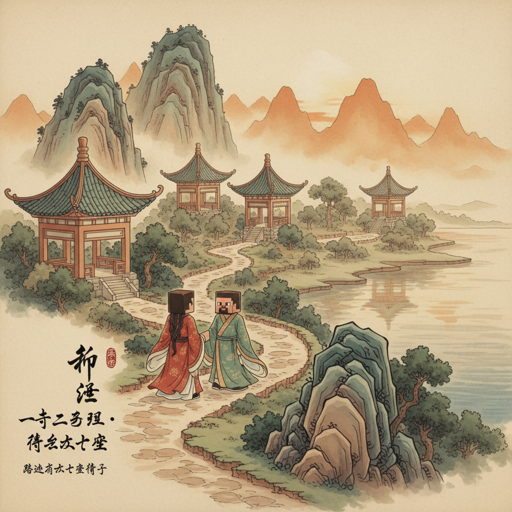

# 第2课 基本笔画

## 📋 学习目标
- 认识 **横（一）**、**竖（丨）**、**撇（丿）**、**捺（㇏）**、**点（丶）**、**提（㇀）**
- 笔画组成简单字：**一、十、人、大**
- 新学汉字：**一 十 人 大 天 太 个 八 入**（9个字）

---

## 🎬 第一页：一横成桥

Steve 和 Alex 走到一条河边，水太深过不去。

> "糟了，桥坏了！我们怎么过去？"

Alex 看着河对岸的木头，又看看岸边的一块石碑——上面刻着一条横线：

> 把石头连在一起……就是……一座桥！

```
  一（横） ＝ 一座桥
```

Steve 恍然大悟："就这么简单？一横就是桥？"
Alex 笑着搬来木头，排成一条长长的横线：

> "对！**横**是最简单的笔画，从左到右写。就像搭桥一样！"



---

## ✏️ 第二页：横的写法

Alex 在地上画了一道横：

> "写横的时候，从左到右，平平的，像一条路。"

```
从左到右 ──→
━━━━━━━━━━
```

**找一找**：下面哪些东西是"横"？

```
一块桥板 🪵 → 是横 ✅
一根柱子 🏛️ → 不是 ❌
一排栏杆 → 是横 ✅
```

> 📝 **跟我写**：从左到右，拉平，不要太长。
> 一个"一"字 = 一条横线 = 一座桥


---

## 🤔 第三页：竖——柱子

过了桥，他们来到一个倒塌的房子前，几根柱子还立着。

> "这些柱子真高！"

Alex 指了指石碑上新刻的字——一条竖线：

```
丨（竖） ＝ 一根柱子
```

> "**竖**是从上到下的笔画，像柱子一样直直的！"

```
从上到下 ↓
┃
┃
┃
```

**十 = 横 + 竖 = 桥 + 柱子**
"把一横和一竖交叉，就成了 **十** 字！"


---

## 🤔 第四页：撇和捺——走路的人

他们继续前进，看到一个村民正在快步走路。

> "看他的腿——左腿往前伸，右腿往后蹬！"

石碑上新出现了两条斜线：

```
丿（撇）  ＝ 往左伸的腿
㇏（捺）  ＝ 往右蹬的腿
```

> "**撇**往左下方走，**捺**往右下方走。合在一起，就像一个人往前迈步！"

```
人 ＝ 丿 + ㇏ = 一个人往前走
```

"人本来就是这个意思——一个人站着，两条腿分开。"



---

## 🤔 第五页：大——张开手臂的人

一个村民张开双臂欢迎他们：

> "**大**！"

```
人 + 一横(手臂) = 大
```

> "一个人张开双臂，就是'大'。好大的拥抱！"

```
大 ＝ 人 + 一横
```

**天 = 一 + 大**："一"在上，"大"在下，就是"天"。

**太 = 大 + 丶**：大字加一点，就是"太大"的"太"。

> "天上有太阳，太阳太大了！"



---

## 🤔 第六页：八和入

路标上还有两个相似的符号：

```
八 ＝ 丿 + ㇏（两笔分开）= 分成八块
入 ＝ 丿 + ㇏（上面连起来）= 进入门里
```

> "**八**像两瓣分开了。
> **入**像入口，上面要连起来。"

**记忆技巧：**
- 八 → 两个人分开走 ← 八是分开的
- 入 → 走进一个入口 ← 上面要合拢

| 字 | 笔画 | 记住它 |
|----|------|--------|
| 八 | 2笔 | 两瓣掰开 |
| 入 | 2笔 | 入口合拢 |



---

## ✏️ 第七页：个——做个记号

Steve 想学会写"个"字，这样他可以在木头上做记号。

> "**个**字怎么写？第一笔是撇……"

```
个 ＝ 丿 + 丨 + 丶
    = 撇 + 竖 + 点
```

> "一个'个'，表示一个东西，一个人。"

> **笔画顺序**：丿 丨 丶（撇、竖、点）



---

---

> 【标A: 语文课标一上·识字与写字·认识常用汉字（象形字→楷体）】

### ❌常见误解

| ❌ 错误写法/理解 | ✅ 正确写法/理解 |
|-------|-------|
| "日"写成"目"（中间多一横） | 日=太阳，中间一横，不是两横 |
| "山"写成三竖一样高 | 中间一竖最高，两边的低 |
| "水"的笔画随便写 | 笔顺：竖钩 → 横撇 → 撇 → 捺 |
| 把象形字当画看，不记字形 | 象形字是"从画变来的字"，要记住现在的样子 |

🧠 想一想
1. **观察推理**：为什么"日"里面只有一横而不是两横？（提示：太阳只有一个）
2. **反事实**：如果古人把"山"画成三座一样高的山峰，现在的"山"字会是什么样子？

## 🔗 跨科连接
数学第1课教数字1-10 → 语文同步教一二三
英语Lesson 2教ABC字母 → 中英文字对比认知

## 📖 第八页：小词典

| 汉字 | 笔画数 | 组成 | 意思 |
|------|--------|------|------|
| **一** | 1画 | 横 | 一条桥、数字1 |
| **十** | 2画 | 横+竖 | 十字路口 |
| **人** | 2画 | 撇+捺 | 一个人 |
| **大** | 3画 | 人+横 | 张手的人 |
| **天** | 4画 | 一+大 | 天空 |
| **太** | 4画 | 大+丶 | 太大 |
| **个** | 3画 | 撇+竖+点 | 一个 |
| **八** | 2画 | 撇+捺分开 | 八块 |
| **入** | 2画 | 撇+捺合拢 | 进入 |



---

## ✏️ 第九页：笔画找一找

在下面的字里，找出你认识的笔画！

```
个 → 找到 丿（撇）了吗？ → 第一个笔画就是撇 ✅
大 → 找到 一（横）了吗？ → 中间的横 ✅
八 → 找到 ㇏（捺）了吗？ → 第二个笔画 ✅
十 → 哪两笔？ → 一横一竖 ✅
```

**连连看：把笔画和比喻连起来**

```
一（横）    →   一根柱子
丨（竖）    →   一座桥
丿（撇）    →   往右蹬的腿
㇏（捺）    →   往左走的腿
```


---

## 🎯 第十页：挑战——修房子

前面有一栋倒塌了一堵墙的房子！Steve 需要用汉字砖块来修墙。每块墙上的格子缺了一笔，把正确的笔画填进去。

**第1格：** 缺一笔 → 把 ___ 填入就成为"十"
**第2格：** 缺一笔 → 把 ___ 填入就成为"人"
**第3格：** 缺两笔 → 把 ___ 和 ___ 填入就成为"大"
**第4格：** 缺一笔 → 把 ___ 填入就成为"太"

> 全部填对，房子修好！村民们送给 Steve **5 颗绿宝石** 💎




---

## 📜 古诗角 — 《一去二三里》

> **宋·邵雍** · 数数诗——数字藏在诗句里，读起来像游戏。

```
一去二三里
烟村四五家
亭台六七座
八九十枝花
```

逐句赏诗：
一去二三里 — 一去二三里



烟村四五家 — 烟村四五家



亭台六七座 — 亭台六七座


八九十枝花 — 八九十枝花



---

## 🎉 第十一页：完成！

> "我学会了6种基本笔画和9个汉字！"
>
> "不只是学会了字，"Alex 说，"你学会了**汉字的积木**。每个字都是由笔画搭成的，就像 Minecraft 的方块一样！"

> 🏆 **获得「笔画大师」徽章！**

### 本课新学的字
```
一 十 人 大 天 太 个 八 入
（9个字，累计17个字）
```

> ➡️ **准备好了吗？下一课：汉字小天地——人和大自然！**
