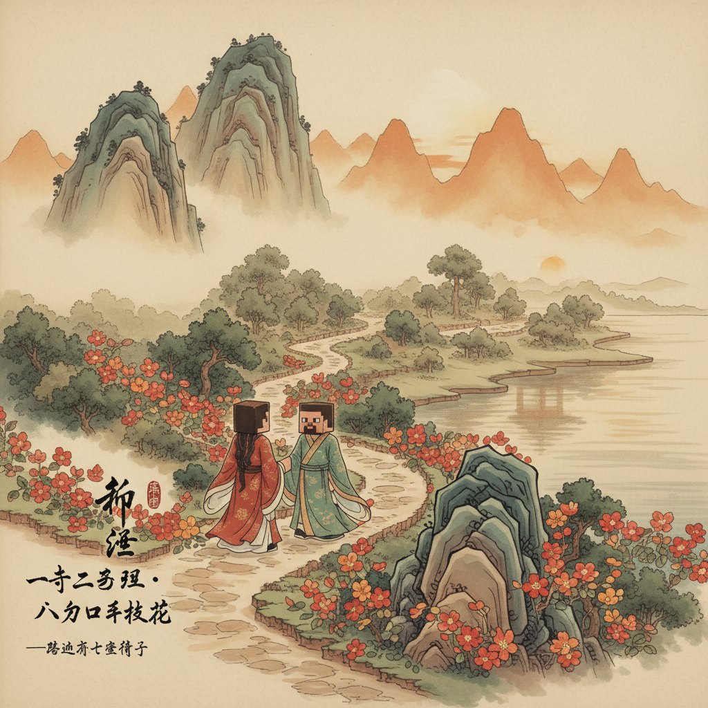
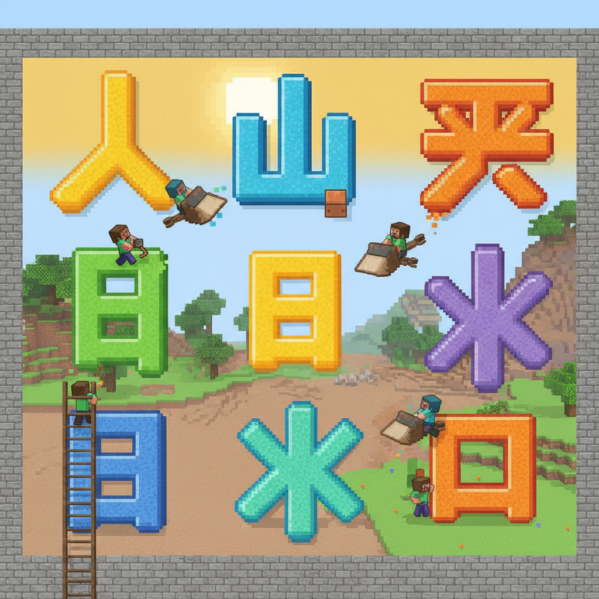
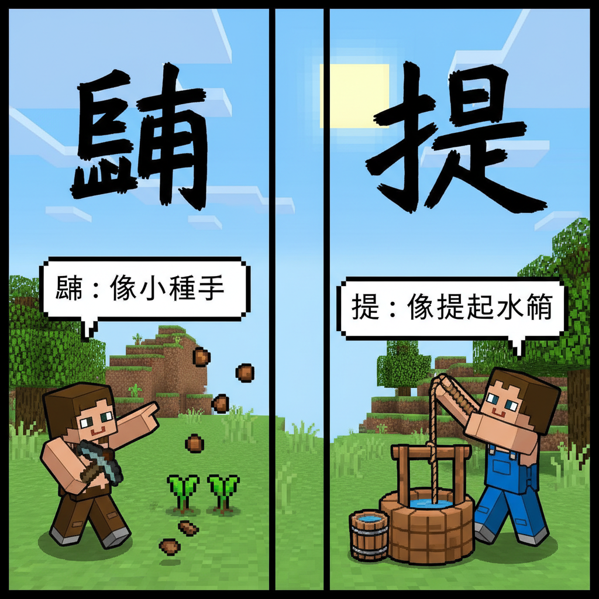

# 第2课 拓展篇 — 笔画大闯关

> 📖 **先完成《基本笔画》基础篇，再来闯关！**

---

## 📋 学习目标
- 巩固 6 种基本笔画
- 认识 **点、提** 的更多变化
- 笔画游戏复习 9 个汉字

---

## 🤔 第一页：神秘壁画

几周后，Steve 再次经过那条河。

桥已经修好了，但河边的断墙上出现了一幅巨大的壁画。上面画着各种线条：

> "这些线是什么意思？"

Alex 画了一个圈指着壁画说：

> "这是天上的雷电，一竖穿过一横——**十**。
> 这是一个人在走路——**人**。
> 这是一个人张开双臂——**大**。
>
> 所有的汉字，都是由最基本的笔画拼成的。就像用方块搭建 Minecraft 的房子一样！"



---

## 🤔 第二页：点——小种子

> "还有两种笔画我们没学过：**点**和**提**。"

Alex 在地上画了一个小点：

> "**点**（丶）——像一滴雨、一粒种子，小小的。"

```
丶 → 最小的笔画
```

**找找"点"在哪里：**
```
太 → 大字右下角有一点 ✅
个 → 最后一笔是点 ✅
笑 → 由几个点组成？ ✅
```

**提**（㇀）——从下往上提，像提东西：

> "**提**是从左下往右上挑的笔画，像把水桶从井里提上来。"



---

## ✏️ 第三页：笔画闯关——堆方块

Steve 发现一种游戏：用笔画搭积木，看能拼成多少字！

**用笔画方块拼字：**

```
一 + 丨 = ___
丿 + ㇏ = ___
人 + 一 = ___
一 + 大 = ___
大 + 丶 = ___
丿 + 丨 + 丶 = ___
```

**答案：** 十 / 人 / 大 / 天 / 太 / 个



---

## 🎯 第四页：大闯关——四关挑战

### 第一关：猜字 🤔
看描述猜是什么字：
```
1. 一横一竖 = ___   (答案：十)
2. 撇+捺，像两条腿 = ___   (答案：人)
3. 人张手 = ___   (答案：大)
4. 一小+一大 = ___   (答案：天)
```

### 第二关：填空 ✍️
用"大"或"太"填空：
```
1. 太阳（___）了！（太）
2. 好（___）的树！（大）
3. 今天天真（___）！（太）
```

### 第三关：比一比 🆚
```
八 vs 入  → 哪里不同？
天 vs 大  → 哪里不同？
```

### 第四关：数笔画 🔢
```
一（__画）  十（__画）  人（__画）
大（__画）  个（__画）  八（__画）
```


---

## 🎉 第五页：拿宝箱——通关！

> "全部答对了！"
>
> "你知道吗？汉字的总数有几万个，但基本笔画却只有 **6种**。"
>
> "就像 Minecraft 里，用不同颜色的方块就可以搭建整个世界一样——用6种笔画，可以写出成千上万个汉字！"

> 💎 **获得 5 颗绿宝石 +「笔画闯关」勋章**

### 拓展篇小结
- ✅ 巩固了 6 种笔画：一丨丿㇏丶㇀
- ✅ 复习了 9 字：一 十 人 大 天 太 个 八 入
- ✅ 已掌握 **17 个汉字**！

### ✨ Bonus Challenge
你能用笔画方块拼出几个不同的字？

试试看用 **一、丨、丿、㇏、丶** 五种笔画，你能拼出哪些我们学过的字？

> ➡️ **准备好了吗？下一课拓展：汉字小天地——人和大自然！**
