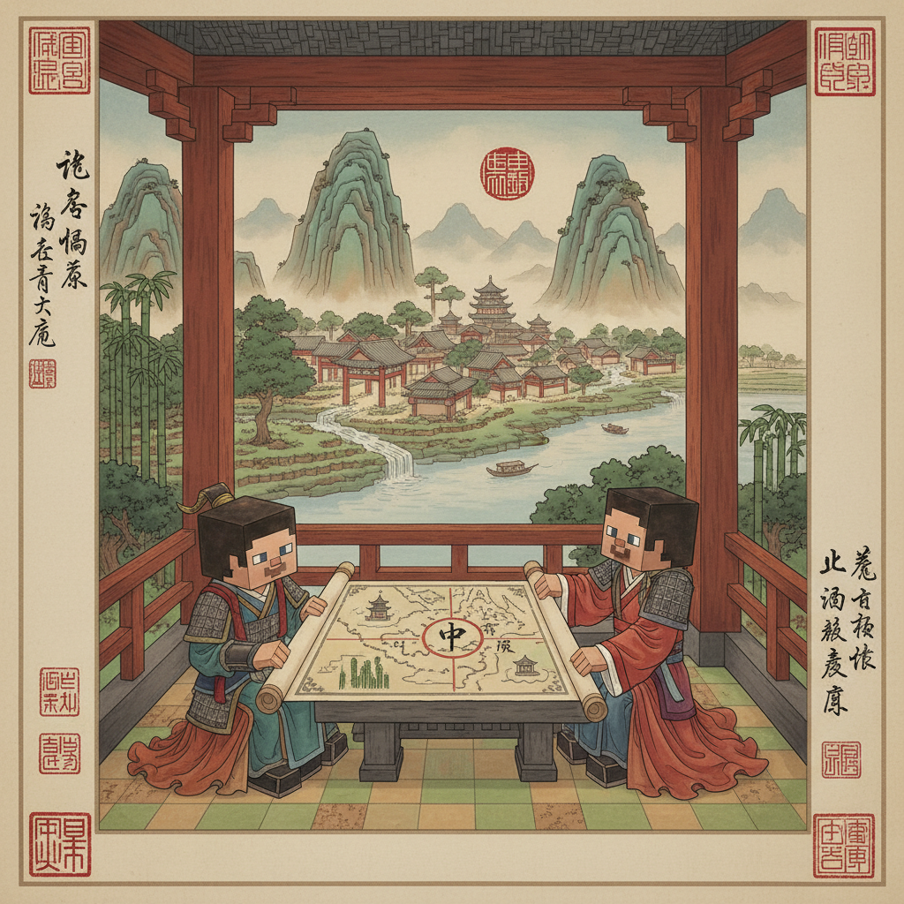
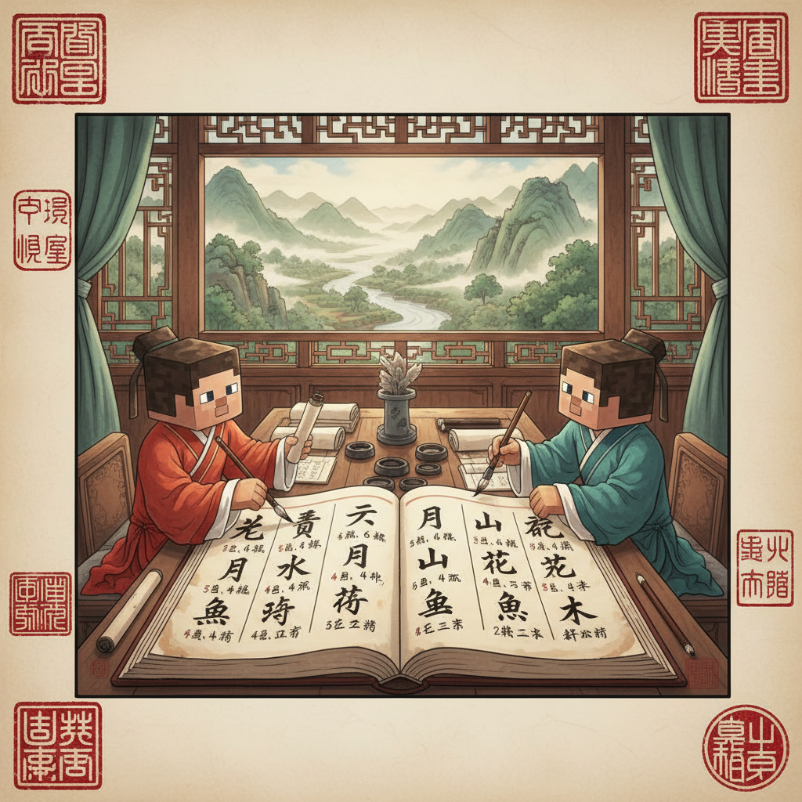
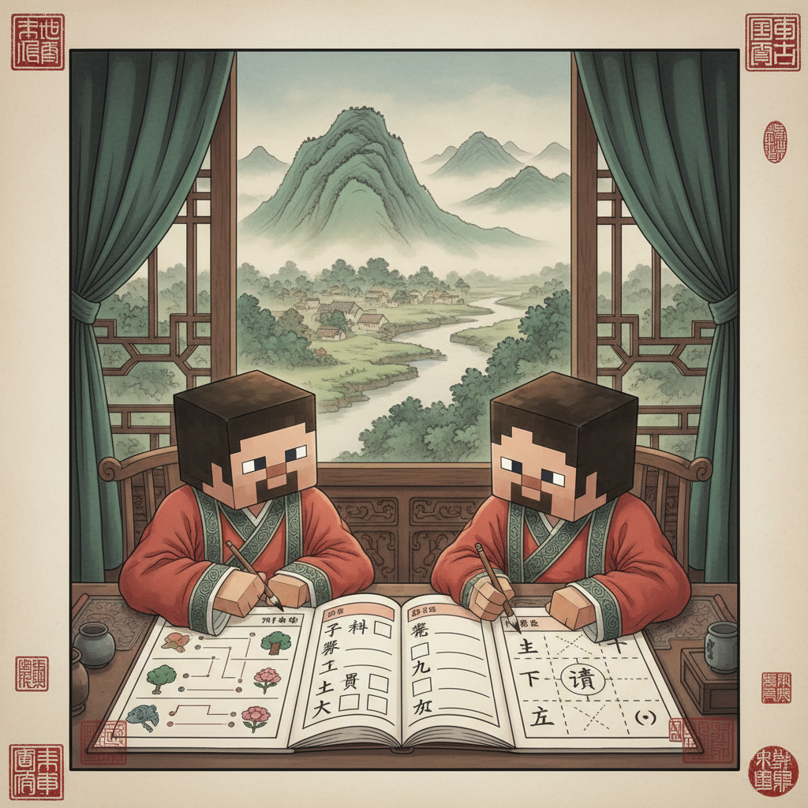

# 第3课 天地人

## 📋 学习目标
- 认识 10 个新字：**天 地 人 你 我 他 上 下 左 右 中**
- 能用这些字介绍自己和别人
- 掌握每个字的笔画顺序

---

## 🎬 第一页：欢迎来到村庄

穿过森林，Steve 和 Alex 来到了一个热闹的村庄。

很多村民在广场上忙碌着：有的在修房子，有的在种田，有的在做饭。

> "哇，这里真热闹！"

Alex 指着天空说：

> "头上是**天**，脚下是**地**，中间是**人**——这就是我们的世界。"

石碑上刻着三个大字：

```
   天 (tiān)      地 (dì)      人 (rén)
   头上            脚下          中间
```


---

## ✏️ 第二页：天

**天** [tiān] (4画)

> 一 + 大 = 天
> "一"是天空，"大"是人站在地上——天就是人的头顶上的广阔空间。

```
笔画顺序：
①一(横) ②一(横) ③一(横) ④丿㇏(撇捺)

写成口诀：两横加个大，头顶就是天
```

| 笔画 | 写法 |
|------|------|
| ① 一 | 第一横，短一点 |
| ② 一 | 第二横，长一点 |
| ③ 一 | 第三横，比第二横短 |
| ④ 丿㇏ | 撇捺打开，站稳 |

**组词：** 天空(tiān kōng)、今天(jīn tiān)
**句子：** 天是蓝色的。


---

## ✏️ 第三页：地

**地** [dì] (6画)

> 土 + 也 = 地
> 土代表泥土，地就是脚下的土地。

```
笔画顺序：
①一(横) ②丨(竖) ③㇀(提) ④𠃌(横折钩) ⑤丨(竖) ⑥乚(竖弯钩)

写成口诀：土字旁加个也，脚下就是地
```

| 笔画 | 写法 |
|------|------|
| ①②③ | 土字旁：横竖提 |
| ④⑤⑥ | 也字：横折钩 + 竖 + 竖弯钩 |

**组词：** 大地(dà dì)、地面(dì miàn)
**句子：** 地上有花和草。


---

## 🤔 第四页：人

**人** [rén] (2画)

> 我们在第2课学过了！复习一下：
> 丿(撇) + ㇏(捺) = 人（一个人往前走）

```
笔画顺序：
①丿(撇) ②㇏(捺)

写成口诀：撇捺往前，做个好人
```

**组词：** 大人(dà rén)、小人(xiǎo rén)
**句子：** 人有两只手。


---

## 🤔 第五页：你、我、他

三个村民走过来互相打招呼：

> "你(nǐ)好！"
> "我(wǒ)是Bob！"
> "他(tā)是Steve！"

Alex 教 Steve 三个重要的字：

| 字 | 拼音 | 意思 | 笔顺 | 笔画 |
|----|------|------|------|------|
| **你** | nǐ | 你（对方） | ①丿 ②丨 ③丿 ④㇇ ⑤丨 ⑥丿 ⑦丶 | 7画 |
| **我** | wǒ | 我（自己） | ①丿 ②一 ③亅 ④㇀ ⑤亅 ⑥丿 ⑦一 ⑧丿 ⑨丶 | 9画 |
| **他** | tā | 他（别人） | ①丿 ②丨 ③𠃌 ④丨 ⑤乚 | 5画 |

> 记住的秘诀：
> - **你** = ⟨亻⟩(人) + ⟨尔⟩(你)
> - **我** = 一只手上拿着武器（戈），保卫自己
> - **他** = ⟨亻⟩(人) + ⟨也⟩(也)

**对话练习：**
> "**你**叫什么名字？" (What's your name?)
> "**我**叫Steve。" (I'm Steve.)
> "**他**是我的朋友。" (He is my friend.)


---

## 🤔 第六页：上、下、左、右、中

村长在广场中央指着四面：

> "在我们村里，跟人指路需要用到方向字！"

| 字 | 拼音 | 意思 | 像什么 | 笔画 |
|----|------|------|--------|------|
| **上** | shàng | 上面 ↑ | 一个东西在线的上面 | 3画 |
| **下** | xià | 下面 ↓ | 一个东西在线的下面 | 3画 |
| **左** | zuǒ | 左边 ← | 用左手做工 | 5画 |
| **右** | yòu | 右边 → | 用右手吃饭 | 5画 |
| **中** | zhōng | 中间 ↔ | 一个口被穿过 | 4画 |

**上：(3画)** ①丨 ②一 ③一
**下：(3画)** ①一 ②丨 ③丶
**左：(5画)** ①一 ②丿 ③一 ④丨 ⑤一
**右：(5画)** ①一 ②丿 ③丨 ④𠃍 ⑤一
**中：(4画)** ①丨 ②𠃍 ③一 ④丨

> 教你区分左和右：
> - **左** = 𠂇(左手) + 工(做工)，左手做工
> - **右** = 𠂇(右手) + 口(吃饭)，右手吃饭


---

---

> 【标A: 语文课标一上·识字与写字·认识常用汉字（象形字→楷体）】

### ❌常见误解

| ❌ 错误写法/理解 | ✅ 正确写法/理解 |
|-------|-------|
| "日"写成"目"（中间多一横） | 日=太阳，中间一横，不是两横 |
| "山"写成三竖一样高 | 中间一竖最高，两边的低 |
| "水"的笔画随便写 | 笔顺：竖钩 → 横撇 → 撇 → 捺 |
| 把象形字当画看，不记字形 | 象形字是"从画变来的字"，要记住现在的样子 |

🧠 想一想
1. **观察推理**：为什么"日"里面只有一横而不是两横？（提示：太阳只有一个）
2. **反事实**：如果古人把"山"画成三座一样高的山峰，现在的"山"字会是什么样子？

## 🔗 跨科连接
数学第1课教数字1-10 → 语文同步教一二三
英语Lesson 2教ABC字母 → 中英文字对比认知

## 📖 第七页：小词典

| 字 | 拼音 | 笔画 | 笔顺 | 组词 | 句 |
|----|------|------|------|------|-----|
| 天 | tiān | 4 | 一一一丿㇏ | 天空、今天 | 天很蓝。 |
| 地 | dì | 6 | 一丨㇀𠃌丨乚 | 大地、地上 | 地很大。 |
| 人 | rén | 2 | 丿㇏ | 大人、小人 | 人有朋友。 |
| 你 | nǐ | 7 | 丿丨丿㇇丨丿丶 | 你好、你们 | 你好吗？ |
| 我 | wǒ | 9 | 丿一亅㇀亅丿一丿丶 | 我们、自我 | 我叫Steve。 |
| 他 | tā | 5 | 丿丨𠃌丨乚 | 他们、他人 | 他是朋友。 |
| 上 | shàng | 3 | 丨一一 | 上面、上山 | 上山去。 |
| 下 | xià | 3 | 一丨丶 | 下面、下山 | 下山来。 |
| 左 | zuǒ | 5 | 一丿一丨一 | 左边、左右 | 左边有树。 |
| 右 | yòu | 5 | 一丿丨𠃍一 | 右边、右手 | 右边有人。 |
| 中 | zhōng | 4 | 丨𠃍一丨 | 中间、中心 | 中间有路。 |



---

## ✏️ 第八页：练习——谁是谁？

**练习1：连线**
把单字和它的意思连起来：

```
天         →    脚下的大地
地         →    头顶的天空
你         →    自己
我         →    对方
他         →    第三个人
```

**练习2：填空**
```
1. （你/我）____叫Steve。
2. （你/我）____叫什么名字？
3. （他/我）____是Bob。
```

**练习3：指方向**
村长："请大家____（上/下）山！"
Steve："我要往____（左/右）走！"
Alex："我在____（中/上）间等你们！"



---

## 🎯 第九页：挑战——村长问路

村长给 Steve 出了三个问题：

**第一关：选择题**
```
"站在天地之间的，是什么？"
A) 天  B) 地  C) 人 ✅
```

**第二关：找到正确的字**
```
"你的朋友是_____？"
A) 你  B) 我  C) 他 ✅
```

**第三关：方向迷宫**
Steve 要到村长的家。在迷宫里，只有正确的方向指令才能到达：
```
→ → 右 右
↓ 下
→ 右 → 右 → 右
↓ 下
← 左 到达！
```

你能帮 Steve 走出迷宫吗？



---

## 🎉 第十页：第3课完成！

> "我学会了11个重要的汉字！"
>
> "有了这些字，"Alex 说，"你就可以介绍自己、问候别人、指路了！"

> 🏆 **获得「天地人」徽章！**
> 📦 **累计识字：28个**

### 本课新字总表（带笔顺）
```
天(tiān) ①②③④  地(dì) ①②③④⑤⑥  人(rén) ①②
你(nǐ) ①②③④⑤⑥⑦  我(wǒ) ①②③④⑤⑥⑦⑧⑨
他(tā) ①②③④⑤  上(shàng) ①②③  下(xià) ①②③
左(zuǒ) ①②③④⑤  右(yòu) ①②③④⑤  中(zhōng) ①②③④
```
