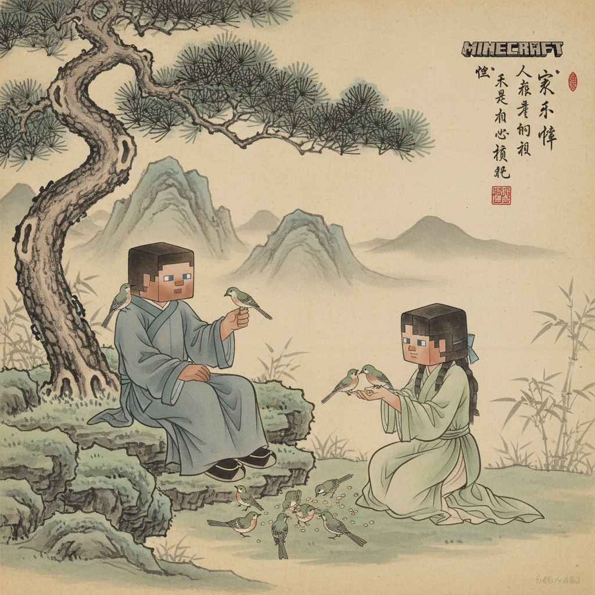
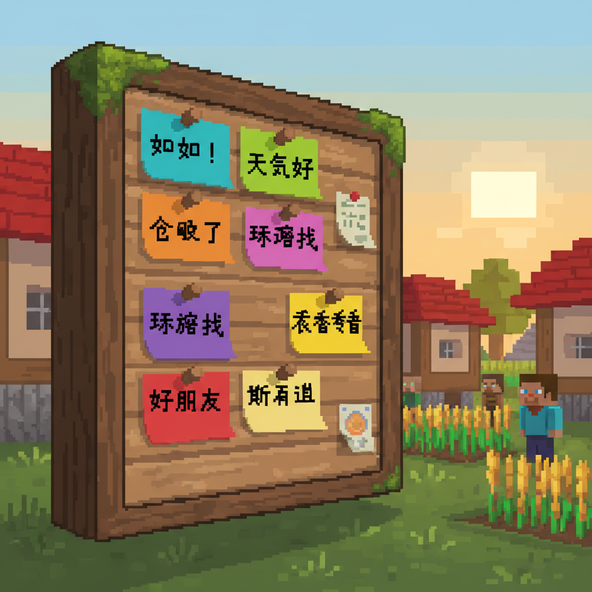
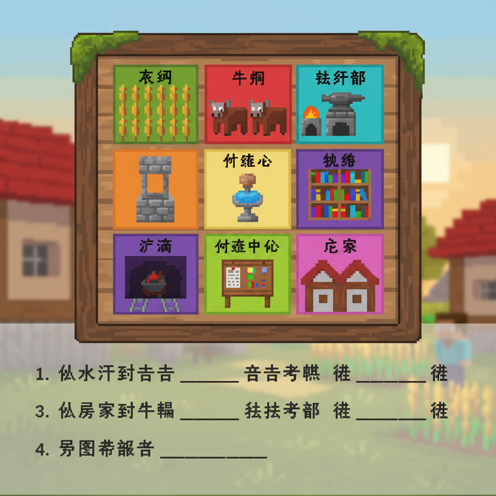

# 第3课 拓展篇 — 村庄里的一日

> 📖 **先完成《天地人》基础篇，再来这里！**

---

## 📋 学习目标
- 巩固 11 个核心字：天 地 人 你 我 他 上 下 左 右 中
- 用这些字进行简单的对话
- 学会"们"字（你们、我们、他们）

---

## 🤔 第一页：新的一天才开始

第二天早上，Steve 在村庄的小屋里醒来。

> "天亮了！今天我要做什么呢？"

Bob 敲门：

> "**你**醒啦！**我**们一起去农场吧！"
>
> "**他**们也都在！"



---

## 🤔 第二页：们——多个人

Alex 教 Steve 一个新字：

> "昨天学了 **你、我、他**——单人。"
>
> "如果想**很多人**一起说，加一个**们**字！"

| 单数 | 复数 |
|------|------|
| 你 nǐ | 你们 nǐ men |
| 我 wǒ | 我们 wǒ men |
| 他 tā | 他们 tā men |

**们** [men] (5画)
> 亻(人) + 门(门)
> 一个人站在门口，外面有很多人——就是"们"。

```
笔画顺序：①丿 ②丨 ③丶 ④丨 ⑤𠃍 ⑥一
写成口诀：人在门边，多个人们
```

> "**我们**是朋友！" (We are friends!)
> "**你们**好！" (Hello everyone!)
> "**他们**在田里。" (They are in the field.)


---

## ✏️ 第三页：谁在这里？

村庄里有一个公告栏，上面贴着各种消息。

Steve 读着公告栏：

```
天晴了！     (The sky is clear!)
地上有花。   (There are flowers on the ground.)
人在田里。   (People are in the field.)
你在哪里？   (Where are you?)
我在村口。   (I'm at the village gate.)
他在山上。   (He is on the mountain.)
```

> 你能读懂这些句子吗？每一个字都是我们学过的！

**读一读，指一指：**
1. "天"在哪里？→ 第一个字！
2. "地"在哪里？→ 第二个句子！
3. "你"出现了几次？→ ____次


---

## ✏️ 第四页：方位游戏

Alex 画了一张村庄地图：

| 🏠 村口 | 🌲 森林 | ⛰️ 山 |
|---------|---------|-------|
| 🌊 河边 | 🏪 商店 | 🌾 农田 |
| 🗿 广场 | 🏡 Bob家 | 🏫 学校 |

**根据地图填空：**
```
1. 山在____边。（上/下/左/右） → 右
2. 河在____边。 → 左
3. 农田在商店的____边。 → 下
4. 广场在中____。 → 中间
```

**句子练习：**
```
天上有___
地上有___
左边有___
右边有___
中间有___
```



---

## 🎯 第五页：挑战——翻译官

Alex 说中文，Steve 能翻译成英文吗？

| 中文 | English |
|------|---------|
| 你好！ | _____ |
| 我叫Steve。 | _____ |
| 他是我的朋友。 | _____ |
| 我们在山上。 | _____ |
| 你们好！ | _____ |
| 天上有太阳 | _____ |
| 地上有人 | _____ |

> 💡 **Bonus Challenge:**
> 用学过的字写出你自己的句子！



---

## 🎉 第六页：复习教室

所有村民都聚集在广场上，村长说：

> "今天，我们学习了最重要的汉字。"
>
> "天、地、人——这是我们生活的世界。"
> "你、我、他——这是和我们一起生活的人。"
> "上、下、左、右、中——这是我们在世界中的位置。"

Steve 点点头：

> "有了这些字，我可以在村庄里问路了、打招呼了、介绍自己了！"

> 🏆 **获得「小翻译官」徽章！**
> 💎 +5 绿宝石

### 拓展篇小结
- ✅ 巩固：天 地 人 你 我 他 上 下 左 右 中
- ✅ 新学：们
- ✅ 学会了说复数："我们""你们""他们"
- ✅ 累计识字：**29个字**

> ➡️ **下一课：大自然——云雨风雪花鸟虫！**
