# 第4课 大自然

## 📋 学习目标
- 认识 10 个新字：**云 雨 风 雪 星 花 草 虫 鸟**
- 学会描写自然现象的基本句式
- 掌握每个字的笔画顺序

**累计识字：36字**（前课26 + 本课10）

---

## 🎬 第一页：天空在变脸

Steve 和 Alex 在村庄安顿下来，第二天一早出门干活。

> "咦，天空怎么在变？"

刚才还是蓝蓝的天，突然飘来一团团白色的东西。

> "看，那是**云**！"Alex 指着天空。

```
   云 (yún)  — 天上的棉花糖
```

但云越来越厚，慢慢变成灰色……

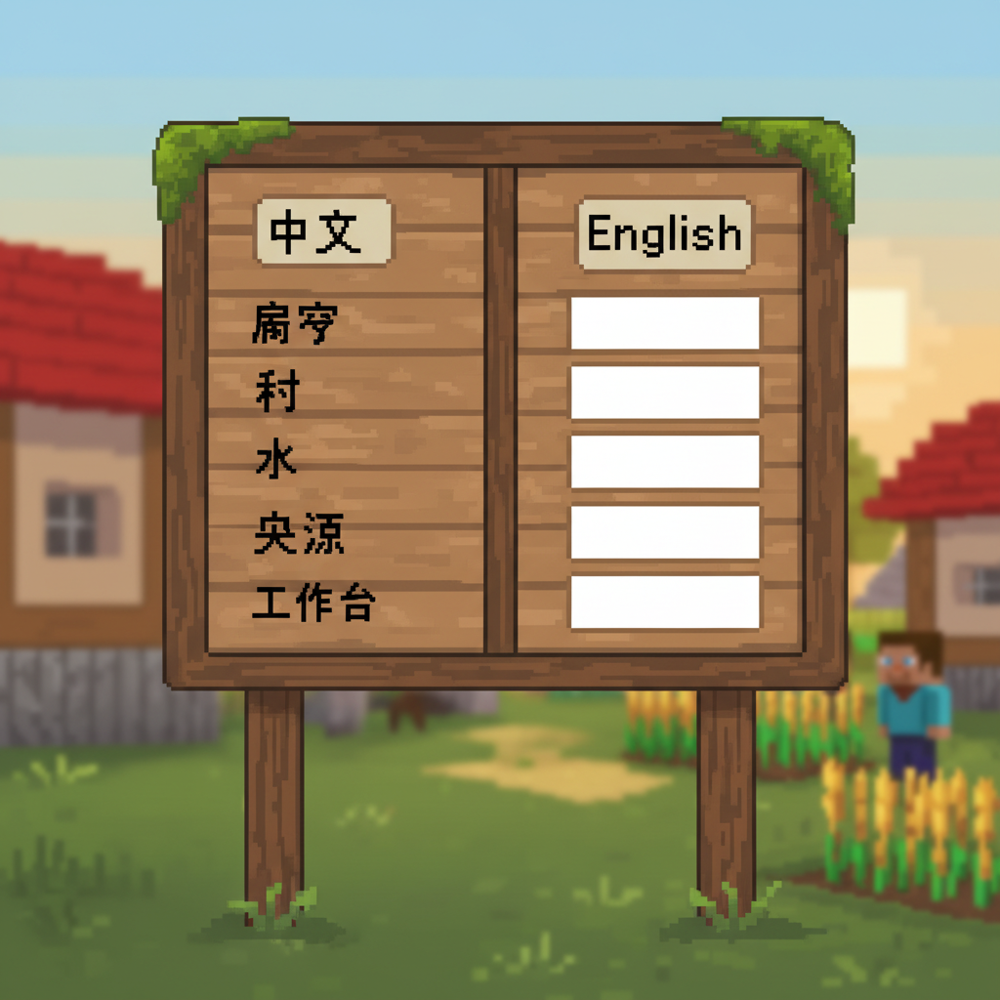

---

## ✏️ 第二页：云

**云** [yún] (4画)

> "二"字上面加个"厶"（私字边）——云就是在天上飘来飘去的东西。

```
笔画顺序：
①一(横) ②一(横) ③一()(撇折) ④丶(点)

写成口诀：两横上面，一折一点，天上白云
```

| 笔画 | 写法 |
|------|------|
| ① 一 | 短横 |
| ② 一 | 长横，比第一横长 |
| ③ 一 | 撇折（先撇后折） |
| ④ 丶 | 点在折脚下 |

**组词：** 白云(bái yún)、云朵(yún duǒ)
**句子：** 白云在天上。

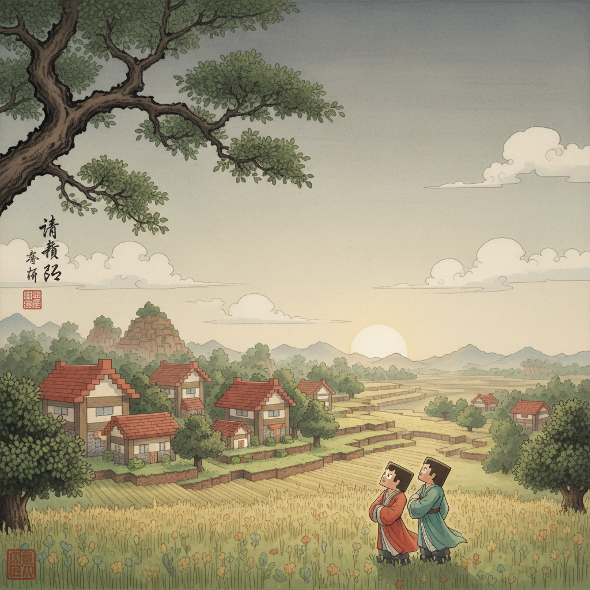

---

## 🎬 第三页：下雨了

云越来越黑。

> "啪！"一滴水掉在 Steve 头上。

哗啦啦——大雨来了！

```
   雨 (yǔ)  — 天上下来的水
```

Steve 赶紧跑进屋檐下：

> "这是**雨**！快躲起来！"

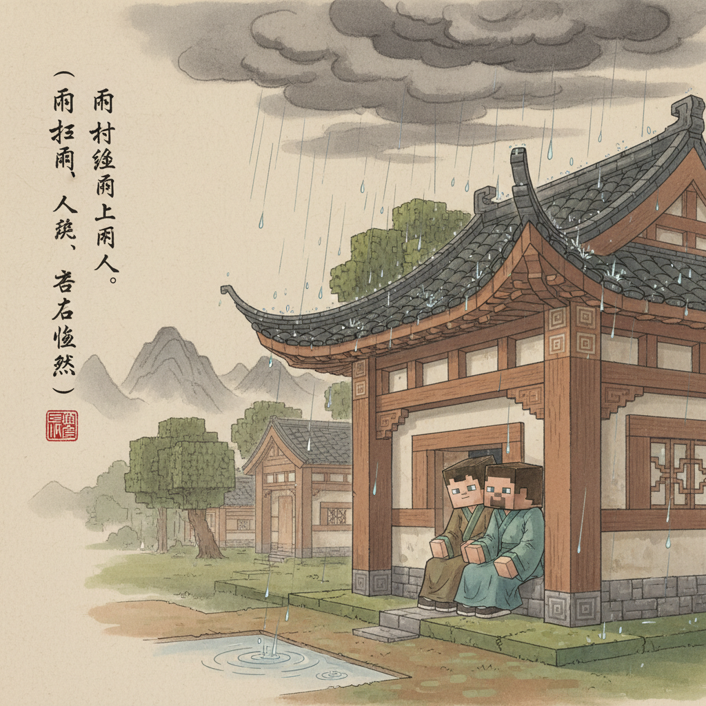

---

## ✏️ 第四页：雨

**雨** [yǔ] (8画)

> "雨"看起来像一个窗户，里面有小水滴。

```
笔画顺序：
①一(横) ②一(横) ③一(竖) ④一(横折钩) ⑤一(竖) ⑥丶(点) ⑦丶(点) ⑧丶(点) ⑨丶(点)

写成口诀：横横竖折再一竖，四点小雨落进来
```

| 笔画 | 写法 |
|------|------|
| ① 一 | 顶横 |
| ② 一 | 短横 |
| ③ 一 | 竖 |
| ④ 一 | 横折钩，左边框 |
| ⑤ 一 | 中竖 |
| ⑥⑦⑧⑨ | 四个点，像雨滴 |

**组词：** 下雨(xià yǔ)、雨水(yǔ shuǐ)
**句子：** 下雨了，天上有很多云。


---

## 🎬 第五页：起风了

雨停了。

> "呼呼——"突然来了一阵大风，把 Alex 的帽子吹飞了！

```
   风 (fēng) — 看不见但能感觉到
```

树被吹得摇摇摆摆，地上的叶子飞起来。

> "好大的**风**！追我的帽子！"

Steve 追着帽子跑，Alex 哈哈大笑。

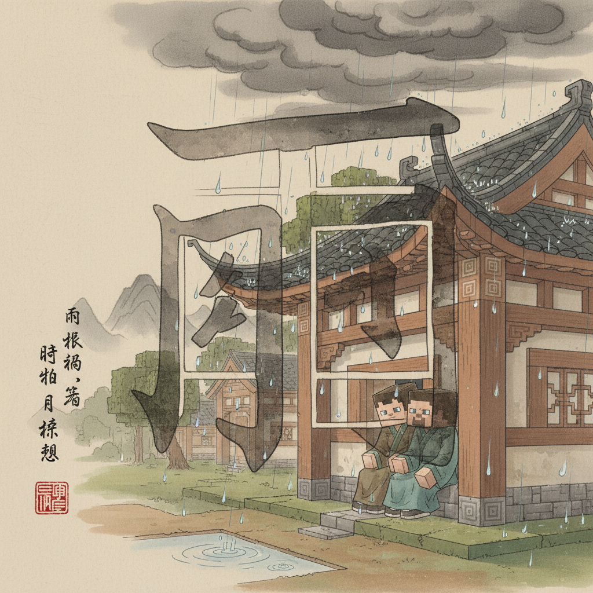

---

## ✏️ 第六页：风 + 雪

**风** [fēng] (4画)

```
笔画顺序：
①丿(撇) ②一(横折弯钩) ③丿(撇) ④丶(点)

写成口诀：一撇一弯钩，一撇一点收，风吹起来有力量
```

**组词：** 大风(dà fēng)、风雨(fēng yǔ)
**句子：** 大风来了，云跑了。

---

天慢慢变冷了。

> "阿嚏！"Alex 打了个喷嚏。

天空飘下白白的小东西——不是雨，也不是云。

> "这是**雪**！"Steve 兴奋地喊。

**雪** [xuě] (11画)

> 上面是"雨"，下面是"彐"——雨变成了白色小羽毛。

```
笔画顺序：
①一(横)②一(横)③一(竖)④一(横折钩)⑤一(竖)⑥丶⑦丶⑧丶⑨丶⑩一(横折)⑪一(横)⑫一(横)

写成口诀：雨字头占上面，三横一折在下边
```

**组词：** 下雪(xià xuě)、雪花(xuě huā)
**句子：** 下雪了，大地是白的。

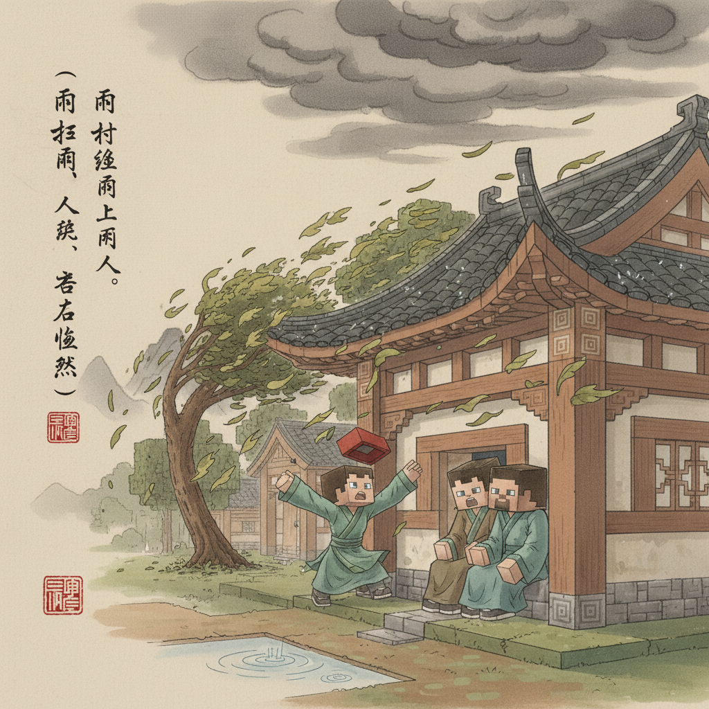

---

## 🎬 第七页：满天的星星

傍晚来临，风雪停了。

Steve 和 Alex 坐在村口的山坡上，仰头看天。

天黑了，但天上出现了无数亮点。

```
   星 (xīng) — 黑夜里的光
```

> "天上好多小灯！那是**星**星！"

Alex 伸出手，仿佛要摘一颗。

> "一颗、两颗、三颗……太多了数不完！"

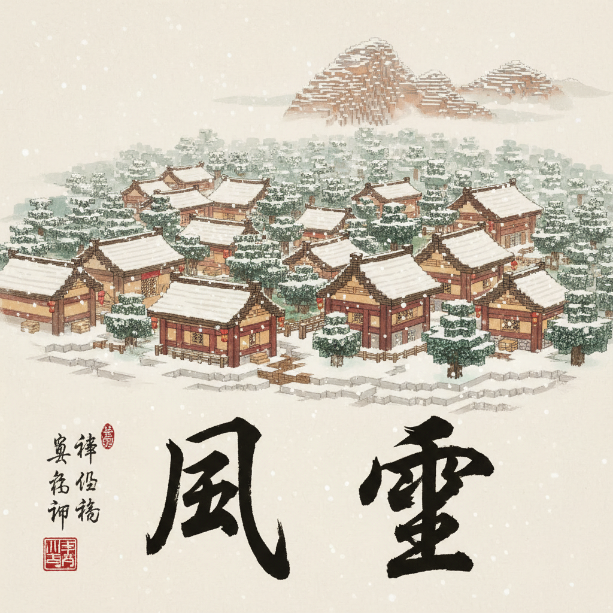

---

## ✏️ 第八页：星

**星** [xīng] (9画)

> 上面"日"是太阳，下面"生"是出生——太阳妈妈生出来的光点点。

```
笔画顺序：
①一(竖)②一(横折)③一(横)④一(横)⑤丿(撇)⑥一(横)⑦一(横)⑧一(竖)⑨一(横)

写成口诀：日字头，生字脚，星星天上闪闪亮
```

**组词：** 星星(xīng xīng)、星空(xīng kōng)
**句子：** 天上有很多星星。

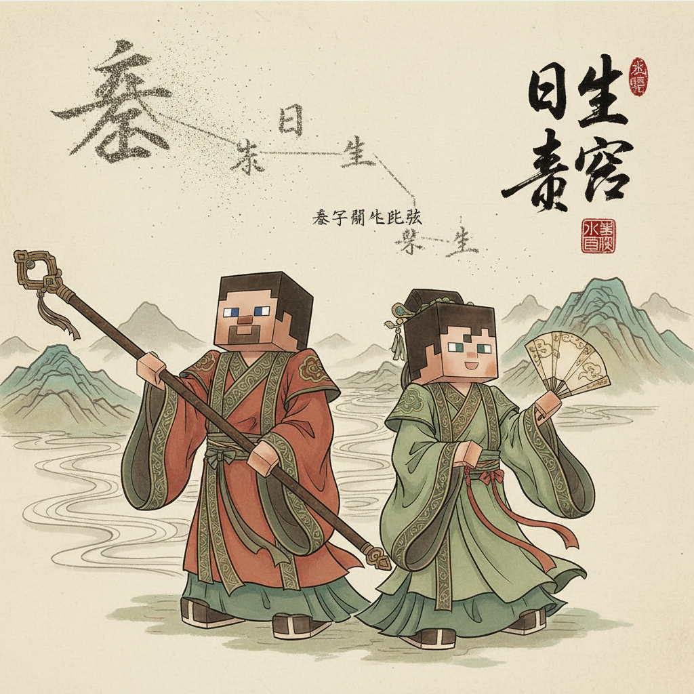

---

## 🎬 第九页：花和草的世界

第二天，太阳出来了。

昨天的雨水让大地上长出很多新生命。

```
   花 (huā)   草 (cǎo)
   红红绿绿    一大片一大片
```

Steve 指着地上：

> "看！开了好多**花**！旁边一大片是**草**。"

蜜蜂在花间飞来飞去，草地绿油油的。


---

## ✏️ 第十页：花 + 草

**花** [huā] (7画)

```
笔画顺序：
①一(横)②一(竖)③一(竖)④丿(撇)⑤一(竖)⑥丿(撇)⑦一(竖弯钩)

写成口诀：草字头，化字脚，花儿开在草地好
```

**组词：** 花朵(huā duǒ)、小花(xiǎo huā)
**句子：** 草地上开了三朵花。

---

**草** [cǎo] (9画)

```
笔画顺序：
①一(横)②一(竖)③一(竖)④一(竖)⑤一(横折)⑥一(横)⑦一(横)⑧一(横)⑨一(竖)

写成口诀：草字头，早字底，地上长满小青绿
```

**组词：** 小草(xiǎo cǎo)、草地(cǎo dì)
**句子：** 小草是绿色的。

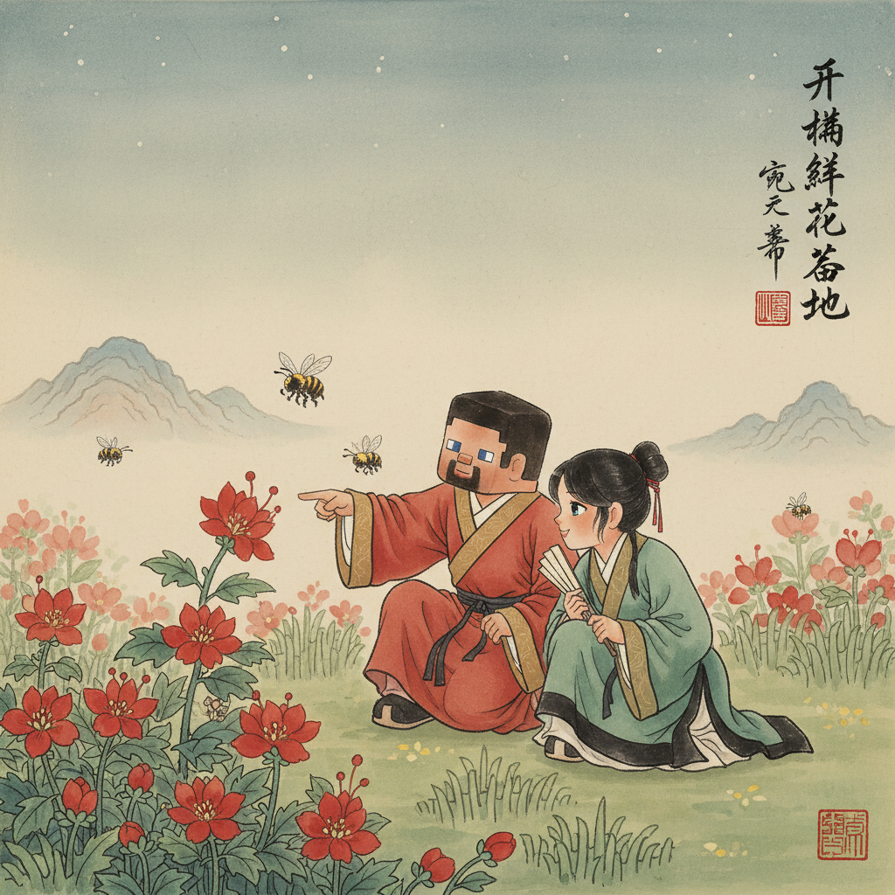

---

## 🎬 第十一页：虫和鸟

草丛里有动静！

> "叽叽叽——"

一只小虫从草里爬出来。

```
   虫 (chóng) — 小小的，会爬
```

突然，树上一只鸟飞起来，叫着从头顶掠过。

```
   鸟 (niǎo)  — 有翅膀，会飞
```

> "**虫**在地上爬，**鸟**在天上飞。"Alex 总结。

Steve 笑了："一个在地上走，一个在天上走。"

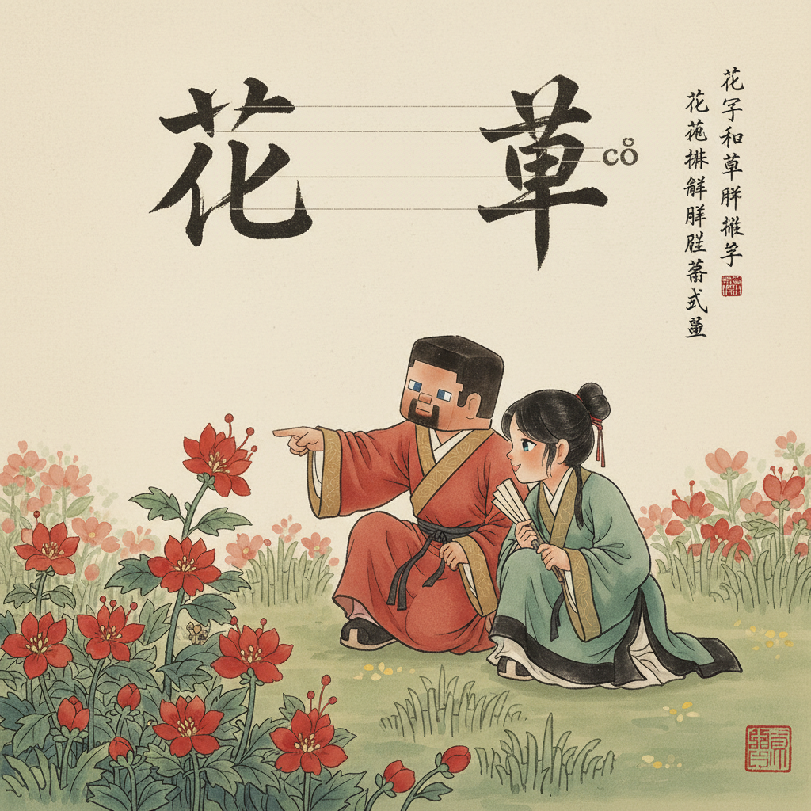

---

## ✏️ 第十二页：虫 + 鸟

**虫** [chóng] (6画)

```
笔画顺序：
①一(竖)②一(横折)③一(横)④一(竖)⑤一(提)⑥丶(点)

写成口诀：口字框，中间一竖一提，尾巴一点收
```

**组词：** 虫子(chóng zi)、小虫(xiǎo chóng)
**句子：** 小虫在草里走。

---

**鸟** [niǎo] (5画)

```
笔画顺序：
①丿(撇)②一(横折钩)③丶(点)④一(竖折折钩)⑤一(横)

写成口诀：一撇横折加点眼，竖折弯钩展翅膀，最后一横是鸟脚
```

**组词：** 小鸟(xiǎo niǎo)、飞鸟(fēi niǎo)
**句子：** 小鸟在天上飞。

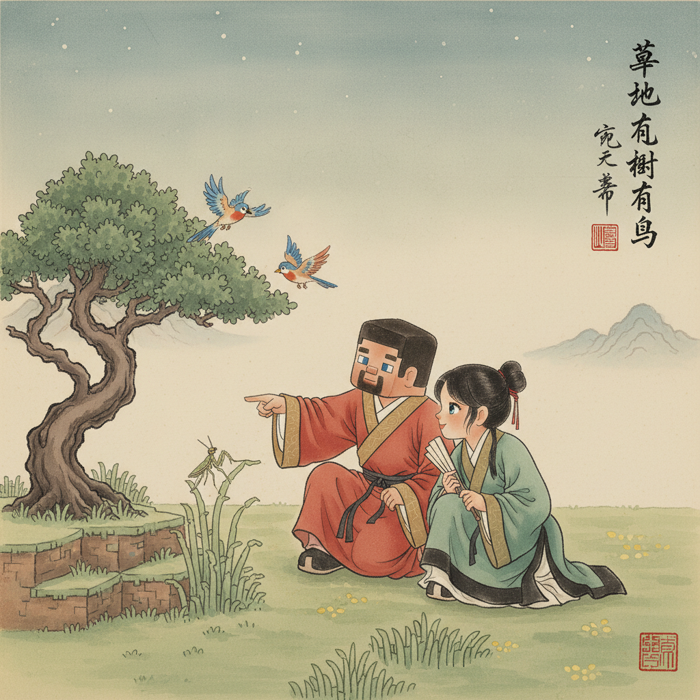

---

## 🎯 第十三页：故事时间 — 大自然的宝藏

Steve 和 Alex 拿出一个小本子，把今天看到的都记下来。

> "天空有**云**，云带来**雨**，雨后有大**风**。"
> "冬天下**雪**，夜晚有**星**星。"
> "春天**花**开，满山是**草**，**虫**儿爬，**鸟**儿飞。"

Alex 开心地说：

> "大自然真好！天天都有新东西看。"

Steve 在旁边画了一幅画：
- 天上的云、星星、太阳
- 地上的花、草、树
- 空中的雨、雪、风、鸟

> "这就是**大自然**——天地之间的一切。"


---

## 📝 练习

### 一、认一认（连线题）

| 你的任务 |
|----------|
| **云** → 天上看 / 地上走 |
| **雨** → 天上下来的水 / 地上的水 |
| **星** → 白天有 / 晚上有 |
| **花** → 红的黄的 / 黑色的 |
| **鸟** → 会飞 / 会游泳 |

### 二、填一填 — Steve 的观察笔记

Steve 在看天。天上有什么？用新字填空：

> 天上有 ____（白白的）、____（掉水的）、____（会飞的）。
> 晚上有 ____（亮亮的）。地上有 ____（红的黄的）和 ____（绿的）。
> 还有 ____（爬的）和 ____（飞的）。

### 三、读一读 — 大自然儿歌

```
 风 吹 云，天 上 跑，
 雨 落 地，草 儿 笑。
 星 星 亮，花 儿 开，
 小 虫 爬，小 鸟 叫。
```

---

## 🏆 挑战

你是大自然探险家！完成四个任务：

**第一关：说出自然**
Steve 指什么你叫什么：
1. 指太阳旁的白色 → ___

**第二关：画大自然**
A. 天上飘着 → ___
B. 满天小雨 → ___
C. 夜晚星空 → ___

**第三关：字找朋友**
- 天 + ___ = 天气真好
- ___ + 风 = 大风吹
- 下 ___ = 冬天来了
- 小 ___ 在天上飞
- 小 ___ 在草里爬

**第四关：对文字**
| 白云 | 天上飞的白云 |
| 星星 | 晚上的光亮 |
| 小鸟 | 会飞的朋友 |
| 红花 | 草地里的小花 |

---

## 📊 本课小结

我把什么字种进了文字花园？
- [ ] 云 — 天上的棉花糖
- [ ] 雨 — 天上下来的水
- [ ] 风 — 看不见但能感觉到
- [ ] 雪 — 白色的小羽毛
- [ ] 星 — 黑夜里的光
- [ ] 花 — 红的黄的
- [ ] 草 — 绿的一大片
- [ ] 虫 — 在地上爬
- [ ] 鸟 — 在天上飞

> **累计识字：36字**
> 日 | 月 | 山 | 水 | 火 | 木 | 田 | 石
> 一 | 十 | 人 | 大 | 天 | 太 | 个 | 八 | 入
> 天 | 地 | 人 | 你 | 我 | 他 | 上 | 下 | 左 | 右 | 中
> **云 | 雨 | 风 | 雪 | 星 | 花 | 草 | 虫 | 鸟**

---

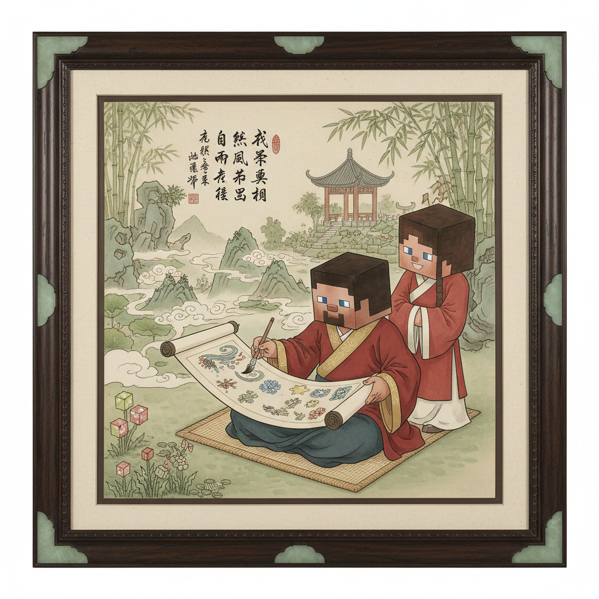
