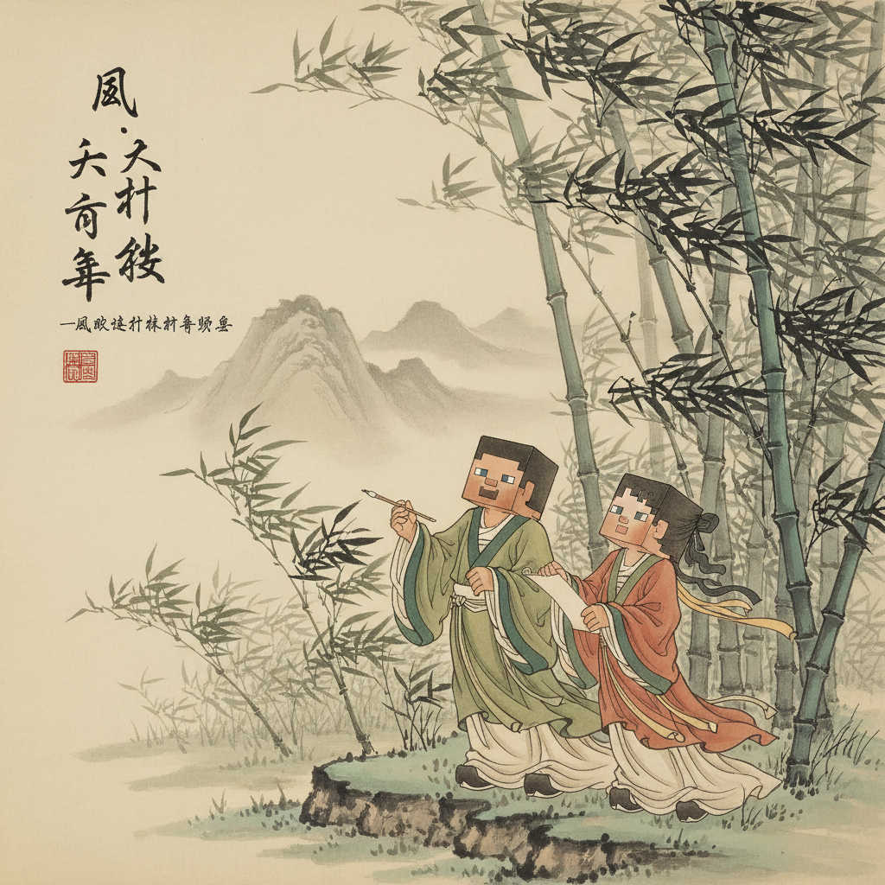

# 第4课 拓展篇：大自然探险队

## 📋 学习目标
- 巩固第4课 9 个字：云雨风雪星花草虫鸟
- 学会在不同场景中灵活运用
- 新增关联字：光 林 叶（+3字）

**累计累计：39字**

---

## 🎬 第一页：探险队出发！

今天是个大晴天。

> "我们组一个**大自然探险队**！"Steve 提议。

Alex 立刻答应了。他们把今天要完成的任务写在一张纸上：

```
  探险清单：
  ☐ 找到白云 —— 在天上 ✓
  ☐ 找到下雨 —— 在云里
  ☐ 找到大风 —— 它看不见
  ☐ 找到星星 —— 晚上才能看到
  ☐ 找到花朵 —— 草地上
  ☐ 找到小鸟 —— 树上
```

> "六个任务！今天一定很有趣。"



---

## 🎬 第二页：任务一 — 森林中的光

两人走进一片密密的树林（**林** = 两个木）。

树林里暗暗的。突然，一束阳光从叶子（**叶**）间透下来。

```
   光 (guāng) — 带来光明的东西
```

> "看，林子里的**光**！"Alex 指着。

**光** [guāng] (6画)

```
笔画顺序：①一(竖)②丶(点)③丿(撇)④一(横)⑤丿(撇)⑥一(竖弯钩)

写成口诀：一竖一点撇加横，再一撇来弯钩收，光明照大地
```

**组词：** 阳光(yáng guāng)、星光(xīng guāng)
**句子：** 星星会发光。


---

## 🎬 第三页：任务二 — 寻云记

走出树林，一片大草地。

> "任务一完成！开始找云！"

Steve 抬头：

> "那边！大**白云**！像一只小狗。"

Alex 看了："我看像一朵**大花**！"

```
   白云像什么？
   🐕 小狗？  🌸 花朵？  ⭐ 星星？
```

两人大笑——云真是个有趣的东西。

> "有**风**的时候，云飞得最快。"


---

## 🎬 第四页：任务三、四 — 风云突变

还没找到第三朵云，天就变了。

> "轰隆隆——"

远处传来雷声。大风吹起来，白云变成了灰云。

```
   风带来雨，云带来雪。
   大自然的变化真快！
```

> "下雨了！下大雨了！" —— 雨滴打下来。

几分钟后，雨变小了。然后……

> "看！天上挂了一条彩色桥！"

🌈 一道彩虹跨在天边。

> "风过了，雨停了，**彩虹**出来了！"


---

## 🎬 第五页：任务五 — 花草地

走路的时候，Alex 发现脚边长满了东西。

> "这是**花**！红花、蓝花、黄花……"

花旁边是一大片绿绿的**草**。草里还有小虫在爬。

```
   花草在一起，就是一个花园 🏡
```

**叶** [yè] (5画) — 新的字！

> "花有**叶**，草也有叶。叶子是植物的小手。"

```
笔画：①一(竖)②一(横折)③一(横)④一(横)⑤一(竖)
口诀：口字旁，十字脚，树上长叶少不了
```

**组词：** 叶子(yè zi)、树叶(shù yè)


---

## 🎬 第六页：任务六 — 鸟和虫的对话

一棵大树上有只小鸟。

> "叽叽！"小鸟叫。

树下草丛里，一只小虫爬出来。

```
   小鸟说："天上真好玩！"
   小虫说："地上也有很多好玩的东西。"
```

Steve 蹲下来：

> "**鸟**在天上飞，**虫**在地上爬——大自然里每个朋友都有自己的家。"

**林** [lín] (8画) — 新的字！

> "两个木，就是**林**。三木是森——很多很多树。"

```
笔画：①一(横)②一(竖)③丿(撇)④丶(点)⑤一(横)⑥一(竖)⑦丿(撇)⑧丶(点)
口诀：左边一个木，右边一个木，两个木字站在一起就是林
```

**组词：** 树林(shù lín)、森林(sēn lín)


---

## 🎬 第七页：回家的星光

天黑了。

> "六个任务都完成了！"Steve 在清单上全部打勾 ✓

两人走在回家的路上。夜空中满天**星星**。

> "今天看了云、雨、风、花、草、鸟、虫……还有这么多**星**星。"

Alex 突然停下：

> "等一等。最大的星星，是不是**太阳**？"

Steve 想了想："太阳白天有，星星晚上有。太阳也是星星的一种。"

> "大自然真大——从天空到地上，从白天到晚上，到处都有好玩的东西。"


---

## 🎯 第八页：探险家测试

### 第一关：谁是谁？

| 描述 | 字 |
|------|-----|
| 天上下来的水 | ? |
| 黑夜里的光 | ? |
| 看不见但能感觉到 | ? |
| 红红绿绿开在草地上 | ? |
| 有翅膀会飞 | ? |
| 两个木站一起 | ? |

### 第二关：大自然填空

> 风大，____ 跑了。天黑，____ 出来了。
> 下雨后 ____ 更绿了。春 ____ 开，小 ____ 飞。

### 第三关：连一连

```
 云  ·  早上有
 雨  ·  天上看
 星  ·  晚上有
 花  ·  天上掉
 鸟  ·  草地上
```

### 第四关：自己写（选一个）

1. 我最喜欢大自然里的 _____（为什么？）
2. 画一个**风雨过后出彩虹**的 Minecraft 图

---

## 📊 拓展课小结

我把什么字种进了文字花园？
- [ ] 光 — 带来光明
- [ ] 叶 — 植物的小手
- [ ] 林 — 很多树在一起
- [ ] 复习了：云雨风雪星花草虫鸟

> **累计识字：39字**
> 云 | 雨 | 风 | 雪 | 星 | 花 | 草 | 虫 | 鸟 | **光 | 叶 | 林**

---


