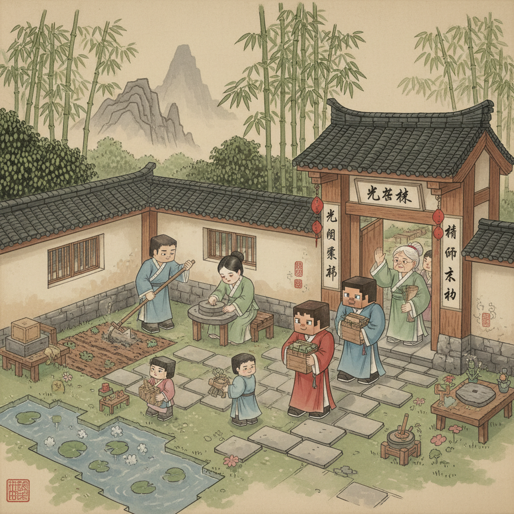
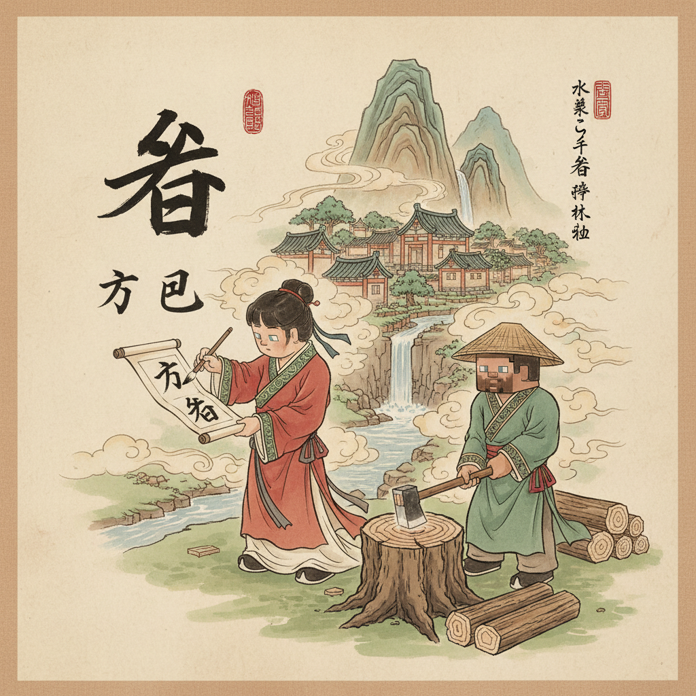
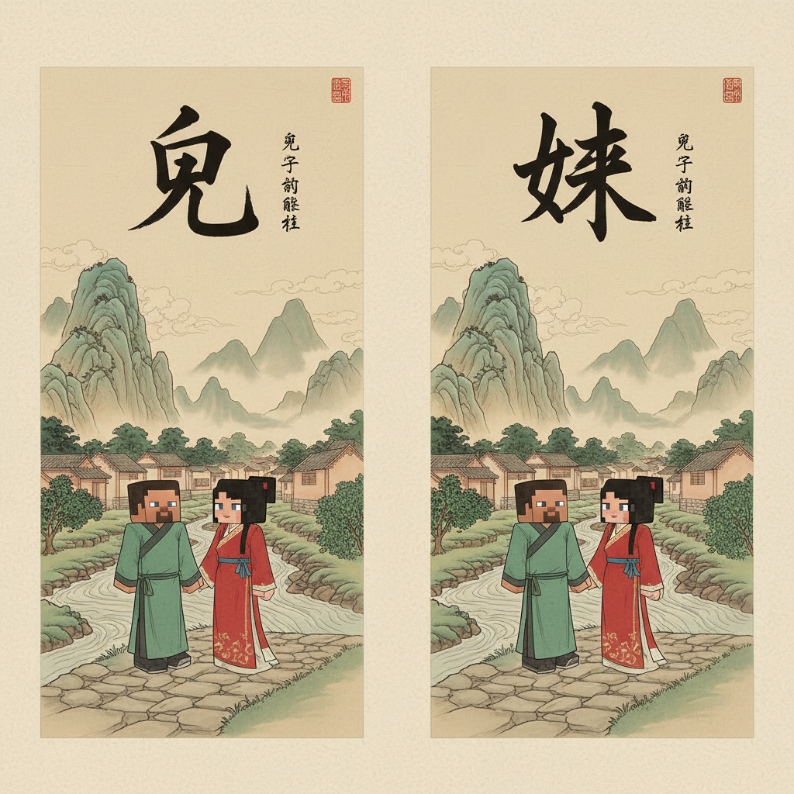

# 第5课 我爱我家

## 📋 学习目标
- 认识 7 个新字：**爸 妈 兄 妹 爷 奶 宝**
- 学会介绍家人
- 掌握每个字的笔画顺序

**累计识字：46字**（前课39 + 本课7）

---

## 🎬 第一页：村庄里的一家人

完成了大自然探险，Steve 和 Alex 回到村里。

一位老奶奶在门口招手：

> "孩子们，过来坐坐！"

她的院子里很热闹：有人在劈柴，有人在做饭，还有两个小朋友在跑。

> "这是你们一家吗？"Alex 问。

> "对，这是我们一家人。"

```
   家 (jiā) — 有屋顶，有猪，有爱的地方
   一家人在一个家里
```

Steve 拿出本子："我要把每个家人都记下来！"



---

## ✏️ 第二页：爸

一位高高大大的村民在劈木头。

> "这是我**爸爸**。"一个小朋友说。

**爸** [bà] (8画)

> 上面是"父"，下面是"巴"——父亲的字。

```
笔画顺序：
①丿(撇)②丶(点)③丿(撇)④丶(点)⑤一(横折)⑥一(竖)⑦一(横)⑧一(竖弯钩)

写成口诀：父字头，巴字底，爸爸高大又有力
```

**组词：** 爸爸(bà ba)、老爸(lǎo bà)
**句子：** 爸爸在天地上干活。



---

## ✏️ 第三页：妈

院子里，一位阿姨在做饭。锅里咕噜咕噜冒着热气。

> "这是我**妈妈**。"小朋友拉着 Alex 去看。

**妈** [mā] (6画)

> 左边"女"，右边"马"——母亲的字。

```
笔画顺序：
①一(撇点)②丿(撇)③一(横)④一(横折)⑤一(竖折折钩)⑥一(横)

写成口诀：女字旁，马字边，妈妈做饭香满天
```

**组词：** 妈妈(mā ma)、老妈(lǎo mā)
**句子：** 妈妈在做饭。


---

## ✏️ 第四页：兄 + 妹

两个小朋友跑了过来。

> "这是我的**哥哥**，这是我的**妹妹**。"

哥哥大一点，妹妹小一点。两人手拉手。

**兄** [xiōng] (5画)

```
笔画顺序：
①一(竖)②一(横折)③一(横)④丿(撇)⑤一(竖弯钩)

写成口诀：口字框加个儿，哥哥就是大哥哥
```

**组词：** 哥哥(gē ge)、兄长(xiōng zhǎng)

---

**妹** [mèi] (8画)

```
笔画顺序：
①一(撇点)②丿(撇)③一(横)④一(横)⑤一(横)⑥一(竖)⑦丿(撇)⑧丶(捺)

写成口诀：女字旁，未字边，妹妹小小走前边
```

**组词：** 妹妹(mèi mei)、小妹(xiǎo mèi)

> "哥哥和妹妹，一个大一个小。"


---

## ✏️ 第五页：爷 + 奶

一位白胡子老人坐在门口的木椅上，晒太阳。

> "这是我**爷爷**。"哥哥指着老人。

**爷** [yé] (6画)

```
笔画顺序：
①丿(撇)②丶(点)③丿(撇)④丶(点)⑤一(横折)⑥一(竖)

写成口诀：父字头，卩字底，爷爷胡子白又密
```

**组词：** 爷爷(yé ye)、老大爷(lǎo dà ye)

---

旁边是刚才招手的老奶奶。

> "这是我**奶奶**。"

**奶** [nǎi] (5画)

```
笔画顺序：
①一(撇点)②丿(撇)③一(横)④一(横折钩)⑤丿(撇)

写成口诀：女字旁，乃字边，奶奶笑容暖心田
```

**组词：** 奶奶(nǎi nai)、牛奶(niú nǎi)

> "爷爷晒太阳，奶奶笑哈哈。"


---

## ✏️ 第六页：宝

奶奶怀里抱着一个小小的人儿。

> "这是我们家最小的——**宝宝**。"

宝宝正在睡觉，小脸红扑扑的。

**宝** [bǎo] (8画)

> 上面是"宀"（宝盖头），下面是"玉"——房子里有玉，最珍贵的东西。

```
笔画顺序：
①丶(点)②丶(点)③一(横钩)④一(横)⑤一(横)⑥一(竖)⑦一(横)⑧丶(点)

写成口诀：宝盖头高高，玉在下边藏，家里有宝宝，比玉还要宝
```

**组词：** 宝宝(bǎo bao)、宝贝(bǎo bèi)
**句子：** 奶奶抱着小宝宝。



---

## 🎬 第七页：全家福

> "来！一起拍个**全家福**！"Steve 说。

一家人站在一起：
- 爷爷坐前面，抱着宝宝
- 奶奶站旁边，笑眯了眼
- 爸爸高大，站在后面
- 妈妈笑着，手搭在哥哥肩上
- 哥哥和妹妹站最前面

> "咔嚓！"

Alex 在本子上写道：

```
   我家一共有 6 个人：
   爷爷、奶奶、爸爸、妈妈、
   哥哥、妹妹——还有我！
```

Steve 数了数："加上你就是 7 个人啦！"


---

## 🎬 第八页：故事时间 — 我的一家人

Steve 想起自己的家人。

> "我也有一个家。爸爸、妈妈，还有一个妹妹。"

> "我也是！"Alex 说。"我有爸爸、妈妈，还有两个哥哥！"

他们一起在本子上画出各自的家：

```
   Steve 的家：          Alex 的家：
   爸 妈 妹              爸 妈 兄 兄
```

> "不管是大家还是小家，家里都有爱。"

Steve 写下一句话：

> 天大地大，家最大。


---

## 📝 练习

### 一、认一认（谁是谁？）

| 描述 | 谁？ |
|------|------|
| 高大有力，劈木头 | ___ 爸 |
| 做饭香满天 | 妈 ___ |
| 胡子白又密 | 爷 ___ |
| 笑容暖心田 | 奶 ___ |
| 比哥哥小一点 | ___ 妹 |
| 家里最小的人 | 宝 ___ |

### 二、填一填

Steve 去朋友家做客，朋友介绍家人：

> "这是我 ___（大个子），这是我 ___（做饭的）。
> 这是我 ___（白胡子），这是我 ___（笑呵呵）。
> 这是我 ___（比我大），这是我 ___（比我小）。
> 还有一个小 ___（最小的）。"

### 三、读儿歌

```
   爸爸高，妈妈好，
   哥哥大，妹妹小。
   爷爷笑，奶奶抱，
   宝宝睡，一家人好。
```

### 四、画一画

拿出纸，画出你的家人。在每个家人旁写上称呼：

```
   我家有___个人：
   □ 爷爷
   □ 奶奶
   □ 爸爸
   □ 妈妈
   □ 其他：___
```

---

## 🏆 挑战 — 家庭大侦探

**第一关：字找部首**

"爸、爷"的上半部分是什么？
A. 父字头  B. 巴字头  C. 八字头

"妈、妹、奶"的左半部分是什么？
A. 马字边  B. 女字旁  C. 口字旁

**第二关：火眼金睛**

下面有几个"妈"字？

```
   吗妈妈吗妈吗妈妈
```

**第三关：家人连线**

```
   爸  ·  最小的
   妈  ·  做菜
   兄  ·  高大
   妹  ·  晒太阳
   爷  ·  比我大
   奶  ·  比我小
   宝  ·  笑呵呵
```

**第四关：模仿Steve写家谱**

照样子写你的家谱：
```
   [你的名字]
      ↑
   爸爸  妈妈
      ↑        ↑
   爷爷  奶奶
```

---

## 📊 本课小结

我把什么字种进了文字花园？
- [ ] 爸 — 高大有力
- [ ] 妈 — 做饭香满天
- [ ] 兄 — 大哥哥
- [ ] 妹 — 小妹妹
- [ ] 爷 — 白胡子晒太阳
- [ ] 奶 — 笑呵呵
- [ ] 宝 — 家里最小的宝贝

> **累计识字：46字**
> 日 | 月 | 山 | 水 | 火 | 木 | 田 | 石
> 一 | 十 | 人 | 大 | 天 | 太 | 个 | 八 | 入
> 天 | 地 | 人 | 你 | 我 | 他 | 上 | 下 | 左 | 右 | 中
> 云 | 雨 | 风 | 雪 | 星 | 花 | 草 | 虫 | 鸟 | 光 | 叶 | 林
> **爸 | 妈 | 兄 | 妹 | 爷 | 奶 | 宝**

---


---

> 【标A: 语文课标一上·识字与写字·认识常用汉字（象形字→楷体）】

### ❌常见误解

| ❌ 错误写法/理解 | ✅ 正确写法/理解 |
|-------|-------|
| "日"写成"目"（中间多一横） | 日=太阳，中间一横，不是两横 |
| "山"写成三竖一样高 | 中间一竖最高，两边的低 |
| "水"的笔画随便写 | 笔顺：竖钩 → 横撇 → 撇 → 捺 |
| 把象形字当画看，不记字形 | 象形字是"从画变来的字"，要记住现在的样子 |

🧠 想一想
1. **观察推理**：为什么"日"里面只有一横而不是两横？（提示：太阳只有一个）
2. **反事实**：如果古人把"山"画成三座一样高的山峰，现在的"山"字会是什么样子？

## 🔗 跨科连接
数学第1课教数字1-10 → 语文同步教一二三
英语Lesson 2教ABC字母 → 中英文字对比认知

