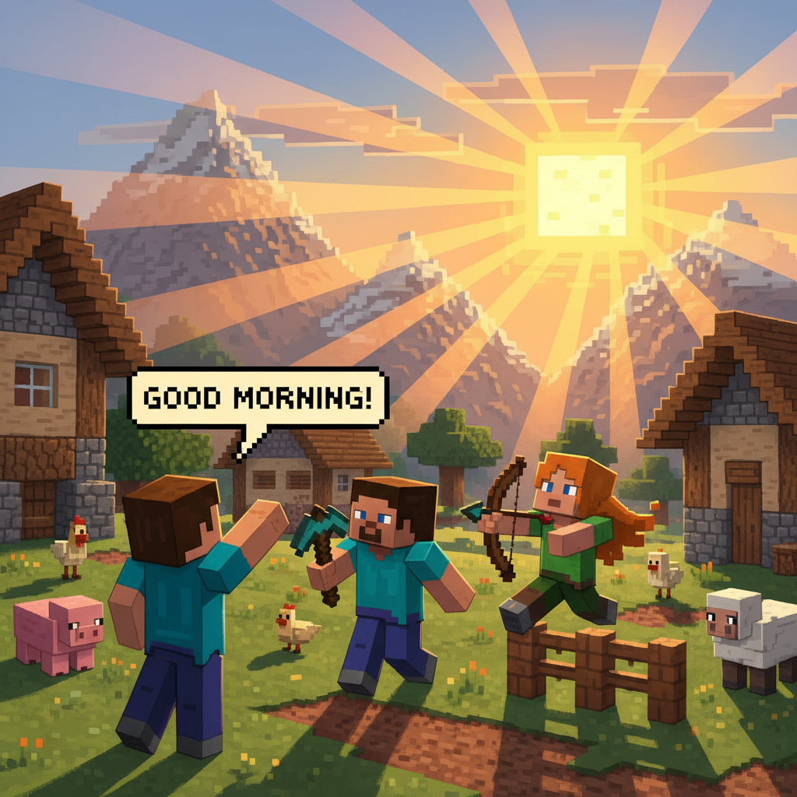
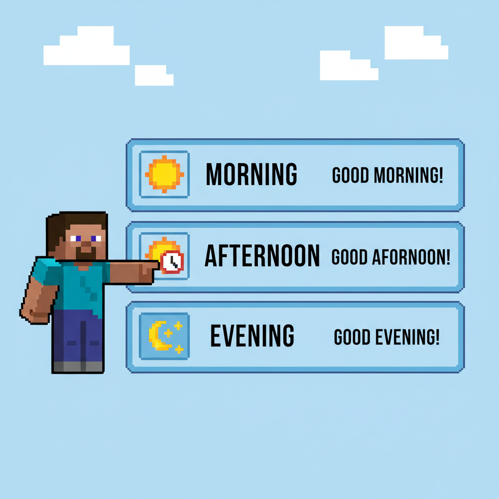
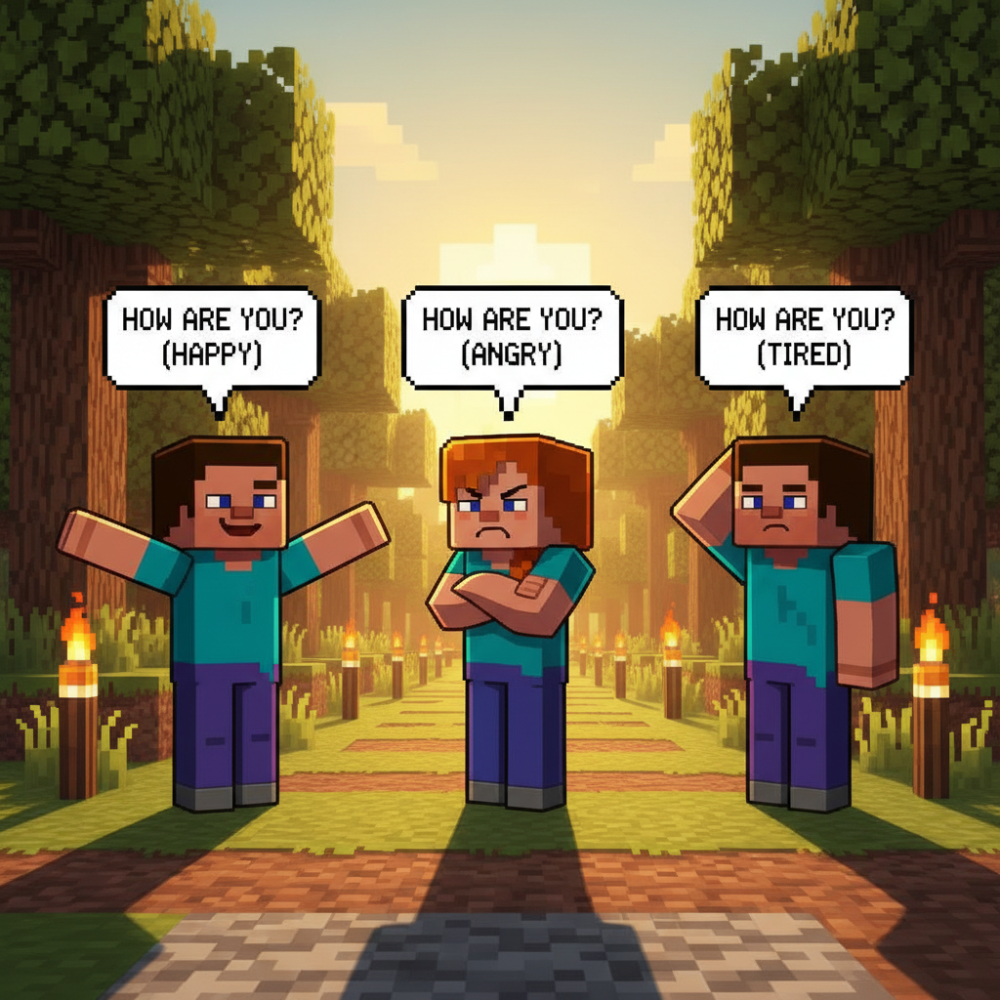
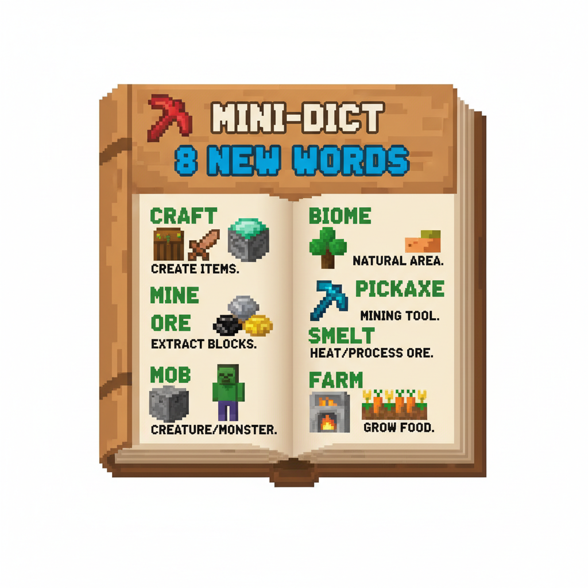
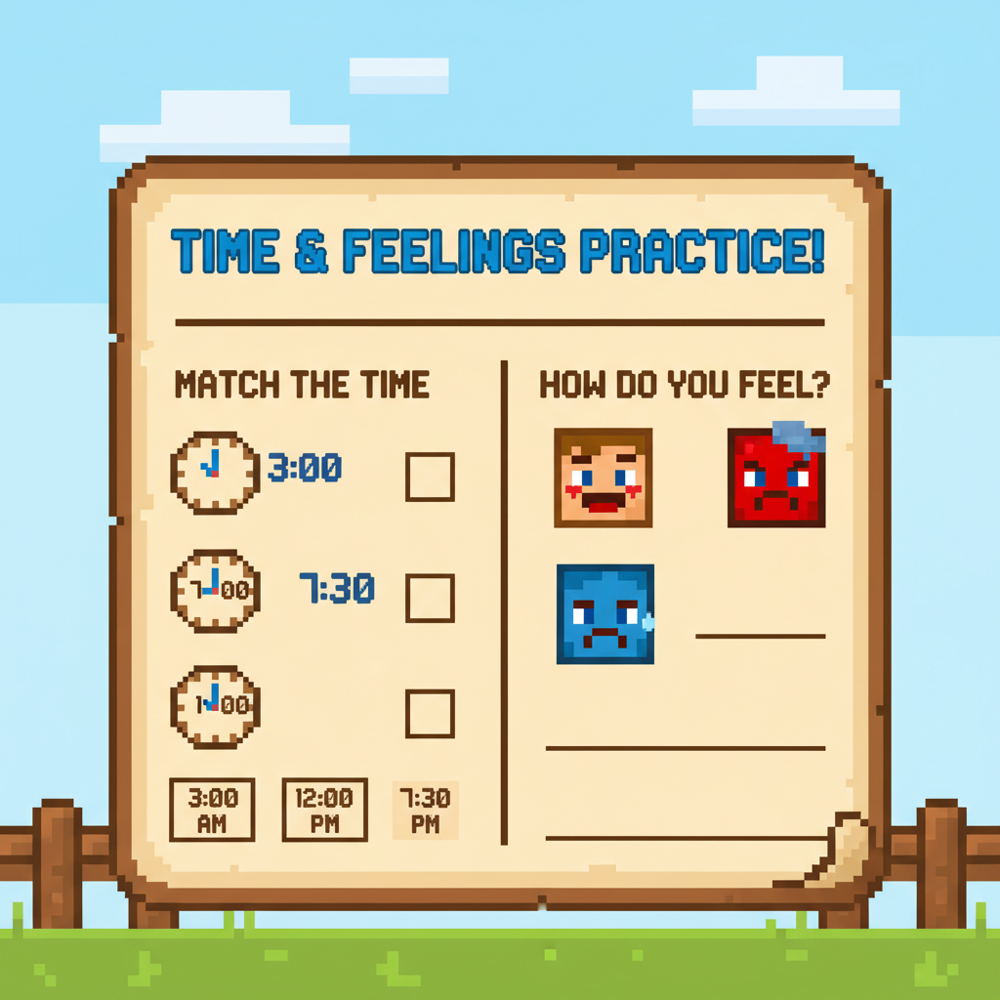
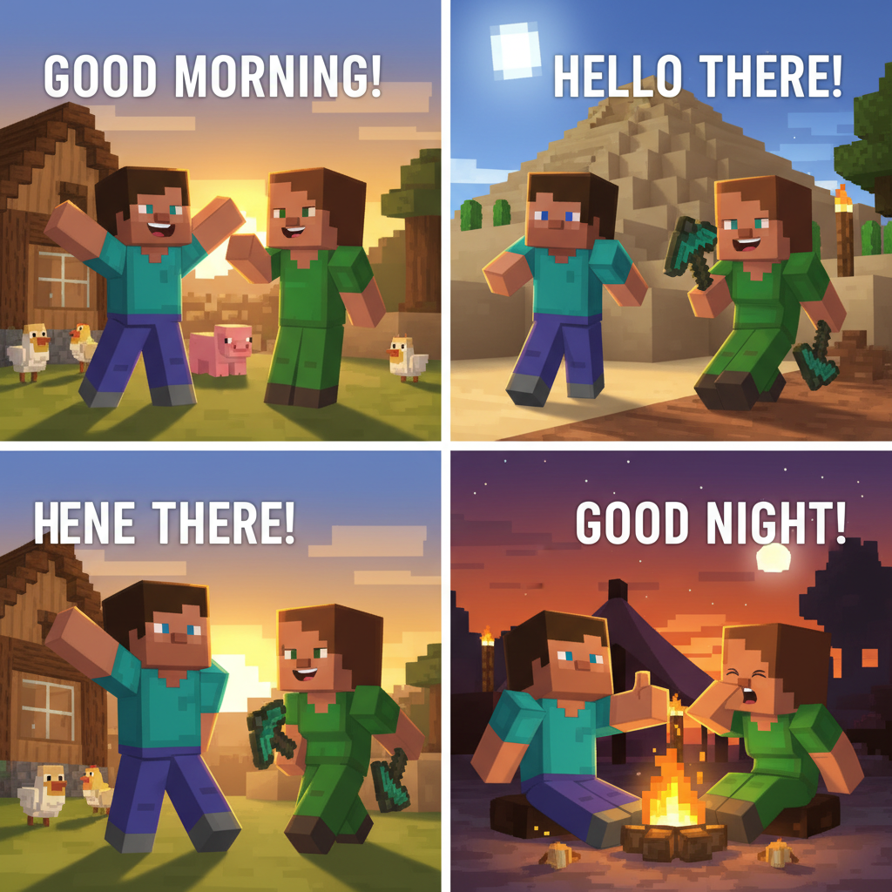

# Lesson 1 — Extension: More Greetings!

> 📖 **Complete Lesson 1 (Hello!) first, then try this!**

---

## 📋 Learning Goals
- Learn more greetings: **Good morning, Good afternoon, Good night**
- Practice asking and answering **"How are you?"**
- Review: hello, goodbye, name, friend
- New words: **morning, afternoon, night, thank you**

---

## 🤔 Page 1: A New Day

The next morning, Steve wakes up in his new house.

Bob knocks on the door:

> "**Good morning**, Steve! Did you sleep well?"
>
> "Good morning, Bob! Yes, I slept great!"

Steve learns: when the sun comes up, we say **"Good morning"** 🌅



---

## 🤔 Page 2: Good Afternoon and Good Night

Alex shows Steve a chart:

| Time | Greeting |
|------|----------|
| 🌅 Morning (sunrise~12:00) | **Good morning** |
| ☀️ Afternoon (12:00~18:00) | **Good afternoon** |
| 🌙 Night (after dark) | **Good night** |

> "So when the sun is high, I say **Good afternoon**?"
>
> "That's right! And before bed, say **Good night**!"



---

## 🤔 Page 3: How Are You?

Let's learn more ways to answer **"How are you?"**

| Question | Answers |
|----------|---------|
| How are you? | I'm **fine**, thank you. ✅ |
| How are you? | I'm **good**! ✅ |
| How are you? | I'm **happy**! 😊 |
| How are you? | I'm **tired**. 😴 |

Steve practices:

> "How are you, Alex?"
> "I'm **happy**! The sun is shining!"
> "How are you, Steve?"
> "I'm **good**! Let's play!"



---

## 📖 Page 4: New Mini Dictionary

| English | 中文 |
|---------|------|
| **Good morning** 🌅 | 早上好 |
| **Good afternoon** ☀️ | 下午好 |
| **Good night** 🌙 | 晚安 |
| **Thank you** 🙏 | 谢谢你 |
| **How are you?** | 你好吗？ |
| **I'm happy** 😊 | 我很开心 |
| **I'm tired** 😴 | 我累了 |
| **I'm good** 👍 | 我很好 |


---

## ✏️ Page 5: Practice

### Exercise 1: Match the time ⏰
```
🌅 Sunrise         →   Good afternoon
☀️ High sun        →   Good night
🌙 Before bed      →   Good morning
```

### Exercise 2: How are you?
Draw a line from the feeling to the answer:

```
How are you?       →   😊 I'm happy.
How are you?       →   😴 I'm tired.
How are you?       →   👍 I'm good.
How are you?       →   ✅ I'm fine.
```



---

## 🎭 Page 6: Role Play!

Act out this conversation with a friend (or with yourself!):

### Scene: Meeting at the Village Gate 🏘️

| You | Friend |
|-----|--------|
| "Hello!" | "Hello!" |
| "What's your name?" | "My name is ____." |
| "Nice to meet you!" | "Nice to meet you, too!" |
| "How are you?" | "I'm happy!" |
| "Goodbye!" | "Goodbye, my friend!" |

> 🔄 **Try it again with different feelings!**
> - I'm tired 😴 (yawn when you say it!)
> - I'm good 👍 (thumbs up!)
> - I'm happy 😊 (big smile!)



---

---

> 📐 **CEFR Level:** Pre-A1 | **对标:** 英语课标一级·听说·日常问候与基础词汇

### ⚠️ Common Mistakes

| ❌ Wrong | ✅ Right |
|----------|---------|
| "I is Steve" | **"I am Steve"** — "I" always uses "am" |
| "What your name?" | **"What's your name?"** — need "is" |
| Pronouncing "th" as "s" or "z" | **"th" = tongue between teeth** (this, that, three) |
| "Goodbye" said too fast like "g'bai" | Say clearly: **Good-bye** (two parts) |

### 🧠 Think About It
1. **Observation**: In English, we say "Hello!" but in Chinese we say "你好！" Why do different languages have different greetings?
2. **What if**: What if English had no alphabet letters — every word was a picture like ancient Egyptian? How would you write "cat"?

## 🔗 Cross-Curricular Links
数学第1-2课教数字 → 英语同步numbers & counting
语文第1课教象形字 → 英语字母演变故事（A来自牛头𓃾）

## 🎯 Page 7: Challenge — All Day Greeting

Steve goes through a whole day. What should he say at each time?

**Time 1: 🌅 Morning**
> Steve wakes up. He sees Bob.
> "______, Bob!"
> A) Good night
> B) Good morning ✅
> C) Good afternoon

**Time 2: ☀️ Noon (12:00)**
> Steve is building a house. Alex comes.
> "______, Alex!"
> A) Good afternoon ✅
> B) Good morning
> C) Good night

**Time 3: 🌙 Night**
> Steve goes to bed.
> "______, everyone!"
> A) Good morning
> B) Good afternoon
> C) Good night ✅

**Time 4: Meeting a new friend**
> A new villager walks up.
> "______! My name is Tom."
> A) Hello ✅
> B) Goodbye
> C) Good night



---

## 🎉 Page 8: Celebration — Star Badge!

> ⭐ You completed the **More Greetings** extension!

Steve can now greet people at any time of day:

- 🌅 Good morning!
- ☀️ Good afternoon!
- 🌙 Good night!
- 👋 Hello!
- 👋 Goodbye!

Bob gives Steve a special reward:

> 🏆 **"Star Greeter" Badge** — You can greet anyone, anytime!

> ➡️ **Next lesson: ABC Adventure — Letters A to M!**

---

### ✨ Extension Summary
- ✅ New greetings: Good morning, Good afternoon, Good night
- ✅ More answers: I'm happy, I'm tired, I'm good
- ✅ I can greet people at **any time of day**!
- ⭐ **Next: ABC Adventure — Let's learn the alphabet!**
