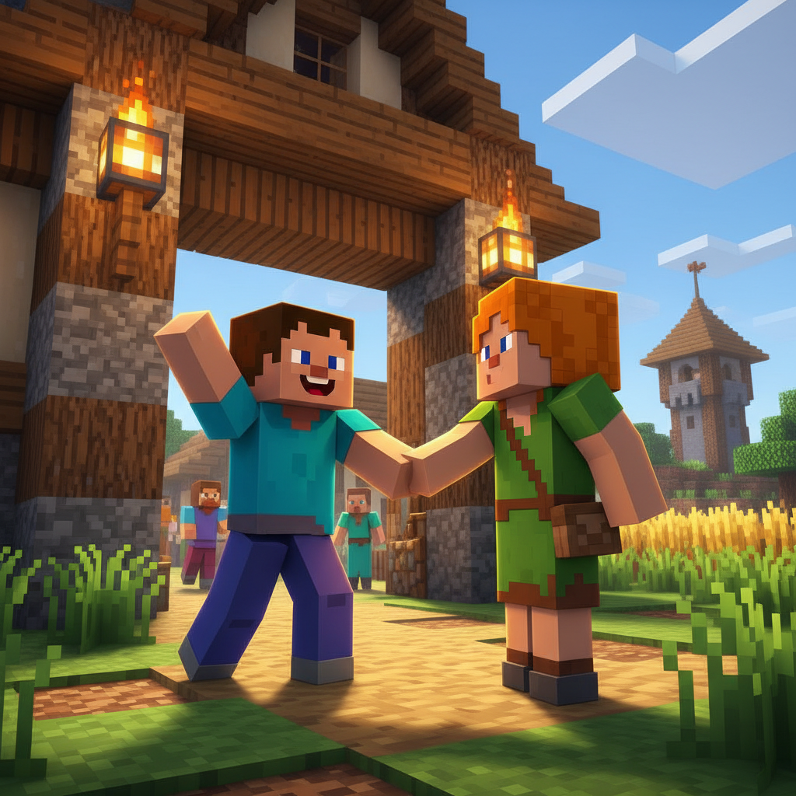
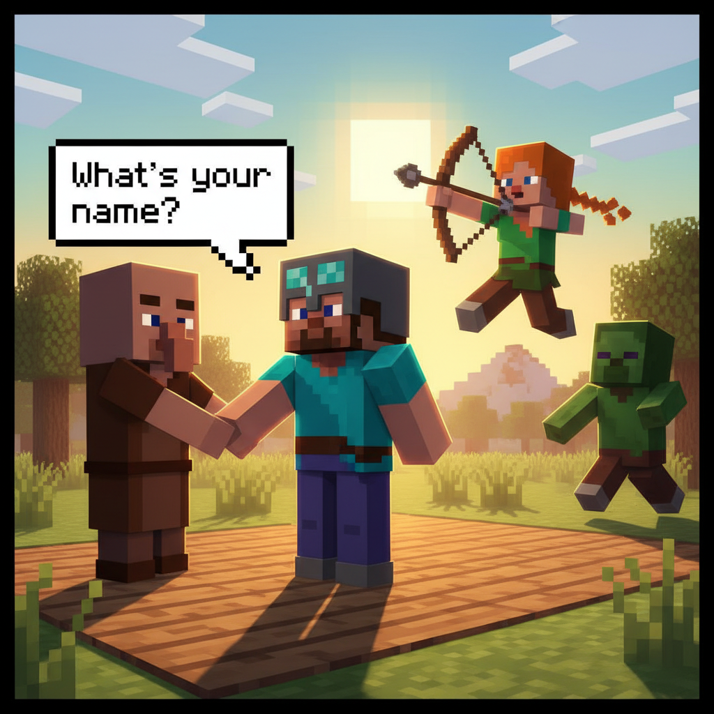
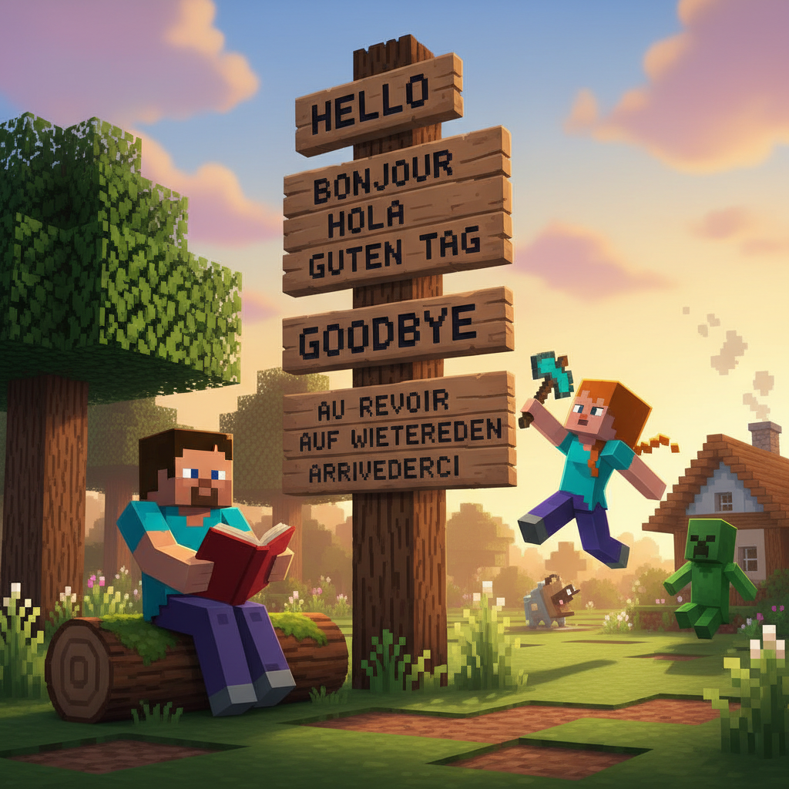
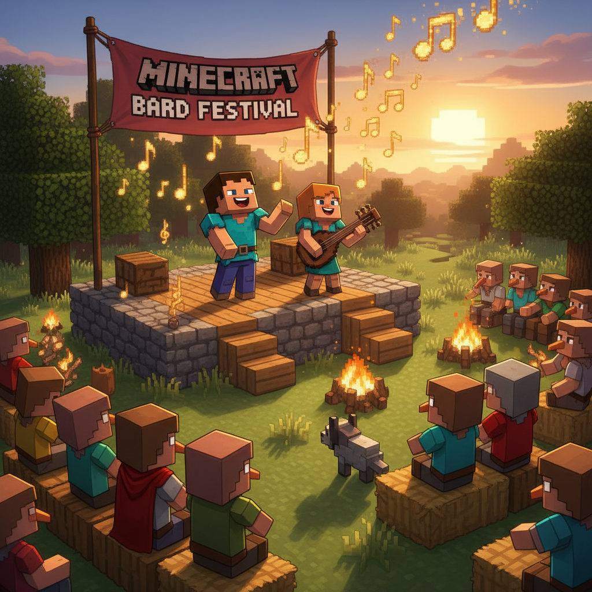
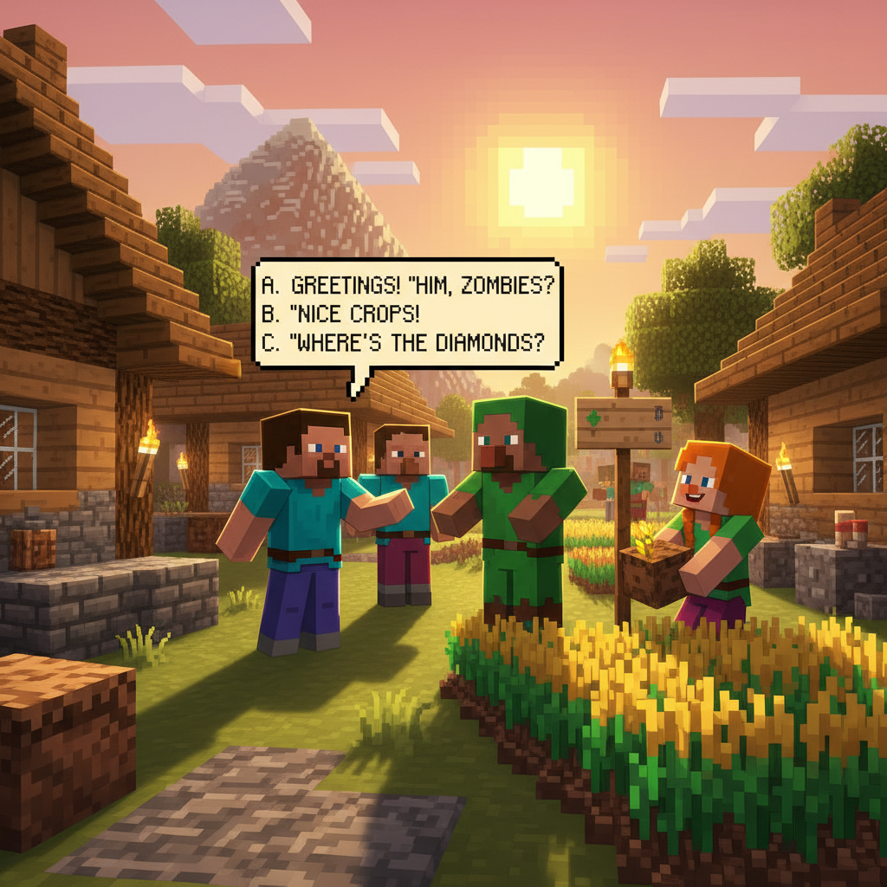

# Lesson 1 — Hello!

## 📋 Learning Goals
- Say **"Hello"** and **"Goodbye"**
- Ask and answer **"What's your name?"**
- Learn 4 new words: **hello, goodbye, name, friend**

---

## 🎬 Page 1: A New World

Steve wakes up in a new land — a green village with colorful houses made of blocks.

> "Where am I?"

A friendly villager walks up to him, smiling.

> "Hello! Welcome to our village!"
>
> "Hello!" Steve waves back.

He looks around. Everything is new and exciting!



---

## 🤔 Page 2: What's Your Name?

The villager smiles and asks:

> "My name is **Bob**. **What's your name?** "

Steve thinks for a moment...

> "My **name** is **Steve**."

Bob shakes his hand:

> "Nice to meet you, Steve!"
>
> "Nice to meet you, too!"



> 📝 **Let's practice:**
> - **What's your name?** — 你叫什么名字？
> - **My name is ____.** — 我叫 ____。

---

## 🤔 Page 3: Hello and Goodbye

Bob shows Steve a wooden sign with two words:

```
👋 Hello = 你好
👋 Goodbye = 再见
```

> "Use **Hello** when you meet someone.
> Use **Goodbye** when you leave."

Steve nods: "Hello! ... Goodbye! ... I got it!"


---

## 👋 Page 4: My Friend

Alex arrives and joins them.

> "Hello, Steve! I see you've made a new **friend**!"
>
> "Yes! Bob is my new **friend**."

Bob says: "Good **friends** say Hello and Goodbye to each other!"

Alex teaches a new phrase:

> "**How are you?** "
> "**I'm fine, thank you!** "



---

## 📖 Page 5: Mini Dictionary

| English | 中文 |
|---------|------|
| **Hello** 👋 | 你好 |
| **Goodbye** 👋 | 再见 |
| **Name** 📛 | 名字 |
| **Friend** 🤝 | 朋友 |
| **How are you?** | 你好吗？ |
| **I'm fine.** | 我很好。 |


---

## ✏️ Page 6: Practice

### Exercise 1: Match the words 🔗
```
Hello       →    再见
Goodbye     →    你好
Friend      →    名字
Name        →    朋友
```

### Exercise 2: Fill in the blank ✍️

1. A: "______ !" (打招呼)
   B: "Hello!"

2. A: "What's your ______ ?"
   B: "My name is Steve."

3. A: "______ !" (要走了)
   B: "Goodbye!"


---

## 🎤 Page 7: Let's Sing!

### Hello Song 🎵
*(Sing to the tune of "Twinkle Twinkle Little Star")*

```
Hello, hello, how are you?
I am fine, how are you?
Hello, my friend, what's your name?
Nice to meet you, play a game!
Hello, hello, how are you?
I am fine, goodbye to you!
```



---

## 🎯 Page 8: Challenge — Village Greetings

Steve walks through the village. Each villager says something — choose the right reply!

**Villager 1:** "Hello!"
> A) "Goodbye!"
> B) "Hello!" ✅
> C) "I'm fine."

**Villager 2:** "What's your name?"
> A) "My name is Steve." ✅
> B) "Hello!"
> C) "I'm fine."

**Villager 3:** "How are you?"
> A) "Goodbye."
> B) "My name is Steve."
> C) "I'm fine, thank you!" ✅

**Villager 4:** "Goodbye!"
> A) "Goodbye!" ✅
> B) "Hello."
> C) "How are you?"



---

## 🎉 Page 9: Celebration!

Steve made it through the whole village!

> "I said Hello, I asked names, I made friends, and I said Goodbye!"

Bob gives Steve a badge:

> ⭐ **You earned the "Hello" Badge! ⭐**

Sing together:

> "Hello, hello, new **friend**!
> Let's meet again!"

> ➡️ **Want more? Go to Extension:**
> [`lesson-01-extension.md`](./lesson-01-extension.md) — More greetings, role play!

---

### ✨ Lesson Summary
- ✅ I can say **"Hello"** and **"Goodbye"**
- ✅ I can ask **"What's your name?"**
- ✅ I learned **4 new words**: hello, goodbye, name, friend
- ⭐ **Mission Complete! Next: ABC Adventure!**
