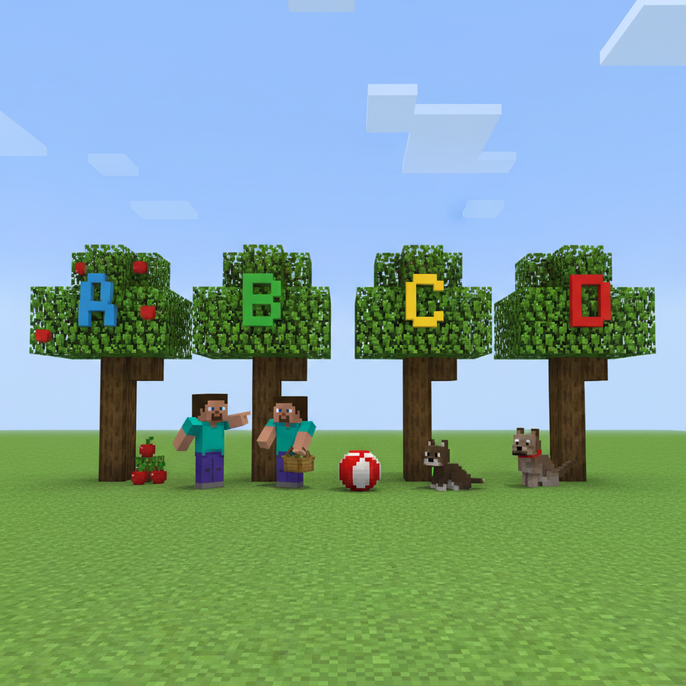
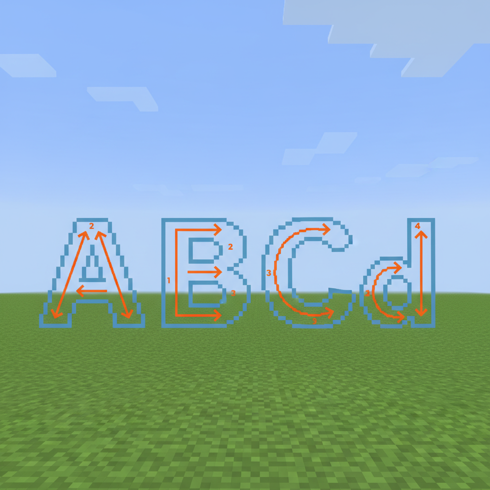
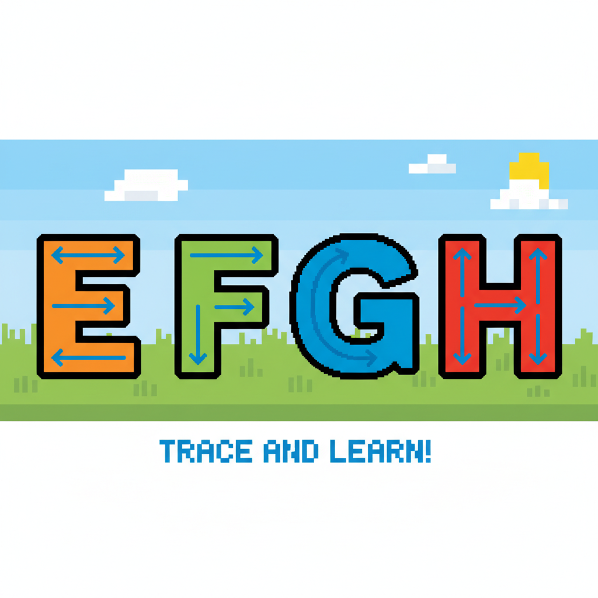
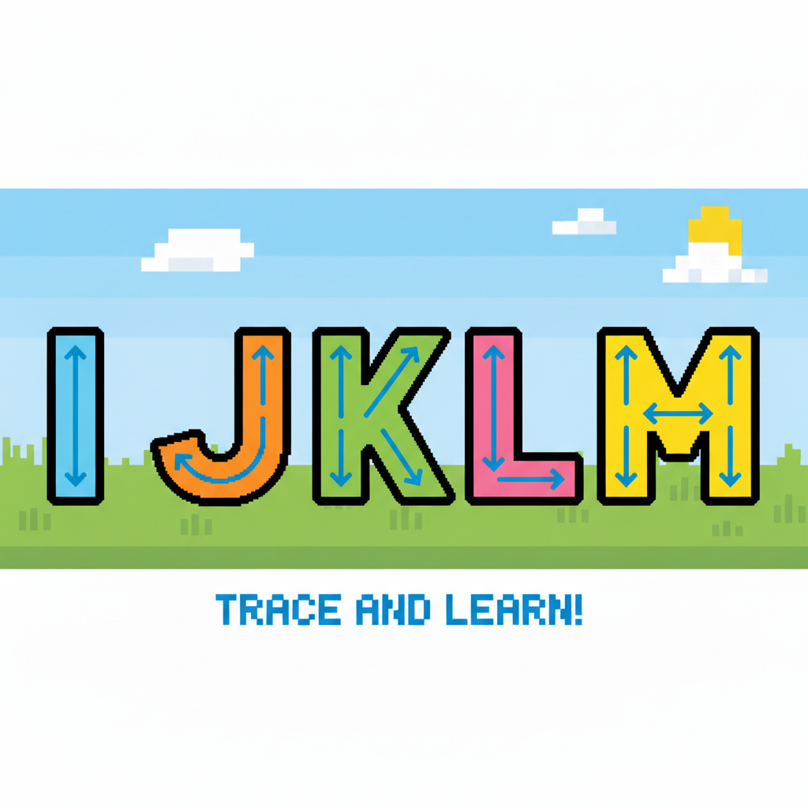
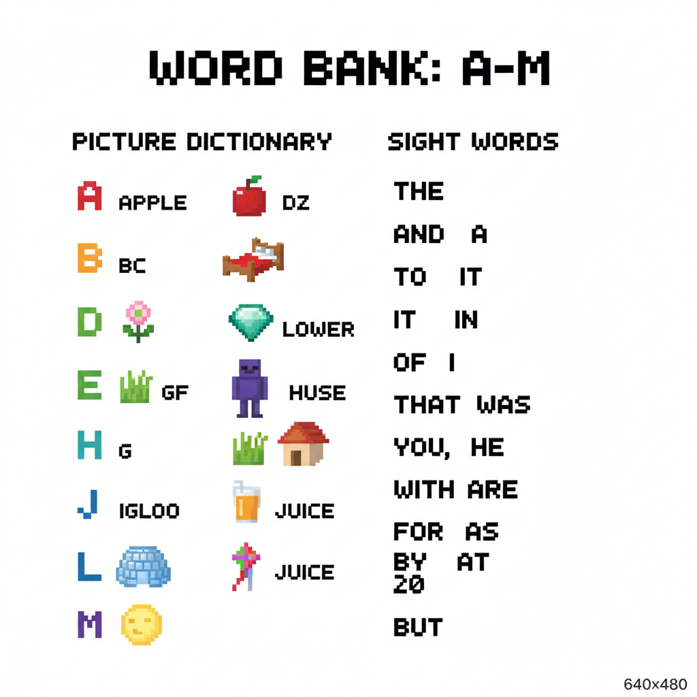
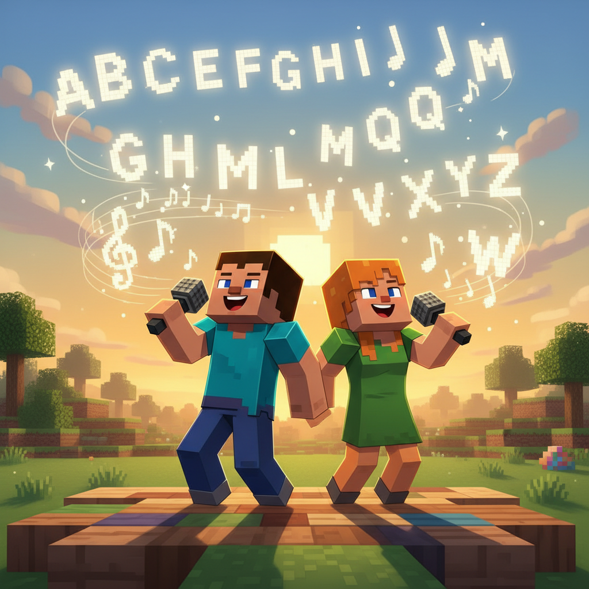

# Lesson 2 — ABC Adventure: Letters A to M

## 📋 Learning Goals
- Recognize letters **A to M**
- Learn new words: **apple, ball, cat, dog, fish, girl, hat**
- Learn sight words: **I, is, in, it**
- Practice: **"It is a ___."**

---

## 🎬 Page 1: The Alphabet Forest

Steve and Alex arrive at a magical forest. Each tree has a giant letter carved on it!

> "What is this place?"
>
> "This is the **Alphabet Forest**," Alex says. "Every tree grows a letter, and every letter has a word!"

The first tree has a big **A** on it.

> "**A** says /a/... **Apple**! A is for **apple**!"

Under the tree, there are red apples on the ground.

> "I see an **apple**! **It is** red!"


---

## 🤔 Page 2: Letters A-B-C-D

Let's walk through the forest and meet the first 4 letters!

| Letter | Word | Picture |
|--------|------|---------|
| **A** a | **apple** 🍎 | A red apple |
| **B** b | **ball** ⚽ | A round ball |
| **C** c | **cat** 🐱 | A cute cat |
| **D** d | **dog** 🐶 | A happy dog |

A cute **cat** sits on a **ball**.
A happy **dog** plays with an **apple**.

> "**It is** a cat. **It is** a dog. **I** see the cat. **Is it** in the tree?"

> "No! The cat **is** on the ball!"


---

## ✏️ Page 3: Trace the Letters

Let's trace the letters with your finger!

```
A a   B b   C c   D d
─     ─     ─     ─
🖍️    🖍️    🖍️    🖍️
```

**A** = pointy top, cross in middle ⛰️
**B** = stick with two bumps 🪵
**C** = half a circle 🌙
**D** = stick with one bump 🪵

> **Fun fact:** A is like a mountain (山). B is like two bumps!



---

## 🤔 Page 4: Letters E-F-G-H

Keep walking! More letters ahead!

| Letter | Word | Picture |
|--------|------|---------|
| **E** e | **egg** 🥚 | An egg |
| **F** f | **fish** 🐟 | A fish |
| **G** g | **girl** 👧 | A girl |
| **H** h | **hat** 🎩 | A hat |

A **girl** holds an **egg**.
A **fish** wears a **hat**?!

> "Ha ha! A fish in a hat!"
>
> "**It is** funny! **I** like **it**!"

> 📝 **New sentences:**
> - **I** see a fish.
> - **It is** in a hat.
> - The **girl is** happy.



---

## ✏️ Page 5: Trace Letters E-F-G-H

```
E e   F f   G g   H h
─     ─     ─     ─
🖍️    🖍️    🖍️    🖍️
```

**E** = stick with three bars 🪜
**F** = E missing the bottom bar
**G** = C with a line ➡️
**H** = two sticks with a bridge 🌉



---

## 🤔 Page 6: Letters I-J-K-L-M

| Letter | Word | Picture |
|--------|------|---------|
| **I** i | **igloo** 🧊 | An igloo |
| **J** j | **juice** 🧃 | A glass of juice |
| **K** k | **kite** 🪁 | A kite |
| **L** l | **lion** 🦁 | A lion |
| **M** m | **moon** 🌙 | The moon |

> "An **igloo is** cold."
> "**Juice is** sweet."
> "A **kite is** in the sky."
> "A **lion is** big."
> "The **moon is** bright at night."


---

## ✏️ Page 7: Trace Letters I-J-K-L-M

```
I i   J j   K k   L l   M m
─     ─     ─     ─     ─
🖍️    🖍️    🖍️    🖍️    🖍️
```

**I** = one tall stick 🏒
**J** = I with a hook at the bottom 🪝
**K** = stick with two arms 💪
**L** = two lines in a corner 📐
**M** = two mountains 🏔️🏔️

> ⭐ **A-M! You did it!**


---

## 📖 Page 8: Word Bank (A-M)

| Letter | Word | 中文 |
|--------|------|------|
| A a | **apple** 🍎 | 苹果 |
| B b | **ball** ⚽ | 球 |
| C c | **cat** 🐱 | 猫 |
| D d | **dog** 🐶 | 狗 |
| E e | **egg** 🥚 | 蛋 |
| F f | **fish** 🐟 | 鱼 |
| G g | **girl** 👧 | 女孩 |
| H h | **hat** 🎩 | 帽子 |
| I i | **igloo** 🧊 | 冰屋 |
| J j | **juice** 🧃 | 果汁 |
| K k | **kite** 🪁 | 风筝 |
| L l | **lion** 🦁 | 狮子 |
| M m | **moon** 🌙 | 月亮 |

### Sight Words
| Word | 中文 | Sentence |
|------|------|----------|
| **I** | 我 | I see a cat. |
| **is** | 是 | It is red. |
| **in** | 在里面 | The cat is in the hat. |
| **it** | 它 | It is a ball. |



---

## ✏️ Page 9: Practice

### Exercise 1: What letter is it? 🔤
```
🐱 → C is for ____
🐶 → D is for ____
🍎 → A is for ____
🪁 → K is for ____
🦁 → L is for ____
🌙 → M is for ____
```

### Exercise 2: Fill in the blank ✍️

1. **____** is a cat. (It / I)
2. The apple **____** red. (is / in)
3. **____** see a fish. (It / I)
4. The fish **is ____** the hat. (is / in)

### Exercise 3: Match the sentence 🔗
```
A cat        is in the sky.
A kite       is cold.
An igloo     is a pet.
The moon     is bright.
```



---

## 🎤 Page 10: ABC Song (A-M)

### 🎵 Sing along!
*(To the tune of "Twinkle Twinkle Little Star")*

```
A-B-C-D-E-F-G,
Letters are so fun, you see!
H-I-J-K-L-M,
Let's go learn them all again!
A for apple, B for ball,
Letters standing straight and tall!
A-B-C-D-E-F-G,
Come and learn your ABCs with me!
```



---

---

> 📐 **CEFR Level:** Pre-A1 | **对标:** 英语课标一级·听说·日常问候与基础词汇

### ⚠️ Common Mistakes

| ❌ Wrong | ✅ Right |
|----------|---------|
| "I is Steve" | **"I am Steve"** — "I" always uses "am" |
| "What your name?" | **"What's your name?"** — need "is" |
| Pronouncing "th" as "s" or "z" | **"th" = tongue between teeth** (this, that, three) |
| "Goodbye" said too fast like "g'bai" | Say clearly: **Good-bye** (two parts) |

### 🧠 Think About It
1. **Observation**: In English, we say "Hello!" but in Chinese we say "你好！" Why do different languages have different greetings?
2. **What if**: What if English had no alphabet letters — every word was a picture like ancient Egyptian? How would you write "cat"?

## 🔗 Cross-Curricular Links
数学第1-2课教数字 → 英语同步numbers & counting
语文第1课教象形字 → 英语字母演变故事（A来自牛头𓃾）

## 🎯 Page 11: Challenge — Alphabet Path

Steve needs to walk through the Alphabet Forest to find the secret chest. But the path is blocked by letter puzzles!

**Gate 1:** What letter comes after A?
> A → ___ ?

**Gate 2:** What letter comes before D?
> ___ → D ?

**Gate 3:** Name 3 animals from A-M!
> ___ , ___ , ___

**Gate 4:** What's missing?
> A B C D E ___ G H I J ___ L M

**Gate 5:** Make a sentence!
> "____ is a cat." → say it!

Complete all 5 gates to open the chest!


---

## 🎉 Page 12: Celebration — A-M Master!

> "We did it! A to M!"

Steve opens the treasure chest. Inside: a golden **apple** and a Alpha Badge!

> ⭐ **Alpha Badge (A-M)** ⭐

### New words this lesson (13 words):
```
apple  ball  cat  dog
egg  fish  girl  hat
igloo  juice  kite  lion  moon
```

### Sight words (4 words):
```
I  is  in  it
```

> ➡️ **Next: ABC Adventure — Letters N to Z!**
