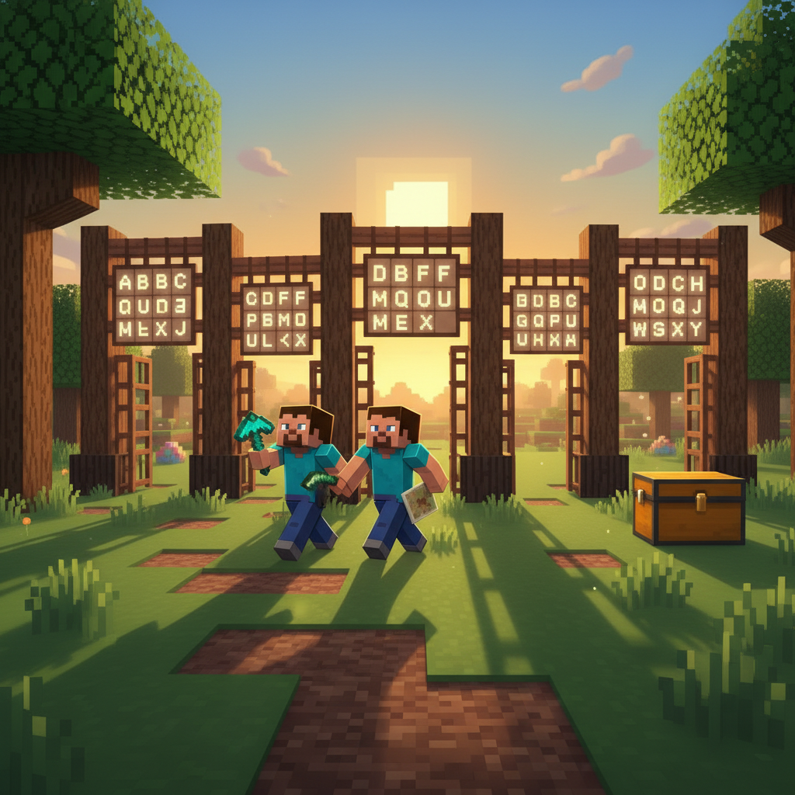
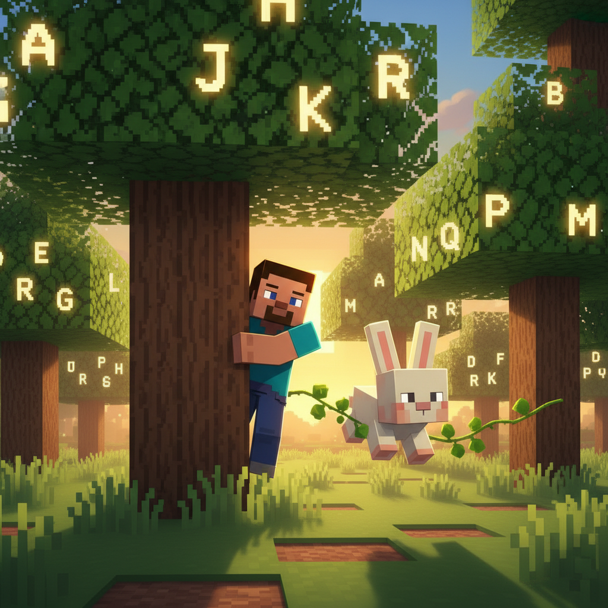
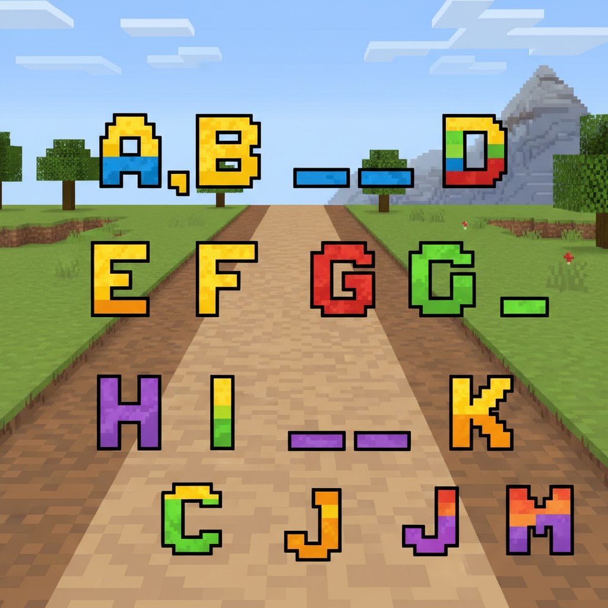
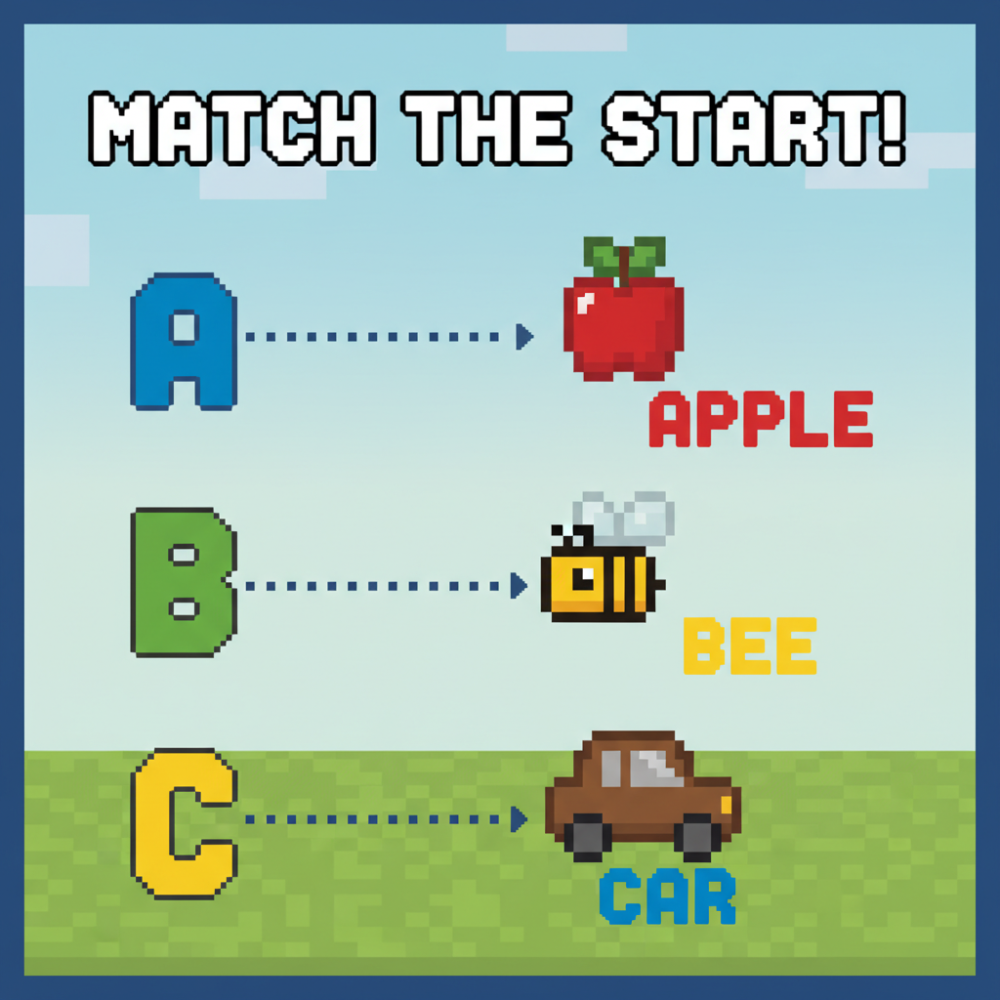
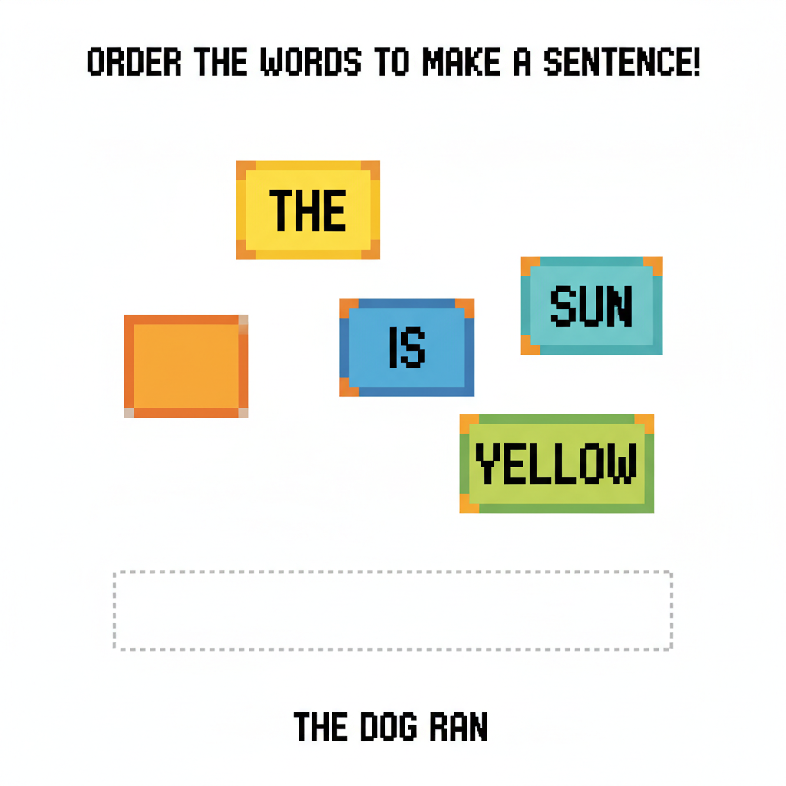
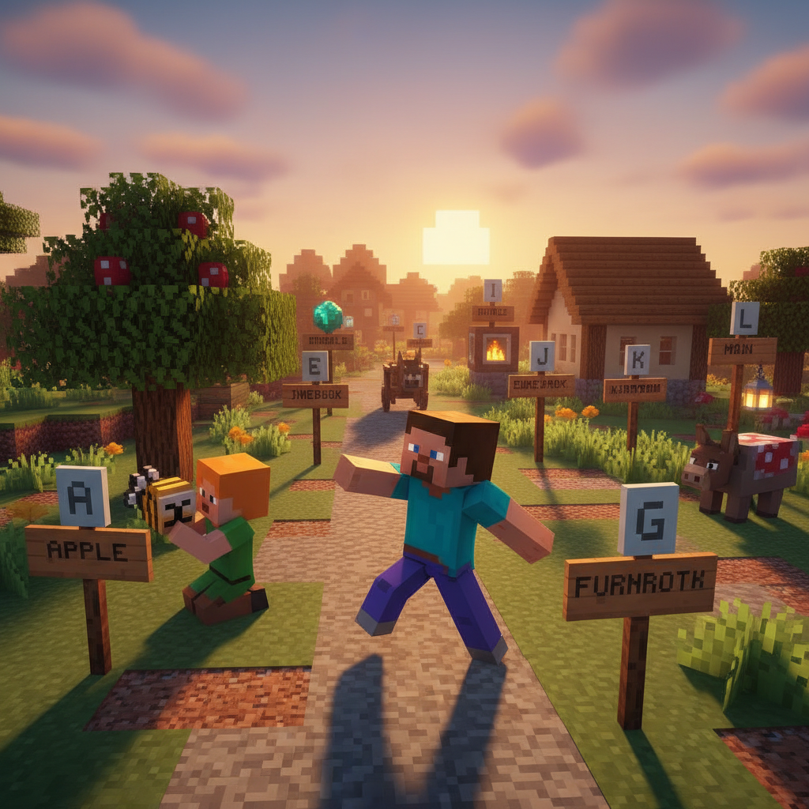
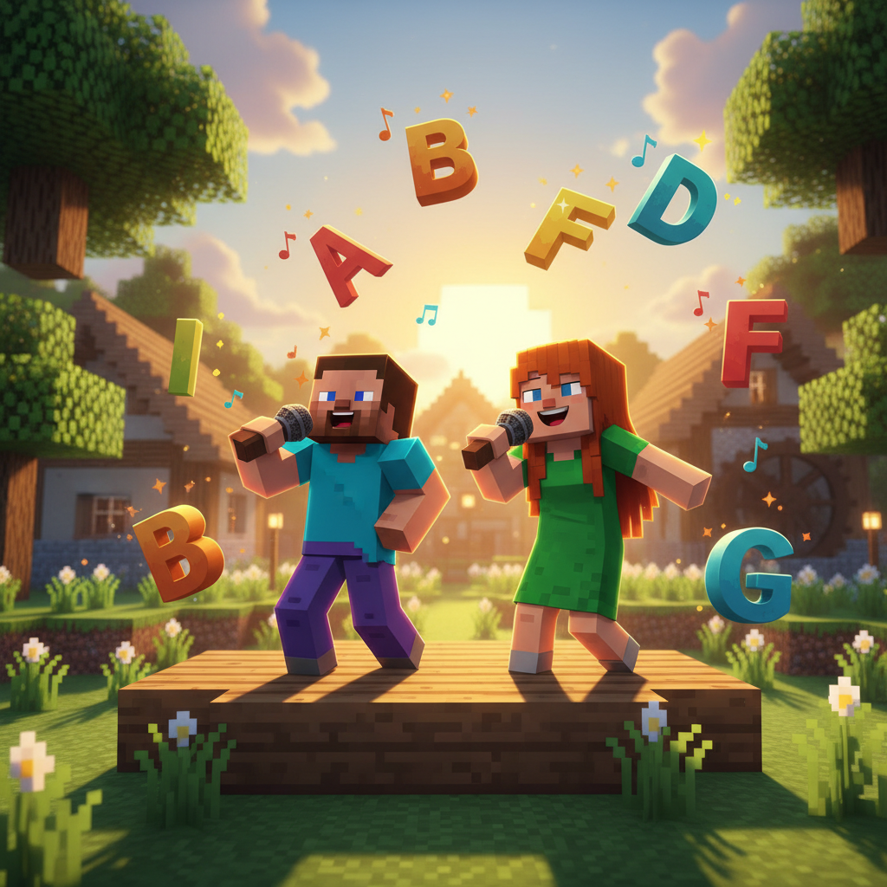

# Lesson 2 — Extension: ABC A-M Fun!

> 📖 **Complete Lesson 2 first, then try this!**

---

## 📋 Learning Goals
- Review letters A-M
- Build sentences: **"I see a ___." "It is a ___."**
- Sight words practice: **I, is, in, it**
- New words: **friend**, **play**, **see**, **like**

---

## 🤔 Page 1: Back in the Forest

Steve goes back to the Alphabet Forest alone. He wants to practice what he learned.

> "I see a **ball**! **It is** red!"
> "I see a **cat**! **It is** cute!"
> "I see an **apple**! **It is** yummy!"

Suddenly, a little rabbit hops out. It has a letter **F** on its ear... wait, no — it's a **friend**!

> "Hello! My name is Lily. I **like** to **play**!"
>
> "Hello, Lily! I **like** to **play** too! **I see** letters everywhere!"



---

## 🤔 Page 2: I Like / I See

Let's practice new sentences!

**I like** — 我喜欢
**I see** — 我看见

| Sentence | Meaning |
|----------|---------|
| **I like** apples. | 我喜欢苹果 |
| **I see** a ball. | 我看见一个球 |
| **I like** cats. | 我喜欢猫 |
| **I see** a fish. | 我看见一条鱼 |
| **I like** juice. | 我喜欢果汁 |
| **I see** the moon. | 我看见月亮 |

Practice with Lily:

> Steve: "**I see** a kite!"
> Lily: "**I like** kites! Can I **play**?"
> Steve: "Yes! Let's **play**!"



---

## ✏️ Page 3: Missing Letters

Some letters are missing from the alphabet path! Fill them in!

```
A _ C D E F G H _ J K L M
(A ___ ?)
```

**What's missing?**
```
B ___ D → ___
E ___ G → ___
H ___ J → ___
K ___ M → ___
```

**Bonus:** Put these letters in order!
```
D, A, C, B → ___ ___ ___ ___
F, E, H, G → ___ ___ ___ ___
M, K, J, L → ___ ___ ___ ___
```



---

## 🎯 Page 4: Matching — Letter to Word

Draw a line from each letter to its word!

| Letter | Word |
|--------|------|
| 🅰️ | 🐟 fish |
| 🅱️ | 🧃 juice |
| 🅲️ | 🍎 apple |
| 🅳️ | 🎩 hat |
| 🅴️ | ⚽ ball |
| 🅵️ | 🥚 egg |
| 🅶️ | 🐱 cat |
| 🅷️ | 🐶 dog |
| 🅸️ | 🧊 igloo |
| 🅹️ | 🦁 lion |
| 🅺️ | 🪁 kite |
| 🅻️ | 🌙 moon |
| 🅼️ | 👧 girl |

> Bonus: Which letter is in YOUR name? My name starts with ___ !



---

## ✏️ Page 5: Build-a-Sentence

Put the words in the right order to make a sentence!

**1.**
```
see / I / a cat  →  ___ ___ ___ ___
```

**2.**
```
red / is / It  →  ___ ___ ___
```

**3.**
```
in / is / The fish / the hat  →  ___ ___ ___ ___ ___
```

**4.**
```
a ball / I / see  →  ___ ___ ___ ___
```

**5.**
```
like / I / apples  →  ___ ___ ___
```


---

## 🎭 Page 6: Letter Hunt in the Village

Steve walks through the village. Can you find things that start with A-M letters?

| Letter | Find in the village | Word |
|--------|-------------------|------|
| **A** | At the market | A **apple** on a cart |
| **B** | In the playground | A **ball** |
| **C** | On a roof | A **cat** |
| **D** | Next to the house | A **dog** |
| **E** | In the kitchen | An **egg** |
| **F** | In the pond | A **fish** |
| **G** | Walking down the road | A **girl** |
| **H** | On a head | A **hat** |
| **I** | Behind the hill | An **igloo**!? |
| **J** | On the table | **Juice** |
| **K** | In the sky | A **kite** |
| **L** | Wait, is that a...? | A **lion**! 😱 |
| **M** | In the night sky | The **moon** 🌙 |

> Can you draw what Steve sees? (drawing prompt for kids)



---

## 🎤 Page 7: Extension Song

### 🎵 I Can See!

```
I can see an A, A is for apple!
I can see a B, B is for ball!
I can see a C, C is for cat!
I can see a D, D is for dog!

I can see the letters, A to M!
Let's learn them all again, my friend!
Apple, ball, cat and dog,
Egg, fish, girl — let's jog!
Hat, igloo, juice and kite,
Lion, moon — all bright!
```



---

---

> 📐 **CEFR Level:** Pre-A1 | **对标:** 英语课标一级·听说·日常问候与基础词汇

### ⚠️ Common Mistakes

| ❌ Wrong | ✅ Right |
|----------|---------|
| "I is Steve" | **"I am Steve"** — "I" always uses "am" |
| "What your name?" | **"What's your name?"** — need "is" |
| Pronouncing "th" as "s" or "z" | **"th" = tongue between teeth** (this, that, three) |
| "Goodbye" said too fast like "g'bai" | Say clearly: **Good-bye** (two parts) |

### 🧠 Think About It
1. **Observation**: In English, we say "Hello!" but in Chinese we say "你好！" Why do different languages have different greetings?
2. **What if**: What if English had no alphabet letters — every word was a picture like ancient Egyptian? How would you write "cat"?

## 🔗 Cross-Curricular Links
数学第1-2课教数字 → 英语同步numbers & counting
语文第1课教象形字 → 英语字母演变故事（A来自牛头𓃾）

## 🎯 Page 8: Challenge — I Can Read!

Read these sentences out loud!

```
1. I see a cat. It is in a hat.
2. I like apples. Apples are red.
3. A fish is in the water.
4. I see a girl. She has a kite.
5. The moon is bright. I like the moon.
6. A lion is big. I like it.
```

> Read all 6 sentences correctly → **⭐ Super Reader Badge!**



---

## 🎉 Page 9: Super Reader!

> ⭐ **A-M Super Reader!**

### Extension Summary
- ✅ Reviewed letters A-M
- ✅ New sentences: **I like, I see**
- ✅ Sight words: **I, is, in, it**
- ✅ I can **read** sentences!
- ✅ I can **spell** words from A-M!

> ➡️ **Next extension: ABC N-Z Fun!**
