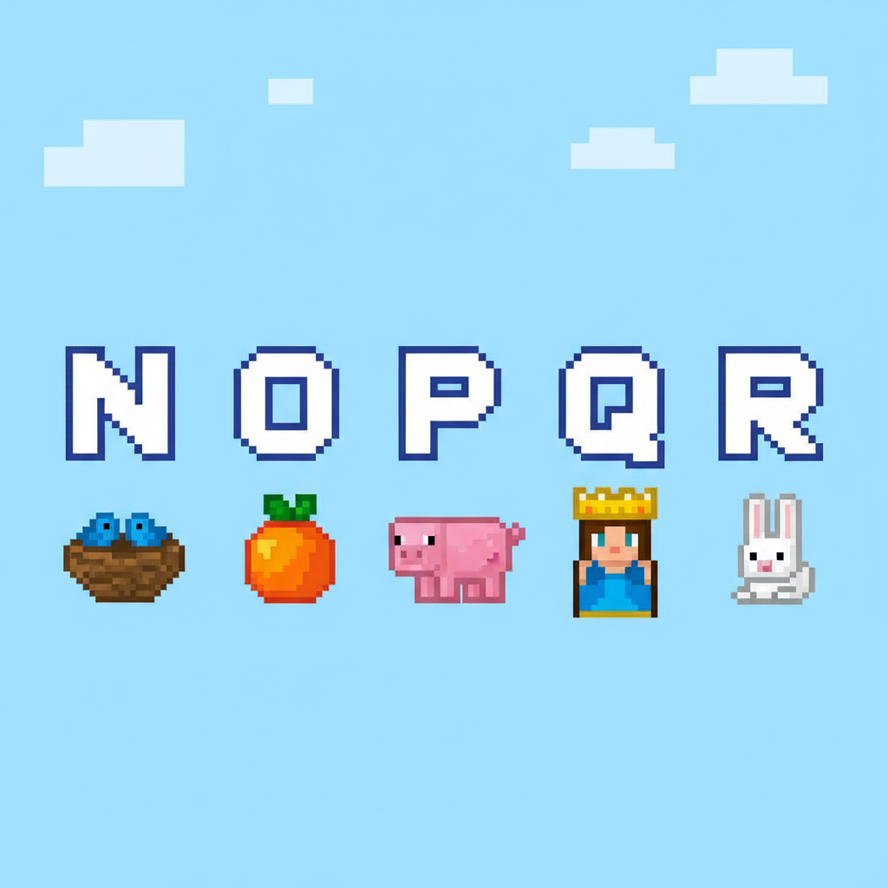
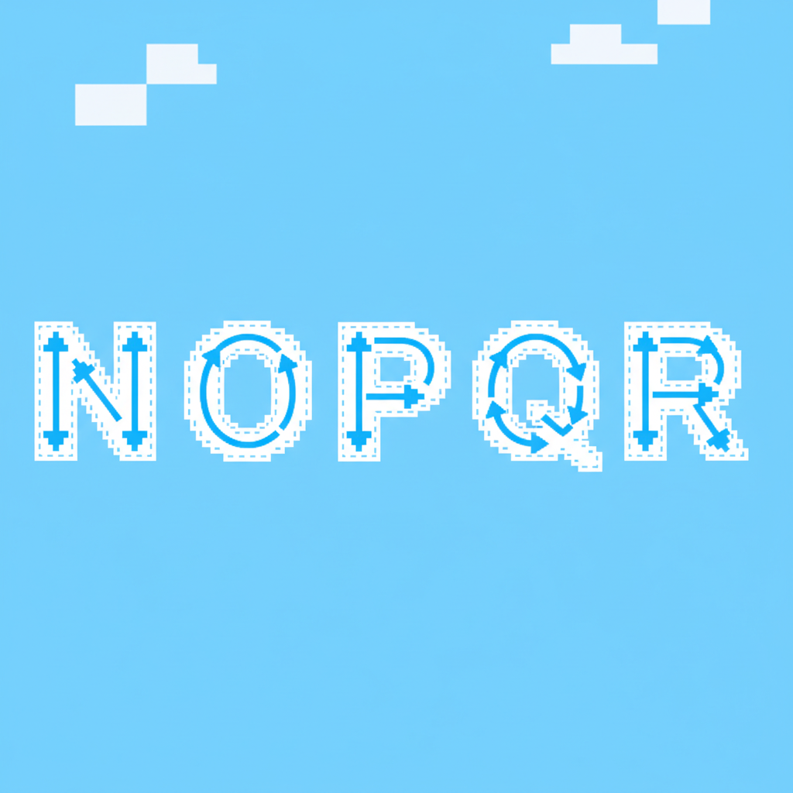
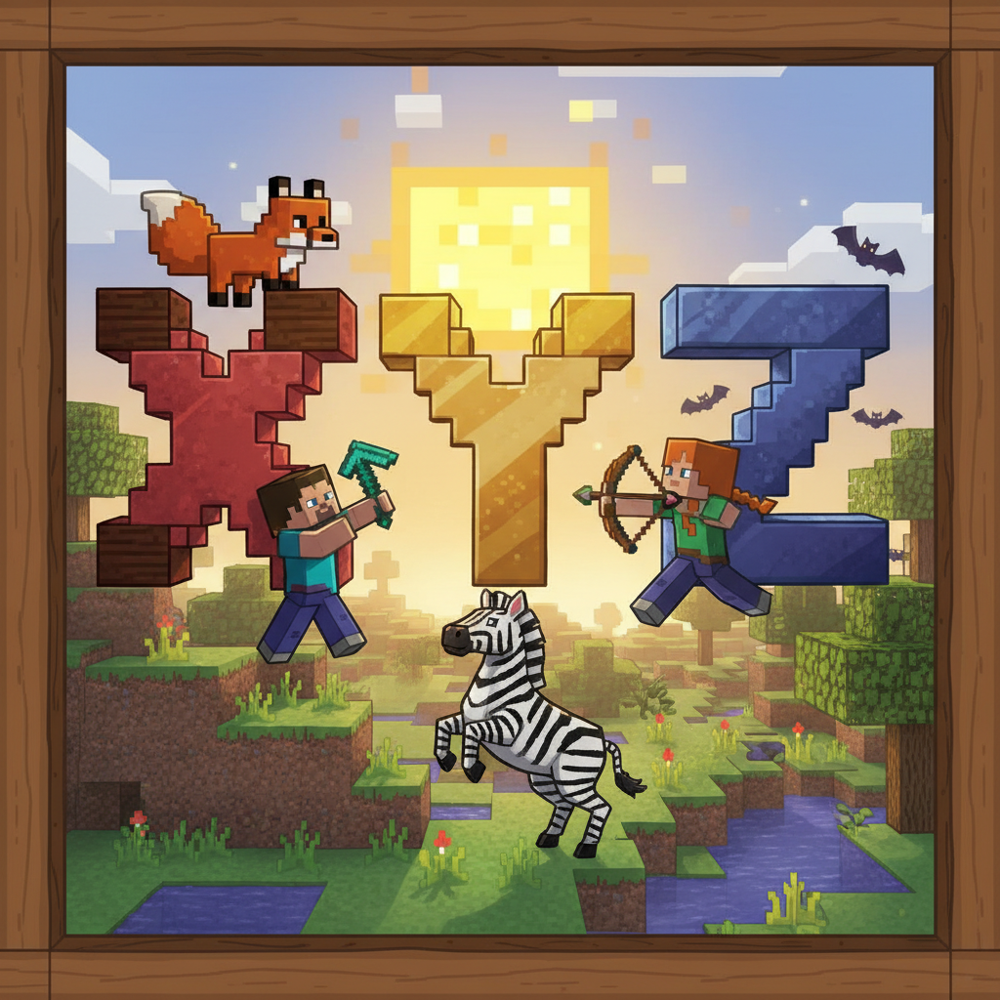
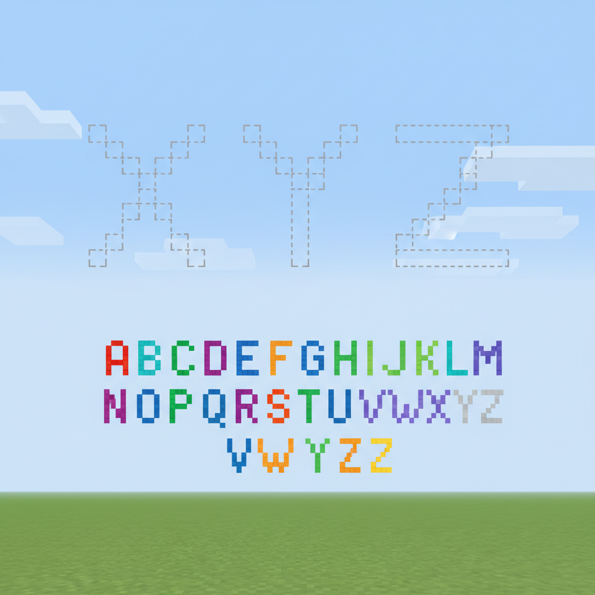
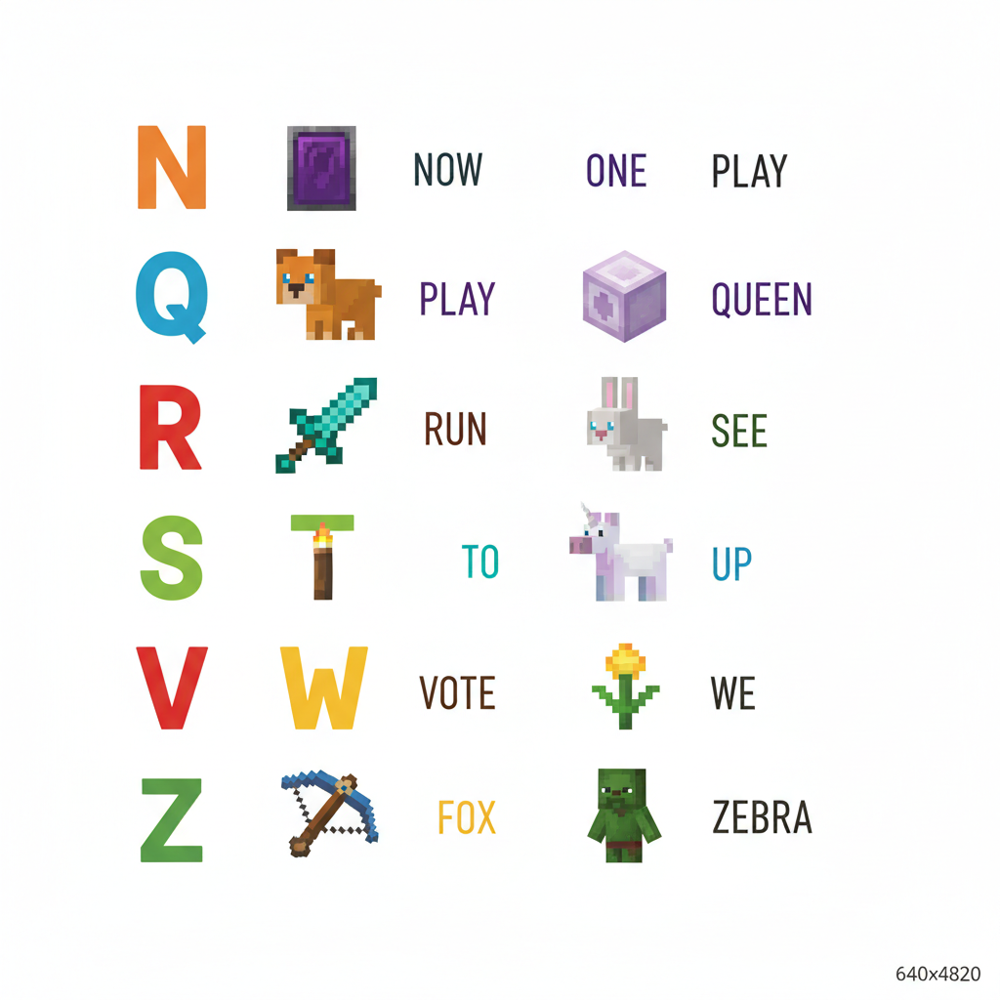
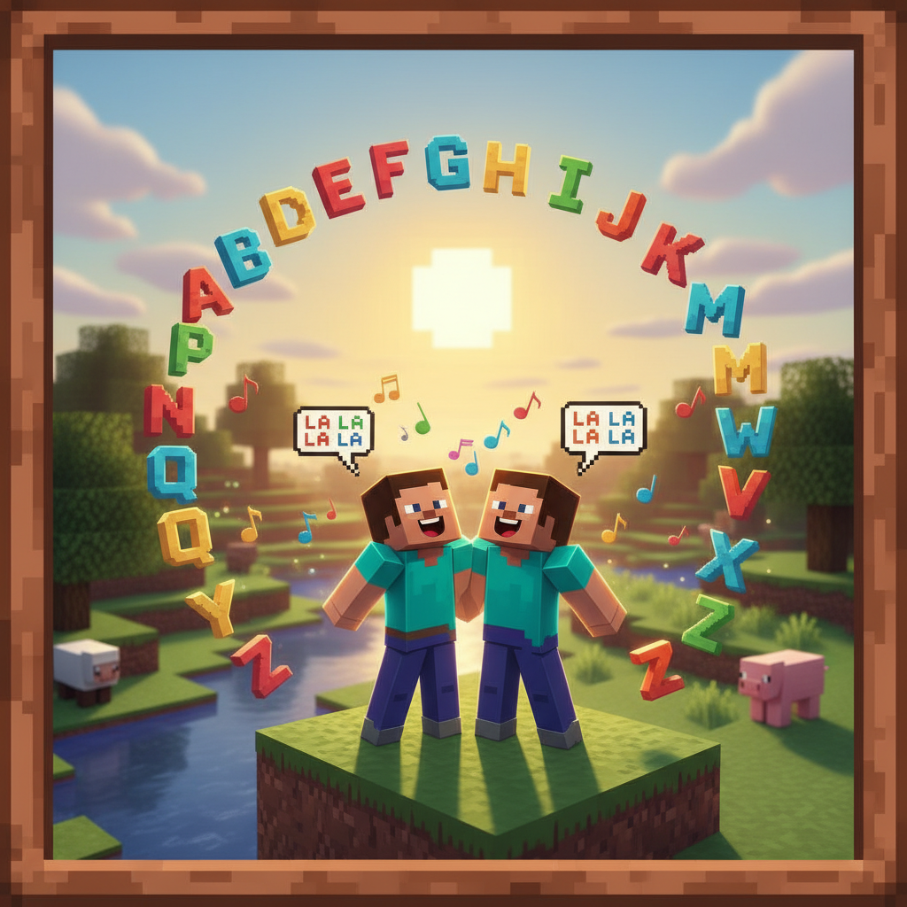
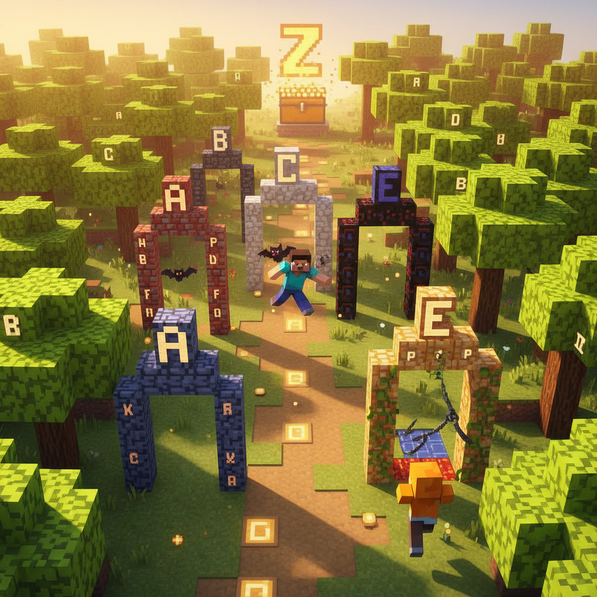

# Lesson 3 — ABC Adventure: Letters N to Z

## 📋 Learning Goals
- Recognize letters **N to Z**
- Learn 13 new words: **nest, orange, pig, queen, rabbit, sun, tree, umbrella, van, water, fox, yellow, zebra**
- Sight words: **my, not, one, the, up, we**
- Practice: **"I have a ___." "This is my ___."**

---

## 🎬 Page 1: The Other Side of the Forest

Steve and Alex cross a bridge into the second half of the Alphabet Forest.

> "We did A to M yesterday. What's on this side?"

Alex points to a big **N** tree:

> "**N** is for **nest**! A bird's house in a tree!"

A bird sits on a **nest** with three eggs.

> "**We** see a nest!"
> "**It is** **one** nest!"
> "**My** nest? No, **it is not my** nest. It is the bird's nest!"


---

## 🤔 Page 2: Letters N-O-P-Q-R

| Letter | Word | Picture |
|--------|------|---------|
| **N** n | **nest** 🪺 | A nest in a tree |
| **O** o | **orange** 🍊 | A juicy orange |
| **P** p | **pig** 🐷 | A pink pig |
| **Q** q | **queen** 👑 | A queen with a crown |
| **R** r | **rabbit** 🐰 | A cute rabbit |

**N** is for nest — up in **the** tree.
**O** is for orange — **one** orange for me.
**P** is for pig — **my** pig is pink!
**Q** is for queen — **the** queen has a crown.
**R** is for rabbit — **not** a frog!

> 📝 **Sight words:**
> - **my** = 我的
> - **not** = 不是
> - **one** = 一个
> - **the** = 这个/那个


---

## ✏️ Page 3: Trace N-O-P-Q-R

```
N n   O o   P p   Q q   R r
🖍️    🖍️    🖍️    🖍️    🖍️
```

**N** = two sticks, one goes down, one goes up ⬇️⬆️
**O** = a round circle 🟠
**P** = stick with a round head 🧍
**Q** = circle with a tail 🐛
**R** = P with a leg 🦵

> **Draw a letter in the air with your finger!**



---

## 🤔 Page 4: Letters S-T-U-V-W

| Letter | Word | Picture |
|--------|------|---------|
| **S** s | **sun** ☀️ | The bright sun |
| **T** t | **tree** 🌳 | A tall tree |
| **U** u | **umbrella** 🌂 | An umbrella |
| **V** v | **van** 🚐 | A blue van |
| **W** w | **water** 💧 | Water drops |

**S** is for **sun** — **the** sun is **up**!
**T** is for **tree** — **one** big **tree**!
**U** is for **umbrella** — **my** umbrella!
**V** is for **van** — **not** a car!
**W** is for **water** — **we** need water!

> "**We** see **the** **sun** **up** in the sky."
> "**We** have **one** **tree** and **one** **van**."
> "**My** umbrella is **not** **up**."



---

## ✏️ Page 5: Trace S-T-U-V-W

```
S s   T t   U u   V v   W w
🖍️    🖍️    🖍️    🖍️    🖍️
```

**S** = a snake curve 🐍
**T** = a tall stick with a hat 🎩
**U** = a cup shape 🥤
**V** = a pointy down arrow ⬇️
**W** = two V's together VV

> 💡 **Fun fact:** W is called "double U" because it looks like two U's together!


---

## 🤔 Page 6: Letters X-Y-Z

The last three letters!

| Letter | Word | Picture |
|--------|------|---------|
| **X** x | **fox** 🦊 | A clever fox |
| **Y** y | **yellow** 💛 | Yellow color |
| **Z** z | **zebra** 🦓 | A striped zebra |

**X** is for **fox** — **one** fox!
**Y** is for **yellow** — **my** favorite color!
**Z** is for **zebra** — **we** see a zebra!

> 🎉 **A to Z! We did it!**


---

## ✏️ Page 7: Trace X-Y-Z

```
X x   Y y   Z z
🖍️    🖍️    🖍️
```

**X** = two crossing lines ❌
**Y** = V with a tail 🪁
**Z** = three lines: → ↘️ → ⚡

> **Write all 26 letters from A to Z!**
> A B C D E F G H I J K L M N O P Q R S T U V W X Y Z



---

## 📖 Page 8: Word Bank (N-Z)

| Letter | Word | 中文 |
|--------|------|------|
| N n | **nest** 🪺 | 鸟巢 |
| O o | **orange** 🍊 | 橙子 |
| P p | **pig** 🐷 | 猪 |
| Q q | **queen** 👑 | 女王 |
| R r | **rabbit** 🐰 | 兔子 |
| S s | **sun** ☀️ | 太阳 |
| T t | **tree** 🌳 | 树 |
| U u | **umbrella** 🌂 | 雨伞 |
| V v | **van** 🚐 | 面包车 |
| W w | **water** 💧 | 水 |
| X x | **fox** 🦊 | 狐狸 |
| Y y | **yellow** 💛 | 黄色 |
| Z z | **zebra** 🦓 | 斑马 |

### Sight Words (N-Z)
| Word | 中文 | Sentence |
|------|------|----------|
| **my** | 我的 | This is my ball. |
| **not** | 不是 | It is not a cat. |
| **one** | 一个 | I have one apple. |
| **the** | 这个/那个 | The sun is up. |
| **up** | 向上 | Up in the tree. |
| **we** | 我们 | We are friends. |



---

## 🎤 Page 9: ABC Song (Full A-Z)

### 🎵 Sing along!

```
A-B-C-D-E-F-G,
H-I-J-K-L-M-N-O-P,
Q-R-S-T-U-V,
W-X-Y-Z!

Now I know my ABCs,
Next time won't you sing with me!
```

**Version 2 — With Words:**
```
A is for apple, B is for ball,
C is for cat standing tall!
D is for dog, E is for egg,
F is for fish with a leg? (No!)

G is for girl, H is for hat,
I is for igloo, that is that!
J is for juice, K is for kite,
L is for lion — what a sight!

M is for moon, N is for nest,
O is for orange, one of the best!
P is for pig, Q is for queen,
R is for rabbit, cute and clean!

S is for sun, T is for tree,
U is for umbrella, hold it for me!
V is for van, W for water,
X is for fox, Y for yellow, Z for zebra!
```



---

## ✏️ Page 10: Practice

### Exercise 1: Letter Order 🔤
What's missing?
```
N O ___ Q R S T ___ V W X ___ Z
```

### Exercise 2: Matching 🔗
```
S       →   water
W       →   sun
Z       →   umbrella
U       →   zebra
```

### Exercise 3: Fill in the blank ✍️

1. "Is this ___ ball?" (my / you)
2. "It is ___ a dog. It is a cat." (not / my)
3. "___ has one apple." (We / I) — both work!
4. "___ sun is yellow." (The / My)

### Exercise 4: Spell it! 📝
Complete the word:
```
___ E S T  →  (N)
___ E L L O W  →  (Y)
___ U N  →  (S)
___ I G  →  (P)
```



---

---

> 📐 **CEFR Level:** Pre-A1 | **对标:** 英语课标一级·听说·日常问候与基础词汇

### ⚠️ Common Mistakes

| ❌ Wrong | ✅ Right |
|----------|---------|
| "I have a orange" | **"I have an orange"** — O is a vowel → "an" |
| "This is my a book" | **"This is my book"** — my + 名词，不加 a/an |
| Confusing N and M in writing | **N** = two sticks (down-up); **M** = two mountains (up-down-up-down) |
| Writing Z backwards (like N) | **Z** = three lines: → then ↘️ then → (like a lightning bolt ⚡) |

### 🧠 Think About It
1. **Pattern**: N to Z — you learned 13 more letters! What's your favorite letter shape and why?
2. **What if**: If you could invent a new letter, what would it look like and what sound would it make?

## 🔗 Cross-Curricular Links
**语文第1-2课象形字+基本笔画**：英文字母N来自鱼(nun)，O来自眼睛(ayin) — 字母象形起源与汉字对比
**数学第1课数字1-10**：数一数N-Z有几个元音(O, U)几个辅音，双语分类
**音乐**：唱完整ABC歌，用Minecraft音符盒伴奏，中英双语字母节奏

## 🎯 Page 11: Challenge — ABC Treasure Chest

The Alphabet Forest has a treasure chest at the end of the Z path. But there are 5 gates!

**Gate 1:** Sing the ABCs! 🎵

**Gate 2:** Name 5 animals from A-Z
> ____, ____, ____, ____, ____

**Gate 3:** What starts with...?
> 🍊 → ___   🚐 → ___   🐰 → ___

**Gate 4:** Read this sentence!
> "We see one fox. It is not yellow."

**Gate 5:** Point to the letters of YOUR name!
> My name starts with ____!



---

## 🎉 Page 12: A-Z Complete!

Steve opens the treasure chest. Inside: a golden **Alpha Badge**!

> ⭐ **Alpha Badge (Full A-Z)!** ⭐

> "I know ALL the letters of the alphabet!"
>
> "And 26 words to go with them!"

### New words this lesson (13 words):
```
nest  orange  pig  queen  rabbit
sun  tree  umbrella  van  water
fox  yellow  zebra
```

### Sight words (5 words):
```
my  not  one  the  up, we
```

> ➡️ **Next: Colorful World — Red, Blue, Yellow, Green!**
