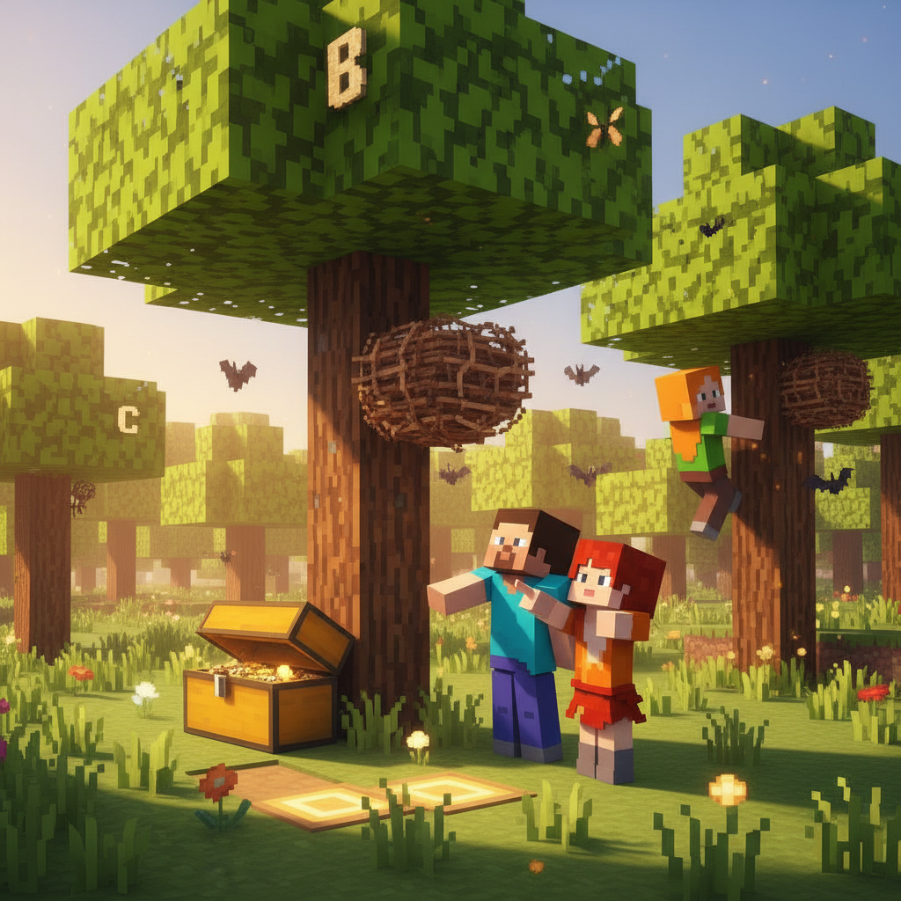
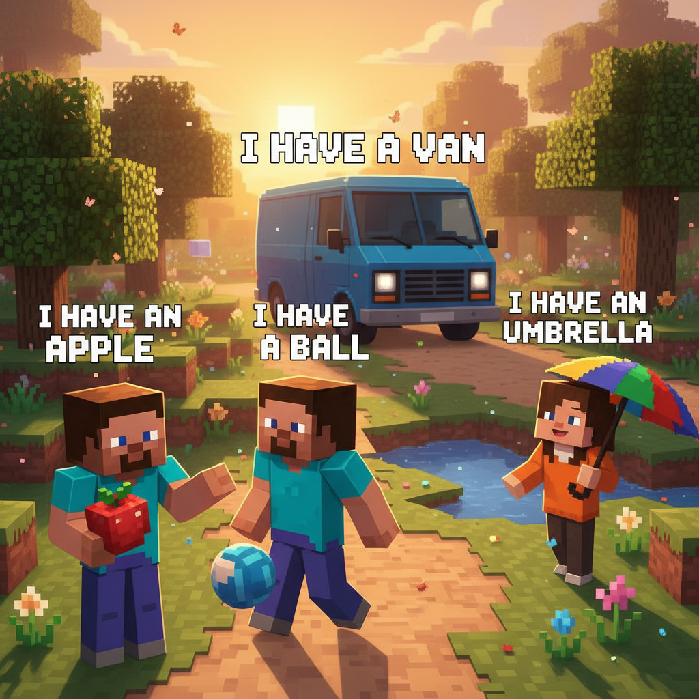
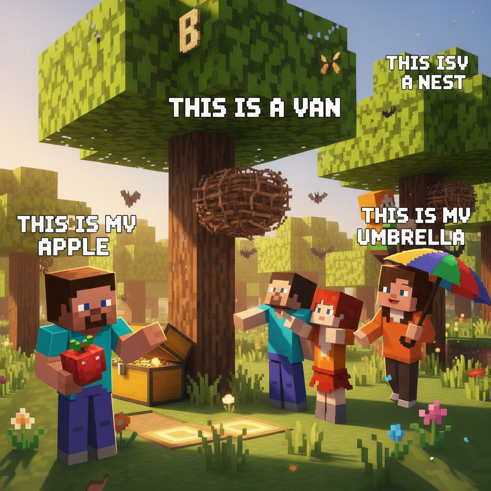
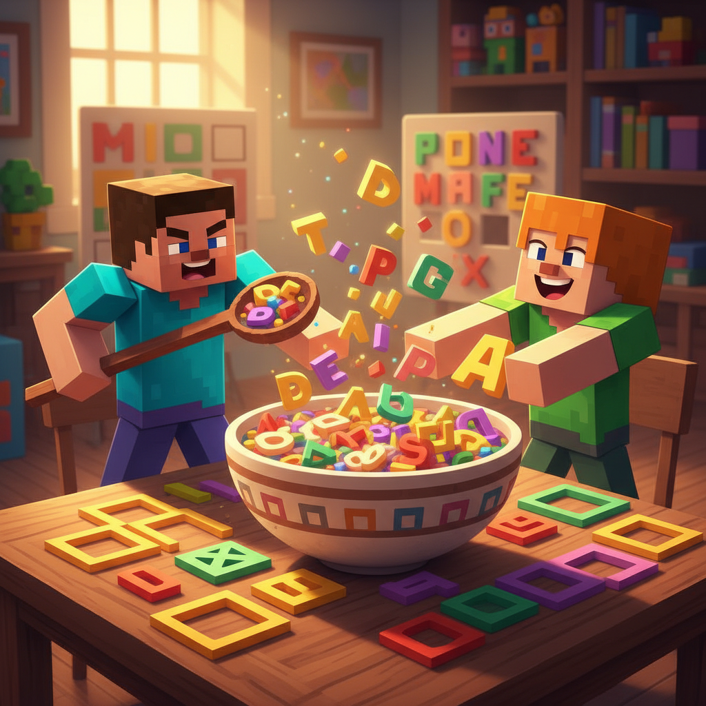
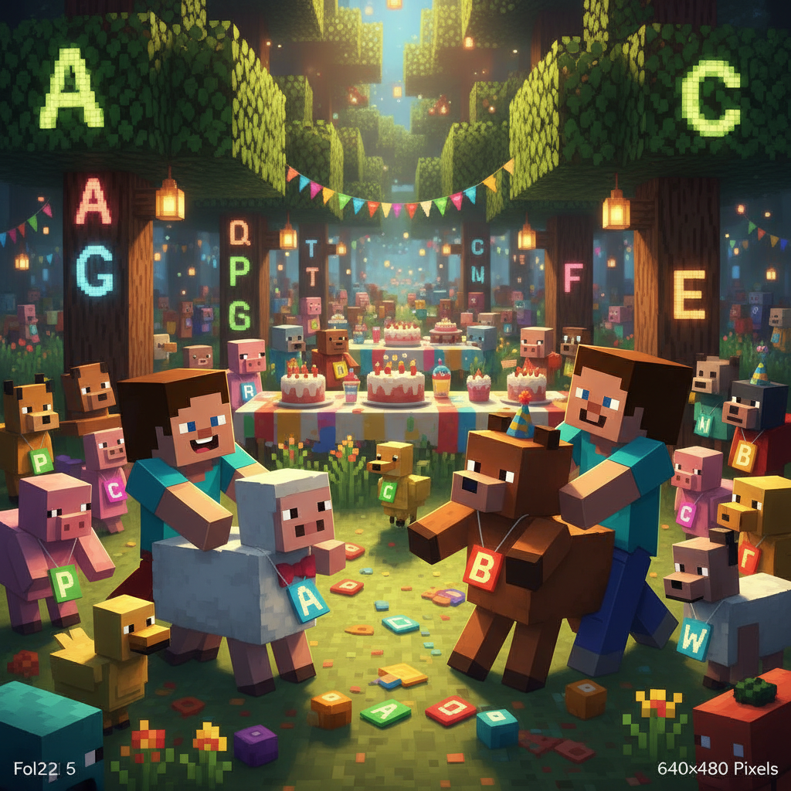
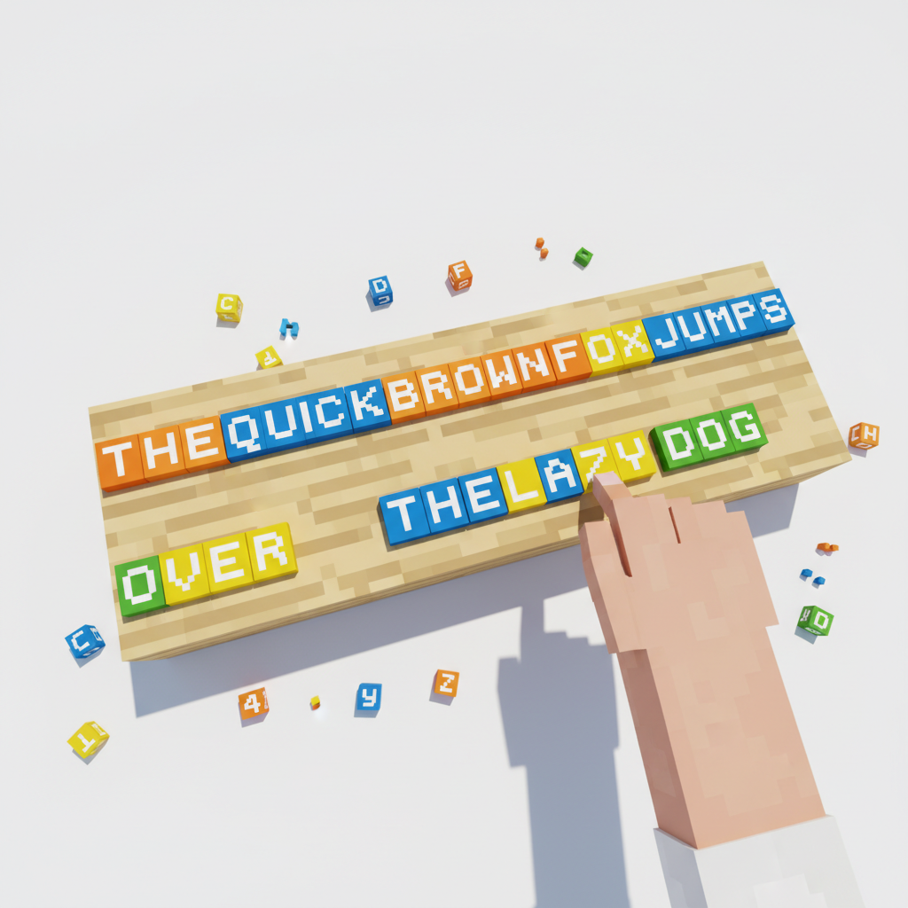

# Lesson 3 — Extension: ABC N-Z Fun!

> 📖 **Complete Lesson 3 first, then try this!**

---

## 📋 Learning Goals
- Review letters N-Z
- Sight words practice: **my, not, one, the, up, we**
- New phrases: **"I have a ___."** and **"This is ___."**

---

## 🤔 Page 1: Back to the Forest

Steve returns to the Alphabet Forest to practice N-Z.

Lily the rabbit is waiting for him.

> "Hello, Steve! Let's practice **N to Z** today!"

Lily points to her house — a **nest** in a **tree**.

> "**This** is **my** nest!"
>
> "**I have** **one** nest."
>
> "It is **not** big, but I **like** it."

Steve says: "**I have** a house too! **My** house is **not** a nest!"


---

## 💬 Page 2: "I Have" Sentences

Let's learn a useful sentence pattern!

**I have** = 我有

| Sentence | 中文 |
|----------|------|
| **I have** an apple. | 我有一个苹果。 |
| **I have** a ball. | 我有一个球。 |
| **I have** one sister. | 我有一个妹妹。 |
| **I have** a yellow umbrella. | 我有一把黄伞。 |
| **We have** a van. | 我们有一辆车。 |
| **We have** water. | 我们有水。 |

> 📝 **Pattern:**
> **I have** + a/an + (word).
> **We have** + (word).

Practice with Lily:

> Lily: "**I have** a carrot. Do you **have** a carrot?"
> Steve: "No, but **I have** an apple!"
> Lily: "**We have** yummy food!"



---

## 💬 Page 3: "This Is" Sentences

Another useful pattern!

**This is** = 这是

| Sentence | 中文 |
|----------|------|
| **This is** my ball. | 这是我的球。 |
| **This is** a cat. | 这是一只猫。 |
| **This is** an orange. | 这是一个橙子。 |
| **This is** not a pig. | 这不是猪。 |
| **This is** the sun. | 这是太阳。 |

> 📝 **Pattern:**
> **This is** + (word).
> **This is not** + (word).

Now using both patterns:

> Steve: "**This is** **my** apple."
> Lily: "**This is** **my** nest."
> Steve: "**We** **have** good things!"



---

## ✏️ Page 4: N-Z Review — What's the Letter?

Can you guess the letter from the clue?

```
🪺 "I am a home for birds. I start with __."
🦊 "I am clever. I start with X? Y? No, __!"
👑 "I wear a crown. I am a __."
☀️ "I am bright and hot. I am the __."
🦓 "I have stripes. I am a __."
```

**Write the first letter for each word:**
```
___est   ___range   ___ig   ___ueen   ___abbit
___un   ___ree   ___mbrella   ___an   ___ater
___ox   ___ellow   ___ebra
```

> Can you do all 13 without looking back?



---

## 🎯 Page 5: Alphabet Soup

Some letters got mixed up in alphabet soup! Help sort them.

**Part A:** Put these letters in order (N-Z):
```
R  N  P  Q  S  O  T  U  V  W  Z  Y  X
→ ___ ___ ___ ___ ___ ___ ___ ___ ___ ___ ___ ___ ___
```

**Part B:** Circle the vowels (a e i o u):
```
N O P Q R S T U V W X Y Z
```

**Part C:** Which letter is NOT in the alphabet?
```
A B C D E F G H I J K L M N O P R S T U V W X Y Z
Missing: ___ (答案：Q)
```


---

## 🎭 Page 6: Alphabet Zoo

The animals from the Alphabet Forest are having a party!

**Who is there?**
```
🐱 Cat (C)
🐶 Dog (D)
🐷 Pig (P)
🐰 Rabbit (R)
🦊 Fox (X)
🦓 Zebra (Z)
🐟 Fish (F)
🐸 Frog (no, we didn't learn F yet... or did we? F is for Fish!)
🦁 Lion (L)
🐄 Cow (C... wait, that's two! C for Cat and Cow!)
```

**Can you name all the animals by their letter?**

> A: ___  B: ___  C: ___ (2 animals!)
> F: ___  L: ___  P: ___  R: ___  X: ___  Z: ___

**Bonus:** What animal starts with **Y**? (Hint: not yellow!)



---

## ✏️ Page 7: Build-a-Sentence (N-Z)

Put the words in order!

**1.**
```
have / I / an orange  →  ___ ___ ___ ___
```

**2.**
```
is / This / my umbrella  →  ___ ___ ___ ___
```

**3.**
```
not / is / a pig / It  →  ___ ___ ___ ___
```

**4.**
```
water / have / We  →  ___ ___ ___
```

**5.**
```
one / tree / I see  →  ___ ___ ___ ___
```

**6.**
```
up / is / The sun  →  ___ ___ ___
```



---

---

> 📐 **CEFR Level:** Pre-A1 | **对标:** 英语课标一级·听说·日常问候与基础词汇

### ⚠️ Common Mistakes

| ❌ Wrong | ✅ Right |
|----------|---------|
| "I have a apple" | **"I have an apple"** — use "an" before a/e/i/o/u sounds |
| "This is N. It say /n/" | **"This is N. It says /n/"** — letter name ≠ letter sound |
| "I have two apple" | **"I have two apples"** — add -s for more than one |
| "Z is /zee/" (UK) or "Z is /zed/" (US confused) | **"Z is /zee/" (US) or /zed/ (UK)** — both are correct! |
### 🧠 Think About It
1. **Observation**: In English, we say "Hello!" but in Chinese we say "你好！" Why do different languages have different greetings?
2. **What if**: What if English had no alphabet letters — every word was a picture like ancient Egyptian? How would you write "cat"?

## 🔗 Cross-Curricular Links
语文第1课教象形字：英语字母 A 来自牛头𓃾（aleph），B 来自房子（beth）→ 一起画字母演变图
数学第1-2课数字 1-10：用英文数字标签给 Minecraft 方块编号，中英双语数方块
Sound Block: N-Z 字母发音与拼音声母对比（n/n/, l/l/, s/s/ — 中英同音！）
## 🎯 Page 8: Challenge — I Can Read!

Read these sentences out loud!

```
1. I have one orange. It is not yellow. It is orange!

2. This is my umbrella. We have water. It is not raining.

3. The sun is up. We see a fox. The fox is not in the tree.

4. This is my nest. I have one egg. It is not a pig! It is a bird's egg.

5. I have two animals! A rabbit and a zebra? No, a rabbit and a fox!
```

> Read all 5 → **⭐ Super Reader N-Z!**



---

## 🎉 Page 9: A to Z — Complete!

> ⭐ **Full Alphabet Super Reader!**

Steve has walked through the entire Alphabet Forest twice — forward and backward!

> "Now I know my ABCs! All 26 of them!"
>
> "A to Z — I did it!"

Lily gives Steve a crown:

> "**This is** for the Alphabet King!"

### Extension Summary
- ✅ Letters N-Z reviewed
- ✅ New sentences: **I have, This is**
- ✅ Sight words: **my, not, one, the, up, we**
- ✅ I can **read** N-Z sentences!
- **Total words learned: 26 alphabet words + 9 sight words = 35 words**

> ➡️ **Next lesson: Colorful World — Let's learn colors!**
