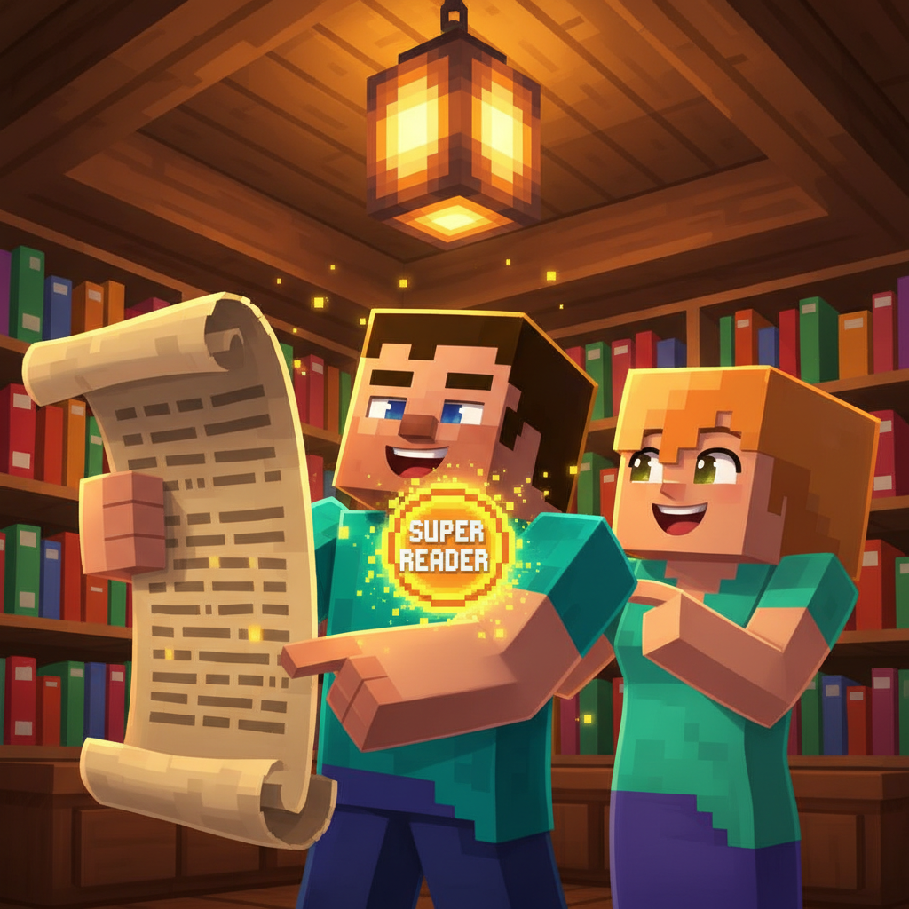
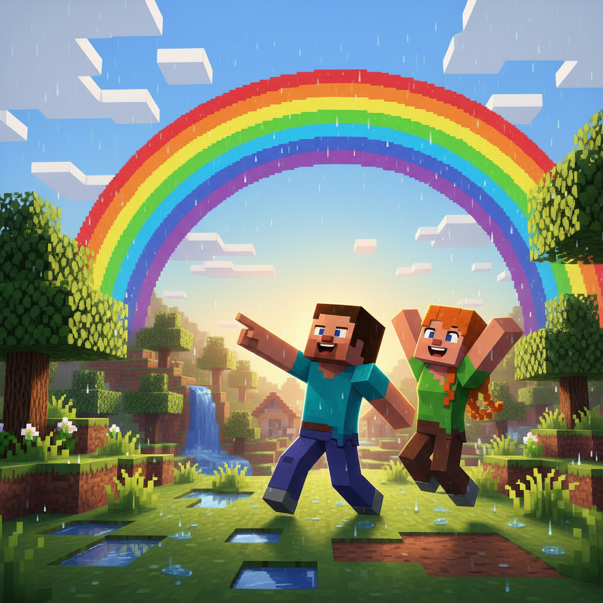
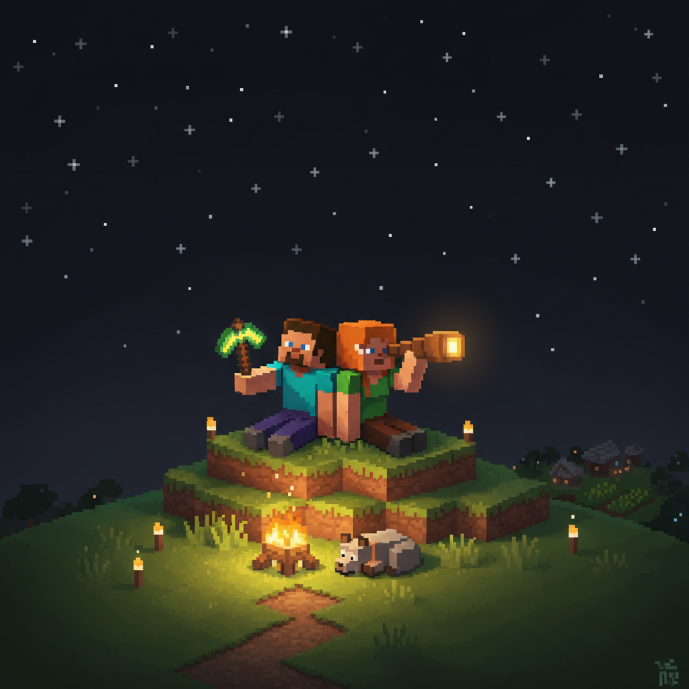
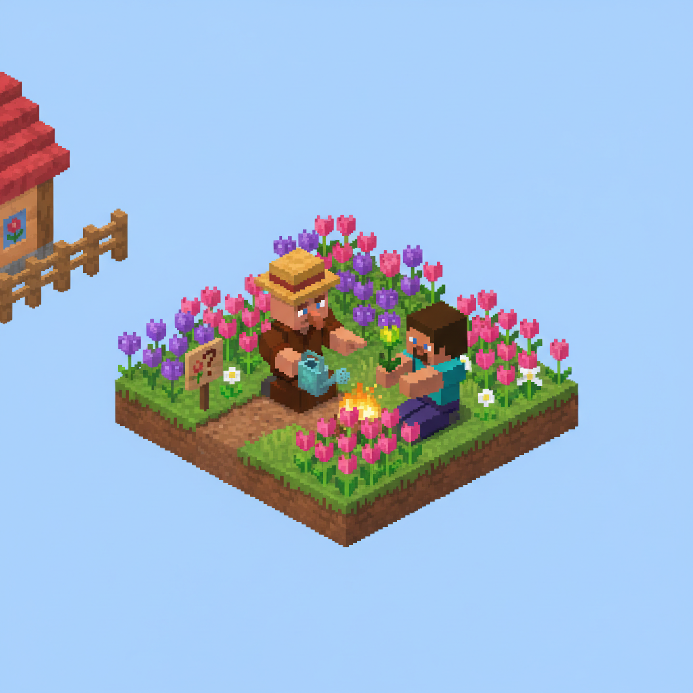
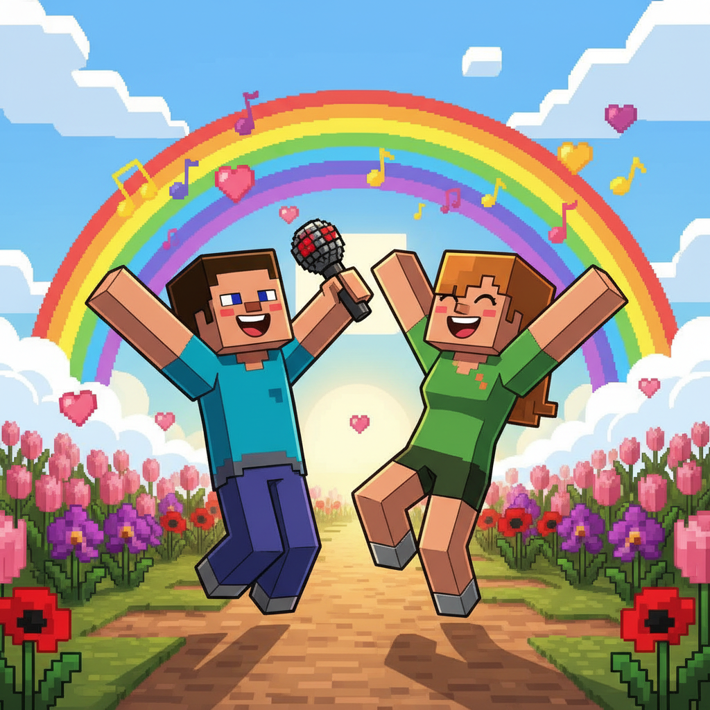
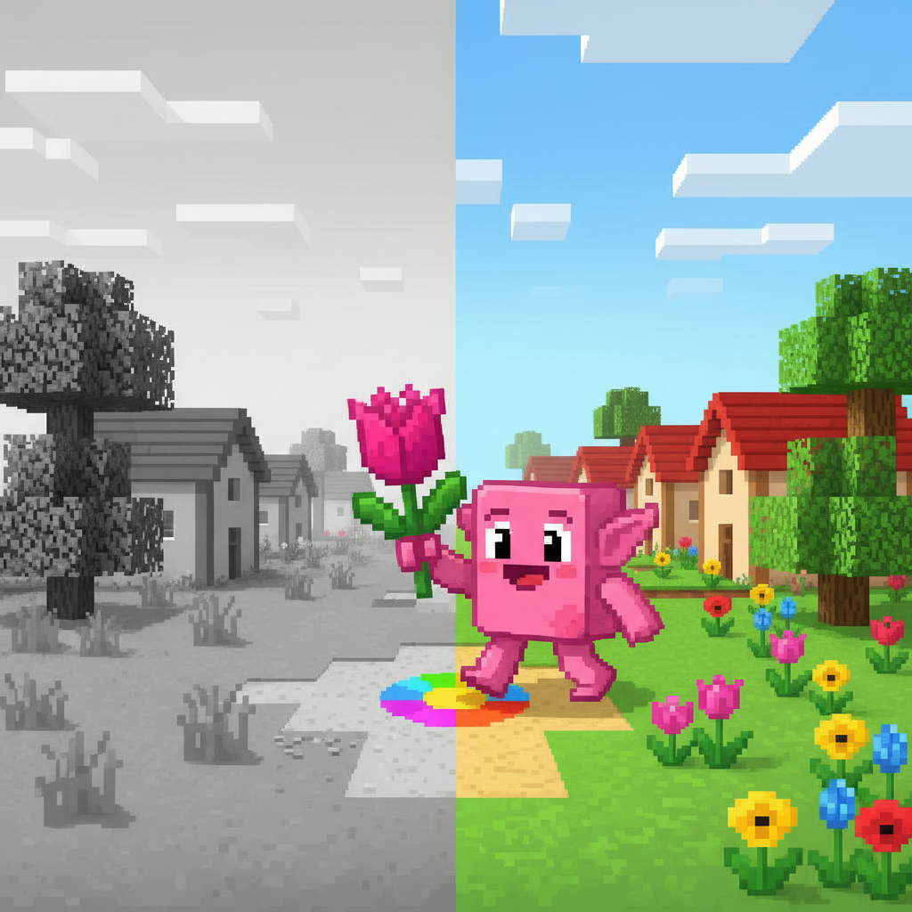

# Lesson 4: Colors 🌈

## 📋 Learning Goals
- Learn 8 color words: **red, blue, yellow, green, black, white, pink, purple**
- Weather words: **rain, rainbow, sun**
- Sight words: **a, big, look, see**
- Build sentences: "I see a ___." / "Look! A ___ ___."

**Total words so far: 41** (L1: 4, L2: 17, L3: 17, L4: 11)

---

## Page 1: A Gray Day

Steve and Alex wake up. They look out the window.

> "Oh no. It is **gray** outside." Alex is sad.

The sky is gray. The clouds are gray. Everything is gray!

> "I do not see any colors," says Steve.

A big raindrop falls. Then another.

> Plip! Plop!

> "It is **rain**!" says Alex.



---

## Page 2: Rain, Rain, Go Away

The rain is heavy now. Steve and Alex stand under a tree.

"Rain, rain, go away," Alex sings.

But then...

> "Look!" Steve points at the sky.

The rain stops. A big, beautiful arc of color stretches across the sky!

> "What is THAT?" Alex gasps.

> "A **rainbow**!" Steve shouts. "Look at the colors!"



---

## Page 3: Red and Blue 🔴🔵

The rainbow has seven colors. Let's start with two!

> "I see **red**!" says Alex. "Red like an apple!"

```
   R E D    →    red  🔴
   红苹果           apple
```

> "I see **blue**!" says Steve. "Blue like the sky!"

```
   B L U E    →    blue  🔵
   蓝色天空         sky
```

Steve makes a rhyme:
> "Red, red, I see red!
>  Blue, blue, I see blue!
>  Look at the rainbow — one, two!"


---

## Page 4: Sight Words: a, look, see 👀

Time to learn three helper words!

| Word | Say | Game |
|------|-----|------|
| **a** | /ə/ | Point: "a cat, a dog, a hat" |
| **look** | /lʊk/ | Cover eyes, open: "Look!" |
| **see** | /siː/ | Hand over eyes: "I see a ___" |

**Sentence builder:**
> I + see + a + ___ .

```
I see a rainbow.    👀🌈
I see a red apple.  👀🔴
I see a blue sky.   👀🔵

Look! I see a ___ !
```

**Game time:** Alex covers his eyes. Steve points at something. Alex opens his eyes.

> "Look! What do you see?"

> "I see a **big** tree!" says Alex.

**big** = not small, very large 🐘


---

## Page 5: Yellow and Green 🟡🟢

Back to the rainbow!

> "What is next?" asks Alex.

> "**Yellow**! Yellow like the **sun** ☀️!" says Steve.

```
   Y E L L O W    →    yellow  🟡
   黄色太阳             sun
```

The sun comes out. It is warm and bright!

> "Look! **Green** grass!" Alex jumps on the grass.

```
   G R E E N    →    green  🟢
   绿色的草           grass
```

After the rain, everything is green and fresh!

> "Yellow sun, green grass — the rainbow made everything beautiful!"


---

## Page 6: Black and White ⚫⚪

It is getting late. The sun goes down.

> "Now I see **black**," says Steve.

```
   B L A C K    →    black  ⚫
   黑色的夜           night
```

The sky is black, but then...

> "Look! Stars! I see **white** stars ✨!"

```
   W H I T E    →    white  ⚪
   白色的星星         star
```

> "Black night, white stars. So pretty!"


---

## Page 7: Pink and Purple 💗💜

The next morning, Steve and Alex visit the village garden.

A villager is planting flowers!

> "I see **pink** flowers!" Alex picks one.

```
   P I N K    →    pink  💗
   粉色的花       flower
```

> "And I see **purple** flowers!" Steve shows one.

```
   P U R P L E    →    purple  💜
   紫色的花          flower
```

The garden is full of colors: red, yellow, pink, purple flowers. Green leaves. Blue sky above. White clouds drifting.

> "The world is so colorful!" Alex spins around.



---

## Page 8: The Color Song 🎵

Steve and Alex make up a song while walking:

```
🎵 Red, red, I see red!
   Blue, blue, I see blue!
   Yellow sun and green, green grass —
   Look at all the colors!

   Black, black, the night is black!
   White, white, the stars are white!
   Pink and purple flowers bloom —
   Look at all the colors! 🎵
```

> "We should sing this every day!" says Alex.



---

## 📝 Story Time: The Missing Color

One day, Steve wakes up in the village.

> "Where is the color?" he asks.

Everything is gray! The sky is gray. The grass is gray. The flowers are gray.

> "Oh no! Someone took the colors!" cries Alex.

A small note is on the ground:

```
   Find me → look for red, blue, yellow, green.
   Find me → I am at the rainbow's end.
```

Steve and Alex run. They find a red apple. They find a blue flower. They find a yellow sunbeam. They find green grass.

> PING! 💫 Each color they find, the world gets its color back!

At the rainbow's end, they find a little gray goblin.

> "I just wanted to be colorful too," it cries.

Alex gives him a pink flower. The goblin turns pink!

> "You are colorful now!" Steve laughs.

The world is colorful again. 🌈



---

## 🎯 Practice

### 1. Match the Color

| Color | Match |
|-------|-------|
| red 🔴 | A. the night |
| blue 🔵 | B. the sun |
| yellow 🟡 | C. an apple |
| green 🟢 | D. the sky |
| black ⚫ | E. a flower |
| white ⚪ | F. grass |
| pink 💗 | G. a star |
| purple 💜 | H. a flower |

### 2. Fill In — What Do You See?

```
I see a ___ apple.     (颜色：🔴)
I see a ___ sky.       (颜色：🔵)
I see ___ grass.       (颜色：🟢)

Look! I see a ___ star!    (颜色：⚪)
I see a ___ flower.        (颜色：💗)

The rainbow has ___ colors.
```

### 3. Say and Color!

| Say | Draw |
|-----|------|
| a red heart | ❤️ |
| a blue fish | 🐟 |
| a yellow sun | ☀️ |
| green grass | 🌿 |
| a pink flower | 🌸 |
| a purple grape | 🍇 |

### 4. Read This!

```
  R E D, red!
  B L U E, blue!
  I see colors. I see you!
  
  Look! A big red apple.
  Look! A big blue sky.
  I see colors! My, oh my!
```

---

## 🏆 Challenge — Color Quest!

You are a Color Knight! Complete 4 tasks:

**🔴 Task 1: Color Hunt**
In your room, find something:
- red: ___
- blue: ___
- green: ___

**🔵 Task 2: Color the Rainbow**
Draw a rainbow. Color each band:
☐ red → ☐ yellow → ☐ green → ☐ blue → ☐ purple

**🟡 Task 3: Read & Draw**
Read this and draw in Minecraft style:
> "I see a big yellow sun. I see green grass. I see a pink flower. Look — a rainbow!"

**🟢 Task 4: Spell It!**
How do you spell...
- R _ D
- B _ U E
- Y E _ L O W
- G R _ _ N

---

## 📊 Lesson Summary

New words I learned:
- [ ] red 🔴 — color of apples
- [ ] blue 🔵 — color of the sky
- [ ] yellow 🟡 — color of the sun
- [ ] green 🟢 — color of grass
- [ ] black ⚫ — color of the night
- [ ] white ⚪ — color of stars
- [ ] pink 💗 — color of some flowers
- [ ] purple 💜 — color of some flowers
- [ ] rainbow 🌈 — colors in the sky
- [ ] rain 🌧️ — water from clouds
- [ ] sun ☀️ — bright light in the sky

Sight words:
- [ ] a — I see a dog
- [ ] big — a big tree
- [ ] look — Look at me!
- [ ] see — I see a rainbow

> **Total words: 41** (hello, goodbye, name, friend, good, morning, afternoon, night, how, are, you, I, am, happy, tired, apple, ball, cat, dog, egg, fish, girl, hat, igloo, juice, kite, lion, moon, my, not, one, the, to, nest, orange, pig, queen, rabbit, sun, tree, umbrella, van, water, fox, yellow, zebra, **red, blue, green, black, white, pink, purple, rainbow, rain, big, look, see, a**)

---


