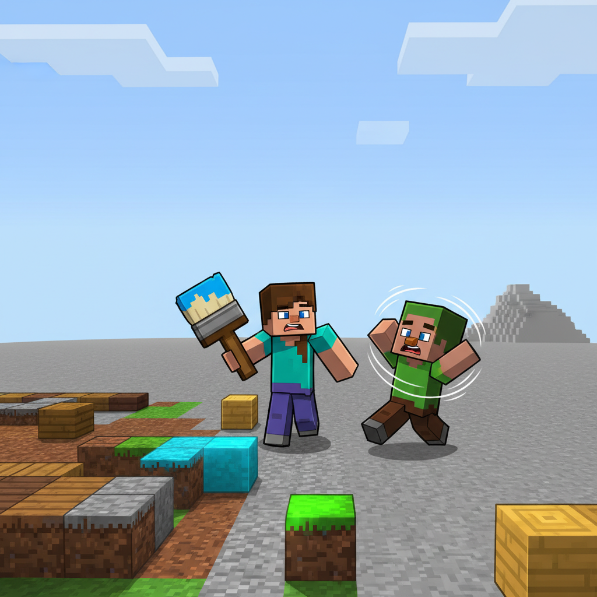
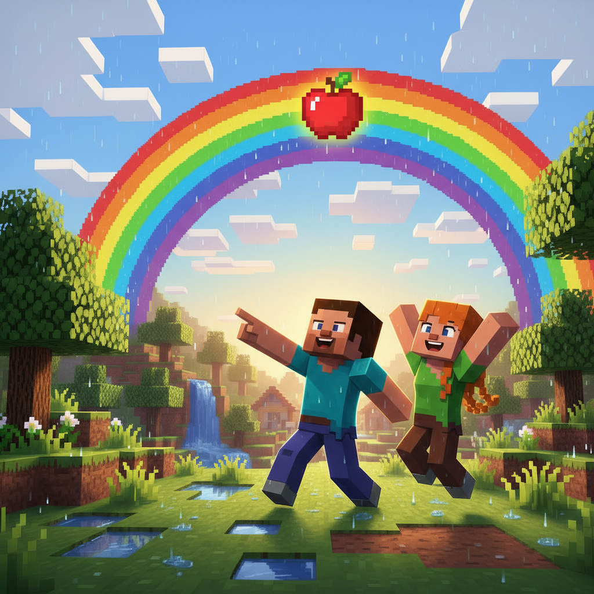
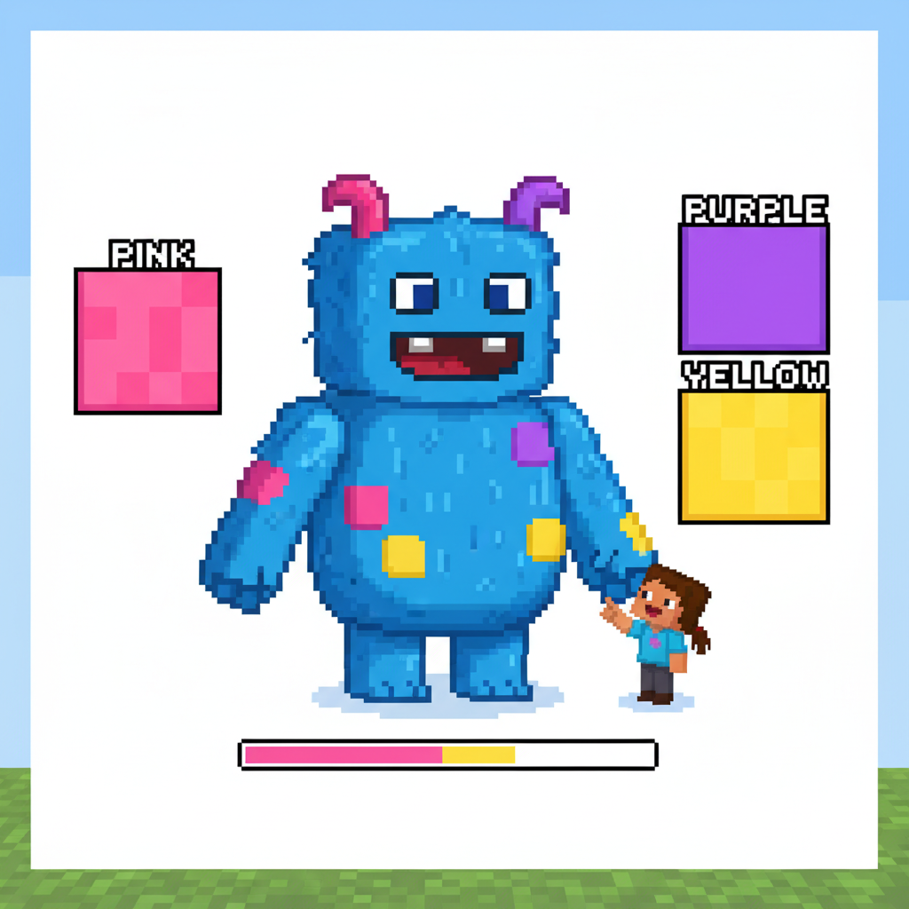

# Lesson 4 Extension: Color Magic 🌈✨

## 📋 Learning Goals
- Reinforce 8 color words + 4 sight words (a, big, look, see)
- New words: **orange, brown, gray, rainbow, mix, paint**
- Sentence pattern: "The ___ is ___." / "I like ___."

---

## Page 1: The Colorless Village 🏚️

A new adventure begins!

> "Something is wrong," says Steve.

The village is losing its colors! The red roof turned gray. The green grass faded to white. The blue sky is turning pale.

> "The Color Monster is eating all the colors!" a villager cries.

> "We have to stop it!" Alex grabs her paintbrush.

She holds up a bucket:
> "We will **paint** the world back to color!"


---

## Page 2: Paint It Red! 🎨🔴

The first faded thing is the big barn. It used to be red. Now it's gray.

> "The barn is gray. I want it **red**."

Alex dips her brush:

```
   "I paint the barn RED!"
   
   The barn is red now.
   I like red. Red is warm!
```

Ding! ✨ The barn glows and turns bright red again.

> "One color saved!" Steve cheers.



---

## Page 3: Paint It Blue and Green! 🎨🔵🟢

Next, the sky and the grass.

> "The sky must be **blue**!" Alex paints upward.

Whoosh — the sky turns deep blue!

> "The grass must be **green**!" She paints the ground.

The grass springs back green and fresh.

> "Blue sky. Green grass. The village is waking up!"

New word:

**gray** [ɡreɪ] — the color of clouds before rain, the color of a stone

> "I do not like gray. I like *colors*!" says Alex.


---

## Page 4: Orange and Brown! 🎨🟠🟤

Steve joins in with his own brush!

> "Let me paint the pumpkins!" says Steve.

```
   O R A N G E    →    orange  🟠
   橙色的南瓜            pumpkin
```

> "**Orange** pumpkins! I like orange!"

Then he paints the tree trunks:

```
   B R O W N    →    brown  🟤
   棕色的树干            tree trunk
```

> "**Brown** trees! Brown is the color of earth and wood."

The village is getting more colorful every minute!


---

## Page 5: The Color Monster Appears 👾

Suddenly — BOOM!

A big, gray, swirling monster appears in the village square.

> "WHO IS PAINTING MY GRAY WORLD?!" it roars.

> "I am the Color Monster! I eat colors! Gray is the best!"

Alex steps forward bravely:

> "Gray is boring! Look at the rainbow — look at the flowers! Why do you only like gray?"

The monster stops. It looks at the pink flowers, the red barn, the blue sky.

> "I... I never saw colors before. I was born gray."



---

## Page 6: Teaching the Monster Colors 🌈

> "Let us teach you!" says Steve.

He holds up a flower:

> "This is **pink**. Pink is pretty!"

> "This is **purple**. Purple is royal!"

> "This is **yellow**. Yellow is sunny!"

The monster stares. Then...

> "P-pink?" it whispers. A tiny pink spot appears on its gray skin.

> "Pur-ple?" A purple spot. "Yel-low?" A yellow spot.

The monster is turning colorful!

> "I did not know..." it says, tears in its eyes. "Colors are... beautiful!"


---

## Page 7: A Rainbow Friend 🌈👾

The Color Monster is now covered in all the colors of the rainbow!

> "I am not gray anymore!" it laughs. "Red, blue, yellow, green, pink, purple, orange... I like them all!"

The monster waves its hand. A giant **rainbow** appears over the village.

> "I can make rainbows now!" 🎉

From that day on, the Color Monster lives in the village. Every time it rains, it makes a huge rainbow.

> "Gray is okay too," says the monster. "Gray clouds bring rain. Rain brings rainbows. Gray is part of the story."


---

## Page 8: Let's Make a Color Book! 📒

Steve and Alex decide to make a **Color Book** so everyone remembers.

Together, they write:

```
   Page 1: red ❤️ — a red apple
   Page 2: blue 💙 — a blue sky
   Page 3: yellow 💛 — a yellow sun
   Page 4: green 💚 — green grass
   Page 5: pink 💗 — a pink flower
   Page 6: purple 💜 — a purple grape
   Page 7: orange 🧡 — an orange pumpkin
   Page 8: brown 🤎 — a brown tree
   Page 9: black 🖤 — the black night
   Page 10: white 🤍 — the white stars
```

> "Ten pages! Ten colors!" Alex says proudly.

> "And one more..." Steve adds a last page:

```
   Page 11: rainbow 🌈 — ALL the colors together!
```



---

## 🎯 Practice

### 1. Color the Monster!

The Color Monster needs his colors back! Color each part:

| Body part | Color it... |
|-----------|-------------|
| Head | 🔴 red |
| Left arm | 🔵 blue |
| Right arm | 🟡 yellow |
| Body | 🟢 green |
| Left leg | 💜 purple |
| Right leg | 🟠 orange |
| Tail | 💗 pink |

### 2. What Color Is It?

Read and answer:

> The apple is ___.
> The sky is ___.
> The grass is ___.
> The sun is ___.
> The night is ___.
> The star is ___.

Now pick three things in your room. What color are they?

```
   My ___ is ___.
   My ___ is ___.
   My ___ is ___.
```

### 3. Make a Rainbow Sentence

Mix and match!

| I see | a | red | apple |
| I like | the | blue | sky |
| Look at | this | yellow | sun |
| That is | a | green | frog |
| Where is | my | pink | flower |

> Example: "I see a red apple." 🍎
> Your turn: _________________

---

## 🏆 Challenge — Become a Color Wizard!

**Wizard Level 1: Color Speller 🧙‍♂️**
Spell these colors:
- R _ D
- B _ U _
- Y _ L L _ W
- G _ E _ N

**Wizard Level 2: Color Poet 📝**
Finish the poem:

```
   Red like an apple,
   Blue like the ___,
   Yellow like the ___,
   Green like the ___!
   
   Colors, colors, everywhere —
   I see colors in the ___!
```

**Wizard Level 3: Color Mixer 🎨**
What happens when you mix?

🔴 + 🟡 = 🟠 (red + yellow = orange)
🔴 + 🔵 = 💜 (red + blue = ___)
🔵 + 🟡 = ? (blue + yellow = ___)

**Wizard Level 4: Roy G. Biv 🌈**
The rainbow order:
R___, O___, Y___, G___, B___, I___, V___

(Hint: Red, Orange, Yellow, Green, Blue, Indigo, Violet)

---

## 📊 Extension Summary

New words I learned:
- [ ] orange 🟠
- [ ] brown 🟤
- [ ] gray 🩶
- [ ] paint 🎨
- [ ] mix — put two colors together
- [ ] I like — I like blue!

Review words:
- [ ] red, blue, yellow, green ✓
- [ ] black, white, pink, purple ✓
- [ ] a, big, look, see ✓
- [ ] rainbow, rain, sun ✓

> **Total words: 47** (+6 new from extension: orange, brown, gray, paint, mix, like)

---


