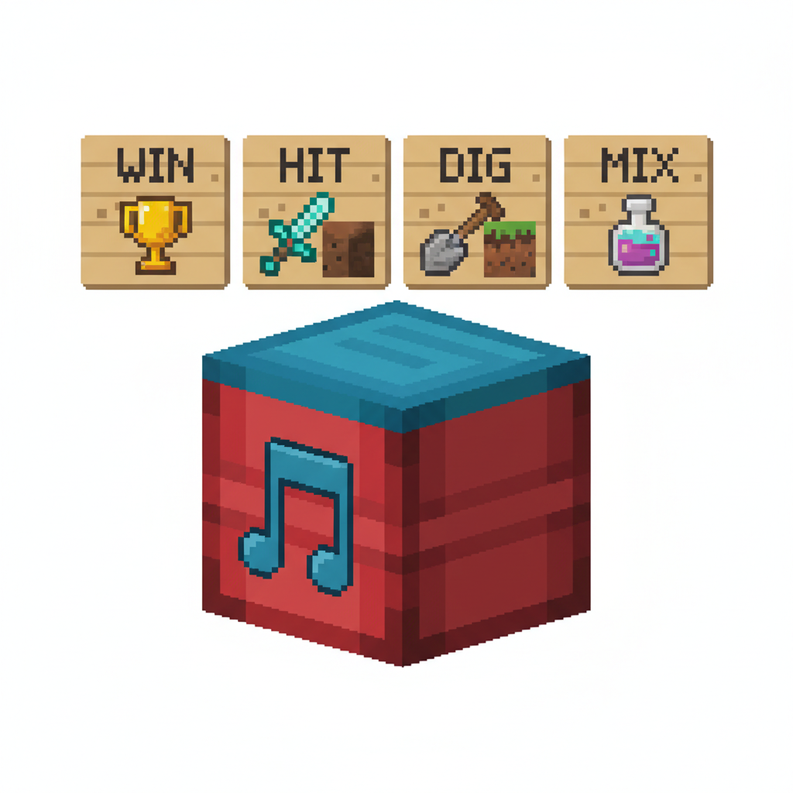
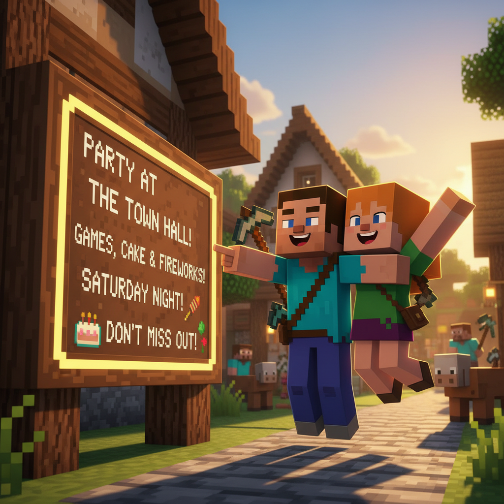
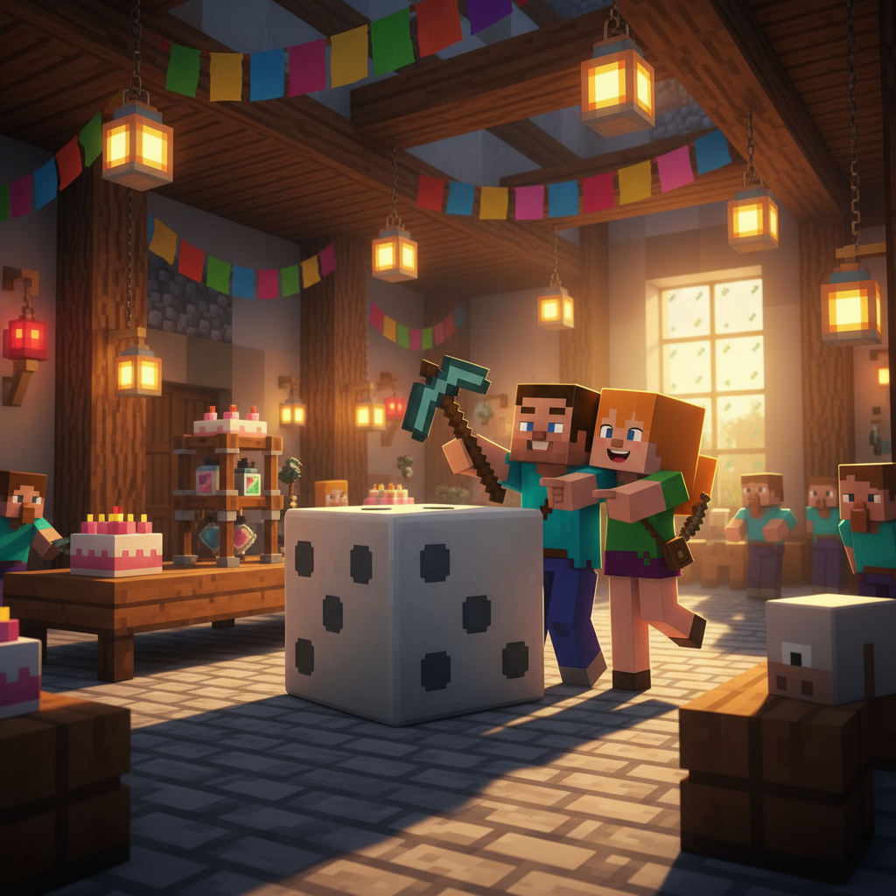
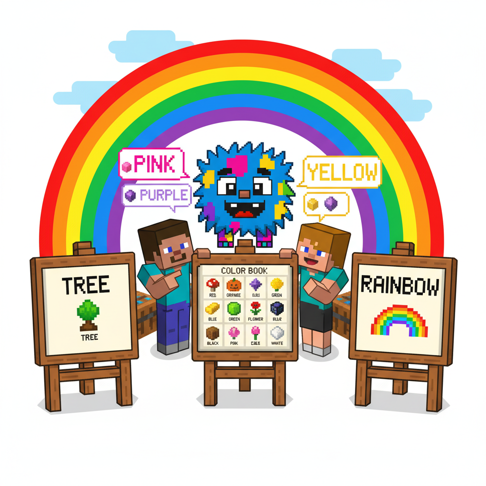
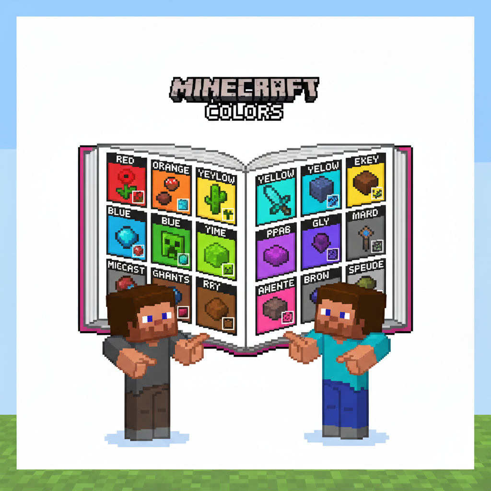
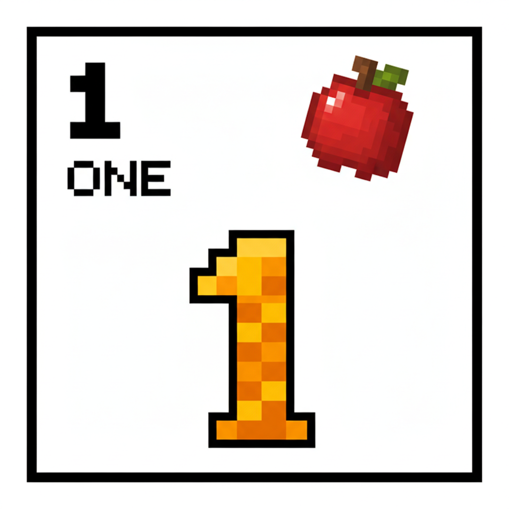

# Lesson 5 Extension: Number Party 🎉

## 📋 Learning Goals
- Review numbers 1-5 + sight words (and, can, come, down, for)
- New words: **six, seven, party, give, take**
- Sentence: "Give me ___." / "I have ___."
- 🔤 Sound Block review: /ɪ/ + new CVC words

---

## 🔤 Sound Block Review: More /ɪ/ Words!

```
   🎵 NOTE BLOCK GLOWING!

   Review: /ɪ/ = "ih" sound

   Old friends:  fish 🐟  pig 🐷  big 🐘  six 6️⃣
   
   New friends:
   w-i-n → win!    🏆
   h-i-t → hit!    👊
   d-i-g → dig!    ⛏️
   m-i-x → mix!    🥄

   Tap and say: /ɪ/ /ɪ/ /ɪ/
```


---

## Page 1: The Number Party Invitation 💌

Back at the village, there is a party!

A sign on the village board reads:

```
   🎉 NUMBER PARTY 🎉
   Today at the big hall!
   Bring 5 friends!
   Come and count!
```

> "A number party!" Alex is excited. "Let's go!"

Steve reads the invitation:

> "It says **give** a number **and** **take** a gift!"

```
   give = 给      take = 拿
   
   Give me one apple.      🍎
   I take the apple.       🍎👋
```



---

## Page 2: Six and Seven 🎲

At the party, there is a big dice game!

The host rolls two giant dice:

> 🎲 "**Six**!" says the host.

```
   S-I-X → six 6️⃣
```

> "I see **six** stars on the dice!"

> 🎲 "**Seven**!" rolls the other.

```
   S-E-V-E-N → seven 7️⃣
```

> "**Six** and **seven**! Two more numbers!"

```
   one two three four five + six seven
   ☝️✌️🤟🖖🖐️ + 6️⃣7️⃣ = I can count to seven!
```



---

## Page 3: Give and Take Game 🎁

The party game begins!

> Rule: **Give** your friend a number of blocks.
> Your friend says how many they get.

```
   Round 1:
   Alex gives Steve: 🟫🟫🟫🟫🟫
   Steve counts: "One, two, three, four, five!"
   "I take FIVE blocks!"
   
   Round 2:
   Steve gives Alex: 🟥🟥🟥
   Alex counts: "One, two, three!"
   "I take THREE blocks!"
   
   Round 3:
   Alex gives Steve: 🟦🟦🟦🟦🟦🟦🟦
   Steve counts: "One to SEVEN!"
   "I take SEVEN blocks!"
```

> Everyone cheers!


---

## Page 4: I Have, You Have 🧮

The next game: "I Have, You Have!"

```
   Host: "I have THREE apples. And you?"
   Alex: "I have FOUR cookies!"

   Host: "I have ONE cake. And you?"
   Steve: "I have FIVE cupcakes!"

   Host: "I have TWO fish. And you?"
   Alex: "I have SIX candies!"

   Host: "I have SEVEN friends. And you?"
   Steve: "I have SEVEN too!"
```

> "We are all friends here!" Everyone laughs.

**Sentence pattern:**
```
   I have ___ ___.

   I have three cookies.    🍪🍪🍪
   I have five blocks.      🟫🟫🟫🟫🟫
   I have one big smile!    😊
```



---

## Page 5: The Number Cake 🎂

The best part of the party — a giant cake!

The cake has **seven** candles on it.

> "Let's count the candles!" everyone shouts.

```
   One! Two! Three! Four! Five! Six! Seven!
   ☝️  ✌️   🤟    🖖    🖐️   6️⃣   7️⃣
```

Steve blows out the candles (just pretend — it's a game).

Then everyone gets a piece of cake. Alex counts the pieces:

> "One slice for you, one for you... seven slices for seven friends!"

> "Numbers make a party better!" says the host.


---

## Page 6: The Number March 🥁

The party ends with a big march! Everyone lines up.

The host beats a drum:

```
   🥁 BOOM! (one step)
   🥁 BOOM! (two steps)
   🥁 BOOM! (three steps)
   
   Left! Right! Left!
   Count out loud:
   ONE, TWO, THREE, FOUR, FIVE, SIX, SEVEN!
```

Steve and Alex march at the front. Everyone follows.

> "Counting is EVERYWHERE!" Alex laughs.

> "One step, two step — count the whole world!" Steve shouts.

The march goes around the village. Everyone is counting. Even the chickens!

```
   🐔 "Cluck!" (one cluck)
   🐔 "Cluck-cluck!" (two clucks)
```



---

## 📝 Story Time: The Two Little Birds 🐦

Alex tells a story at the party:

```
   Two little birds sat on a wall.
   One named Peter. One named Paul.
   
   "Come DOWN, Peter!"
   "Come DOWN, Paul!"
   
   And they came down —
   one, two!
```

Everyone claps. Steve says:

> "A story AND numbers! The best!"

The children ask to hear it again.

> "Two birds. Two names. One, two — they come down."

> "Now YOU tell the story!" Alex points to a little boy.

He stands up: "Two... birds... on... wall! Come down! One, two!"

Everyone cheers! 🎉



---

## 🎯 Practice

### 1. Count to 7!

Write the numbers in order:
```
   ___, ___, ___, ___, ___,
   ___, ___
```

### 2. Give and Take

Draw arrows:
```
   Give → 🍎🍎🍎    → I take THREE apples.
   Give → 🍪🍪        → I take ___ cookies.
   Give → 🧸🧸🧸🧸🧸  → I take ___ bears.
```

### 3. How Many?

Count in the picture (imagine it):
```
   I see ___ party hats.
   I see ___ candles on the cake.
   I see ___ friends marching.
```

### 4. 🔤 Sound Block — Mix and Read

| CVC word | Sounds | Meaning |
|----------|--------|---------|
| win | w - i - n | 🏆 |
| hit | h - i - t | 👊 |
| dig | d - i - g | ⛏️ |
| mix | m - i - x | 🥄 |
| six | s - i - x | 6️⃣ |

Make a sentence with one: "I can ___."

---

## 🏆 Challenge — Number Explorer Level 2!

**🔢 Task 1: Count Your Fingers**
Touch each finger and count: 1, 2, 3, 4, 5, 6, 7!

How many on one hand? ___ (5)
How many on two hands? ___ (7 with two more?)

**🎲 Task 2: Draw the Dice**
Draw a dice showing:
- 🎲 3 dots
- 🎲 6 dots
- 🎲 7 dots (it would be a big dice!)

**📝 Task 3: Write About the Party**
```
   I went to a number party.
   I had ___ cookies.     (number 1-7)
   I saw ___ candles.     (number 1-7)
   I had ___ fun!         (one word: BIG!)
```

**🎵 Task 4: Sing the Number March**
```
   One, two, three — march with me!
   Four, five, six — count the sticks!
   Seven, seven — number heaven!
   I can count, I can count, I can COUNT!
```

---

## 📊 Extension Summary

New words:
- [ ] six 6️⃣ — one more than five
- [ ] seven 7️⃣ — one more than six
- [ ] give 🎁 — hand something to someone
- [ ] take 👋 — get something from someone
- [ ] party 🎉

Review:
- [ ] one, two, three, four, five ✓
- [ ] and, can, come, down, for ✓
- [ ] count ✓

🔤 Sound Block:
- [ ] /ɪ/ — win, hit, dig, mix (new) + fish, pig, big, six, sit (review)

> **Total words: 58** (L5 +5: six, seven, give, take, party)

---


