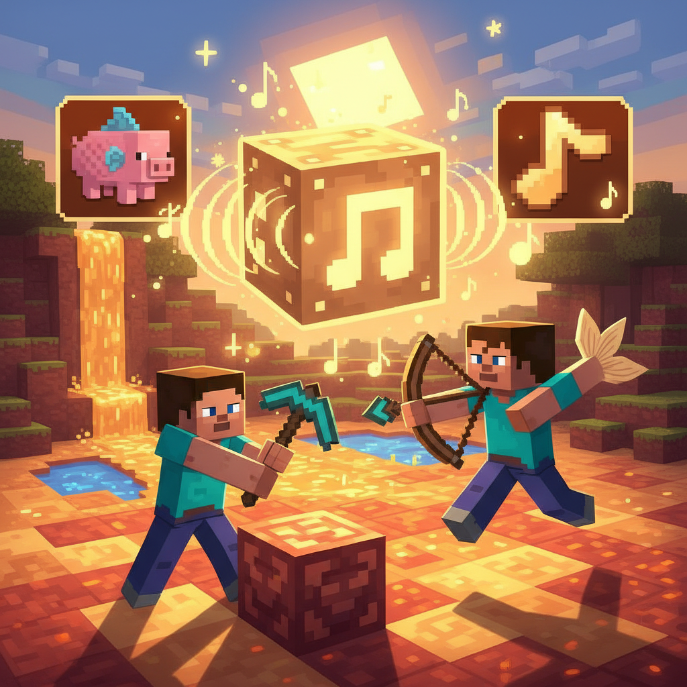
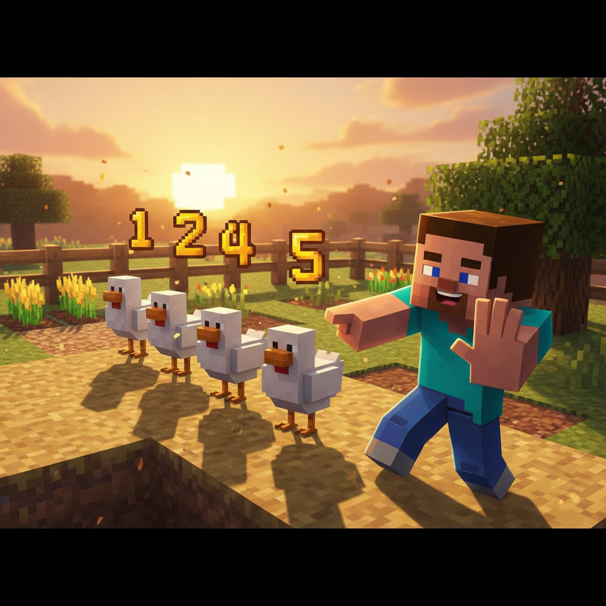
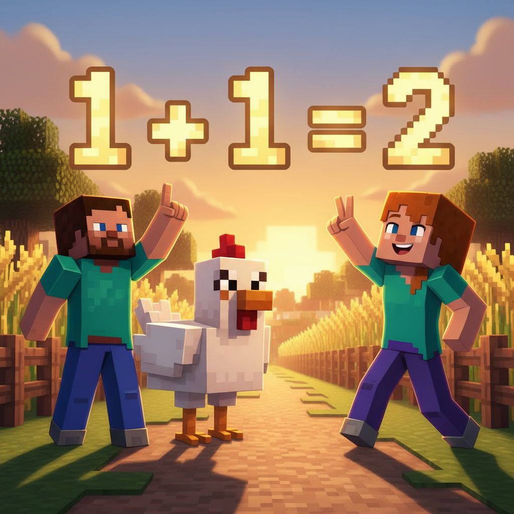
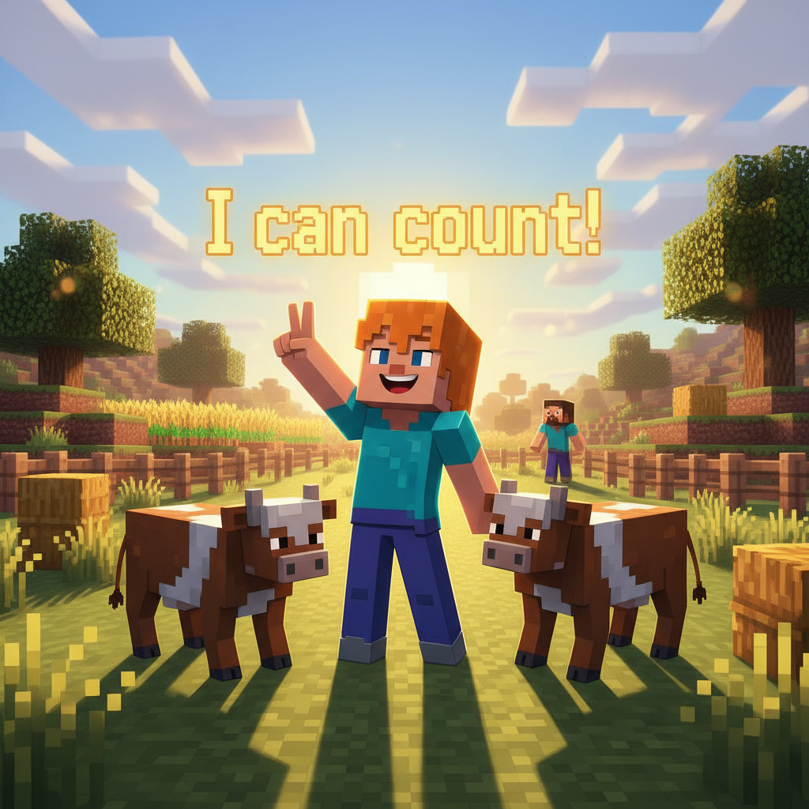
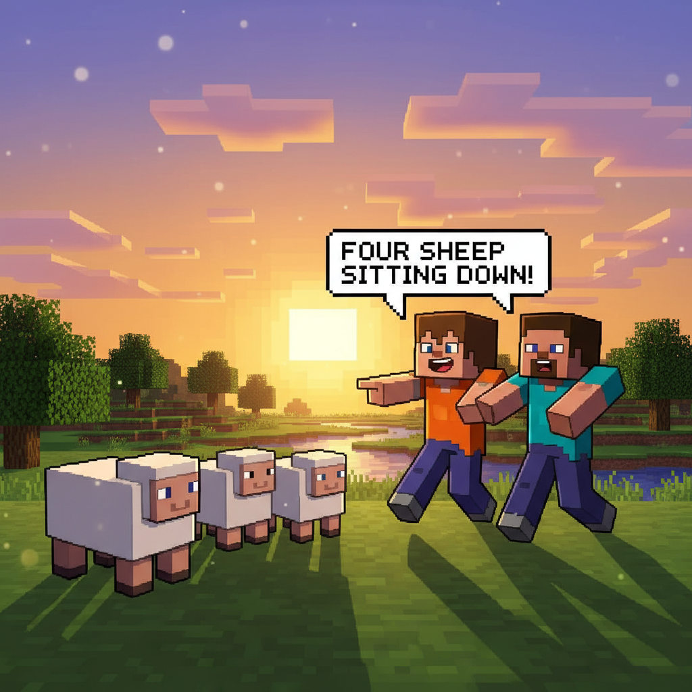
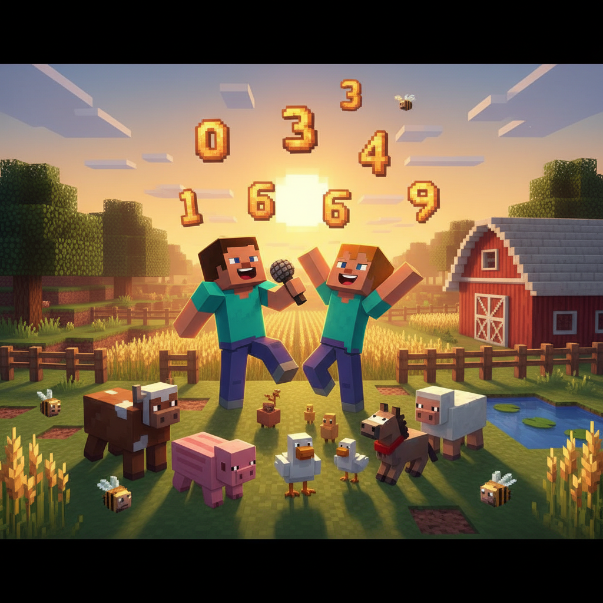

# Lesson 5: Numbers 1-5 🔢

## 📋 Learning Goals
- Learn numbers: **one, two, three, four, five, count**
- Sight words: **and, can, come, down, for**
- Sentence: "I can count (1-5)." / "I see ___ ___."
- 🔤 Sound Block: **i says /ɪ/** (fish, pig, big, six, sit)

**Total words so far: 53** (L1-L4: 47, L5: 6)

---

## 🔤 Sound Block: "i" says /ɪ/

```
   🎵 NOTE BLOCK ACTIVATED!
   
   i = /ɪ/  (short i, like "ih")
   
   Say with Steve:
   f-i-sh → fish! 🐟
   p-i-g → pig! 🐷
   b-i-g → big! 🐘
   s-i-x → six! 6️⃣
   s-i-t → sit! 🪑

   Tap the table: i-i-i /ɪ/-/ɪ/-/ɪ/
```


---

## Page 1: Five Little Chickens 🐔

Steve and Alex visit the village farm.

The farmer shows them a pen with little chickens.

> "How many chickens?" asks Alex.

> "Let us **count**!" says Steve.

```
   ONE   —   ☝️   one little chicken
   TWO   —   ✌️   two little chickens
   THREE —   🤟   three little chickens
   FOUR  —   🖖   four little chickens
   FIVE  —   🖐️   five little chickens!
```

> "One, two, three, four, **five**! I can count!"



---

## Page 2: One ☝️

> **one** = 1

```
   O-N-E → one ☝️
```

> "I see **one** big chicken."

> "**One** is the first number."

Steve holds up one finger.

**Sight word: and**
> "I see one chicken **and** one duck."

**and** = 和，还有 — adds things together

```
   one and one = two
   ☝️ + ☝️ = ✌️
```



---

## Page 3: Two ✌️

> **two** = 2

```
   T-W-O → two ✌️
```

> "I see **two** cows."

> "One, **two** — two cows!"

**Sight word: can**
> "I **can** count to two!"

**can** = 能，会 — I am able to do it

```
   I can count!
   I can see!
   I can jump!
```



---

## Page 4: Three 🤟

> **three** = 3

```
   T-H-R-E-E → three 🤟
```

> "I see **three** pigs."

> "One, two, **three**! Three pink pigs 🐷🐷🐷!"

**Sight word: come**
> "**Come** and see the pigs!"

**come** = 来 — move toward me

```
   Come here!
   Come and see!
   Come with me!
```



---

## Page 5: Four 🖖

> **four** = 4

```
   F-O-U-R → four 🖖
```

> "I see **four** sheep."

> "One, two, three, **four**! Four fluffy sheep 🐑🐑🐑🐑!"

**Sight word: down**
> "The sheep are sitting **down**."

**down** = 下面，向下 — opposite of up

```
   Sit down.
   Look down.
   One, two, three, down!
```


---

## Page 6: Five 🖐️

> **five** = 5

```
   F-I-V-E → five 🖐️
```

> "I see **five** bunnies!"

> "One, two, three, four, **five**! Five happy bunnies 🐰🐰🐰🐰🐰!"

**Sight word: for**
> "This food is **for** the bunnies!"

**for** = 给，为了 — the reason or person

```
   This is for you.
   Food for the bunnies.
   A song for my mom.
```



---

## Page 7: Count with Me! 🎵

Steve and Alex make a counting song:

```
   🎵 One, one — I see one!
      Two, two — I see two!
      Three and four — come to the door!
      Five, five — count to five! 🎵

   (Clap, clap!)

   🎵 One chicken, two cows, three pigs say oink,
      Four sheep, five bunnies — let's all count!
      O-N-E, T-W-O, T-H-R-E-E,
      F-O-U-R, F-I-V-E — I can count to five! 🎵
```

They dance around the farm, counting every animal they see.


---

## 📝 Story Time: The Number Monster 👾

A silly monster appears at the farm! He has no numbers.

> "Help me! I cannot count my cookies!" he cries.

Steve gives him one cookie: 🍪

> "This is **one**! One cookie!"

Alex gives him two cookies: 🍪🍪

> "**Two** cookies! One... two!"

The monster's eyes light up. He takes **three**, **four**, **five** cookies!

> "One, two, three, four, **five**! I can count!"

The monster is so happy, he does a little dance.

> "Thank you, Steve and Alex! Now I can count my cookies!"

From that day on, the Number Monster visits every farm to count animals. 🐔🐮🐷🐑🐰



---

## 🎯 Practice

### 1. Count and Match

| Words | Number | Animals |
|-------|--------|---------|
| one ☝️ | 1 | 🐔 |
| two ✌️ | 2 | 🐮🐮 |
| three 🤟 | 3 | ___ |
| four 🖖 | 4 | ___ |
| five 🖐️ | 5 | ___ |

### 2. Fill In

```
   I see ___ chicken.       (1)
   I see ___ cows.          (2)
   I see ___ pigs.          (3)
   I see ___ sheep.         (4)
   I see ___ bunnies.       (5)
```

### 3. Use the Sight Words

```
   I ___ count to five!      (can / come)
   ___ here and see!         (Come / For)
   Sit ___, little sheep.    (down / and)
   Food ___ the bunnies!     (for / can)
   One chicken ___ one cow.  (and / down)
```

### 4. 🔤 Sound Block Practice

Read these words. Tap for each sound:

| Word | Sounds | Say it! |
|------|--------|---------|
| pig | p - i - g | pig! |
| big | b - i - g | big! |
| sit | s - i - t | sit! |
| six | s - i - x | six! |
| fish | f - i - sh | fish! |

---

## 🏆 Challenge — Number Explorer!

**Level 1: Spell the Numbers 🔤**

```
   O _ E = 1
   T _ O = 2
   T H _ E E = 3
   F _ U R = 4
   F _ V E = 5
```

**Level 2: How Many in the Picture? 🖼️**

Draw a Minecraft farm. Then count:

```
   How many chickens? ___
   How many cows? ___
   How many pigs? ___
```

Write: "I see ___ chickens, ___ cows, and ___ pigs."

**Level 3: Count Your World 🌍**

Look around you. Count:
```
   ___ windows
   ___ doors
   ___ chairs
```

**Level 4: Number Poem ✏️**

Finish the poem:
```
   One little ___ sitting in the ___,
   Two little ___ looking at me,
   Three little ___, four little ___,
   Five little ___ — I can count to five!
```

---

## 📊 Lesson Summary

New numbers:
- [ ] one ☝️
- [ ] two ✌️
- [ ] three 🤟
- [ ] four 🖖
- [ ] five 🖐️
- [ ] count 🔢

Sight words:
- [ ] and — one AND two
- [ ] can — I CAN count
- [ ] come — COME here
- [ ] down — sit DOWN
- [ ] for — food FOR bunnies

🔤 Sound Block:
- [ ] /ɪ/ — f-i-sh, p-i-g, b-i-g, s-i-x, s-i-t

> **Total words: 53** (+6: one, two, three, four, five, count)

---


