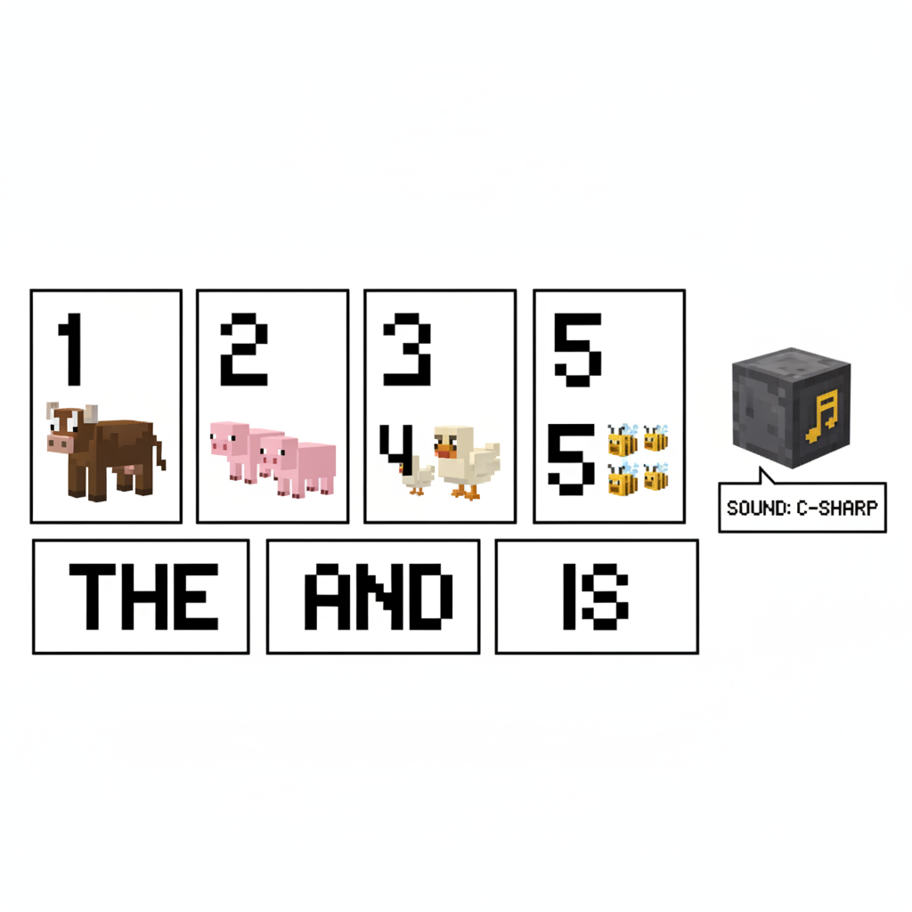
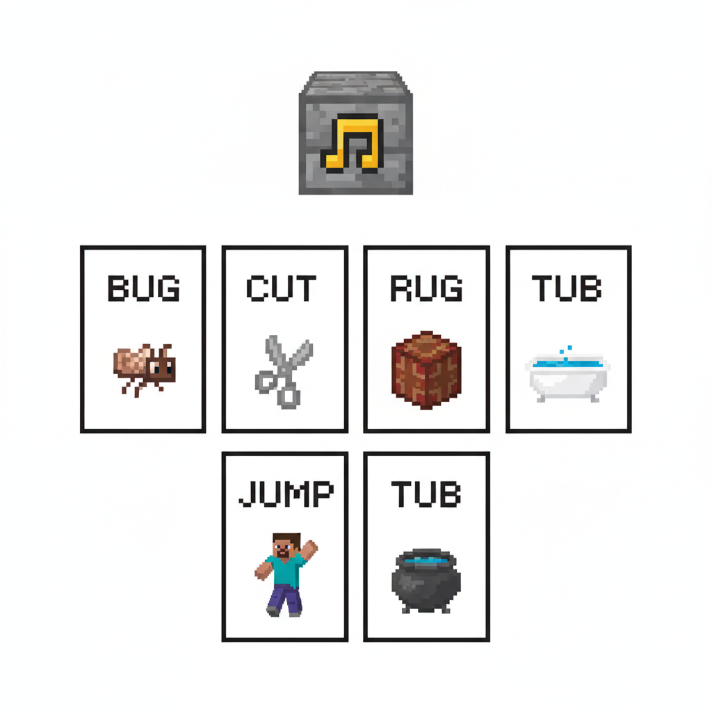
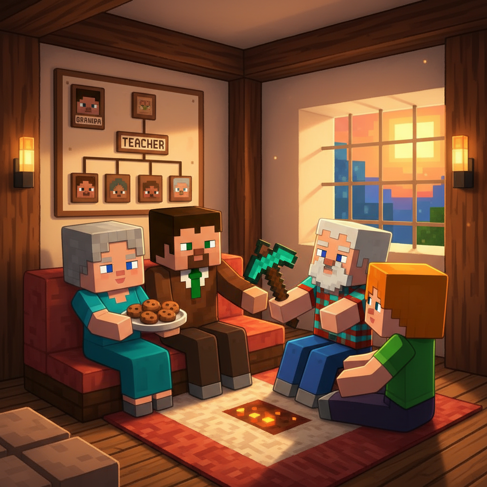
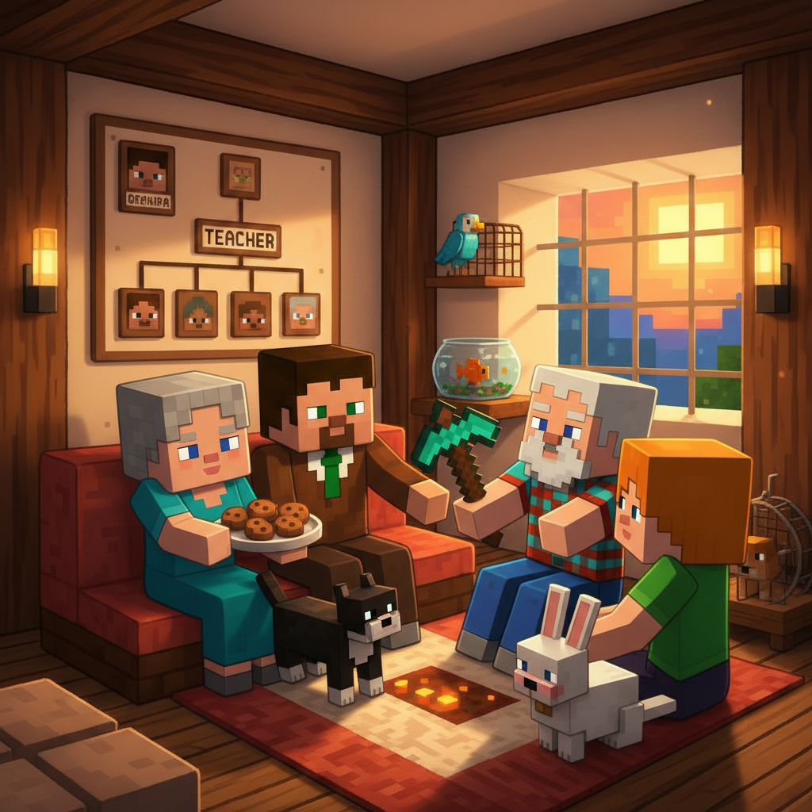
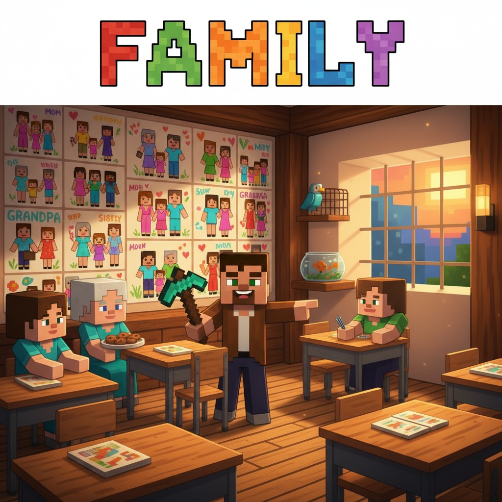
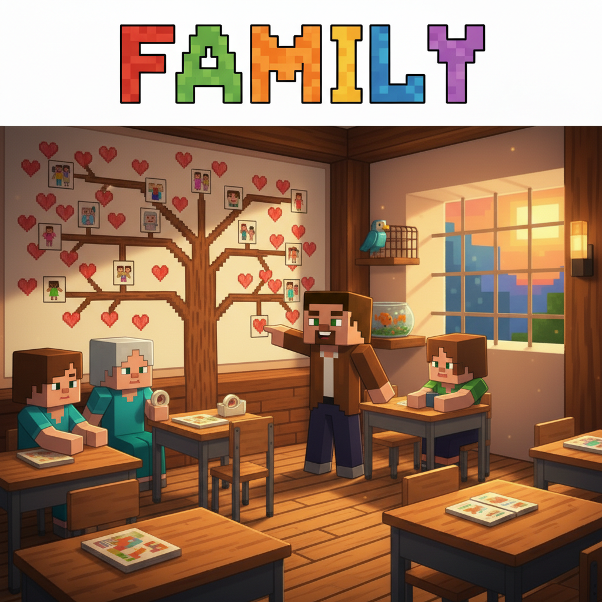
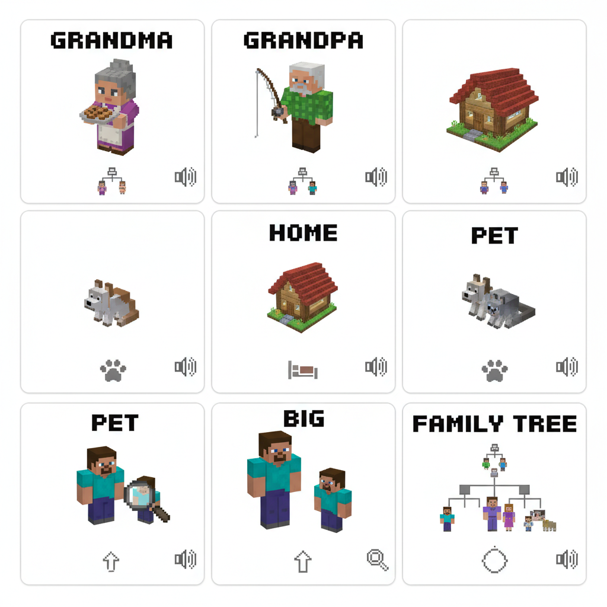

# Lesson 6 Extension: The Family Tree 🌳

## 📋 Learning Goals
- Review family words: mom, dad, sister, brother, baby, love
- Review sight words: find, funny, help, here
- New words: **grandma, grandpa, home, pet, big**
- Sentence: "This is my ___." / "I love my ___."
- 🔤 Sound Block review: /ʌ/ + new CVC practice

---

## 🔤 Sound Block Review: More /ʌ/ Words!

```
   🎵 NOTE BLOCK GLOWING!

   Review: /ʌ/ = "uh" sound

   Old friends:  sun ☀️  run 🏃  fun 🎉  bun 🍞  cup ☕  mud 🟤  hug 🤗
   
   New friends:
   b-u-g → bug!    🐛
   c-u-t → cut!    ✂️
   j-u-m-p → jump! 🦘
   r-u-g → rug!    🟫
   t-u-b → tub!    🛁

   Tap and say: /ʌ/ /ʌ/ /ʌ/
```



---

## Page 1: A Letter to Home ✍️

The next morning, Steve decides to write back to his family.

> "I miss them," he says. "I want to tell them about school!"

Alex brings paper and a pen. "Let's write together!"

```
   Dear Mom, Dad, and my funny sister,
   
   I love you all!
   School is fun!
   My teacher is old and kind.
   I have new friends here.
   I read a magic book today!
   
   ❤️ Love, Steve
```

Steve folds the letter carefully.

> "Writing a letter is like sending a hug through the air," Alex says.

```
   letter = 信     send = 寄、送
```



---

## Page 2: Grandma and Grandpa 👵👴

As they walk to the village post box, they see the old teacher again.

He is sitting with an old woman and an old man.

> "Teacher! Who are they?" asks Alex.

The teacher smiles: "These are my parents. My **grandma** and **grandpa**."

```
   G-R-A-N-D-M-A → grandma 👵
   G-R-A-N-D-P-A → grandpa 👴
```

> "**Grandma** is my mom's mom. **Grandpa** is my dad's dad."

Steve thinks: "So... Grandma is mom's mom?"

> "Yes!" says the teacher. "And grandpa is dad's dad."

Grandma gives them cookies. Grandpa tells a funny story.

```
   Family Tree:
   
        👵👴 (grandma + grandpa)
              ↓
           👩👨 (mom + dad)
              ↓
        👧👦👶 (sister + you + baby brother)
```

**Sight word practice:**
```
   My grandma is HERE with cookies! 🍪
   I FIND grandpa's story so FUNNY! 😂
   HELP grandma carry the plate!
```



---

## Page 3: Home Sweet Home 🏠

Grandma points to a cozy wooden house.

> "That is our **home**."

```
   H-O-M-E → home 🏠
```

> "A house is made of blocks. A **home** is made of love."

```
   house = 房子 🏠 (the building)
   home  = 家 🏠💛 (the warm place with family)
```

Steve looks at the house. There are flowers by the door, a cat sleeping on the step, and smoke coming from the chimney.

> "Your home is beautiful," says Alex.

Grandma smiles: "Because our family is in it."

**Sound Block practice:**
```
   The cat is ON the RUG. 🐱🟫
   I give the dog a HUG. 🐶🤗
   Running home is FUN! 🏃🏠🎉
```


---

## Page 4: The Family Pet 🐱

Steve notices the cat on the step.

> "What is your cat's name?"

> "This is Whiskers. He is our **pet**," says Grandpa.

```
   P-E-T → pet 🐱🐶🐰
```

> "A **pet** is an animal that lives with the family."

Whiskers rubs against Steve's legs.

> "We love Whiskers," Grandma says. "He is part of the family too!"

Alex asks: "Do you have a pet at home, Steve?"

Steve thinks. "No... but maybe I will get one!"

```
   🐱 cat    🐶 dog    🐰 rabbit
   🐟 fish   🐦 bird   🐹 hamster
   
   Which pet do you want?
```

**Sight word practice:**
```
   Can you FIND the cat? 🐱
   The cat is a FUNNY pet! 😂
   HELP me feed the cat! 🥣
   Come HERE, Whiskers! 🐱
```


---

## Page 5: A Big Family 👨‍👩‍👧‍👦

Back at the school, the teacher asks everyone:

> "Who is in your family? Let's make a **big** family picture!"

```
   B-I-G → big 🐘
   
   big = 大     small = 小
   
   a big family 👨‍👩‍👧‍👦
   a big love   ❤️❤️❤️
   a big hug    🤗
```

Each student draws their family. They put all the drawings on the wall.

The wall is covered with families:

```
   Xiaofang's family:   👵👴👩👨👧
   Ping's family:       👩👶
   Lei's family:        👴👩👨👦👦
```

> "Look at all these families!" says the teacher.

> "Some are big. Some are small. But every one has love."

Steve looks at the wall of families and smiles.

> "We have a school family too," he says. "Teachers and students — we are all one big family!"

**Sound Block practice:**
```
   b-u-g → bug! 🐛
   A little bug on the rug!
   
   j-u-m-p → jump! 🦘
   Big families jump for fun!
```



---

## Page 6: The Family Tree Game 🌳

For the last activity, the teacher brings out a big paper tree.

> "This is a **family tree**! Let's fill it in."

```
          🌳 FAMILY TREE 🌳
          
         👵👴 (grandpa + grandma)
              ↓
         👩👨 (mom + dad)
              ↓
    👧         👦          👶
 (sister)    (ME!)    (baby brother)
```

Each student comes up and puts their family on the tree.

Steve puts up: 👩 mom, 👨 dad, 👧 sister — and 👦 Steve!

Alex puts up: 👩 mom, 👨 dad, 👦 brother, 👦 brother — and 👧 Alex!

At the end, the tree is full of faces and hearts.

> "This is our class family tree," the teacher says.

Everyone stands back and looks at the tree. It is beautiful.

```
   🌳 Family is like a tree:
      Roots = grandparents
      Trunk = parents
      Branches = children
      Leaves = love
```



---

## Page 7: Story Time — The Lost Baby Bird 🐦

After class, Steve and Alex hear a sound: "Cheep! Cheep!"

A baby bird has fallen from its nest!

> "Oh no! A baby bird!" cries Alex. "It is lost!"

Steve looks up. High in the tree, a mama bird and papa bird are calling. "Cheep! Cheep!"

> "We must HELP the baby bird!" says Steve.

He carefully picks up the baby bird.

> "I can FIND the nest," says Alex. "It is HERE — in this tree!"

Steve climbs up...up...up. Alex holds the ladder.

> "Here you go, little bird," Steve says. He gently puts the baby back in the nest.

The mama bird and papa bird flutter their wings happily. "Cheep! Cheep! Cheep!"

> "You are back HOME!" says Alex.

The bird family is together again.

Steve comes down. "Every family wants to be together," he says. "Birds... and people too."

```
   Mama bird + Papa bird + Baby bird = A bird family
   
   The baby bird was LOST.
   The mama bird tried to FIND it.
   Steve HELPED put it back.
   Now the baby is HOME.
```



---

## 📝 Practice

### 1. Match

| Word | Meaning |
|------|---------|
| grandma | 👴 dad's dad or mom's dad |
| grandpa | 🐱🐶 animal friend |
| home | 👵 mom's mom or dad's mom |
| pet | 🏠 warm place with family |

### 2. Which is Bigger?

```
   A house or a home?  → ___ is bigger (in love!)
   A pet or a bug?     → ___ is bigger
   A sister or a baby? → ___ is bigger
```

### 3. Family Tree

Fill in your family tree:

```
        👵👴 (_____ + _____)
              ↓
         👩👨 (_____ + _____)
              ↓
    ___         ___          ___
  (sister)     (ME!)    (brother)
```

### 4. 🔤 Sound Block — Read and Draw

Read the word, then draw its picture:

```
   rug  → _________
   bug  → _________
   sun  → _________
   cup  → _________
   mud  → _________
```

### 5. Write a Letter ✍️

Write a short letter to your family:

```
   Dear _____,
   
   I love you!
   
   Today I _____.
   (read a book / played with my pet / helped my sister)
   
   ❤️ Love, _____
```

---

## 🏆 Challenge — Family Explorer!

**Level 1: Word Search 🔍**

Find these words: MOM, DAD, HOME, PET, LOVE, BIG

```
   M O M P E T X
   O A H O M E W
   L D B I G A B
   O A L O V E R
   V B R O T H E
   E H E L P E R
```

**Level 2: Complete the Sentences 🖊️**

```
   My mom's mom is my ________.
   My dad's dad is my ________.
   My cat Whiskers is my ________.
   A warm place with my family is my ________.
   I ________ my family! ❤️
```

**Level 3: Draw and Label 🎨**

Draw your home. Label:

```
   [DRAW YOUR HOME]
   
   This is my ___.
   My ___ lives here.
   My ___ lives here.
   My ___ (pet) lives here too!
   We all ___ each other. ❤️
```

**Level 4: The Family Book 📖**

Make a mini family book:

```
   Page 1: This is my MOM. She ___.
   Page 2: This is my DAD. He ___.
   Page 3: This is my SISTER/BROTHER. ___.
   Page 4: This is my PET. It ___.
   Page 5: I LOVE my family because ___.
```

---

## 📊 Extension Summary

New words:
- [ ] grandma 👵 — Mom's mom or dad's mom
- [ ] grandpa 👴 — Mom's dad or dad's dad
- [ ] home 🏠 — Warm place with family
- [ ] pet 🐱 — Animal family member
- [ ] big 🐘 — Not small, large

Review words (L6 base):
- [ ] mom, dad, sister, brother, baby, love ❤️

Sight words review:
- [ ] find ✓ funny ✓ help ✓ here ✓

🔤 Sound Block review:
- [ ] /ʌ/ — b-u-g, c-u-t, j-u-m-p, r-u-g, t-u-b

> **Total words: 64** (L6 base: 59 + extension: 5)

---


