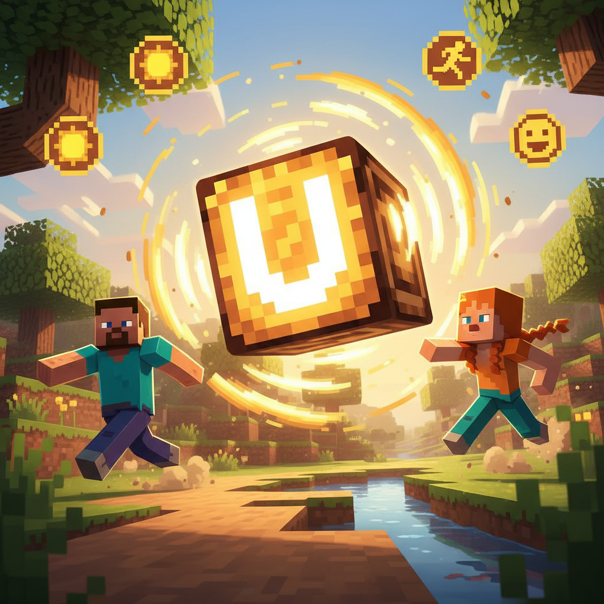
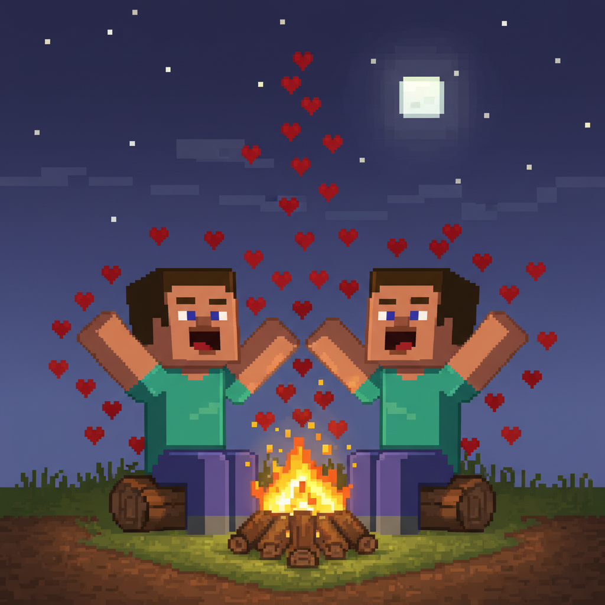

# Lesson 6: Family 👨‍👩‍👧‍👦

## 📋 Learning Goals
- Family words: **mom, dad, sister, brother, baby, love**
- Sight words: **find, funny, help, here**
- Sentence: "This is my ___." / "I love my ___."
- 🔤 Sound Block: **u says /ʌ/** (sun, run, fun, bun, cup, mud)

**Total words so far: 59** (L1-L5: 53, L6: 6)

---

## 🔤 Sound Block: "u" says /ʌ/

```
   🎵 NOTE BLOCK ACTIVATED!
   
   u = /ʌ/  (short u, like "uh")
   
   Say with Steve:
   s-u-n → sun! ☀️
   r-u-n → run! 🏃
   f-u-n → fun! 🎉
   b-u-n → bun! 🍞
   c-u-p → cup! ☕
   m-u-d → mud! 🟤

   Tap the table: u-u-u /ʌ/-/ʌ/-/ʌ/
```


---

## Page 1: A Letter from Home 💌

After school, Steve finds a letter in his pocket.

> "What is it?" asks Alex.

Steve opens it. There is a drawing of four stick figures and a heart.

```
   ❤️ Dear Steve,
      We miss you!
      Love, your family
   
   From: Mom, Dad, Sister
```

Steve smiles. "It is from my **family**!"

> "I have a **mom**, a **dad**, and a **sister**."

Alex looks at the drawing. "Me too! I have a **mom**, a **dad**, and two **brothers**."

```
   family = 家人、家庭 👨‍👩‍👧‍👦
   
   mom   = 妈妈    👩
   dad   = 爸爸    👨
   sister = 姐姐/妹妹 👧
   brother = 哥哥/弟弟 👦
```



---

## Page 2: Mom 👩

Steve points to the first figure in the drawing.

> "This is my **mom**."

```
   M-O-M → mom 👩
```

> "My mom is big and kind. She gives me hugs."

**Sight word: here**
> "Mom says 'Come **here**!' and I run to her."

**here** = 这里 — in this place, come to this spot

```
   Come here!
   I am here.
   Here is my book.
```

**Sound Block practice:** m-u-m → mum! (British: mum = mom)


---

## Page 3: Dad 👨

> "And this is my **dad**."

```
   D-A-D → dad 👨
```

> "My dad is tall and strong. He plays with me."

**Sight word: find**
> "We play hide-and-seek. I **find** my dad!"

**find** = 找到 — discover, see after looking

```
   I find my book.
   I find the cat.
   Can you find me?
```

**Sound Block practice:**
```
   h-u-g → hug! 🤗
   Dad gives me a big hug!
```


---

## Page 4: Sister 👧

Steve points to a smaller figure.

> "This is my little **sister**. She is funny!"

```
   S-I-S-T-E-R → sister 👧
```

> "She is small, but she makes everyone laugh."

**Sight word: funny**
> "My sister is **funny**! She makes silly faces 😜."

**funny** = 好笑、有趣 — makes you laugh

```
   That is a funny cat!
   You are so funny!
   A funny story.
```

```
   👧 sister = girl sibling (姐姐 or 妹妹)
   👦 brother = boy sibling (哥哥 or 弟弟)
```


---

## Page 5: Brother 👦

Alex shows Steve her family picture.

> "I have two **brothers**. They are big and strong!"

```
   B-R-O-T-H-E-R → brother 👦
```

> "They help me with my book bag."
> "They help me when I fall down."

**Sight word: help**
> "My brothers **help** me every day."

**help** = 帮助 — do something for someone, assist

```
   Help me, please!
   I can help you.
   Dad helps me count.
```

**Sound Block practice:**
```
   r-u-n → run! 🏃
   My brother and I run and run!
```


---

## Page 6: Baby 👶

Steve and Alex walk through the village.

They hear a sound: "Waa! Waa!"

> "What is that?" asks Alex.

A village mom is holding a tiny person.

> "That is a **baby**!" says Steve.

```
   B-A-B-Y → baby 👶
```

> "A baby is the smallest in the family."

A little girl runs up: "This is my baby brother! He is very small."

Alex looks at the baby. The baby opens his eyes and smiles.

> "Hello, little baby!" Alex waves.

```
   👶 baby = very small child
   
   Who has a baby in the family?
   - baby brother 👶👦
   - baby sister 👶👧
```


---

## Page 7: Love ❤️

Steve looks at his family letter again.

> "Why do families stay together?" he wonders.

The village mom hears him. She smiles:

> "Because of **love**."

```
   L-O-V-E → love ❤️
```

> "**Love** is the biggest thing in the world. It makes a family a family."

Steve thinks about his mom, his dad, his funny sister.

> "I **love** my mom. I **love** my dad. I **love** my sister."

Alex says: "I **love** my mom, my dad, and my two brothers!"

They draw big hearts on their family pictures.

```
   ❤️  I love my family!
   ❤️  We are a family!
```

**Sound Block practice:**
```
   f-u-n → fun! 🎉
   Family is fun!
   
   h-u-g → hug! 🤗
   Mom gives me a big hug!
```


---

## Page 8: Family Song 🎵

That night, Steve and Alex sit by the fire. They sing a song about family:

```
   🎵 M-O-M, I love my mom!
      D-A-D, I love my dad!
      Sister, brother, baby too —
      My family, I love you!
   
      M-O-M, mom, mom, mom!
      D-A-D, dad, dad, dad!
      Funny sister, funny brother,
      Baby, baby, I love you! 🎵
```

They look at the stars. Steve says:

> "Every family is different. Big family, small family — love is the same."

Alex nods. "And we have a Minecraft family too! We are friends."

> "Friends are family you find," Steve says.



---

## 📝 Practice

### 1. Match the Word

| Word | Who? |
|------|------|
| mom | 👨 tall and strong |
| dad | 👶 very small |
| sister | 👧 girl sibling |
| brother | 👩 gives hugs |
| baby | 👦 boy sibling |

### 2. Fill In

```
   This is my ___. She gives me hugs.     (mom / dad)
   This is my ___. He is tall.             (sister / dad)
   My ___ is funny. She makes me laugh.    (brother / sister)
   My ___ helps me. He is big.             (sister / brother)
   A ___ is very small.                    (baby / dad)
   I ___ my family! ❤️                     (love / find)
```

### 3. Use the Sight Words

```
   Come ___! I am over here.          (here / find)
   I ___ my book under the table.     (find / funny)
   My sister is ___! She dances.      (help / funny)
   Can you ___ me count?              (help / here)
```

### 4. 🔤 Sound Block Practice

Read and tap for each sound:

| Word | Sounds | Say it! |
|------|--------|---------|
| sun | s - u - n | sun! ☀️ |
| run | r - u - n | run! 🏃 |
| fun | f - u - n | fun! 🎉 |
| bun | b - u - n | bun! 🍞 |
| cup | c - u - p | cup! ☕ |
| mud | m - u - d | mud! 🟤 |
| hug | h - u - g | hug! 🤗 |

---

## 🏆 Challenge — Family Explorer!

**Level 1: Spell the Family 🔤**

```
   M _ M = mom
   D _ D = dad
   S _ S T E R = sister
   B R _ T H E R = brother
   B _ B Y = baby
   L _ V E = love ❤️
```

**Level 2: Who Says It? 🗣️**

Match the sentence to the family member:

```
   "Come here, I give hugs!"     → ___
   "I am tall and strong!"       → ___
   "I make funny faces!"         → ___
   "I help you carry your bag!"  → ___
   "Waa! Waa!"                   → ___
```

**Level 3: Draw Your Family 🎨**

Draw your family. Write their names:

```
   My Family
   ┌──────────────┐
   │              │
   │   [DRAW]     │
   │              │
   └──────────────┘
   
   This is my ___. (mom)
   This is my ___. (dad)
   This is my ___. (sister / brother)
```

Write one sentence: "I love my ___."

**Level 4: Family Poem ✏️**

Finish the poem:
```
   Mom gives ___, 
   Dad plays with ___,
   Sister makes me ___,
   Brother helps me ___,
   Baby is so ___,
   I love my ___!
```

---

## 📊 Lesson Summary

New family words:
- [ ] mom 👩 — Mother, gives hugs
- [ ] dad 👨 — Father, tall and strong
- [ ] sister 👧 — Girl sibling, funny
- [ ] brother 👦 — Boy sibling, helps
- [ ] baby 👶 — Very small family member
- [ ] love ❤️ — The biggest thing

Sight words:
- [ ] find — I can FIND it
- [ ] funny — So FUNNY! 😂
- [ ] help — HELP me, please
- [ ] here — Come HERE!

🔤 Sound Block:
- [ ] /ʌ/ — s-u-n, r-u-n, f-u-n, b-u-n, c-u-p, m-u-d, h-u-g

> **Total words: 59** (+6: mom, dad, sister, brother, baby, love)

---


