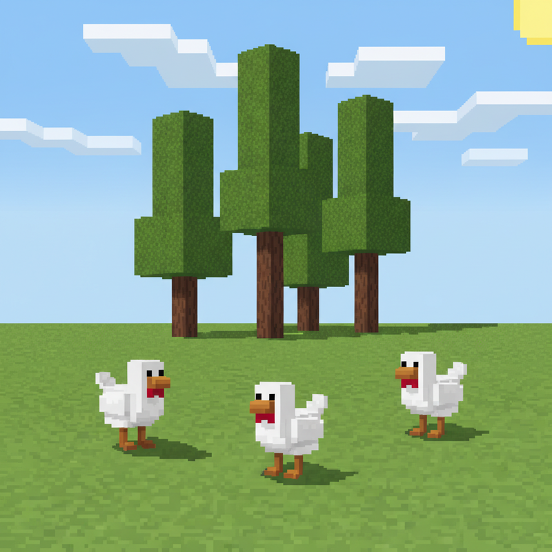
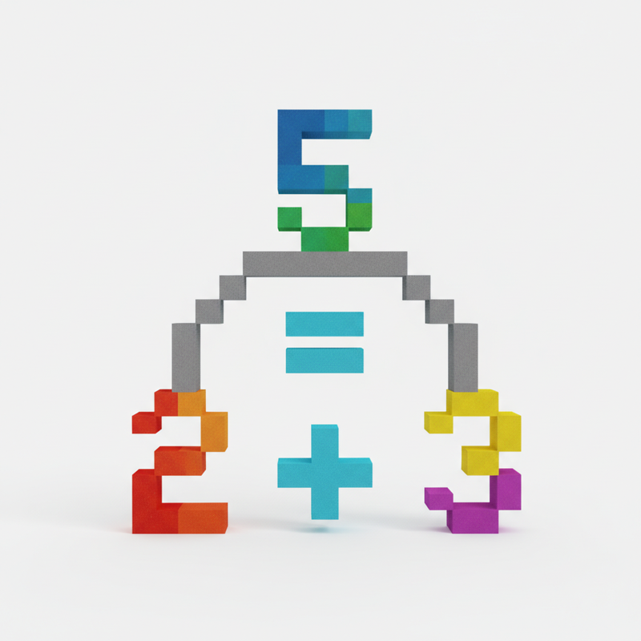
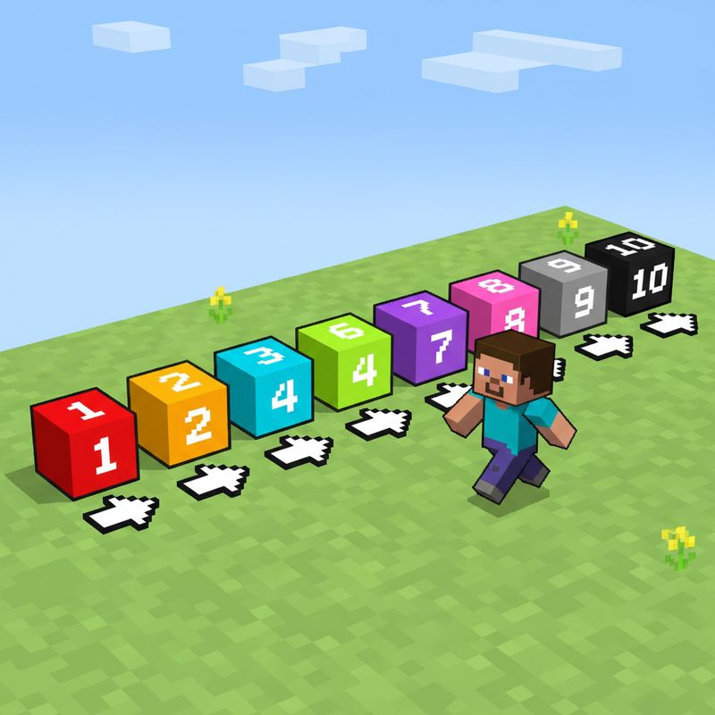
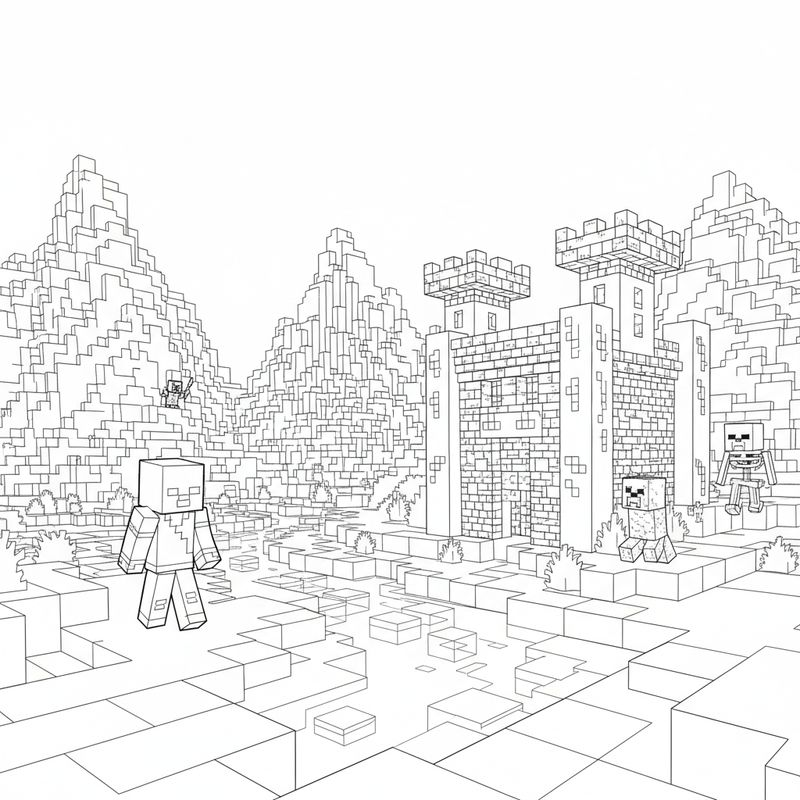
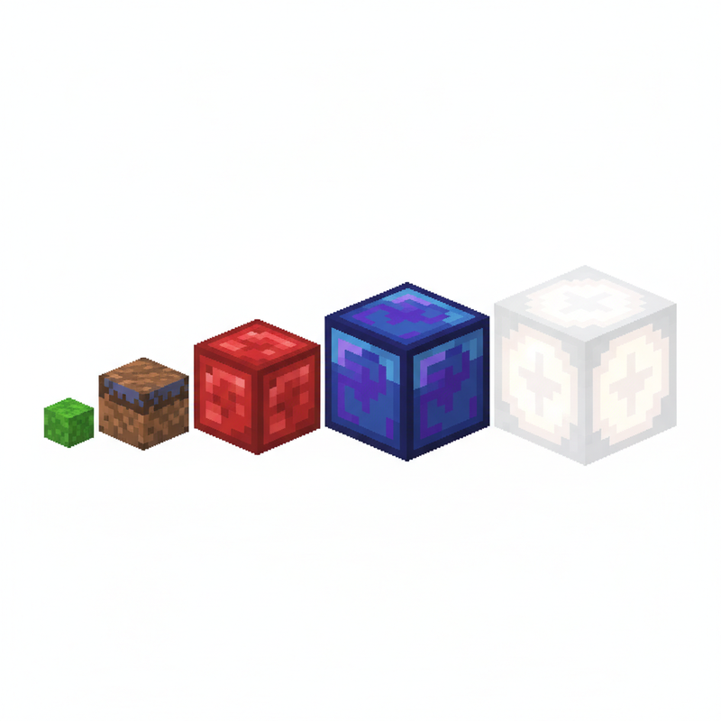
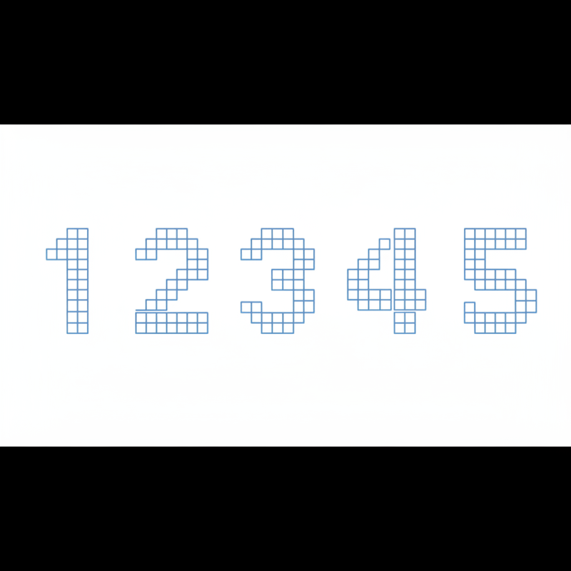
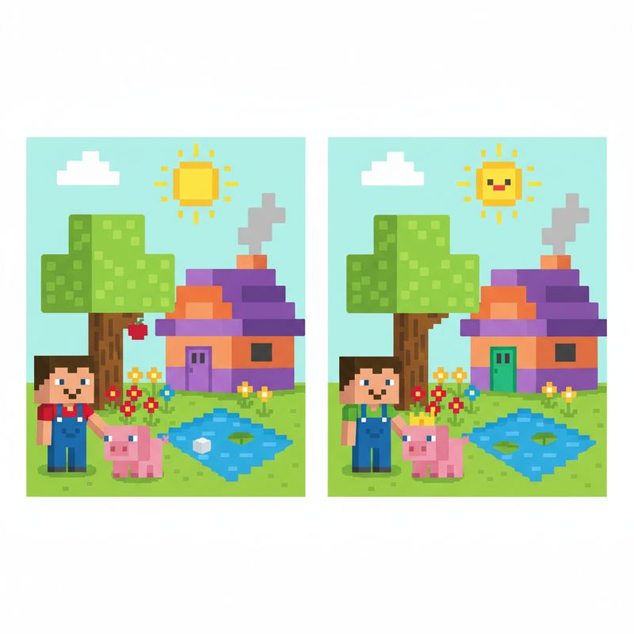

# 第1课 认识数字 1~10

## 📋 学习目标
- 认识数字 1~10，会读会写
- 能用手指、物品对应数数
- 理解数字的顺序和大小

---

## 一、认识数字

### 1 和 2
- **1** — 一个方块，Steve 拿着 1 把镐子
- **2** — 两个方块，Steve 拿着 2 个苹果

### 3 和 4
- **3** — Steve 看到 3 只鸡 🐔🐔🐔
- **4** — Steve 看到 4 棵树 🌲🌲🌲🌲

### 5 和 6
- **5** — 一整只手！✋
- **6** — 一只手 + 1 个手指 ✋ + ☝️

### 7、8、9、10
两只手全打开 = 10！🖐️ + 🖐️ = 10

7、8、9 都在 10 里面。

---

## 二、数数的方法

### 用手指数数
一只手有 **5** 个手指。伸出手指，指着物品，一个一个数。

👆✌️🤟🖖🖐️

### 数一数
Steve 捡到了钻石！1、2、3……数到几了？

---

## 三、数的分解与排列

### 数的朋友（数的分解）
5 可以分成：
- 5 = 1 + 4
- 5 = 2 + 3

像拼方块一样！

### 数轴上的数字
数字排成一条线，从小到大排排站：

**1 → 2 → 3 → 4 → 5 → 6 → 7 → 8 → 9 → 10**

---

## 四、课堂练习

### 练习1：涂一涂
有几只小猪？先数一数，再涂上颜色！

### 练习2：按数字涂色
每个数字代表一种颜色！涂完后看看是什么？
- 1=绿色 2=棕色 3=红色 4=黄色 5=蓝色

### 练习3：排一排
帮 Steve 把方块从小到大排好！

### 练习4：走迷宫
从 1 走到 10，帮 Steve 找到回家的路！

### 练习5：写数字
Steve 在练习写数字，你也来试试！

### 练习6：找不同
这两幅图有 5 个地方不一样！你能找到吗？

---

## 五、本课小结

✅ 认识了数字 1~10
✅ 学会了一个一个数数
✅ 知道了 5 的分解方法
✅ 掌握了数轴上数字的顺序

> 🏠 第一关，通过！下一课：认识 11~20
