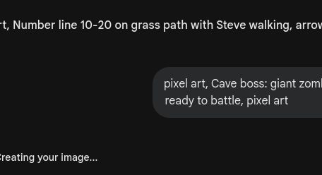

# 🎮 第2关

---

挖矿大冒险

---

数一数：1、2、3……

---

10 + 1 = 11

---

10 + 1 = ？
10 + 2 = ？

---

11 = 1个十 + 1个一
15 = 1个十 + 5个一

---

把11-15涂上不同颜色

---

10 + 6 = 16

---

10 + 7 = 17
10 + 8 = ？
10 + 9 = ？

---

每个箱子里有多少个？

---

10 + 10 = 20

---

它们排成一队

---

按11到20的顺序连线

---

用方块摆一摆

---

把数字和对应的方块连起来

---

把矿石按10个一组分好

---

认真写11到20

---

11、12、__、__、15、__、17、__、__、20

---

数一数有多少颗宝石

---

僵尸巨人守着矿石！
答对20以内数数就过关

---

11-20都认识了
下个冒险在村庄等着你

