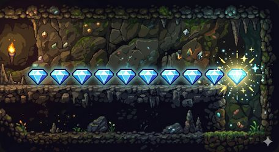
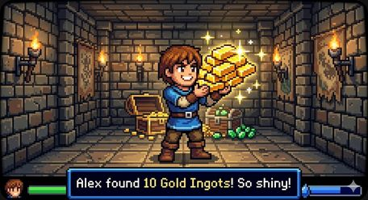
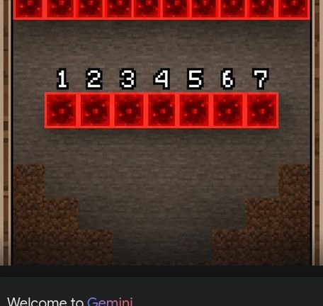
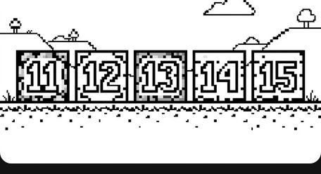
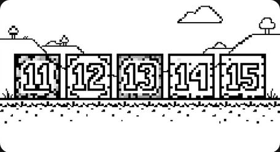
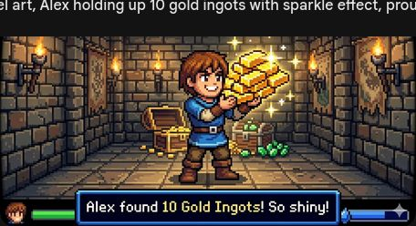

# 第2课 认识数字 11~20

## 📋 学习目标
- 认识数字 11~20，会读会写
- 理解"十"的概念：10个一捆
- 掌握 11~20 的组成（几个十 + 几个一）

---

## 一、从 10 开始

### 11 是怎么来的？
10 颗钻石，再来 1 颗！

**10 + 1 = 11**

### 10 再加几个
- 10 + 1 = 11
- 10 + 2 = 12
- 10 + 3 = 13

---

## 二、理解"十"和"一"

### 10个一捆，零头单放
- **11** = 1 个十 + 1 个一
- **15** = 1 个十 + 5 个一

每个数都是 **1个十 + 几个一**。

### 数一数，写出数字
每个箱子里有多少个？

---

## 三、认识 11~20

### 16、17、18、19
- 10 + 6 = 16（矿车里的煤炭）
- 10 + 7 = 17
- 10 + 8 = 18
- 10 + 9 = 19

### 20
木板正好 20 块！

**10 + 10 = 20**

### 数字排队
10、11、12……20，它们排成一队。

---

## 四、课堂练习

### 练习1：涂一涂
把 11~15 涂上不同颜色。

### 练习2：连一连
按 11 到 20 的顺序连线。

### 练习3：分一分
把矿石按 10 个一组分好。

### 练习4：写一写
认真写 11 到 20。

### 练习5：填一填
11、12、\_\_、\_\_、15、\_\_、17、\_\_、\_\_、20

### 练习6：数一数
宝箱里有宝藏！数一数有多少颗宝石。

---

## 五、本课小结

✅ 认识了数字 11~20
✅ 知道了"10个一捆"就是"一个十"
✅ 理解了数的组成：十位和个位
✅ 会按顺序排列 11~20

> ✨ 矿石收集完成！下一课：比一比，谁多谁少
